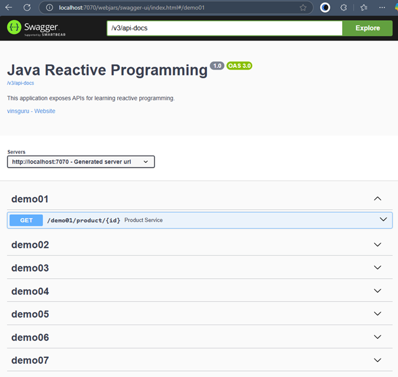
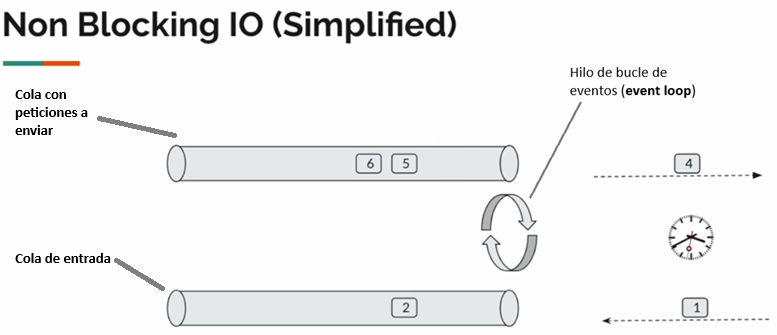

# Sección 2: Mono

---

## Mono/Flux - Introducción

El proyecto `Reactor` —parte del ecosistema `Project Reactor` utilizado en `Spring WebFlux`— define la base del modelo
de programación reactiva en Java.

En este modelo, todos los flujos de datos asíncronos se representan a través de la interfaz `Publisher<T>`, que actúa
como fuente de datos.

El proyecto proporciona dos implementaciones principales de esta interfaz:

- `Mono<T>`: representa un flujo que puede emitir como máximo un elemento (o ninguno).
- `Flux<T>`: representa un flujo que puede emitir cero, uno o múltiples elementos.

En el siguiente diagrama se muestran las relaciones entre los componentes principales del modelo reactivo:
`Publisher`, `Subscriber`, `Subscription`, `Mono` y `Flux`. Este esquema permite visualizar cómo se comunican
y cómo fluye la información desde la publicación hasta la suscripción de datos.


## Mono

- Emite `0 o 1` elemento.
- Seguido por un `onComplete` / `onError`.
- Un `Mono<T>` es un `Publisher<T>` especializado que emite como máximo un elemento a través de la señal `onNext` y
  luego finaliza con una señal `onComplete` (Mono exitoso, con o sin valor) o solo emite una única señal `onError`
  (Mono fallido).

Nuestro primer enfoque será cómo crear un publisher `Mono` usando los métodos de fábrica. También para soportar la base
de código existente. El proyecto Reactor proporciona muchos métodos de fábrica, por lo que a continuación se muestran
los siguientes.

| Métodos de fábrica | Uso                                                   |
|--------------------|-------------------------------------------------------|
| just               | Cuando el valor ya está en la memoria                 |
| empty              | No hay ningún elemento para emitir                    |
| error              | Emitir error                                          |
| fromSupplier       | Aplazar la ejecución mediante el uso de `Supplier<T>` |
| fromCallable       | Aplazar la ejecución mediante `Callable<T>`           |
| fromFuture         | Publisher creado desde un `CompletableFuture<T>`      |

## Mono Just

- Crea un nuevo `Mono` que emite el elemento especificado, que se captura en el momento de la instanciación.
- Emite el valor especificado inmediatamente cuando alguien se suscribe a él.
- Luego envía una señal de completion `(onComplete)`.
- Es útil cuando ya tenemos un valor en memoria.
- Es útil cuando queremos adaptar ese valor al mundo `reactivo`, porque necesitamos retornar un `Publisher`.

En `programación reactiva`, trabajamos con flujos de datos que aún no se han producido, o que se producirán
`asíncronamente`. Pero a veces ya tienes el dato, y aún así necesitas envolverlo en un flujo para que todo nuestro
`pipeline` siga siendo `reactivo`.

Entonces `Mono.just(...)` sirve como una forma de decir:

> "Tengo este dato ya listo, pero igual quiero entregártelo en formato reactivo."

**Importante**
> `Mono.just(...)` no es perezoso `(not lazy)`. El valor se asigna o calcula inmediatamente. Es decir, el valor que le
> pasamos ya fue calculado y evaluado en el momento en que llamamos al método `Mono.just(...)`.

Por ejemplo:

````java
Mono<String> mono = Mono.just(getExpensiveValue());
````

Aquí, `getExpensiveValue()` se ejecuta de inmediato, en el momento de crear el `Mono`, no cuando alguien se suscribe.
Entonces el valor ya está en memoria cuando se crea el `Mono`. Lo que sí es perezoso es la emisión del valor:
`el valor solo se emite cuando alguien se suscribe`.

### Ejemplo con nuestro SubscriberImpl

En este primer ejemplo vamos a utilizar nuestra implementación del `SubscriberImpl` para pasarlo al `mono (publisher)`.
Luego, con el subscriber obtenemos la subscripción y solicitamos que nos retorne 1 elemento.

````java
public class Lec02MonoJust {
    private static final Logger log = LoggerFactory.getLogger(Lec02MonoJust.class);

    public static void main(String[] args) {
        Mono<String> mono = Mono.just("Spanish");
        SubscriberImpl subscriber = new SubscriberImpl();
        mono.subscribe(subscriber);
        subscriber.getSubscription().request(1);
    }
}
````

El resultado de la ejecución anterior nos muestra este log.

````bash
23:34:24.958 INFO  [           main] d.m.a.p.s.SubscriberImpl       : recibido: Spanish
23:34:24.963 INFO  [           main] d.m.a.p.s.SubscriberImpl       : ¡completado!
````

**¿Por qué en el `SubscriberImpl` necesitamos hacer el `request(1)`?**

- En la especificación `Reactive Streams`, un `Subscriber` no recibe ningún dato hasta que le dice al `Publisher`
  cuántos quiere recibir. Eso se hace mediante `subscription.request(n);`.
- Si no hacemos `request(...)`, el `Publisher` no enviará ningún dato, porque está esperando saber cuántos ítems
  quieres. Esto es parte de la filosofía `pull-based` del `backpressure`.
- Entonces, en nuestro ejemplo con `SubscriberImpl`, nosotros somos los que controlamos la demanda explícitamente,
  y si no haces el `request(1)`, no pasa nada, no hay emisión, no hay onNext.

### Ejemplo con el proporcionado por Reactor

En este segundo ejemplo creamos el mono con `Mono.just` y luego en el propio método del `subscribe` imprimimos los
valores.

````java
public class Lec02MonoJust {
    private static final Logger log = LoggerFactory.getLogger(Lec02MonoJust.class);

    public static void main(String[] args) {
        Mono<String> mono = Mono.just("Spanish");
        mono.subscribe(
                value -> log.info("recibido: {}", value),
                error -> log.info("error: {}", error.getMessage()),
                () -> log.info("¡completado!")
        );
    }
}
````

Observamos el mismo resultado que la ejecución inicial.

````bash
23:36:45.528 INFO  [           main] d.m.app.sec02.Lec02MonoJust    : recibido: Spanish
23:36:45.531 INFO  [           main] d.m.app.sec02.Lec02MonoJust    : ¡completado!
````

**¿Por qué sí emite valor sin hacer el `request(...)`?**

- ¡Porque `Reactor` ya lo hace por nosotros debajo del capó!
- Cuando hacemos, tal como lo hemos hecho dentro del `.subscribe(value..., error..., ()...)`, `Reactor` internamente
  crea un `LambdaSubscriber` (una implementación suya de `Subscriber`) y automáticamente hace algo así
  `subscription.request(Long.MAX_VALUE);`, es decir "dame todo lo que tengas disponible".
- Esto se hace por conveniencia, porque en la mayoría de los casos la gente quiere consumir los valores directamente sin
  preocuparse por el control de flujo.

Además, en el código anterior tenemos:

1. `Mono.just("Spanish")`, crea un `Mono<String>` que emite un único valor `Spanish` y luego finaliza (envía la señal
   `onComplete`). Este valor ya está en memoria, como lo mencionamos antes.

2. `mono.subscribe(...)`, aquí estamos suscribiéndonos al `Mono` con `3 callbacks` (funciones `lambda`), que
   corresponden a las señales del flujo reactivo.

## Mono - Empty/Error

- `Mono.empty()`, crea un `Mono` que se completa sin emitir ningún elemento. Es decir, representa un Mono que no emite
  ningún valor, pero termina de forma exitosa (es decir, no lanza error). En otras palabras:
    - No hay `onNext` (porque no hay valor).
    - Se llama directamente a `onComplete`.


- `Mono.error(...)`, crea un `Mono` que finaliza con el error especificado inmediatamente después de suscribirse. Es
  decir, es un `Mono` que `no emite valor alguno y termina con un error`.
    - No hay `onNext`.
    - No hay `onComplete`.
    - Se llama directamente a `onError`.

````java
public class Lec04MonoEmptyError {
    public static void main(String[] args) {
        getUsername(2).subscribe(Util.subscriber("Ejem1"));  //Empty
        getUsername(3).subscribe(Util.subscriber("Ejem2"));  //Error
    }

    private static Mono<String> getUsername(int userId) {
        return switch (userId) {
            case 1 -> Mono.just("Marti");
            case 2 -> Mono.empty();
            default -> Mono.error(new RuntimeException("Entrada inválida"));
        };
    }
}
````

Si ejecutamos el ejemplo anterior vemos la primera línea se corresponden con el `Ejem1` y la última línea con el
`Ejem2`.

````bash
23:10:04.576 INFO  [           main] d.m.a.common.DefaultSubscriber : Ejem1 ¡completado!
23:10:04.579 ERROR [           main] d.m.a.common.DefaultSubscriber : Ejem2 error: Entrada inválida
````

## Mono - From Supplier

El `Mono.fromSupplier(Supplier<T> supplier)` se usa cuando quieres que el código que produce el valor se ejecute solo
cuando alguien se suscriba.

En otras palabras:

- No se ejecuta inmediatamente.
- Solo se ejecuta al hacer `.subscribe()`.
- Es útil cuando el valor es costoso de obtener o calcular, y no quieres hacerlo hasta que sea necesario.

El `Mono.fromSupplier`, crea un `Mono` que produce su valor utilizando el `Supplier` proporcionado. Si el `Supplier`
retorna `null`, el `Mono` resultante se completará vacío `Mono.empty()`.

Produce un valor diferido. A diferencia de `Mono.just()`, que recibe un valor directamente, `Mono.fromSupplier()`
ejecuta el `Supplier` solo en el momento en que alguien se suscribe al `Mono`. Esto es útil cuando el cálculo o la
obtención del valor puede tomar tiempo o cuando el valor puede cambiar entre diferentes suscripciones.

Veamos algunos detalles del `Mono.fromSupplier(...)`:

- Cuando necesitas diferir (posponer) la creación o cálculo de un valor hasta que alguien se suscriba.
- Para envolver operaciones de larga duración o cálculos que no deben ejecutarse hasta que realmente se necesiten.
- Para manejar situaciones donde el valor puede ser `null` y, en esos casos, devolver un `Mono.empty()` automáticamente.
- `Lazy (evaluación diferida)`, con `Mono.fromSupplier()`, el cálculo o la operación que definas dentro del `Supplier`
  no se ejecuta de inmediato. La evaluación se diferirá hasta que alguien se suscriba al `Mono`. Es decir, el cálculo
  no ocurre hasta que realmente sea necesario.
- En `Mono.fromSupplier(...)`, si el `Supplier` lanza una `excepción no comprobada (unchecked)`, como
  `NullPointerException`, `RuntimeException`, etc., el `Mono` se convierte automáticamente en un `Mono.error(...)`.

A continuación se muestra un ejemplo del uso del `Mono.fromSupplier()`.

````java
public class Lec05MonoFromSupplier {

    private static final Logger log = LoggerFactory.getLogger(Lec05MonoFromSupplier.class);

    public static void main(String[] args) {
        List<Integer> list = List.of(1, 2, 3);
        Mono.fromSupplier(() -> sum(list))
                .subscribe(Util.subscriber());
    }

    private static Integer sum(List<Integer> numbers) {
        log.info("Método donde se calcula la suma {}", numbers);
        return numbers.stream()
                .mapToInt(value -> value)
                .sum();
    }

}
````

````bash
23:56:07.554 INFO  [           main] d.m.a.s.Lec05MonoFromSupplier  : Método donde se calcula la suma [1, 2, 3]
23:56:07.559 INFO  [           main] d.m.a.common.DefaultSubscriber :  recibido: 6
23:56:07.563 INFO  [           main] d.m.a.common.DefaultSubscriber :  ¡completado!
````

**Dónde**

- `Mono.fromSupplier()` recibe una referencia a un método que retorna un valor (`int` en este caso).
- Ese método `no se ejecuta inmediatamente`.
- Se ejecuta solo cuando se hace `subscribe()`.
- El valor retornado (6) es emitido al `Subscriber` como un `onNext`.
- Luego, el flujo termina con `onComplete`.

**Nota**
> Si `sum()` devolviera `null`, el `Mono` actuaría como `Mono.empty()` y no emitiría ningún valor (`onNext`), solo
`onComplete`.

## Mono - From Callable

`Mono.fromCallable(Callable<T> callable)` crea un `Mono` a partir de una función que puede lanzar una
`excepción checked`. Si el `Callable` se resuelve como `null`, el `Mono` resultante es un `Mono.empty()`.

Es parecido a `Mono.fromSupplier()`, pero con algunas diferencias claves relacionadas con el manejo de excepciones.

| Característica      | fromSupplier()      | fromCallable()           |
|---------------------|---------------------|--------------------------|
| Retorna             | T                   | T                        |
| ¿Lanza excepciones? | No (solo unchecked) | Sí (checked o unchecked) |
| ¿Cuándo se ejecuta? | Al suscribirse      | Al suscribirse           |

`Callable` es una interfaz funcional de Java que puede `devolver un valor` o `lanzar una excepción`. A diferencia de
`Supplier`, que `solo devuelve un valor`, `Callable` está diseñada para operaciones que pueden fallar, ya que puede
lanzar una excepción comprobada `(checked exception)`.

Al usar `Mono.fromCallable()` el cálculo no se ejecuta inmediatamente; se evalúa cuando alguien se suscribe al `Mono`,
al igual que `Mono.fromSupplier()`. Sin embargo, `Callable` permite manejar excepciones y propagar errores a los
suscriptores de forma más sencilla.

A continuación se muestra un ejemplo básico.

````java
public class Lec06MonoFromCallable {
    private static final Logger log = LoggerFactory.getLogger(Lec06MonoFromCallable.class);

    public static void main(String[] args) {
        Mono.fromCallable(() -> getData())
                .subscribe(Util.subscriber());
    }

    private static String getData() throws Exception {
        log.info("Obteniendo datos...");
        double random = Math.random();
        if (random > 0.5) {
            throw new Exception("Falló en la obtención de datos. random=%f".formatted(random));
        }
        return "Datos obtenidos correctamente. random=%f".formatted(random);
    }
}
````

- La función `getData()` puede lanzar una excepción (`throws Exception`).
- `Mono.fromCallable()` captura esa excepción y la convierte en un `Mono.error()` automáticamente.
- Cuando se llama a `subscribe()`, se ejecuta el método y el resultado se emite, o el `error` se propaga al
  `Subscriber`.

Si ejecutamos la aplicación vemos que esta no se cae cuando se está lanzando una excepción en el método
`gatData()`, por el contrario, la excepción lanzada se captura e imprime en la sección de `onError()` de nuestro
`DefaultSubscriber()`.

````bash
23:02:31.045 INFO  [           main] d.m.a.s.Lec06MonoFromCallable  : Obteniendo datos...
23:02:31.065 ERROR [           main] d.m.a.common.DefaultSubscriber :  error: Falló en la obtención de datos. random=0.793071
````

Si ejecutamos y no nos l anza la excepción el Mono está trabajando con normalidad.

````bash
23:05:32.674 INFO  [           main] d.m.a.s.Lec06MonoFromCallable  : Obteniendo datos...
23:05:32.689 INFO  [           main] d.m.a.common.DefaultSubscriber :  recibido: Datos obtenidos correctamente. random=0.406879
23:05:32.693 INFO  [           main] d.m.a.common.DefaultSubscriber :  ¡completado!
````

## Mono - From Runnable

`Mono.fromRunnable(Runnable runnable)` crea un `Mono<Void>` a partir de una acción que no retorna ningún valor,
pero que quieres ejecutar de forma reactiva.

A continuación se muestran algunas características del `Mono.fromRunnable`:

| Aspecto           | Detalle                                                                                                 |
|-------------------|---------------------------------------------------------------------------------------------------------|
| Tipo de retorno   | `Mono<Void>` (no emite datos, solo la señal de completado)                                              |
| Cuándo se ejecuta | Al suscribirse                                                                                          |
| Uso principal     | Ejecutar lógica secundaria: logs, envíos de notificaciones, tareas, etc.                                |
| Propaga errores   | Sí, si el `Runnable` lanza una excepción, el `Mono` emitirá `onError` y NO se ejecutará `onComplete()`. |

A continuación se muestra un ejemplo básico.

````java
public class Lec07MonoFromRunnable {

    private static final Logger log = LoggerFactory.getLogger(Lec07MonoFromRunnable.class);

    public static void main(String[] args) {
        getProductName(2)
                .subscribe(Util.subscriber());
    }

    private static Mono<String> getProductName(int productId) {
        if (productId == 1) {
            return Mono.fromSupplier(() -> Util.faker().commerce().productName());
        }
        return Mono.fromRunnable(() -> notifyBusiness(productId));
    }

    private static void notifyBusiness(int productId) {
        log.info("Notificando: el producto con id {} no está disponible", productId);
    }

}
````

Si ejecutamos el código anterior, vemos que el `Mono.fromRunnable()` permite que se ejecute el método `notifyBusiness()`
y luego que este método haya finalizado su ejecución sin haber retornado nada `(void)` el `Mono.fromRunnable()` retorna
un `Mono.empty()`.

````bash
23:42:14.552 INFO  [           main] d.m.a.s.Lec07MonoFromRunnable  : Notificando: el producto con id 1 no está disponible
23:42:14.557 INFO  [           main] d.m.a.common.DefaultSubscriber :  ¡completado!
````

## Mono - From Future

`Mono.fromFuture()` permite adaptar un `CompletableFuture` (o cualquier `Future`) a un `Mono`, integrándolo de forma
natural al flujo reactivo de `Project Reactor`.

Lo usamos cuando ya tenemos código que trabaja con `CompletableFuture` (por ejemplo, llamadas asíncronas a servicios
externos o tareas largas) y queremos integrarlo con el modelo reactivo de `Reactor`.

````java
public class Lec08MonoFromFuture {

    private static final Logger log = LoggerFactory.getLogger(Lec08MonoFromFuture.class);

    public static void main(String[] args) {
        Mono.fromFuture(() -> getName())
                .subscribe(Util.subscriber());

        Util.sleepSeconds(3);
    }

    private static CompletableFuture<String> getName() {
        return CompletableFuture.supplyAsync(() -> {
            log.info("Generando nombre..");
            Util.sleepSeconds(2);
            return Util.faker().name().firstName();
        });
    }
}
````

**Dónde**

- `Mono.fromFuture()` espera a que el `Future` termine, y emite su valor.
- Si el `Future` falla, `Mono` emite `onError`.
- El `Mono` se completa cuando el `Future` se completa.
- Como los `Future` no son parte de Reactor, necesitamos evitar que el programa se cierre antes de que termine (por eso
  usamos `Util.sleepSeconds(3)` en el ejemplo).
- El `Util.sleepSeconds(2)` usado dentro del método `getName()` del `CompletableFuture` solo es para simular una demora
  de 2 segundos.
- `CompletableFuture<T>`, representa el resultado futuro de una operación asíncrona.
- `supplyAsync(Supplier<T>)`, ejecuta una tarea en segundo plano que retorna un valor.

El resultado que obtuvimos es exactamente el comportamiento esperado de `Mono.fromFuture()`:

````bash
23:22:36.190 INFO  [onPool-worker-1] d.m.a.s.Lec08MonoFromFuture    : Generando nombre..
23:22:38.316 INFO  [onPool-worker-1] d.m.a.common.DefaultSubscriber :  recibido: Terence
23:22:38.321 INFO  [onPool-worker-1] d.m.a.common.DefaultSubscriber :  ¡completado!
````

1. `Mono.fromFuture(() -> getName())`
    - Se crea un `Mono` a partir del `CompletableFuture` que retorna el método `getName()`.

2. `Dentro de getName()`
    - Se imprime el log `Generando nombre...`
    - Se duerme el hilo durante 2 segundos simulando una tarea lenta.
    - Luego se genera un nombre aleatorio usando `Util.faker()` y se retorna.

3. `Suscripción al Mono`
    - El `Mono` se suscribe, lo que dispara la ejecución del `CompletableFuture`.
    - Una vez que el `CompletableFuture` se completa (después de 2 segundos), el valor (`Terence` en este caso) es
      emitido al suscriptor.
    - Finalmente, se imprime `¡completado!`.
4. `Util.sleepSeconds(3)`
    - Este `sleep` evita que el `main` termine antes de que el `Future` se complete.

## Mono - Defer

`Mono.defer` es un método estático de `Reactor` que pospone la creación del `Mono` hasta que alguien se suscriba.

Es útil cuando:

- Quieres crear un nuevo `Mono` para cada suscripción.
- El contenido del `Mono` depende de algo dinámico o cambiante (como el tiempo, un estado, o una variable que cambia).
- `Mono.defer` es útil cuando el contenido del `Mono` es dinámico o costoso de calcular, y necesitas que se re-evalúe
  cada vez que alguien se suscriba, en lugar de ejecutarse una sola vez como con `Mono.just`.

### ¿En qué se diferencia de Mono.just()?

- `Mono.just(valor)`, crea el `Mono` de inmediato, con el valor dado, aunque nadie se haya suscrito aún.
- `Mono.defer(() -> Mono.just(valor))`, espera hasta que alguien se suscriba para crear el `Mono`.

````java
public class Lec10MonoDefer {

    private static final Logger log = LoggerFactory.getLogger(Lec10MonoDefer.class);

    public static void main(String[] args) {
        Mono<String> monoDefer = Mono.defer(() -> {
            log.info("Creando nuevo mono con defer...");
            return Mono.just(getNombre());
        });

        Util.sleepSeconds(1);
        monoDefer.subscribe(Util.subscriber("defer1"));

        Util.sleepSeconds(4);
        monoDefer.subscribe(Util.subscriber("defer2"));
    }


    private static String getNombre() {
        log.info("Generando nombre...");
        return Util.faker().name().firstName();
    }
}
````

**Dónde**

- `Mono.defer` no crea el `Mono` inmediatamente.
- La lógica dentro de `Mono.defer(...)` se ejecuta cada vez que alguien se suscribe.
- Cada suscripción genera un nombre diferente, gracias a que el método `getNombre()` se llama de nuevo en cada ocasión.
- El `sleep` entre las suscripciones permite ver que no es un caché del primer resultado — es una nueva ejecución real.

A continuación se muestra el resultado del código anterior, donde cada suscripción ejecuta el método `getNombre()` desde
cero gracias a `Mono.defer`.

````bash
## Luego de esperar 1 segundo realiza una suscripción
23:35:19.288 INFO  [           main] d.m.app.sec02.Lec10MonoDefer   : Creando nuevo mono con defer...
23:35:19.291 INFO  [           main] d.m.app.sec02.Lec10MonoDefer   : Generando nombre...
23:35:19.413 INFO  [           main] d.m.a.common.DefaultSubscriber : defer1 recibido: Jaclyn
23:35:19.418 INFO  [           main] d.m.a.common.DefaultSubscriber : defer1 ¡completado!

## Luego de esperar 4 segundos hay una segunda suscripción
23:35:23.426 INFO  [           main] d.m.app.sec02.Lec10MonoDefer   : Creando nuevo mono con defer...
23:35:23.426 INFO  [           main] d.m.app.sec02.Lec10MonoDefer   : Generando nombre...
23:35:23.426 INFO  [           main] d.m.a.common.DefaultSubscriber : defer2 recibido: Loren
23:35:23.426 INFO  [           main] d.m.a.common.DefaultSubscriber : defer2 ¡completado!
````

Ahora, suponiendo que el `supplier` (contenido dentro del `.defer`) retorne un `null`, entonces lo que obtendremos será
una `excepción`. Por ejemplo, tenemos el siguiente código.

````java
public class Lec10MonoDefer {

    private static final Logger log = LoggerFactory.getLogger(Lec10MonoDefer.class);

    public static void main(String[] args) {
        Mono<String> monoDefer = Mono.defer(() -> {
            log.info("Creando nuevo mono con defer...");
            return null;
        });

        Util.sleepSeconds(1);
        monoDefer.subscribe(Util.subscriber("defer1"));
    }
}
````

El `suscriber` emitirá un error.

````bash
23:51:04.143 INFO  [           main] d.m.app.sec02.Lec10MonoDefer   : Creando nuevo mono con defer...
23:51:04.156 ERROR [           main] d.m.a.common.DefaultSubscriber : defer1 error: The Mono returned by the supplier is null
````

## ¿Qué pasa con los datos de los servicios remotos o base de datos?

Normalmente cuado trabajamos con programación reactiva en spring, utilizamos `Spring WebFlux` para realizar las
peticiones http, pero en este caso no estamos trabajando con `Spring WebFlux`, así que utilizaremos un `jar`
proporcionado por el tutor para hacer dichas peticiones http.

Descargamos el siguiente `jar` llamado
[external-services.jar](https://github.com/vinsguru/java-reactive-programming-course/raw/master/02-external-services/external-services.jar)
para demostrar el protocolo HTTP sin bloqueo.

Luego de haberlo descargado, lo copiaremos dentro de un directorio `servers` en el directorio raíz de este proyecto. A
continuación ejecutaremos el `jar`.

````bash
$ D:\programming\spring\01.udemy\03.vinoth_selvaraj\java-reactive-programming (feature/section-2)
λ java -jar .\servers\external-services.jar

  .   ____          _            __ _ _
 /\\ / ___'_ __ _ _(_)_ __  __ _ \ \ \ \
( ( )\___ | '_ | '_| | '_ \/ _` | \ \ \ \
 \\/  ___)| |_)| | | | | || (_| |  ) ) ) )
  '  |____| .__|_| |_|_| |_\__, | / / / /
 =========|_|==============|___/=/_/_/_/
 :: Spring Boot ::                (v3.2.0)

2025-04-25T23:52:31.403-05:00  INFO 16688 --- [           main] c.v.e.ExternalServicesApplication        : Starting ExternalServicesApplication v0.0.1-SNAPSHOT using Java 21.0.6 with PID 16688 (D:\programming\spring\01.udemy\03.vinoth_selvaraj\java-reactive-programming\servers\external-services.jar started by magadiflo in D:\programming\spring\01.udemy\03.vinoth_selvaraj\java-reactive-programming)
2025-04-25T23:52:31.409-05:00  INFO 16688 --- [           main] c.v.e.ExternalServicesApplication        : No active profile set, falling back to 1 default profile: "default"
2025-04-25T23:52:33.437-05:00  INFO 16688 --- [           main] o.s.b.web.embedded.netty.NettyWebServer  : Netty started on port 7070
2025-04-25T23:52:33.453-05:00  INFO 16688 --- [           main] c.v.e.ExternalServicesApplication        : Started ExternalServicesApplication in 2.533 seconds (process running for 3.101)
````

Luego, si vamos a nuestro navegador e ingresamos al `http://localhost:7070/` veremos las siguientes apis expuestas con
las que iremos trabajando.



## Cliente IO sin bloqueo

En este apartado crearemos nuestro propio `cliente HTTP no bloqueante`, utilizando las librerías de `Reactor Netty`.
Esto nos permitirá realizar peticiones HTTP de manera `reactiva`, sin bloquear hilos, siguiendo los principios de la
programación reactiva.

Para este propósito, agregamos las siguientes dependencias en el archivo `pom.xml`.

````xml

<dependencies>
    <dependency>
        <groupId>io.projectreactor.netty</groupId>
        <artifactId>reactor-netty-core</artifactId>
    </dependency>
    <dependency>
        <groupId>io.projectreactor.netty</groupId>
        <artifactId>reactor-netty-http</artifactId>
    </dependency>
</dependencies>
````

**Nota**
> Cuando trabajemos con `Spring WebFlux`, no será necesario agregar estas dependencias manualmente, ya que `WebFlux`
> nos proporciona un `cliente HTTP reactivo` llamado `WebClient`.
>
> En este ejercicio, creamos nuestro propio cliente para entender mejor cómo funciona internamente un cliente reactivo
> como `WebClient`.

La siguiente clase abstracta configura un `cliente HTTP no bloqueante` utilizando `Reactor Netty`. Define lo siguiente:

- `BASE_URL`: URL base que se usará para todas las peticiones HTTP.
- `LoopResources`: recurso que define el grupo de hilos para manejar `IO` (permite controlar el comportamiento del
  cliente en cuanto a hilos y rendimiento).
- `HttpClient`: instancia configurada con el `loopResources` y la `baseUrl`.

Esto permite que cualquier clase que extienda de `AbstractHttpClient` herede la configuración común del cliente.

````java
public abstract class AbstractHttpClient {
    private static final String BASE_URL = "http://localhost:7070";
    protected final HttpClient httpClient;

    protected AbstractHttpClient() {
        LoopResources loopResources = LoopResources.create("magadiflo", 1, true);
        this.httpClient = HttpClient.create()
                .runOn(loopResources)
                .baseUrl(BASE_URL);
    }
}
````

**Donde**

- `LoopResources`, crea un conjunto (pool) de hilos que manejarán las conexiones de red (IO) para el cliente HTTP. En
  nuestro caso tenemos `LoopResources.create("magadiflo", 1, true);`, donde.
    - `magadiflo`: Prefijo que tendrán los nombres de los hilos creados (útil para monitoreo).
    - `1`: Número de selectores (generalmente relacionado al número de hilos de IO que quieres tener).
    - `true`: Permite optimizar o compartir recursos internamente según la configuración de Netty.
- `runOn(loopResources)`, le indica al `HttpClient` que utilice ese conjunto de hilos (`loopResources`) en lugar de usar
  el grupo de hilos por defecto. Esto da mayor control sobre el rendimiento y el comportamiento del cliente, como el
  número de conexiones simultáneas.

**En resumen**
> `LoopResources` crea los hilos que manejarán el trabajo de red, y `runOn()` hace que el `HttpClient` trabaje sobre
> esos hilos. Así tenemos un `cliente HTTP` más controlado y personalizable.

La siguiente clase extiende de `AbstractHttpClient` y representa un cliente personalizado para comunicarse con un
servicio externo. Expone un método `Mono<String> getProductName(int productId)`.

- `Hace una petición GET` al endpoint `/demo01/product/{productId}` del servidor definido en `BASE_URL`.
- `responseContent()` accede al contenido del cuerpo de la respuesta de manera reactiva.
- `asString()` transforma los bytes en un `Publisher<String>`.
- `next()` obtiene el primer elemento emitido y lo encapsula en un `Mono`.

Este diseño permite realizar peticiones HTTP completamente no bloqueantes, integrándose naturalmente en flujos
reactivos.

````java
public class ExternalServiceClient extends AbstractHttpClient {
    public Mono<String> getProductName(int productId) {
        return this.httpClient
                .get()
                .uri("/demo01/product/" + productId)
                .responseContent()
                .asString()
                .next();
    }
}
````

## Demo IO sin bloqueo

En este apartado usaremos el cliente http que creamos anteriormente para realizar peticiones al servicio externo que nos
proporcionó el tutor en apartados anterior. Para eso, es muy importante tener levantado dicho servicio.

````bash
D:\programming\spring\01.udemy\03.vinoth_selvaraj\java-reactive-programming (feature/section-2)
λ java -jar .\servers\external-services.jar

  .   ____          _            __ _ _
 /\\ / ___'_ __ _ _(_)_ __  __ _ \ \ \ \
( ( )\___ | '_ | '_| | '_ \/ _` | \ \ \ \
 \\/  ___)| |_)| | | | | || (_| |  ) ) ) )
  '  |____| .__|_| |_|_| |_\__, | / / / /
 =========|_|==============|___/=/_/_/_/
 :: Spring Boot ::                (v3.2.0)

2025-04-29T23:06:39.013-05:00  INFO 6116 --- [           main] c.v.e.ExternalServicesApplication        : Starting ExternalServicesApplication v0.0.1-SNAPSHOT using Java 21.0.6 with PID 6116 (D:\programming\spring\01.udemy\03.vinoth_selvaraj\java-reactive-programming\servers\external-services.jar started by magadiflo in D:\programming\spring\01.udemy\03.vinoth_selvaraj\java-reactive-programming)
2025-04-29T23:06:39.017-05:00  INFO 6116 --- [           main] c.v.e.ExternalServicesApplication        : No active profile set, falling back to 1 default profile: "default"
2025-04-29T23:06:41.325-05:00  INFO 6116 --- [           main] o.s.b.web.embedded.netty.NettyWebServer  : Netty started on port 7070
2025-04-29T23:06:41.344-05:00  INFO 6116 --- [           main] c.v.e.ExternalServicesApplication        : Started ExternalServicesApplication in 2.884 seconds (process running for 3.546)
````

Creamos una clase de demostración para realizar peticiones utilizando nuestro http cliente. Este código demuestra el uso
no bloqueante de un `cliente HTTP` construido con `Reactor Netty`, haciendo múltiples solicitudes simultáneas a un
servicio externo.

````java
public class Lec11NonBlockingIO {

    private static final Logger log = LoggerFactory.getLogger(Lec11NonBlockingIO.class);

    public static void main(String[] args) {
        ExternalServiceClient client = new ExternalServiceClient();

        log.info("iniciando");
        for (int i = 1; i <= 5; i++) {
            client.getProductName(i)
                    .subscribe(Util.subscriber());
        }

        //Solo para ver el resultado en consola es necesario bloquear el hilo principal
        Util.sleepSeconds(2);
    }
}
````

En el código anterior se invoca `Util.sleepSeconds(2)` para evitar que el programa finalice antes de recibir las
respuestas, ya que `las operaciones son asíncronas`.

El servicio externo (al que accede el `ExternalServiceClient`) fue configurado con una demora artificial para simular
la latencia típica de servicios reales. Esto permite verificar cómo maneja Reactor múltiples solicitudes simultáneamente
sin bloquear el hilo principal.

````bash
23:19:49.739 INFO  [           main] d.m.a.sec02.Lec11NonBlockingIO : iniciando
23:19:51.089 INFO  [magadiflo-nio-1] d.m.a.common.DefaultSubscriber :  recibido: product-2
23:19:51.097 INFO  [magadiflo-nio-1] d.m.a.common.DefaultSubscriber :  ¡completado!
23:19:51.100 INFO  [magadiflo-nio-1] d.m.a.common.DefaultSubscriber :  recibido: product-1
23:19:51.100 INFO  [magadiflo-nio-1] d.m.a.common.DefaultSubscriber :  ¡completado!
23:19:51.101 INFO  [magadiflo-nio-1] d.m.a.common.DefaultSubscriber :  recibido: product-5
23:19:51.102 INFO  [magadiflo-nio-1] d.m.a.common.DefaultSubscriber :  ¡completado!
23:19:51.102 INFO  [magadiflo-nio-1] d.m.a.common.DefaultSubscriber :  recibido: product-3
23:19:51.102 INFO  [magadiflo-nio-1] d.m.a.common.DefaultSubscriber :  ¡completado!
23:19:51.104 INFO  [magadiflo-nio-1] d.m.a.common.DefaultSubscriber :  recibido: product-4
23:19:51.104 INFO  [magadiflo-nio-1] d.m.a.common.DefaultSubscriber :  ¡completado!
````

### ✅ Interpretación

- La aplicación inicia inmediatamente (registro en `main`).
- Luego, todos los resultados de las 5 peticiones GET son recibidos casi al mismo tiempo `(~23:19:51)`.
- El procesamiento se realiza en un hilo llamado `magadiflo-nio-1`, que fue configurado explícitamente en
  `LoopResources`.
- Cada suscripción imprime el resultado (`recibido: product-N`) seguido del mensaje `¡completado!`.

### 🧠 Conclusión

- A pesar de que los servicios tienen una demora simulada, el cliente ejecutó las peticiones de `forma concurrente` y
  `no bloqueó el hilo principal`, lo cual es el comportamiento esperado en programación reactiva y no bloqueante.
- Todos los eventos fueron manejados por el hilo personalizado `magadiflo-nio-1`, configurado en el `LoopResources`, lo
  que muestra control sobre el `event loop`.
- La respuesta se muestra en orden desordenado (p. ej., `product-2`, luego `product-1`, etc.) porque las peticiones se
  ejecutan en paralelo y `cada respuesta depende del tiempo que el servidor se demora en responder`, no del orden en que
  fueron solicitadas.
    - Esto es una característica `natural de la programación asíncrona`: las respuestas se procesan tan pronto como
      llegan, sin esperar a que otras terminen primero.
- Este comportamiento valida que el flujo está funcionando en `modo no bloqueante`, lo que significa que no se impone
  ningún orden artificial y se prioriza la eficiencia en tiempo de respuesta.

Supongamos que ahora modificamos el bucle for y hacemos `100 peticiones` por lo que obtenemos como respuesta `100`
resultados. A continuación se muestra un extracto de dichos resultados.

````bash
23:45:26.298 INFO  [           main] d.m.a.sec02.Lec11NonBlockingIO : iniciando
23:45:27.795 INFO  [magadiflo-nio-1] d.m.a.common.DefaultSubscriber :  recibido: product-1
23:45:27.797 INFO  [magadiflo-nio-1] d.m.a.common.DefaultSubscriber :  ¡completado!
23:45:27.798 INFO  [magadiflo-nio-1] d.m.a.common.DefaultSubscriber :  recibido: product-5
23:45:27.799 INFO  [magadiflo-nio-1] d.m.a.common.DefaultSubscriber :  ¡completado!
...
23:45:27.972 INFO  [magadiflo-nio-1] d.m.a.common.DefaultSubscriber :  recibido: product-96
23:45:27.972 INFO  [magadiflo-nio-1] d.m.a.common.DefaultSubscriber :  ¡completado!
23:45:27.972 INFO  [magadiflo-nio-1] d.m.a.common.DefaultSubscriber :  recibido: product-98
23:45:27.972 INFO  [magadiflo-nio-1] d.m.a.common.DefaultSubscriber :  ¡completado!
23:45:27.972 INFO  [magadiflo-nio-1] d.m.a.common.DefaultSubscriber :  recibido: product-100
23:45:27.972 INFO  [magadiflo-nio-1] d.m.a.common.DefaultSubscriber :  ¡completado!
````

### 🧠 ¿Por qué todas las respuestas llegan "casi al mismo tiempo"?

> `Concurrencia`: Se refiere a la capacidad de un sistema para manejar múltiples tareas a la vez. Puede lograrse con un
> solo hilo o núcleo, mediante técnicas como el non-blocking I/O o la intercalación de tareas. Por ejemplo, si tienes un
> solo hilo que maneja múltiples conexiones de red usando eventos o callbacks, eso es concurrencia.

Porque estamos usando una arquitectura `reactiva no bloqueante`, y estamos lanzando muchas `peticiones concurrentes`
(100 en este caso). Lo que ocurre es:

1. `Las solicitudes se procesan de forma asíncrona`: no se bloquea un hilo esperando una respuesta antes de procesar la
   siguiente.
2. `El procesamiento es muy rápido o no tiene operaciones costosas (como sleeps o IO)`, por lo tanto, las respuestas
   "fluyen" rápidamente una tras otra.
3. `Todas las respuestas son gestionadas por el mismo hilo` del event loop (`magadiflo-nio-1`), lo que es característico
   de este modelo de programación.

### 🧵 ¿Por qué solo se usa un hilo (magadiflo-nio-1)?

En WebFlux (y Reactor), por defecto se utiliza un `event loop basado en Netty`, que trabaja con un pequeño grupo de
hilos no bloqueantes para manejar muchas conexiones concurrentes.

- El thread `magadiflo-nio-1` es uno de esos hilos del pool de Netty.
- No se necesitan más hilos para cada petición como en el modelo tradicional servlet (como en Spring MVC con Tomcat).
- Si la lógica dentro de cada flujo no hace trabajo bloqueante (como acceso a base de datos síncronos, Thread.sleep,
  etc.), no se delega a más hilos y todo ocurre en ese hilo del event loop.

### Ventajas de la programación reactiva frente a la imperativa

#### 1. Mayor eficiencia en el manejo de la concurrencia:

- `Programación imperativa`: Si ejecutamos las 100 peticiones de manera secuencial (una detrás de otra), cada una de
  ellas esperará su turno, lo que significa que si cada una tarda, por ejemplo, 1 segundo, tomaría 100 segundos en
  total.


- `Programación reactiva`: En la programación reactiva, las peticiones pueden realizarse de manera asíncrona, sin
  esperar a que una termine antes de iniciar la siguiente. Usando operadores como flatMap, map, merge o zip, podemos
  enviar todas las peticiones al mismo tiempo (o casi) y manejar las respuestas a medida que llegan. En un escenario
  ideal, el tiempo total de procesamiento no se vería afectado por la cantidad de peticiones, ya que se estarían
  ejecutando concurrentemente, esperando las respuestas sin bloquearse entre sí. El tiempo total para procesar todas las
  peticiones podría ser similar al tiempo de la más larga de esas peticiones (por ejemplo, 3 segundos, si esa es la
  duración de la petición más lenta).

#### 2. No bloqueo de recursos:

- `Programación imperativa`: Cada vez que una petición está esperando una respuesta (por ejemplo, de una base de datos o
  un servicio externo), el hilo se bloquea hasta que reciba esa respuesta. Esto puede ser costoso, ya que hay un gasto
  de recursos en términos de hilos bloqueados.


- `Programación reactiva`: En la programación reactiva, los hilos no se bloquean. En lugar de eso, cuando una tarea está
  esperando una respuesta, se puede liberar ese hilo para hacer otra cosa. Esto permite que el sistema maneje muchas más
  peticiones simultáneamente sin tener que crear muchos hilos. Usualmente, se puede usar un número reducido de hilos
  para manejar muchas más peticiones de manera eficiente.

## Preguntas frecuentes sobre cómo funciona el bucle de eventos (Event Loop)

### E/S sin bloqueo (explicación simplificada)

En este apartado vamos a discutir cómo funciona la `E/S no bloqueante` por detrás, es decir, cómo opera el
`bucle de eventos (event loop)` en un nivel simplificado.

Veamos la imagen inferior a muy alto nivel. Como parte del bucle de eventos, tenemos un único hilo y una
cola de tareas. Aunque todo esto está abstraído para nosotros como desarrolladores, esto es lo que sucede internamente.

Cuando solicitamos, por ejemplo, el nombre del producto para los IDs 1, 2, 3, 4, etc., estas solicitudes se envían a
`Reactor` (o `Reactor Netty`), y todas estas tareas se añaden a una cola. Luego, el `hilo del bucle de eventos` procesa
continuamente esa cola: si hay tareas, las toma y las ejecuta; si no, permanece inactivo.

Supongamos ahora que el servicio remoto es lento y tarda 1 segundo en responder. El hilo tomará la primera tarea (por
ejemplo, "obtener el nombre del producto con ID 1") y la enviará, pero `no esperará` a que llegue la respuesta.
En lugar de quedarse bloqueado, tomará inmediatamente la siguiente tarea y la enviará también, y así sucesivamente.

De esta forma, podemos enviar incluso `100 solicitudes en paralelo`, `sin necesidad de usar 100 hilos`. Todo esto se
hace desde `un solo hilo` gracias al modelo `no bloqueante`.

### ¿Cuál respuesta llegará primero?

No hay ninguna garantía sobre el orden en que llegarán las respuestas. La `latencia de red`, la
`carga del servidor remoto`, entre otros factores, influyen. Esto no es un problema de Java ni de la programación
reactiva: lo mismo ocurre si usamos lenguajes como Go o Python. Es simplemente una característica inherente a las
comunicaciones de red.

Entonces, aunque enviemos las solicitudes en orden, podríamos recibir primero la respuesta del producto con ID 3 antes
que la del ID 1.

Veamos la siguiente imagen conceptual.



- En la cola superior se encuentran las tareas pendientes por enviar.
- El `hilo del bucle de eventos` sigue enviando solicitudes al servicio remoto.
- A medida que llegan las respuestas, el sistema operativo notifica al `hilo del bucle de eventos`.
- Estas respuestas se agregan a una cola de entrada (inferior), es decir, la cola de respuestas entrantes.

> Y nuevamente, `el orden en que llegan estas respuestas no está garantizado`.

Gracias a este modelo, `un solo hilo es capaz de manejar cientos de solicitudes concurrentes`, lo que hace que la
programación reactiva sea extremadamente eficiente para aplicaciones con alta concurrencia y operaciones de E/S
intensivas.

## Preguntas frecuentes: ¿Por qué no deberíamos usar block()?

En este apartado vamos a discutir por qué no se recomienda usar la sentencia `block()` en un entorno reactivo.

El método `block()` es una forma imperativa de obtener el resultado de un `Mono` o `Flux`. Lo que hace es detener el
hilo actual hasta que el valor esté disponible, rompiendo así con el principio fundamental de la
`programación reactiva`: la `no bloqueante` y la `asincronía`.

### ¿Qué pasa si usamos block()?

Si llamamos a `block()` dentro de un flujo reactivo:

- Interrumpimos el procesamiento no bloqueante.
- Ocupamos un hilo innecesariamente mientras esperamos la respuesta.
- Podemos generar cuellos de botella, especialmente bajo alta carga o en aplicaciones con muchos usuarios concurrentes.
- Rompemos el flujo reactivo, lo que puede llevar a errores difíciles de depurar.

Por lo tanto, usar `block()` *elimina muchas de las ventajas de la programación reactiva*, como el rendimiento, la
eficiencia en el uso de recursos, y la escalabilidad.

### ¿Cuándo es aceptable usar block()?

Existen casos controlados donde su uso sí es válido:

- En `pruebas unitarias` (por ejemplo, al verificar el resultado final de un `Mono` o `Flux`).
- En código de integración o scripts temporales donde no hay una cadena reactiva que preservar.
- Al realizar una migración progresiva de código imperativo a reactivo (como paso intermedio, no como solución final).

Sin embargo, su uso debe estar `limitado` y `consciente`, y `nunca en código de producción reactivo`.

### ❌ Ejemplo de mal uso de block()

````java
public static void main(String[] args) {
    Mono<String> nombreProductoMono = servicio.obtenerNombreProducto("123");

    // Bloquea el hilo actual esperando la respuesta
    String nombre = nombreProductoMono.block(); // ❌ Esto rompe la naturaleza reactiva
    System.out.println("Nombre del producto: " + nombre);
}
````

En este caso, el hilo se detiene hasta que `nombreProductoMono` emita un valor. Si este Mono representa una llamada
remota o acceso a base de datos, podríamos bloquear por milisegundos o incluso segundos. En un sistema con alta
concurrencia, esto es un gran problema.

### ✅ Forma recomendada (reactiva)

````java
public static void main(String[] args) {
    servicio.obtenerNombreProducto("123")
            .subscribe(nombre -> System.out.println("Nombre del producto: " + nombre));
}
````

Aquí usamos `subscribe`, que `no bloquea el hilo actual`. En cambio, registramos una función que se ejecutará cuando el
dato esté disponible. Este enfoque es `totalmente no bloqueante` y se alinea con el modelo reactivo.

#### 🔔 NOTA: Este ejemplo usa `subscribe()` solo con fines demostrativos.

En una aplicación real construida con `Spring WebFlux` (por ejemplo, una `API REST`), no debemos usar `subscribe()`
directamente en el código del controlador o del servicio. `Spring WebFlux` se encarga de suscribirse por nosotros
cuando retornamos un `Mono` o `Flux` desde un `handler` o `endpoint`.

Es decir, nosotros solo escribimos:

````java

@GetMapping("/producto/{id}")
public Mono<String> obtenerNombreProducto(@PathVariable String id) {
    return servicio.obtenerNombreProducto(id); // ✅ Spring WebFlux hace el subscribe
}
````

En cambio, si hacemos `subscribe()` manualmente dentro del handler, interrumpimos el flujo reactivo y el servidor no
puede controlar correctamente la respuesta.

## Asignación

- Create `FileService`
    - read file y return content
    - create file y write content
    - delete file

  Tenemos la siguiente interfaz al que le debemos proporcionar una implementación.

    ````java
    public interface FileService {
        Mono<String> read(String fileName);
    
        Mono<Void> write(String fileName, String content);
    
        Mono<Void> delete(String fileName);
    }
    ````
- Suposiciones
    - Algunos archivos son de tamaño muy pequeño.
    - Los archivos se encuentran en `src/main/resources/sec02`.

- Expectativas
    - Los métodos de servicio de archivos deben realizar el trabajo solo cuando los suscriptores se suscriban a ellos.
    - Comunicar el error al suscriptor en caso de problemas.
    - Simplemente, use lo aprendido hasta ahora y cualquier clase de utilidad. No necesita ninguna biblioteca especial.
      `java.nio.file`.

## Solución

Iniciamos creando manualmente el directorio `sec02` en el siguiente path `src/main/resources/sec02`. Posteriormente,
definimos nuestra interfaz `FileService`.

````java
public interface FileService {
    Mono<String> read(String fileName);

    Mono<Void> write(String fileName, String content);

    Mono<Void> delete(String fileName);
}
````

A continuación, realizamos la implementación del `FileService`.

````java
public class FileServiceImpl implements FileService {

    private static final Logger log = LoggerFactory.getLogger(FileServiceImpl.class);
    private static final Path PATH = Path.of("src/main/resources/sec02");

    @Override
    public Mono<String> read(String fileName) {
        return Mono.fromCallable(() -> Files.readString(PATH.resolve(fileName)));
    }

    @Override
    public Mono<Void> write(String fileName, String content) {
        return Mono.fromRunnable(() -> this.writeFile(fileName, content));
    }

    @Override
    public Mono<Void> delete(String fileName) {
        return Mono.fromRunnable(() -> this.deleteFile(fileName));
    }

    private void writeFile(String fileName, String content) {
        try {
            Files.writeString(PATH.resolve(fileName), content);
            log.info("Contenido escrito en archivo: {}", fileName);
        } catch (IOException e) {
            throw new RuntimeException(e);
        }
    }

    private void deleteFile(String fileName) {
        try {
            Files.delete(PATH.resolve(fileName));
            log.info("Archivo eliminado: {}", fileName);
        } catch (IOException e) {
            throw new RuntimeException(e);
        }
    }
}
````

El método `.resolve(fileName)` de la clase `Path` en Java `concatena` el nombre del archivo (o subruta) al `Path base`.
En nuestro caso `private static final Path PATH = Path.of("src/main/resources/sec02");`, cuando luego hacemos lo
siguiente `Path resolve = PATH.resolve(fileName);` estaría siendo equivalente a construir una ruta como la que sigue
`src/main/resources/sec02/{fileName}`. En nuestro caso, sería `src/main/resources/sec02/my-file.txt`. Tener en cuenta
que este método no modifica el `Path` original (`PATH` sigue siendo igual), sino que retorna un nuevo `Path` con la
ruta combinada.

En el método `read(String fileName)`, ¿por qué se ha usado `fromCallable`?

- El método `Files.readString(...)` retorna un valor (`String` con el contenido del archivo).
- Puede lanzar una `exception comprobada (IOException)` y `fromCallable` captura esa excepción y la convierte en una
  señal de error (`onError`) dentro del flujo reactivo.
- `fromCallable` es ideal para operaciones que retornan un valor y pueden fallar.

En el método `write(String fileName, String content)`, ¿por qué se ha usado el `fromRunnable`?

- `writeFile(...)` no retorna nada (`void`) pero tiene efectos secundarios (escribe en disco).
- El método puede lanzar una excepción, pero como `Runnable` no permite excepciones `checked`, lo manejamos
  correctamente envolviendo la excepción en una `RuntimeException`.
- `fromRunnable` es ideal para tareas `sin retorno`, pero que hacen algo útil (efectos secundarios como `logs`,
  `escritura`, etc.).

Finalmente, en la clase principal llamo a los métodos.

````java
public class Lec12Assignment {
    public static void main(String[] args) {
        String fileName = "my-file.txt";
        FileService fileService = new FileServiceImpl();

        fileService.write(fileName, "WebFlux Spring Boot")
                .subscribe(Util.subscriber());

        fileService.read(fileName)
                .subscribe(Util.subscriber());

        fileService.delete(fileName)
                .subscribe(Util.subscriber());
    }
}
````

Al ejecutar la clase principal, vemos que nuestra aplicación está funcionando.

````bash
15:57:49.018 INFO  [           main] d.m.a.s.a.FileServiceImpl      : Contenido escrito en archivo: my-file.txt
15:57:49.020 INFO  [           main] d.m.a.common.DefaultSubscriber :  ¡completado!
15:57:49.020 INFO  [           main] d.m.a.common.DefaultSubscriber :  recibido: WebFlux Spring Boot
15:57:49.020 INFO  [           main] d.m.a.common.DefaultSubscriber :  ¡completado!
15:57:49.020 INFO  [           main] d.m.a.s.a.FileServiceImpl      : Archivo eliminado: my-file.txt
15:57:49.020 INFO  [           main] d.m.a.common.DefaultSubscriber :  ¡completado!
````
