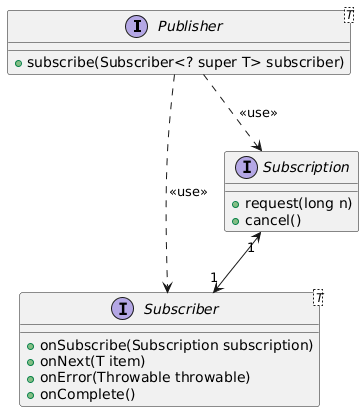

# Sección 2: Mono

---

## Creación del proyecto

A continuación se muestran las dependencias que usaremos para trabajar en este proyecto junto con las configuraciones de
`logback.xml`.

````xml

<project xmlns="http://maven.apache.org/POM/4.0.0"
         xmlns:xsi="http://www.w3.org/2001/XMLSchema-instance"
         xsi:schemaLocation="http://maven.apache.org/POM/4.0.0 http://maven.apache.org/xsd/maven-4.0.0.xsd">
    <modelVersion>4.0.0</modelVersion>

    <groupId>dev.magadiflo</groupId>
    <artifactId>java-reactive-programming</artifactId>
    <version>1.0-SNAPSHOT</version>

    <properties>
        <maven.compiler.source>21</maven.compiler.source>
        <maven.compiler.target>21</maven.compiler.target>
        <project.build.sourceEncoding>UTF-8</project.build.sourceEncoding>

        <reactor.version>2023.0.8</reactor.version>
        <logback.version>1.5.8</logback.version>
        <faker.version>1.0.2</faker.version>
        <junit.version>5.10.1</junit.version>
    </properties>
    <dependencies>
        <dependency>
            <groupId>io.projectreactor</groupId>
            <artifactId>reactor-core</artifactId>
        </dependency>
        <dependency>
            <groupId>io.projectreactor.netty</groupId>
            <artifactId>reactor-netty-core</artifactId>
        </dependency>
        <dependency>
            <groupId>io.projectreactor.netty</groupId>
            <artifactId>reactor-netty-http</artifactId>
        </dependency>
        <dependency>
            <groupId>ch.qos.logback</groupId>
            <artifactId>logback-classic</artifactId>
            <version>${logback.version}</version>
        </dependency>
        <dependency>
            <groupId>org.slf4j</groupId>
            <artifactId>slf4j-api</artifactId>
            <version>2.0.16</version>
        </dependency>
        <dependency>
            <groupId>com.github.javafaker</groupId>
            <artifactId>javafaker</artifactId>
            <version>${faker.version}</version>
        </dependency>
        <!-- test dependencies -->
        <dependency>
            <groupId>org.junit.jupiter</groupId>
            <artifactId>junit-jupiter-engine</artifactId>
            <version>${junit.version}</version>
            <scope>test</scope>
        </dependency>
        <!-- step-verifier -->
        <dependency>
            <groupId>io.projectreactor</groupId>
            <artifactId>reactor-test</artifactId>
            <scope>test</scope>
        </dependency>
    </dependencies>
    <dependencyManagement>
        <dependencies>
            <dependency>
                <groupId>io.projectreactor</groupId>
                <artifactId>reactor-bom</artifactId>
                <version>${reactor.version}</version>
                <type>pom</type>
                <scope>import</scope>
            </dependency>
        </dependencies>
    </dependencyManagement>
    <build>
        <plugins>
            <plugin>
                <groupId>org.apache.maven.plugins</groupId>
                <artifactId>maven-compiler-plugin</artifactId>
                <configuration>
                    <source>21</source>
                    <target>21</target>
                </configuration>
            </plugin>
        </plugins>
    </build>
</project>
````

En el directorio `src/main/resources` agregamos el archivo `logback.xml`.

````xml
<!-- http://dev.cs.ovgu.de/java/logback/manual/layouts.html -->
<configuration>
    <appender name="STDOUT" class="ch.qos.logback.core.ConsoleAppender">
        <encoder>
            <pattern>%d{HH:mm:ss.SSS} %-5level [%15.15t] %cyan(%-30.30logger{30}) : %m%n</pattern>
        </encoder>
    </appender>
    <logger name="io.netty.resolver.dns.DnsServerAddressStreamProviders" level="OFF"/>
    <root level="INFO">
        <appender-ref ref="STDOUT"/>
    </root>
</configuration>
````

## Implementando nuestro propio Publisher/Subscriber - Parte 1

Los flujos reactivos proporcionan un conjunto de interfaces:

- `Publisher`
- `Subscription`
- `Subscriber`

En este apartado y en el siguiente realizaremos nuestra propia implementación, pero ojo, esto no lo haremos en la vida
real. Es solo para obtener la comprensión básica. En la vida real utilizaremos una implementación proporcionada por
el proyecto `Reactor`.

Ideemos algún caso de uso para nuestra aplicación:

- Publisher, proporcionará el correo electrónico del cliente.
- Suscriber, está interesado en el correo electrónico del cliente para poder enviarle mensajes promocionales.

A continuación vamos a crear las clases `PublisherImpl`, `SubscriberImpl` y `SubscriptionImpl`. Recordar que estas
clases solo son clases que creamos para ver cómo es que funciona la `programación reactiva` con la especificación de
`Reactive Stream`, es decir, en la vida real no tenemos qué hacerlas.

````java
public class SubscriberImpl implements Subscriber<String> {

    private static final Logger log = LoggerFactory.getLogger(SubscriberImpl.class);
    private Subscription subscription;

    @Override
    public void onSubscribe(Subscription subscription) {
        this.subscription = subscription;
    }

    @Override
    public void onNext(String email) {
        log.info("recibido: {}", email);
    }

    @Override
    public void onError(Throwable throwable) {
        log.error("error", throwable);
    }

    @Override
    public void onComplete() {
        log.info("¡completado!");
    }

    public Subscription getSubscription() {
        return this.subscription;
    }
}
````

````java
public class SubscriptionImpl implements Subscription {

    private static final Logger log = LoggerFactory.getLogger(SubscriptionImpl.class);
    private final Subscriber<? super String> subscriber;

    public SubscriptionImpl(Subscriber<? super String> subscriber) {
        this.subscriber = subscriber;
    }

    @Override
    public void request(long l) {

    }

    @Override
    public void cancel() {

    }
}
````

````java
public class PublisherImpl implements Publisher<String> {
    @Override
    public void subscribe(Subscriber<? super String> subscriber) {
        SubscriptionImpl subscription = new SubscriptionImpl(subscriber);
        subscriber.onSubscribe(subscription);
    }
}
````

El código anterior muestra la implementación de la siguiente relación de interfaces.



## Implementando nuestro propio Publisher/Subscriber - Parte 2

**Recordar**
> En la vida real no tenemos que hacer estas implementaciones, aquí solo lo estamos haciendo para entender cómo es que
> por debajo funciona y jugar un poco con estos conceptos.
>
> En entornos reales rara vez, o casi nunca, se implementan directamente las interfaces `Subscriber`, `Publisher` o
> `Subscription`, porque ya existen implementaciones robustas, eficientes y listas para usar como `Flux` y `Mono` de
> Project Reactor. Pero crear esas implementaciones a mano es una excelente forma de entender cómo fluye la información,
> cómo se maneja el backpressure, cómo se suscriben los consumidores, etc.
>
> Es como construir un motor desde cero para entender cómo funciona internamente, aunque luego uses uno ya armado.

La siguiente implementación del `Subscription` lo que hace es simular el envío de correos electrónicos generados
aleatoriamente, pero con un límite de `10 como máximo`. Cada vez que el `Subscriber` pide elementos `(con request(n))`,
esta clase responde generando hasta `n` correos (o menos si ya está por llegar al tope de 10), y se los envía con
`onNext`.

Cuando ya ha enviado los 10, llama a `onComplete()` para indicar que terminó, y marca la `suscripción` como cancelada
internamente para no seguir enviando más.

`En resumen`: es una fuente finita de correos falsos que respeta un límite y responde a la demanda del `Subscriber`.

````java
public class SubscriptionImpl implements Subscription {

    private static final Logger log = LoggerFactory.getLogger(SubscriptionImpl.class);
    private static final int MAX_ITEMS = 10;
    private final Faker faker;
    private final Subscriber<? super String> subscriber;
    private boolean isCancelled;
    private int count = 0;

    public SubscriptionImpl(Subscriber<? super String> subscriber) {
        this.subscriber = subscriber;
        this.faker = Faker.instance();
    }

    @Override
    public void request(long requested) {
        if (this.isCancelled) return;

        log.info("El subscriber ha solicitado {} items", requested);
        if (requested > MAX_ITEMS) {
            this.subscriber.onError(new RuntimeException("Falló la validación"));
            this.isCancelled = true;
            return;
        }

        for (int i = 0; i < requested && this.count < MAX_ITEMS; i++) {
            this.count++;
            this.subscriber.onNext(this.faker.internet().emailAddress());
        }

        if (this.count == MAX_ITEMS) {
            log.info("No más datos para producir");
            this.subscriber.onComplete();
            this.isCancelled = true;
        }
    }

    @Override
    public void cancel() {
        log.info("El subscriber fue cancelado");
        this.isCancelled = true;
    }
}
````

## Publisher/Subscriber demo

Tendremos en consideración los siguientes puntos al momento de realizar la demostración.

1. El `publisher` no produce datos a menos que el `subscriber` los solicite.
2. El `publisher` solo producirá <= elementos solicitados por el `subscriber`. El `publisher` también puede producir 0
   elementos.
3. El `subscriber` puede cancelar la suscripción. El productor debe detenerse en ese momento, ya que el `subscriber` ya
   no está interesado en consumir los datos.
4. El `publisher` puede enviar la señal de error para indicar que algo anda mal.

En la siguiente demostración, si llamamos al método `demo1()`, no veremos nada dado que no hemos solicitado nada al
`publisher`.

````java
public class Main {
    public static void main(String[] args) throws InterruptedException {
        demo1();
    }

    private static void demo1() {
        PublisherImpl publisher = new PublisherImpl();
        SubscriberImpl subscriber = new SubscriberImpl();
        publisher.subscribe(subscriber);
    }
}
````

En el siguiente ejemplo vemos que el publisher va devolviendo elementos según se le vayan solicitando. Llega un punto
en el que se llega al límite establecido, por lo tanto se completa el flujo.

````java
public class Main {
    public static void main(String[] args) throws InterruptedException {
        demo2();
    }

    private static void demo2() throws InterruptedException {
        PublisherImpl publisher = new PublisherImpl();
        SubscriberImpl subscriber = new SubscriberImpl();
        publisher.subscribe(subscriber);

        subscriber.getSubscription().request(3);
        Thread.sleep(Duration.ofSeconds(2));

        subscriber.getSubscription().request(3);
        Thread.sleep(Duration.ofSeconds(2));

        subscriber.getSubscription().request(3);
        Thread.sleep(Duration.ofSeconds(2));

        subscriber.getSubscription().request(3);
        Thread.sleep(Duration.ofSeconds(2));
    }
}
````

````bash
d.m.a.p.p.SubscriptionImpl     : El subscriber ha solicitado 3 items
d.m.a.p.s.SubscriberImpl       : recibido: clifford.mills@yahoo.com
d.m.a.p.s.SubscriberImpl       : recibido: eugene.muller@yahoo.com
d.m.a.p.s.SubscriberImpl       : recibido: waldo.wyman@gmail.com
d.m.a.p.p.SubscriptionImpl     : El subscriber ha solicitado 3 items
d.m.a.p.s.SubscriberImpl       : recibido: marquis.frami@yahoo.com
d.m.a.p.s.SubscriberImpl       : recibido: eduardo.lockman@yahoo.com
d.m.a.p.s.SubscriberImpl       : recibido: minh.jerde@gmail.com
d.m.a.p.p.SubscriptionImpl     : El subscriber ha solicitado 3 items
d.m.a.p.s.SubscriberImpl       : recibido: nikita.runte@yahoo.com
d.m.a.p.s.SubscriberImpl       : recibido: ha.hamill@hotmail.com
d.m.a.p.s.SubscriberImpl       : recibido: diana.murphy@hotmail.com
d.m.a.p.p.SubscriptionImpl     : El subscriber ha solicitado 3 items
d.m.a.p.s.SubscriberImpl       : recibido: bert.klocko@hotmail.com
d.m.a.p.p.SubscriptionImpl     : No más datos para producir
d.m.a.p.s.SubscriberImpl       : ¡completado!
````

En la siguiente demostración se solicitan inicialmente 3 elementos, posterior a esa solicitud se cancela la suscripción,
por lo tanto se deja de emitir elementos.

````java
public class Main {
    public static void main(String[] args) throws InterruptedException {
        demo3();
    }

    private static void demo3() throws InterruptedException {
        PublisherImpl publisher = new PublisherImpl();
        SubscriberImpl subscriber = new SubscriberImpl();
        publisher.subscribe(subscriber);

        subscriber.getSubscription().request(3);
        Thread.sleep(Duration.ofSeconds(2));

        subscriber.getSubscription().cancel();
    }
}
````

````bash
d.m.a.p.p.SubscriptionImpl     : El subscriber ha solicitado 3 items
d.m.a.p.s.SubscriberImpl       : recibido: margareta.bashirian@yahoo.com
d.m.a.p.s.SubscriberImpl       : recibido: bryant.schaefer@yahoo.com
d.m.a.p.s.SubscriberImpl       : recibido: robbie.botsford@gmail.com
d.m.a.p.p.SubscriptionImpl     : El subscriber fue cancelado
````

En la siguiente demostración, inicialmente se solicitan 3 elementos, mismos que son entregados sin problemas. A
continuación se solicitan 30 elementos, pero internamente en la `SubscriptionImpl` hay una validación que dice que si
supera la cantidad máxima permitida (10 elementos) el subscriber lance un error
`this.subscriber.onError(new RuntimeException("Falló la validación"));`

````java
public class Main {
    public static void main(String[] args) throws InterruptedException {
        demo4();
    }

    private static void demo4() throws InterruptedException {
        PublisherImpl publisher = new PublisherImpl();
        SubscriberImpl subscriber = new SubscriberImpl();
        publisher.subscribe(subscriber);

        subscriber.getSubscription().request(3);
        Thread.sleep(Duration.ofSeconds(2));
        subscriber.getSubscription().request(30);
        Thread.sleep(Duration.ofSeconds(2));
    }
}
````

````bash
23:54:28.917 INFO  [           main] d.m.a.p.p.SubscriptionImpl     : El subscriber ha solicitado 3 items
23:54:29.097 INFO  [           main] d.m.a.p.s.SubscriberImpl       : recibido: janiece.homenick@hotmail.com
23:54:29.098 INFO  [           main] d.m.a.p.s.SubscriberImpl       : recibido: jerry.okuneva@hotmail.com
23:54:29.099 INFO  [           main] d.m.a.p.s.SubscriberImpl       : recibido: erasmo.pollich@hotmail.com
23:54:31.109 INFO  [           main] d.m.a.p.p.SubscriptionImpl     : El subscriber ha solicitado 30 items
23:54:31.109 ERROR [           main] d.m.a.p.s.SubscriberImpl       : error
java.lang.RuntimeException: Falló la validación
	at dev.magadiflo.app.pubsub.publisher.SubscriptionImpl.request(SubscriptionImpl.java:29)
	at dev.magadiflo.app.pubsub.Main.demo4(Main.java:94)
	at dev.magadiflo.app.pubsub.Main.main(Main.java:22)
````

## Mono/Flux - Introducción

El proyecto `Reactor` proporciona dos implementaciones de la interfaz `Publisher<T>`:

- `Mono<T>`
- `Flux<T>`


## Mono

- Emite `0 o 1` elemento.
- Seguido por un `onComplete` / `onError`.
- Un `Mono<T>` es un `Publisher<T>` especializado que emite como máximo un elemento a través de la señal `onNext` y
  luego finaliza con una señal `onComplete` (Mono exitoso, con o sin valor) o solo emite una única señal `onError`
  (Mono fallido).

Nuestro primer enfoque será cómo crear un publisher `Mono` usando los métodos de fábrica. También para soportar la base
de código existente. El proyecto Reactor proporciona muchos métodos de fábrica, por lo que a continuación se muestran
los siguientes.

| Métodos de fábrica | Uso                                                   |
|--------------------|-------------------------------------------------------|
| just               | Cuando el valor ya está en la memoria                 |
| empty              | No hay ningún elemento para emitir                    |
| error              | Emitir error                                          |
| fromSupplier       | Aplazar la ejecución mediante el uso de `Supplier<T>` |
| fromCallable       | Aplazar la ejecución mediante `Callable<T>`           |
| fromFuture         | Publisher creado desde un `CompletableFuture<T>`      |

## Mono Just

- Crea un nuevo `Mono` que emite el elemento especificado, que se captura en el momento de la instanciación.
- Emite el valor especificado inmediatamente cuando alguien se suscribe a él.
- Luego envía una señal de completion `(onComplete)`.
- Es útil cuando ya tenemos un valor en memoria.
- Es útil cuando queremos adaptar ese valor al mundo `reactivo`, porque necesitamos retornar un `Publisher`.

En `programación reactiva`, trabajamos con flujos de datos que aún no se han producido, o que se producirán
`asíncronamente`. Pero a veces ya tienes el dato, y aún así necesitas envolverlo en un flujo para que todo nuestro
`pipeline` siga siendo `reactivo`.

Entonces `Mono.just(...)` sirve como una forma de decir:

> "Tengo este dato ya listo, pero igual quiero entregártelo en formato reactivo."

**Importante**
> `Mono.just(...)` no es perezoso `(not lazy)`. El valor se asigna o calcula inmediatamente. Es decir, el valor que le
> pasamos ya fue calculado y evaluado en el momento en que llamamos al método `Mono.just(...)`.

Por ejemplo:

````java
Mono<String> mono = Mono.just(getExpensiveValue());
````

Aquí, `getExpensiveValue()` se ejecuta de inmediato, en el momento de crear el `Mono`, no cuando alguien se suscribe.
Entonces el valor ya está en memoria cuando se crea el `Mono`. Lo que sí es perezoso es la emisión del valor:
`el valor solo se emite cuando alguien se suscribe`.

### Ejemplo con nuestro SubscriberImpl

En este primer ejemplo vamos a utilizar nuestra implementación del `SubscriberImpl` para pasarlo al `mono (publisher)`.
Luego, con el subscriber obtenemos la subscripción y solicitamos que nos retorne 1 elemento.

````java
public class Lec02MonoJust {
    private static final Logger log = LoggerFactory.getLogger(Lec02MonoJust.class);

    public static void main(String[] args) {
        Mono<String> mono = Mono.just("Spanish");
        SubscriberImpl subscriber = new SubscriberImpl();
        mono.subscribe(subscriber);
        subscriber.getSubscription().request(1);
    }
}
````

El resultado de la ejecución anterior nos muestra este log.

````bash
23:34:24.958 INFO  [           main] d.m.a.p.s.SubscriberImpl       : recibido: Spanish
23:34:24.963 INFO  [           main] d.m.a.p.s.SubscriberImpl       : ¡completado!
````

**¿Por qué en el `SubscriberImpl` necesitamos hacer el `request(1)`?**

- En la especificación `Reactive Streams`, un `Subscriber` no recibe ningún dato hasta que le dice al `Publisher`
  cuántos quiere recibir. Eso se hace mediante `subscription.request(n);`.
- Si no hacemos `request(...)`, el `Publisher` no enviará ningún dato, porque está esperando saber cuántos ítems
  quieres. Esto es parte de la filosofía `pull-based` del `backpressure`.
- Entonces, en nuestro ejemplo con `SubscriberImpl`, nosotros somos los que controlamos la demanda explícitamente,
  y si no haces el `request(1)`, no pasa nada, no hay emisión, no hay onNext.

### Ejemplo con el proporcionado por Reactor

En este segundo ejemplo creamos el mono con `Mono.just` y luego en el propio método del `subscribe` imprimimos los
valores.

````java
public class Lec02MonoJust {
    private static final Logger log = LoggerFactory.getLogger(Lec02MonoJust.class);

    public static void main(String[] args) {
        Mono<String> mono = Mono.just("Spanish");
        mono.subscribe(
                value -> log.info("recibido: {}", value),
                error -> log.info("error: {}", error.getMessage()),
                () -> log.info("¡completado!")
        );
    }
}
````

Observamos el mismo resultado que la ejecución inicial.

````bash
23:36:45.528 INFO  [           main] d.m.app.sec02.Lec02MonoJust    : recibido: Spanish
23:36:45.531 INFO  [           main] d.m.app.sec02.Lec02MonoJust    : ¡completado!
````

**¿Por qué sí emite valor sin hacer el `request(...)`?**

- ¡Porque `Reactor` ya lo hace por nosotros debajo del capó!
- Cuando hacemos, tal como lo hemos hecho dentro del `.subscribe(value..., error..., ()...)`, `Reactor` internamente
  crea un `LambdaSubscriber` (una implementación suya de `Subscriber`) y automáticamente hace algo así
  `subscription.request(Long.MAX_VALUE);`, es decir "dame todo lo que tengas disponible".
- Esto se hace por conveniencia, porque en la mayoría de los casos la gente quiere consumir los valores directamente sin
  preocuparse por el control de flujo.

Además, en el código anterior tenemos:

1. `Mono.just("Spanish")`, crea un `Mono<String>` que emite un único valor `Spanish` y luego finaliza (envía la señal
   `onComplete`). Este valor ya está en memoria, como lo mencionamos antes.

2. `mono.subscribe(...)`, aquí estamos suscribiéndonos al `Mono` con `3 callbacks` (funciones `lambda`), que
   corresponden a las señales del flujo reactivo.

## Creando un subscriber predeterminado

A lo largo del curso usaremos el método `.subscribe()` para ver el resultado del flujo en los `Mono` y `Flux`. En este
sentido, para evitar escribir repetidamente dentro del `subscribe(...)` los tres parámetros
`value, error, () -> complete`, similar a como se muestra a continuación, es que crearemos un `subscriber`
predeterminado.

````java
public static void main(String[] args) {
    Mono<String> mono = Mono.just("Spanish");
    mono.subscribe(
            value -> log.info("recibido: {}", value),
            error -> log.info("error: {}", error.getMessage()),
            () -> log.info("¡completado!")
    );
}
````

Nuestro `DefaultSubscriber` implementa la interfaz `Subscriber`. Esto nos permitirá utilizarlo dentro del
método `.subscribe(...)` quien acepta una implementación del `subscriber`.

````java
public class DefaultSubscriber<T> implements Subscriber<T> {

    private static final Logger log = LoggerFactory.getLogger(DefaultSubscriber.class);
    private final String name;

    public DefaultSubscriber(String name) {
        this.name = name;
    }

    @Override
    public void onSubscribe(Subscription subscription) {
        subscription.request(Long.MAX_VALUE);
    }

    @Override
    public void onNext(T item) {
        log.info("{} recibido: {}", this.name, item);
    }

    @Override
    public void onError(Throwable throwable) {
        log.error("{} error: {}", this.name, throwable.getMessage());
    }

    @Override
    public void onComplete() {
        log.info("{} ¡completado!", this.name);
    }
}
````

Como vemos en el código anterior, la clase `DefaultSubscriber<T>` implementa `Subscriber<T>`, recibe un nombre para
identificar quién lo está usando, y maneja todos los métodos (`onSubscribe`, `onNext`, `onError`, `onComplete`)
de forma clara y reutilizable. Además, en `onSubscribe` hacemos `subscription.request(Long.MAX_VALUE)` para evitar
tener que pedir manualmente los elementos en cada uso.

Utilizaremos el `DefaultSubscriber` a través de una clase de utilidad. Esta clase nos retorna dos variantes de la
implementación del `Subscriber`. El primer método genérico retorna una implementación del `Subscriber<T>` al cual se
le pasa una cadena vacía por constructor. El segundo método genérico sí recibe un valor por parámetro y se lo envía al
constructor de la implementación. Además, estamos trabajando con la librería `Faker` que nos permitirá trabajar con
datos aleatorios, como correos, nombres, etc.

````java
public class Util {

    private static final Faker faker = Faker.instance();

    private Util() {
    }

    public static <T> Subscriber<T> subscriber() {
        return new DefaultSubscriber<>("");
    }

    public static <T> Subscriber<T> subscriber(String name) {
        return new DefaultSubscriber<>(name);
    }

    public static Faker faker() {
        return faker;
    }

    public static void sleepSeconds(long seconds) {
        try {
            Thread.sleep(Duration.ofSeconds(seconds));
        } catch (InterruptedException e) {
            throw new RuntimeException(e);
        }
    }
}
````

Realizamos una prueba rápida para ver cómo es que podemos usar nuestras clases implementadas anteriormente.

````java
public class Main {
    public static void main(String[] args) {
        Mono<String> mono = Mono.just("Spring Boot");
        mono.subscribe(Util.subscriber());
        mono.subscribe(Util.subscriber("martin"));
    }
}
````

Si vemos los resultados, todo está funcionando como esperábamos.

````bash
23:53:00.548 INFO  [           main] d.m.a.common.DefaultSubscriber :  recibido: Spring Boot
23:53:00.556 INFO  [           main] d.m.a.common.DefaultSubscriber :  ¡completado!
23:53:00.556 INFO  [           main] d.m.a.common.DefaultSubscriber : martin recibido: Spring Boot
23:53:00.556 INFO  [           main] d.m.a.common.DefaultSubscriber : martin ¡completado!
````

Por lo tanto, cada vez que queramos ver los valores de un `Publisher` cuando hagamos un `.subscribe()` solo necesitamos
utilizar nuestra clase de utilidad y llamar a uno de los dos métodos del `subscriber`. De esta manera, evitamos tener
que escribir constantemente los `callbacks` para manejar los `valores`, los `errores` o el `complete`.

## Mono - Empty/Error

- `Mono.empty()`, crea un `Mono` que se completa sin emitir ningún elemento. Es decir, representa un Mono que no emite
  ningún valor, pero termina de forma exitosa (es decir, no lanza error). En otras palabras:
    - No hay `onNext` (porque no hay valor).
    - Se llama directamente a `onComplete`.


- `Mono.error(...)`, crea un `Mono` que finaliza con el error especificado inmediatamente después de suscribirse. Es
  decir, es un `Mono` que `no emite valor alguno y termina con un error`.
    - No hay `onNext`.
    - No hay `onComplete`.
    - Se llama directamente a `onError`.

````java
public class Lec04MonoEmptyError {
    public static void main(String[] args) {
        getUsername(2).subscribe(Util.subscriber("Ejem1"));  //Empty
        getUsername(3).subscribe(Util.subscriber("Ejem2"));  //Error
    }

    private static Mono<String> getUsername(int userId) {
        return switch (userId) {
            case 1 -> Mono.just("Marti");
            case 2 -> Mono.empty();
            default -> Mono.error(new RuntimeException("Entrada inválida"));
        };
    }
}
````

Si ejecutamos el ejemplo anterior vemos la primera línea se corresponden con el `Ejem1` y la última línea con el
`Ejem2`.

````bash
23:10:04.576 INFO  [           main] d.m.a.common.DefaultSubscriber : Ejem1 ¡completado!
23:10:04.579 ERROR [           main] d.m.a.common.DefaultSubscriber : Ejem2 error: Entrada inválida
````

## Mono - From Supplier

En la programación reactiva, debemos ser perezosos en la medida de lo posible. A veces puede ser necesario retrasas la
ejecución, hacer el trabajo solo cuando sea necesario, de lo contrario no lo hagamos.

El `Mono.fromSupplier(Supplier<T> supplier)` se usa cuando quieres que el código que produce el valor se ejecute solo
cuando alguien se suscriba.

En otras palabras:

- No se ejecuta inmediatamente.
- Solo se ejecuta al hacer `.subscribe()`.
- Es útil cuando el valor es costoso de obtener o calcular, y no quieres hacerlo hasta que sea necesario.

El `Mono.fromSupplier`, crea un `Mono` que produce su valor utilizando el `Supplier` proporcionado. Si el `Supplier`
retorna `null`, el `Mono` resultante se completará vacío `Mono.empty()`.

Produce un valor diferido. A diferencia de `Mono.just()`, que recibe un valor directamente, `Mono.fromSupplier()`
ejecuta el `Supplier` solo en el momento en que alguien se suscribe al `Mono`. Esto es útil cuando el cálculo o la
obtención del valor puede tomar tiempo o cuando el valor puede cambiar entre diferentes suscripciones.

Veamos algunos detalles del `Mono.fromSupplier(...)`:

- Cuando necesitas diferir (posponer) la creación o cálculo de un valor hasta que alguien se suscriba.
- Para envolver operaciones de larga duración o cálculos que no deben ejecutarse hasta que realmente se necesiten.
- Para manejar situaciones donde el valor puede ser `null` y, en esos casos, devolver un `Mono.empty()` automáticamente.
- `Lazy (evaluación diferida)`, con `Mono.fromSupplier()`, el cálculo o la operación que definas dentro del `Supplier`
  no se ejecuta de inmediato. La evaluación se diferirá hasta que alguien se suscriba al `Mono`. Es decir, el cálculo
  no ocurre hasta que realmente sea necesario.
- En `Mono.fromSupplier(...)`, si el `Supplier` lanza una `excepción no comprobada (unchecked)`, como
  `NullPointerException`, `RuntimeException`, etc., el `Mono` se convierte automáticamente en un `Mono.error(...)`.

A continuación se muestra un ejemplo del uso del `Mono.fromSupplier()`.

````java
public class Lec05MonoFromSupplier {

    private static final Logger log = LoggerFactory.getLogger(Lec05MonoFromSupplier.class);

    public static void main(String[] args) {
        List<Integer> list = List.of(1, 2, 3);
        Mono.fromSupplier(() -> sum(list))
                .subscribe(Util.subscriber());
    }

    private static Integer sum(List<Integer> numbers) {
        log.info("Método donde se calcula la suma {}", numbers);
        return numbers.stream()
                .mapToInt(value -> value)
                .sum();
    }

}
````

````bash
23:56:07.554 INFO  [           main] d.m.a.s.Lec05MonoFromSupplier  : Método donde se calcula la suma [1, 2, 3]
23:56:07.559 INFO  [           main] d.m.a.common.DefaultSubscriber :  recibido: 6
23:56:07.563 INFO  [           main] d.m.a.common.DefaultSubscriber :  ¡completado!
````

**Dónde**

- `Mono.fromSupplier()` recibe una referencia a un método que retorna un valor (`int` en este caso).
- Ese método `no se ejecuta inmediatamente`.
- Se ejecuta solo cuando se hace `subscribe()`.
- El valor retornado (6) es emitido al `Subscriber` como un `onNext`.
- Luego, el flujo termina con `onComplete`.

**Nota**
> Si `sum()` devolviera `null`, el `Mono` actuaría como `Mono.empty()` y no emitiría ningún valor (`onNext`), solo
`onComplete`.

## Mono - From Callable

`Mono.fromCallable(Callable<T> callable)` crea un `Mono` a partir de una función que puede lanzar una
`excepción checked`. Si el `Callable` se resuelve como `null`, el `Mono` resultante es un `Mono.empty()`.

Es parecido a `Mono.fromSupplier()`, pero con algunas diferencias claves relacionadas con el manejo de excepciones.

| Característica      | fromSupplier()      | fromCallable()           |
|---------------------|---------------------|--------------------------|
| Retorna             | T                   | T                        |
| ¿Lanza excepciones? | No (solo unchecked) | Sí (checked o unchecked) |
| ¿Cuándo se ejecuta? | Al suscribirse      | Al suscribirse           |

`Callable` es una interfaz funcional de Java que puede `devolver un valor` o `lanzar una excepción`. A diferencia de
`Supplier`, que `solo devuelve un valor`, `Callable` está diseñada para operaciones que pueden fallar, ya que puede
lanzar una excepción comprobada `(checked exception)`.

Al usar `Mono.fromCallable()` el cálculo no se ejecuta inmediatamente; se evalúa cuando alguien se suscribe al `Mono`,
al igual que `Mono.fromSupplier()`. Sin embargo, `Callable` permite manejar excepciones y propagar errores a los
suscriptores de forma más sencilla.

A continuación se muestra un ejemplo básico.

````java
public class Lec06MonoFromCallable {
    private static final Logger log = LoggerFactory.getLogger(Lec06MonoFromCallable.class);

    public static void main(String[] args) {
        Mono.fromCallable(() -> getData())
                .subscribe(Util.subscriber());
    }

    private static String getData() throws Exception {
        log.info("Obteniendo datos...");
        double random = Math.random();
        if (random > 0.5) {
            throw new Exception("Falló en la obtención de datos. random=%f".formatted(random));
        }
        return "Datos obtenidos correctamente. random=%f".formatted(random);
    }
}
````

- La función `getData()` puede lanzar una excepción (`throws Exception`).
- `Mono.fromCallable()` captura esa excepción y la convierte en un `Mono.error()` automáticamente.
- Cuando se llama a `subscribe()`, se ejecuta el método y el resultado se emite, o el `error` se propaga al
  `Subscriber`.

Si ejecutamos la aplicación vemos que esta no se cae cuando se está lanzando una excepción en el método
`gatData()`, por el contrario, la excepción lanzada se captura e imprime en la sección de `onError()` de nuestro
`DefaultSubscriber()`.

````bash
23:02:31.045 INFO  [           main] d.m.a.s.Lec06MonoFromCallable  : Obteniendo datos...
23:02:31.065 ERROR [           main] d.m.a.common.DefaultSubscriber :  error: Falló en la obtención de datos. random=0.793071
````

Si ejecutamos y no nos l anza la excepción el Mono está trabajando con normalidad.

````bash
23:05:32.674 INFO  [           main] d.m.a.s.Lec06MonoFromCallable  : Obteniendo datos...
23:05:32.689 INFO  [           main] d.m.a.common.DefaultSubscriber :  recibido: Datos obtenidos correctamente. random=0.406879
23:05:32.693 INFO  [           main] d.m.a.common.DefaultSubscriber :  ¡completado!
````

## Mono - From Runnable

`Mono.fromRunnable(Runnable runnable)` crea un `Mono<Void>` a partir de una acción que no retorna ningún valor,
pero que quieres ejecutar de forma reactiva.

A continuación se muestran algunas características del `Mono.fromRunnable`:

| Aspecto           | Detalle                                                                                                 |
|-------------------|---------------------------------------------------------------------------------------------------------|
| Tipo de retorno   | `Mono<Void>` (no emite datos, solo la señal de completado)                                              |
| Cuándo se ejecuta | Al suscribirse                                                                                          |
| Uso principal     | Ejecutar lógica secundaria: logs, envíos de notificaciones, tareas, etc.                                |
| Propaga errores   | Sí, si el `Runnable` lanza una excepción, el `Mono` emitirá `onError` y NO se ejecutará `onComplete()`. |

A continuación se muestra un ejemplo básico.

````java
public class Lec07MonoFromRunnable {

    private static final Logger log = LoggerFactory.getLogger(Lec07MonoFromRunnable.class);

    public static void main(String[] args) {
        getProductName(2)
                .subscribe(Util.subscriber());
    }

    private static Mono<String> getProductName(int productId) {
        if (productId == 1) {
            return Mono.fromSupplier(() -> Util.faker().commerce().productName());
        }
        return Mono.fromRunnable(() -> notifyBusiness(productId));
    }

    private static void notifyBusiness(int productId) {
        log.info("Notificando: el producto con id {} no está disponible", productId);
    }

}
````

Si ejecutamos el código anterior, vemos que el `Mono.fromRunnable()` permite que se ejecute el método `notifyBusiness()`
y luego que este método haya finalizado su ejecución sin haber retornado nada `(void)` el `Mono.fromRunnable()` retorna
un `Mono.empty()`.

````bash
23:42:14.552 INFO  [           main] d.m.a.s.Lec07MonoFromRunnable  : Notificando: el producto con id 1 no está disponible
23:42:14.557 INFO  [           main] d.m.a.common.DefaultSubscriber :  ¡completado!
````

## Mono - From Future

`Mono.fromFuture()` permite adaptar un `CompletableFuture` (o cualquier `Future`) a un `Mono`, integrándolo de forma
natural al flujo reactivo de `Project Reactor`.

Lo usamos cuando ya tenemos código que trabaja con `CompletableFuture` (por ejemplo, llamadas asíncronas a servicios
externos o tareas largas) y queremos integrarlo con el modelo reactivo de `Reactor`.

````java
public class Lec08MonoFromFuture {

    private static final Logger log = LoggerFactory.getLogger(Lec08MonoFromFuture.class);

    public static void main(String[] args) {
        Mono.fromFuture(() -> getName())
                .subscribe(Util.subscriber());

        Util.sleepSeconds(3);
    }

    private static CompletableFuture<String> getName() {
        return CompletableFuture.supplyAsync(() -> {
            log.info("Generando nombre..");
            Util.sleepSeconds(2);
            return Util.faker().name().firstName();
        });
    }
}
````

**Dónde**

- `Mono.fromFuture()` espera a que el `Future` termine, y emite su valor.
- Si el `Future` falla, `Mono` emite `onError`.
- El `Mono` se completa cuando el `Future` se completa.
- Como los `Future` no son parte de Reactor, necesitamos evitar que el programa se cierre antes de que termine (por eso
  usamos `Util.sleepSeconds(3)` en el ejemplo).
- El `Util.sleepSeconds(2)` usado dentro del método `getName()` del `CompletableFuture` solo es para simular una demora
  de 2 segundos.
- `CompletableFuture<T>`, representa el resultado futuro de una operación asíncrona.
- `supplyAsync(Supplier<T>)`, ejecuta una tarea en segundo plano que retorna un valor.

El resultado que obtuvimos es exactamente el comportamiento esperado de `Mono.fromFuture()`:

````bash
23:22:36.190 INFO  [onPool-worker-1] d.m.a.s.Lec08MonoFromFuture    : Generando nombre..
23:22:38.316 INFO  [onPool-worker-1] d.m.a.common.DefaultSubscriber :  recibido: Terence
23:22:38.321 INFO  [onPool-worker-1] d.m.a.common.DefaultSubscriber :  ¡completado!
````

1. `Mono.fromFuture(() -> getName())`
    - Se crea un `Mono` a partir del `CompletableFuture` que retorna el método `getName()`.

2. `Dentro de getName()`
    - Se imprime el log `Generando nombre...`
    - Se duerme el hilo durante 2 segundos simulando una tarea lenta.
    - Luego se genera un nombre aleatorio usando `Util.faker()` y se retorna.

3. `Suscripción al Mono`
    - El `Mono` se suscribe, lo que dispara la ejecución del `CompletableFuture`.
    - Una vez que el `CompletableFuture` se completa (después de 2 segundos), el valor (`Terence` en este caso) es
      emitido al suscriptor.
    - Finalmente, se imprime `¡completado!`.
4. `Util.sleepSeconds(3)`
    - Este `sleep` evita que el `main` termine antes de que el `Future` se complete.

