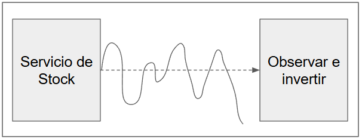

# Sección 3: Flux

---

## Flux

- `Flux<T>` representa una secuencia reactiva que puede emitir `0 a N elementos`.
- Puede terminar con una señal de éxito (`onComplete`) o error (`onError`).

## Flux - Just

Crea un `Flux` que emite los elementos proporcionados y luego se completa.

````java
public class Lec01FluxJust {
    public static void main(String[] args) {
        Flux.just(1, 2, 3, 4)
                .subscribe(Util.subscriber());
    }
}
````

Este `Flux` emitirá los elementos 1, 2, 3, 4 uno tras otro, y luego enviará una señal de completado (`onComplete`).

````bash
16:54:54.196 INFO  [           main] d.m.a.common.DefaultSubscriber :  recibido: 1
16:54:54.199 INFO  [           main] d.m.a.common.DefaultSubscriber :  recibido: 2
16:54:54.199 INFO  [           main] d.m.a.common.DefaultSubscriber :  recibido: 3
16:54:54.199 INFO  [           main] d.m.a.common.DefaultSubscriber :  recibido: 4
16:54:54.201 INFO  [           main] d.m.a.common.DefaultSubscriber :  ¡completado!
````

## Flux - Multiple Subscribers

Creamos un `Flux` que emite los números del 1 al 4. Luego hay dos suscriptores distintos al mismo `Flux`.

1. El primer suscriptor (`sub1`) se suscribe a una versión filtrada del `Flux` (solo números pares).
2. El segundo suscriptor (`sub2`) se suscribe al `Flux` sin filtro, por lo tanto, recibe todos los elementos.

- `Flux.just(...)` crea un `Cold Publisher`.
- Un `Cold Publisher` genera una secuencia cada vez que alguien se suscribe.
- Cada suscripción comienza desde el principio y no comparte el flujo con otros suscriptores.

Esto es útil cuando quieres que cada consumidor reciba la secuencia completa y pueda aplicar sus propias
transformaciones.

````java
public class Lec02MultipleSubscribers {
    public static void main(String[] args) {
        Flux<Integer> numbers = Flux.just(1, 2, 3, 4);

        numbers
                .filter(value -> value % 2 == 0)
                .subscribe(Util.subscriber("sub1"));

        numbers.subscribe(Util.subscriber("sub2"));
    }
}
````

Cuando se tiene más de un `Subscriber` suscrito al mismo `Flux`, cada suscriptor recibe su propia instancia de la
secuencia de datos.

````bash
17:00:41.794 INFO  [           main] d.m.a.common.DefaultSubscriber : sub1 recibido: 2
17:00:41.796 INFO  [           main] d.m.a.common.DefaultSubscriber : sub1 recibido: 4
17:00:41.799 INFO  [           main] d.m.a.common.DefaultSubscriber : sub1 ¡completado!
17:00:41.800 INFO  [           main] d.m.a.common.DefaultSubscriber : sub2 recibido: 1
17:00:41.800 INFO  [           main] d.m.a.common.DefaultSubscriber : sub2 recibido: 2
17:00:41.800 INFO  [           main] d.m.a.common.DefaultSubscriber : sub2 recibido: 3
17:00:41.800 INFO  [           main] d.m.a.common.DefaultSubscriber : sub2 recibido: 4
17:00:41.800 INFO  [           main] d.m.a.common.DefaultSubscriber : sub2 ¡completado!
````

## Flux - From Array / List

Este tema es fundamental porque muestra cómo crear un `Flux` a partir de estructuras de datos ya existentes, como
`listas` o `arrays`.

- `Flux.fromIterable(Iterable<T>)`: Crea un `Flux` que emite todos los elementos de una colección (por ejemplo, `List`,
  `Set`, etc.).
- `Flux.fromArray(T[])`: Crea un `Flux` a partir de un arreglo de cualquier tipo.

Ambos son métodos estáticos de fábrica utilizados para `convertir fuentes de datos existentes en secuencias reactivas`.

````java
public class Lec03FluxFromIterableOrArray {
    public static void main(String[] args) {
        List<String> letters = List.of("a", "b", "c");
        Flux.fromIterable(letters)
                .subscribe(Util.subscriber());

        Integer[] ages = {18, 20, 25};
        Flux.fromArray(ages)
                .subscribe(Util.subscriber());
    }
}
````

Al ejecutar la clase anterior, observamos el siguiente resultado.

````bash
17:13:08.170 INFO  [           main] d.m.a.common.DefaultSubscriber :  recibido: a
17:13:08.172 INFO  [           main] d.m.a.common.DefaultSubscriber :  recibido: b
17:13:08.172 INFO  [           main] d.m.a.common.DefaultSubscriber :  recibido: c
17:13:08.175 INFO  [           main] d.m.a.common.DefaultSubscriber :  ¡completado!
17:13:08.176 INFO  [           main] d.m.a.common.DefaultSubscriber :  recibido: 18
17:13:08.176 INFO  [           main] d.m.a.common.DefaultSubscriber :  recibido: 20
17:13:08.176 INFO  [           main] d.m.a.common.DefaultSubscriber :  recibido: 25
17:13:08.176 INFO  [           main] d.m.a.common.DefaultSubscriber :  ¡completado!
````

## Flux - From Stream

`Flux.fromStream(Stream<T>)` permite convertir un `java.util.stream.Stream` en un `Flux`, para emitir sus elementos de
forma reactiva.

````java
public class Lec04FluxFromStream {
    public static void main(String[] args) {
        List<Integer> numbers = List.of(1, 2, 3);
        Stream<Integer> stream = numbers.stream();

        Flux<Integer> flux = Flux.fromStream(stream);

        flux.subscribe(Util.subscriber("sub1"));
    }
}
````

Si ejecutamos el código anterior veremos que todo está funcionando correctamente.

````bash
17:31:08.222 INFO  [           main] d.m.a.common.DefaultSubscriber : sub1 recibido: 1
17:31:08.224 INFO  [           main] d.m.a.common.DefaultSubscriber : sub1 recibido: 2
17:31:08.224 INFO  [           main] d.m.a.common.DefaultSubscriber : sub1 recibido: 3
17:31:08.226 INFO  [           main] d.m.a.common.DefaultSubscriber : sub1 ¡completado!
````

Sin embargo, es importante entender que los `Streams` en Java son de un solo uso. Esto significa que, una vez consumido
un stream, no puede volver a ser reutilizado (intentar hacerlo lanza una excepción).

En ese sentido, si intentamos utilizar el `Flux.fromStream(stream)` con varias suscripciones, veremos que en el
resultado nos muestra un error.

````java
public class Lec04FluxFromStream {
    public static void main(String[] args) {
        List<Integer> numbers = List.of(1, 2, 3);
        Stream<Integer> stream = numbers.stream();

        Flux<Integer> flux = Flux.fromStream(stream);

        flux.subscribe(Util.subscriber("sub1")); // OK
        flux.subscribe(Util.subscriber("sub2")); // ERROR: el stream ya fue usado
    }
}
````

Este error no es del `Flux`, sino del propio `stream` de java. Si se reutiliza un `stream` ya consumido, se obtiene una
excepción.

````bash
17:32:06.467 INFO  [           main] d.m.a.common.DefaultSubscriber : sub1 recibido: 1
17:32:06.469 INFO  [           main] d.m.a.common.DefaultSubscriber : sub1 recibido: 2
17:32:06.469 INFO  [           main] d.m.a.common.DefaultSubscriber : sub1 recibido: 3
17:32:06.471 INFO  [           main] d.m.a.common.DefaultSubscriber : sub1 ¡completado!
17:32:06.473 ERROR [           main] d.m.a.common.DefaultSubscriber : sub2 error: stream has already been operated upon or closed
````

### ✅ Solución: usar un Stream Supplier

La manera correcta de trabajar con múltiples suscripciones es usando un `Supplier` que crea un nuevo `stream` cada vez.
Esto garantiza que `cada suscriptor reciba su propio stream nuevo`, evitando el error de reutilización.

````java
public class Lec04FluxFromStream {
    public static void main(String[] args) {
        List<Integer> numbers = List.of(1, 2, 3);

        Flux<Integer> flux = Flux.fromStream(() -> numbers.stream());

        flux.subscribe(Util.subscriber("sub1"));
        flux.subscribe(Util.subscriber("sub2"));
    }
}
````

Ahora, si volvemos a ejecutar la aplicación veremos que todos los suscribers están recibiendo sus datos.

````bash
17:34:37.380 INFO  [           main] d.m.a.common.DefaultSubscriber : sub1 recibido: 1
17:34:37.382 INFO  [           main] d.m.a.common.DefaultSubscriber : sub1 recibido: 2
17:34:37.382 INFO  [           main] d.m.a.common.DefaultSubscriber : sub1 recibido: 3
17:34:37.385 INFO  [           main] d.m.a.common.DefaultSubscriber : sub1 ¡completado!
17:34:37.385 INFO  [           main] d.m.a.common.DefaultSubscriber : sub2 recibido: 1
17:34:37.385 INFO  [           main] d.m.a.common.DefaultSubscriber : sub2 recibido: 2
17:34:37.385 INFO  [           main] d.m.a.common.DefaultSubscriber : sub2 recibido: 3
17:34:37.385 INFO  [           main] d.m.a.common.DefaultSubscriber : sub2 ¡completado!
````

## Flux - Range

El operador `range` en `Flux` crea una secuencia de números dentro de un rango específico, generando un `Flux` con un
flujo de números enteros. Es útil cuando necesitas producir una secuencia de números consecutivos en un rango
determinado.

En el siguiente ejemplo, el `Flux.range(3, 4)` genera un `Flux` que emitirá los números `3, 4, 5, 6`. El primer
parámetro es el `número inicial` y el segundo parámetro es la `cantidad de números a emitir`.

Aprovechamos que vamos a emitir 4 elementos para que en cada uno de ellos obtengamos un nombre aleatorio a partir del
`Util.faker().name().firstName()`. Le damos un formato y lo pasamos al `subscriber` para ser procesado.

````java
public class Lec05FluxRange {
    public static void main(String[] args) {
        Flux.range(3, 4)
                .map(i -> String.format("%d°: %s", i, Util.faker().name().firstName()))
                .subscribe(Util.subscriber());
    }
}
````

````bash
17:54:29.879 INFO  [           main] d.m.a.common.DefaultSubscriber :  recibido: 3°: Marquita
17:54:29.883 INFO  [           main] d.m.a.common.DefaultSubscriber :  recibido: 4°: Brenton
17:54:29.883 INFO  [           main] d.m.a.common.DefaultSubscriber :  recibido: 5°: Maria
17:54:29.883 INFO  [           main] d.m.a.common.DefaultSubscriber :  recibido: 6°: Carmelita
17:54:29.887 INFO  [           main] d.m.a.common.DefaultSubscriber :  ¡completado!
````

## Log Operator

El operador `log()` en `Project Reactor` se utiliza para registrar (`loggear`) los eventos del flujo reactivo.
Es una herramienta muy útil para el desarrollo y depuración, ya que muestra en consola los eventos que ocurren
dentro de un `Flux` o `Mono`.

Este operador permite ver en tiempo real:

- Cuándo se suscribe un `Subscriber`
- Cuándo se hace una solicitud (`request`)
- Los elementos emitidos (`onNext`)
- Si ocurre un error (`onError`)
- Cuando el flujo se completa (`onComplete`)
- Información del tipo de suscripción (por ejemplo, si es `synchronous fuseable`)

El siguiente código genera un `Flux` que emite los números del `1 al 5`. Al usar `.log()`, se imprimen en consola todos
los eventos que ocurren en ese flujo.

````java
public class Lec06Log {
    public static void main(String[] args) {
        Flux.range(1, 5)
                .log()
                .subscribe(Util.subscriber());
    }
}
````

Salida típica en consola.

````bash
main] reactor.Flux.Range.1           : | onSubscribe([Synchronous Fuseable] FluxRange.RangeSubscription)  // el subscriber se ha suscrito al flujo
main] reactor.Flux.Range.1           : | request(unbounded)                                               // El subscriber solicita una cantidad ilimitada de datos
main] reactor.Flux.Range.1           : | onNext(1)                                                        // El publisher emite el valor 1
main] d.m.a.common.DefaultSubscriber :  recibido: 1                                                       // El subscriber recibe y procesa el valor 1
main] reactor.Flux.Range.1           : | onNext(2)
main] d.m.a.common.DefaultSubscriber :  recibido: 2
main] reactor.Flux.Range.1           : | onNext(3)
main] d.m.a.common.DefaultSubscriber :  recibido: 3
main] reactor.Flux.Range.1           : | onNext(4)
main] d.m.a.common.DefaultSubscriber :  recibido: 4
main] reactor.Flux.Range.1           : | onNext(5)
main] d.m.a.common.DefaultSubscriber :  recibido: 5
main] reactor.Flux.Range.1           : | onComplete()                                                     // El flujo se completa
main] d.m.a.common.DefaultSubscriber :  ¡completado!                                                      // El subscriber muestra que terminó
````

🧠 Notas importantes

- Podemos pasarle un nombre de categoría al método `log("miCategoria")` si deseamos identificar el flujo en los logs.
- También podemos controlar qué eventos `loggear` usando una sobrecarga de `log()` con `SignalType`
  (ej. `log("miCategoria", Level.INFO, SignalType.ON_NEXT)`).
- El operador `log()` es solo para depuración, `no afecta el comportamiento del flujo`.

## Flux vs List

Para realizar la comparación entre `Flux` y `List` vamos a crear la siguiente clase que nos permitirá ejemplificar mejor
las diferencias.

````java
public class NameGenerator {

    private NameGenerator() {
    }

    public static List<String> getNamesList(int count) {
        return IntStream.rangeClosed(1, count)
                .mapToObj(value -> generateName())
                .toList();
    }

    public static Flux<String> getNamesFlux(int count) {
        return Flux.range(1, count)
                .map(value -> generateName());
    }

    private static String generateName() {
        Util.sleepSeconds(1);
        return Util.faker().name().firstName();
    }
}
````

La clase `NameGenerator` encapsula dos métodos clave:

- `getNamesList(int count)` → genera una `lista` síncrona de nombres.
- `getNamesFlux(int count)` → genera un `Flux` (flujo reactivo) de nombres.

Ambos usan un método privado `generateName()` que simula una operación costosa con `sleepSeconds(1)` para representar
un tiempo de espera (como si fuera una llamada a una API, base de datos, etc.).

A continuación se muestra la clase principal cuyo objetivo es entender las diferencias clave entre trabajar con
colecciones tradicionales como `List` (enfoque `imperativo/síncrono`) y flujos reactivos como `Flux`
(enfoque `reactivo/asíncrono/no bloqueante`).

````java
public class Lec07FluxVsList {

    private static final Logger log = LoggerFactory.getLogger(Lec07FluxVsList.class);

    public static void main(String[] args) {
        // Lista tradicional
        List<String> namesList = NameGenerator.getNamesList(5); //Somos bloqueados por 5 segundos. Retorna la cantidad solicitada o nada
        log.info(String.valueOf(namesList));

        // Flujo reactivo
        Flux<String> namesFlux = NameGenerator.getNamesFlux(5); //Aquí fácilmente se puede cancelar luego del primer resultado
        namesFlux.subscribe(Util.subscriber());
    }
}
````

### 🔍 ¿Qué pasa internamente?

1. `getNamesList(5)`:
    - Se ejecuta una operación bloqueante (1 segundo por nombre).
    - Se espera 5 segundos para obtener toda la lista.
    - Una vez lista, se imprime toda junta.

2. `getNamesFlux(5)`:
    - Los nombres se emiten uno por uno cada segundo.
    - Se pueden procesar a medida que llegan (en tiempo real).
    - Ventaja: puedes cancelar el `subscribe()` si ya no necesitas más elementos.

````bash
// List
10:40:01.953 INFO  [           main] d.m.app.sec03.Lec07FluxVsList  : [Lekisha, Kiyoko, Tanner, Gita, Terrance]

// Flux
10:40:03.017 INFO  [           main] d.m.a.common.DefaultSubscriber :  recibido: Leif
10:40:04.034 INFO  [           main] d.m.a.common.DefaultSubscriber :  recibido: Yong
10:40:05.041 INFO  [           main] d.m.a.common.DefaultSubscriber :  recibido: Justa
10:40:06.049 INFO  [           main] d.m.a.common.DefaultSubscriber :  recibido: Emily
10:40:07.059 INFO  [           main] d.m.a.common.DefaultSubscriber :  recibido: Dorian
10:40:07.065 INFO  [           main] d.m.a.common.DefaultSubscriber :  ¡completado!
````

### ✅ Conclusión

- Si necesitas todos los datos antes de continuar (modo tradicional), una `List` puede funcionar, pero bloquea el hilo.
- Si quieres emitir, transformar o consumir datos a medida que están disponibles, `Flux` es la opción ideal, más
  escalable y eficiente en sistemas reactivos.
- En entornos de alta concurrencia o I/O intensivo, `Flux` supera ampliamente a `List` por su naturaleza no bloqueante
  y capacidad de cancelación.

## Preguntas frecuentes: ¿Mono y Flux son estructuras de datos?

Aunque en un principio uno puede pensar que `Mono<T>` y `Flux<T>` son estructuras de datos como `List<T>` o `Set<T>`,
en realidad no lo son.

- `List<T>, Set<T>, ...`, representan los `datos en la memoria`. Son almacenes, son como bodegas llenas de objetos que
  ya están allí y nosotros solo los vamos a buscar.
- `Flux<T>, Mono<T>`, representa un `tunel/tubería` a través de la cual se pueden transferir los datos de un lugar a
  otro, una tubería por donde `los datos fluyen` bajo demanda. Su propósito `no es almacenar datos`, sino producir y
  transformar flujos de datos.

## Flux - Interval

Crea un `Flux` que emite valores largos, comenzando en `0` y aumentando a intervalos de tiempo específicos en el
temporizador global. El primer elemento se emite tras un retraso inicial igual al período. Si la demanda no se
produce a tiempo, se generará un `onError` con un `IllegalStateException` por desbordamiento que detalla el tick que
no se pudo emitir. En condiciones normales, el `Flux` nunca se completará.
Se ejecuta en el Scheduler `Schedulers.parallel()`.

- `Flux.interval(Duration)` es un operador que emite valores tipo Long empezando desde 0 y se incrementa con cada
  intervalo.
- Este operador es `asíncrono` y `no bloqueante`. Utiliza un `Scheduler` (por defecto `Schedulers.parallel()`).
- `No se detiene por sí solo`, a menos que se cancele, se agregue un límite (como `take(n)`), o finalice el programa.

````java
public class Lec09FluxInterval {
    public static void main(String[] args) {
        Flux.interval(Duration.ofMillis(500)) // Cada 500 milisegundos
                .map(i -> Util.faker().name().firstName()) // Transforma el número en un nombre aleatorio
                .subscribe(Util.subscriber());

        Util.sleepSeconds(5); // Mantiene vivo el h ilo principal por 5 segundos
    }
}
````

### 📌 Explicación

- Se crea un `Flux` que emite un valor cada `500 milisegundos`.
- Cada valor se transforma con `map` usando `faker()` para obtener un nombre aleatorio.
- Se suscribe al `Flux` usando un `subscriber` personalizado (`Util.subscriber()`).
- Se duerme el hilo principal por 5 segundos para permitir que se emitan valores, ya que interval corre en otro hilo.

````bash
12:05:45.873 INFO  [     parallel-1] d.m.a.common.DefaultSubscriber :  recibido: Rosia
12:05:46.263 INFO  [     parallel-1] d.m.a.common.DefaultSubscriber :  recibido: Max
12:05:46.760 INFO  [     parallel-1] d.m.a.common.DefaultSubscriber :  recibido: Kieth
12:05:47.255 INFO  [     parallel-1] d.m.a.common.DefaultSubscriber :  recibido: Dannie
12:05:47.754 INFO  [     parallel-1] d.m.a.common.DefaultSubscriber :  recibido: Micah
12:05:48.269 INFO  [     parallel-1] d.m.a.common.DefaultSubscriber :  recibido: Kendrick
12:05:48.754 INFO  [     parallel-1] d.m.a.common.DefaultSubscriber :  recibido: Allene
12:05:49.265 INFO  [     parallel-1] d.m.a.common.DefaultSubscriber :  recibido: Zola
12:05:49.764 INFO  [     parallel-1] d.m.a.common.DefaultSubscriber :  recibido: Estelle
12:05:50.261 INFO  [     parallel-1] d.m.a.common.DefaultSubscriber :  recibido: Wilson
````

## Flux - Empty/Error

1. `Flux.empty()`
    - Crea un `Flux` que no emite ningún elemento, pero sí completa exitosamente.
    - Útil cuando queremos devolver un flujo vacío sin error (equivalente a un List vacío).


2. `Flux.error(ThrowableSupplier)`
    - Crea un `Flux` que inmediatamente emite un error y no emite ningún valor.
    - Útil para simular o propagar fallos.

````java
public class Lec10FluxEmptyError {
    public static void main(String[] args) {
        Flux.empty()
                .subscribe(Util.subscriber());

        Flux.error(() -> new RuntimeException("Ocurrió un error"))
                .subscribe(Util.subscriber());
    }
}
````

````bash
// empty flux
12:28:03.644 INFO  [           main] d.m.a.common.DefaultSubscriber :  ¡completado!

// error flux
12:28:03.647 ERROR [           main] d.m.a.common.DefaultSubscriber :  error: Ocurrió un error
````

## Flux - Defer

`Flux.defer` es un operador que retrasa la creación del `Flux` hasta que un `Subscriber` se suscribe.
Es útil cuando cada suscripción debe obtener un nuevo flujo "fresco", por ejemplo, si el contenido del flujo depende de
algo que puede cambiar con el tiempo (como la hora actual o una llamada a base de datos).

| Sin `defer (Flux.just(...))`        | Con `defer (Flux.defer(...))`                 |
|-------------------------------------|-----------------------------------------------|
| El valor es evaluado inmediatamente | El valor se evalúa cuando alguien se suscribe |
| Se reutiliza el mismo valor         | Cada suscriptor obtiene un nuevo valor        |

- `Flux<String> flux = Flux.just(getName())`, el `getName()` se ejecuta de inmediato.
- `Flux<String> flux = Flux.defer(() -> Flux.just(getName()))`, el `getName()` se ejecuta al suscribirse.

Veamos el siguente ejemplo.

````java
public class Lec11FluxDefer {
    private static final Logger log = LoggerFactory.getLogger(Lec11FluxDefer.class);

    public static void main(String[] args) {
        // getName() se ejecuta solo una vez
        Flux<String> justFlux = Flux.just(getName());
        justFlux.subscribe(Util.subscriber("just"));
        justFlux.subscribe(Util.subscriber("just"));

        // getName() se ejecuta en cada suscripción
        Flux<String> deferFlux = Flux.defer(() -> Flux.just(getName()));
        deferFlux.subscribe(Util.subscriber("defer"));
        deferFlux.subscribe(Util.subscriber("defer"));
    }

    private static String getName() {
        log.info("Generando nombre...");
        return Util.faker().name().firstName();
    }
}
````

Como se observa, el `Flux.just` se ejecuta una sola vez, por eso el nombre se repite. Mientras que en el segundo
ejemplo el `Flux.defer` se ejecuta en cada suscripción.

````bash
//Flux.just

12:46:40.053 INFO  [           main] d.m.app.sec03.Lec11FluxDefer   : Generando nombre...
12:46:40.288 INFO  [           main] d.m.a.common.DefaultSubscriber : just recibido: Freddie
12:46:40.291 INFO  [           main] d.m.a.common.DefaultSubscriber : just ¡completado!
12:46:40.292 INFO  [           main] d.m.a.common.DefaultSubscriber : just recibido: Freddie

//Flux.defer

12:46:40.292 INFO  [           main] d.m.a.common.DefaultSubscriber : just ¡completado!
12:46:40.292 INFO  [           main] d.m.app.sec03.Lec11FluxDefer   : Generando nombre...
12:46:40.292 INFO  [           main] d.m.a.common.DefaultSubscriber : defer recibido: Ivory
12:46:40.292 INFO  [           main] d.m.a.common.DefaultSubscriber : defer ¡completado!
12:46:40.292 INFO  [           main] d.m.app.sec03.Lec11FluxDefer   : Generando nombre...
12:46:40.293 INFO  [           main] d.m.a.common.DefaultSubscriber : defer recibido: Loree
12:46:40.293 INFO  [           main] d.m.a.common.DefaultSubscriber : defer ¡completado!
````

`Flux.defer` es como decir: `📌 "No ejecutes esta lógica ahora, espera hasta que alguien lo necesite (se suscriba)"`.
Esto te da control total sobre el momento de ejecución, algo fundamental en flujos reactivos.

## Mono/Flux Conversion

A veces necesitamos convertir uno en otro, dependiendo del contexto.

````java
public class Lec12MonoFluxConversion {
    public static void main(String[] args) {
        monoToFlux();
        fluxToMono();
    }

    private static void fluxToMono() {
        Flux<Integer> range = Flux.range(1, 5);
        Mono<Integer> mono = Mono.from(range); //range.next()
        mono.subscribe(Util.subscriber());
    }

    private static void monoToFlux() {
        Mono<String> username = getUsername(1);
        Flux<String> from = Flux.from(username);
        save(from);
    }

    public static Mono<String> getUsername(int userId) {
        return switch (userId) {
            case 1 -> Mono.just("Martín");
            case 2 -> Mono.empty();
            default -> Mono.error(() -> new RuntimeException("Entrada inválida"));
        };
    }

    private static void save(Flux<String> flux) {
        flux.subscribe(Util.subscriber());
    }
}
````

1. `Mono → Flux`
    - Esta conversión es directa y segura.
    - Un Mono se puede convertir fácilmente en un `Flux` que emitirá uno o cero elementos.
    - Es útil cuando una API espera un Flux, pero tú solo tienes un Mono.


2. `Flux → Mono`
    - Esta conversión puede ser peligrosa si hay más de un elemento en el `Flux`.
    - `Mono.from(Publisher<T>)` toma solo el primer elemento emitido y descarta el resto.
    - Es equivalente a `range.next()`.
    - Si queremos recolectar todos los elementos en una lista, deberías usar: `range.collectList();` que
      retorna `Mono<List<Integer>>`

````bash
//MonoToFlux

13:01:32.335 INFO  [           main] d.m.a.common.DefaultSubscriber :  recibido: Martín
13:01:32.340 INFO  [           main] d.m.a.common.DefaultSubscriber :  ¡completado!

// FluxToMono

13:01:32.342 INFO  [           main] d.m.a.common.DefaultSubscriber :  recibido: 1
13:01:32.343 INFO  [           main] d.m.a.common.DefaultSubscriber :  ¡completado!
````

## Asignación

Como parte de esta tarea, vamos a invertir algo de dinero y vamos a obtener beneficios. Así que tenemos un servicio de
acciones (tenemos expuesto el endpoint en nuestro servicio externo) y vamos a observar las variaciones de precios que
nos empujará periódicamente. El precio subirá y bajará. Tendremos que observar e invertir.



- El servicio de acciones emitirá cambios de precio cada 500 ms durante unos 20 segundos, después de eso se completará.
- El precio puede variar entre S/ 80 y S/ 120.
- `Tarea`:
    - Crear un suscriptor con un saldo de S/ 1000.
    - Cuando el precio baje de S/ 90, comprar una acción (stock).
    - Cuando el precio supere los S/ 110,
        - Vender todas las cantidades.
        - Cancelar la suscripción.
        - Imprimir las ganancias obtenidas.

### Solución

Lo primero que haremos será levantar nuestro servicio externo que simulará el servicio de acciones.

````bash
D:\programming\spring\01.udemy\03.vinoth_selvaraj\java-reactive-programming (feature/section-3)
$ java -jar .\servers\external-services.jar
````

Este servicio nos habilitará el siguiente endpoint de nuestro servicio de stock.

````bash
$ curl http://localhost:7070/demo02/stock/stream
````

El segundo paso que haremos será crear una clase que consuma el endpoint anterior utilizando el cliente externo que
creamos en capítulos anteriores.

````java
public class ExternalServiceClient extends AbstractHttpClient {

    public Flux<Integer> getPriceChanges() {
        return this.httpClient
                .get()
                .uri("/demo02/stock/stream")
                .responseContent()
                .asString()
                .map(Integer::parseInt);
    }

}
````

Como siguiente paso, podríamos omitir la creación de la siguiente clase y trabajarlo todo en la clase `main` y realizar
la lógica dentro del lambda `.subscribe(value -> {}...)`, pero luego habría que buscar la manera de cancelar la
suscripción cuando se cumpla la condición del enunciado. Así que para facilitarnos el trabajo lo haremos en una clase
que implementa el `Suscription`.

````java
public class StockPriceObserver implements Subscriber<Integer> {

    private static final Logger log = LoggerFactory.getLogger(StockPriceObserver.class);
    private int quantity = 0;
    private int balance = 1000;
    private Subscription subscription;

    @Override
    public void onSubscribe(Subscription subscription) {
        subscription.request(Long.MAX_VALUE);
        this.subscription = subscription;
    }

    @Override
    public void onNext(Integer price) {
        if (price < 90 && this.balance >= price) {
            this.quantity++;
            this.balance -= price;
            log.info("Compró una acción a S/{}, cantidad total {}, saldo restante S/{}", price, this.quantity, this.balance);
        } else if (price > 110 && this.quantity > 0) {
            log.info("Venta de {} cantidades a S/{}", this.quantity, price);
            this.balance = this.balance + (this.quantity * price);
            this.quantity = 0;
            this.subscription.cancel();
            log.info("Ganancia: S/{}", (this.balance - 1000));
        }
    }

    @Override
    public void onError(Throwable throwable) {
        log.error("error: {}", throwable.getMessage());
    }

    @Override
    public void onComplete() {
        log.info("¡Completado!");
    }
}
````

Finalmente, en la clase principal llamamos al endpoint a través del método `.getPriceChanges()` y le agregamos
la implementación del `Subscriber`, el `StockPriceObserver`.

````java

public class Lec13Assignment {
    private static final Logger log = LoggerFactory.getLogger(Lec13Assignment.class);

    public static void main(String[] args) {
        ExternalServiceClient client = new ExternalServiceClient();
        StockPriceObserver subscriber = new StockPriceObserver();
        client.getPriceChanges()
                .subscribe(subscriber);

        Util.sleepSeconds(21); //Solo bloqueamos el hilo principal para fines demostrativos
    }
}
````

Ejecutamos la aplicación y vemos el resultado que obtenemos.

````bash
16:46:42.731 INFO  [magadiflo-nio-1] d.m.a.s.a.StockPriceObserver   : Compró una acción a S/87, cantidad total 1, saldo restante S/913
16:46:43.218 INFO  [magadiflo-nio-1] d.m.a.s.a.StockPriceObserver   : Compró una acción a S/83, cantidad total 2, saldo restante S/830
16:46:44.733 INFO  [magadiflo-nio-1] d.m.a.s.a.StockPriceObserver   : Compró una acción a S/82, cantidad total 3, saldo restante S/748
16:46:45.731 INFO  [magadiflo-nio-1] d.m.a.s.a.StockPriceObserver   : Compró una acción a S/89, cantidad total 4, saldo restante S/659
16:46:46.231 INFO  [magadiflo-nio-1] d.m.a.s.a.StockPriceObserver   : Compró una acción a S/84, cantidad total 5, saldo restante S/575
16:46:46.723 INFO  [magadiflo-nio-1] d.m.a.s.a.StockPriceObserver   : Compró una acción a S/89, cantidad total 6, saldo restante S/486
16:46:47.223 INFO  [magadiflo-nio-1] d.m.a.s.a.StockPriceObserver   : Compró una acción a S/86, cantidad total 7, saldo restante S/400
16:46:48.724 INFO  [magadiflo-nio-1] d.m.a.s.a.StockPriceObserver   : Compró una acción a S/86, cantidad total 8, saldo restante S/314
16:46:50.231 INFO  [magadiflo-nio-1] d.m.a.s.a.StockPriceObserver   : Compró una acción a S/81, cantidad total 9, saldo restante S/233
16:46:54.750 INFO  [magadiflo-nio-1] d.m.a.s.a.StockPriceObserver   : Venta de 9 cantidades a S/118
16:46:54.755 INFO  [magadiflo-nio-1] d.m.a.s.a.StockPriceObserver   : Ganancia: S/295
````
