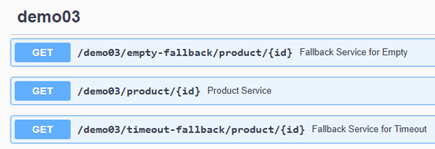

# Sección 5: Operadores

---

## Operador - Handle

El operador `handle()` en `Reactor` `es un operador de combinación (composite)` que permite aplicar lógica imperativa y
condicional en el procesamiento de elementos dentro de un `Flux`.

Combina las funcionalidades de:

- `filter()` → para decidir si un elemento debe pasar o no.
- `map()` → para transformar los elementos.

Se comporta como un `filtro más una transformación personalizada`, utilizando una función
`BiConsumer<T, SynchronousSink<R>>` para procesar cada elemento.

Veamos un ejemplo sencillo donde usamos el `.handle()`. El ejemplo consiste en emitir un conjunto de números desde el
1 hasta el 10. Según el valor del item emitido realizar alguna acción, por ejemplo:

- Si se emite el 1, enviaremos el valor -2.
- Si se emite el 4, no haremos nada.
- Si se emite el 7, lanzaremos un error.
- En cualquier otro caso, pasaremos el valor como está.

````java
public class Lec01Handle {
    public static void main(String[] args) {
        Flux.range(1, 10)
                .handle((item, synchronousSink) -> {
                    switch (item) {
                        case 1 -> synchronousSink.next(-2);     // transforma 1 en -2
                        case 4 -> {
                        }                                       // no emite nada (se descarta)
                        case 7 -> synchronousSink.error(new RuntimeException("Lanzando error porque el valor es 7"));
                        default -> synchronousSink.next(item);  // pasa el valor tal como está
                    }
                })
                .cast(Integer.class)
                .subscribe(Util.subscriber());
    }
}
````

- El código anterior recibe una función handler con dos argumentos:
    - El valor de entrada (`item`).
    - Un `SynchronousSink` que permite:
        - Emitir un nuevo valor con `next(R value)`.
        - Terminar el flujo con `complete()`.
        - Emitir un error con `error(Throwable e)`.

- Si no se invoca `next()`, el elemento no se emite (similar a un `filter()` que descarta el elemento).
- `cast(Integer.class)` asegura que el tipo genérico sea `Integer`.

Como resultado obtenemos lo siguiente.

````bash
11:33:40.646 INFO  [           main] d.m.a.common.DefaultSubscriber :  recibido: -2
11:33:40.648 INFO  [           main] d.m.a.common.DefaultSubscriber :  recibido: 2
11:33:40.648 INFO  [           main] d.m.a.common.DefaultSubscriber :  recibido: 3
11:33:40.648 INFO  [           main] d.m.a.common.DefaultSubscriber :  recibido: 5
11:33:40.648 INFO  [           main] d.m.a.common.DefaultSubscriber :  recibido: 6
11:33:40.653 ERROR [           main] d.m.a.common.DefaultSubscriber :  error: Lanzando error porque el valor es 7
````

### 🧠 Cuándo usar `handle()`

- Cuando necesitas `filtrar y transformar` al mismo tiempo.
- Si la lógica de procesamiento requiere más control que el que permite `map()` y `filter()` por separado.
- Para emitir errores condicionalmente o terminar el flujo antes de tiempo (`sink.error(...)`, `sink.complete()`).

## Operador Handle - Tarea asignada

Esta tarea nos permitirá aplicar lo aprendido sobre el operador `handle()` y explorar su uso en conjunto con
`generate()`.

````java
public class Lec02HandleUntilAssignment {
    public static void main(String[] args) {
        Flux.<String>generate(synchronousSink -> synchronousSink.next(Util.faker().country().name()))
                .handle((country, synchronousSink) -> {
                    synchronousSink.next(country);
                    if (country.equalsIgnoreCase("peru")) {
                        synchronousSink.complete();
                    }
                }).subscribe(Util.subscriber());
    }
}
````

### ✅ ¿Qué hace este código?

1. Se genera un `Flux<String>` con `generate()`, que puede emitir nombres de países indefinidamente, dependiendo de la
   cantidad de elementos solicitados por el `Subscriber` (a través de `request(n)`).
2. Luego se pasa por el operador `handle()`:
    - Cada país generado se emite directamente con `synchronousSink.next(country)`.
    - Si el país es `Peru` (ignorando mayúsculas/minúsculas), se llama a `synchronousSink.complete()`, lo que detiene la
      emisión del `Flux`.

### 🔧 Explicación técnica paso a paso

1. `generate(...)`
    - Es un operador para crear flujos imperativos, uno a la vez.
    - Usa un `SynchronousSink<T>` para emitir elementos `uno por uno`.
    - En este caso, el flujo puede emitir nombres de países indefinidamente mientras el `Subscriber` continúe
      solicitando elementos.

2. `handle(...)`
    - Aquí funciona como un controlador condicional:
        - Siempre emite el país recibido.
        - Pero si el país es `Peru`, finaliza el flujo.

````bash
12:01:02.342 INFO  [           main] d.m.a.common.DefaultSubscriber :  recibido: Seychelles
12:01:02.342 INFO  [           main] d.m.a.common.DefaultSubscriber :  recibido: Central African Republic
12:01:02.342 INFO  [           main] d.m.a.common.DefaultSubscriber :  recibido: Honduras
12:01:02.342 INFO  [           main] d.m.a.common.DefaultSubscriber :  recibido: Lebanon
12:01:02.342 INFO  [           main] d.m.a.common.DefaultSubscriber :  recibido: Peru
12:01:02.344 INFO  [           main] d.m.a.common.DefaultSubscriber :  ¡completado!
````

⚠️ La cantidad de países antes de `Peru` es aleatoria porque faker genera datos aleatorios.

## Do Hooks/Callbacks

Los `operadores de la familia` `do...` (como `doOnNext`, `doFirst`, `doOnComplete`, etc.) se utilizan para
`agregar efectos secundarios` o ejecutar lógica adicional en puntos clave del ciclo de vida de un `Publisher`
(como un `Flux` o `Mono`). A diferencia de operadores transformadores como `map()` o `filter()`, los operadores `do...`
`no modifican los datos del flujo`, sino que observan y reaccionan a eventos internos como la suscripción, la emisión
de datos, la finalización, errores, cancelaciones, entre otros.

Estos operadores son especialmente útiles para:

- Depuración y logging.
- Auditoría de eventos en el flujo.
- Medición de tiempos o métricas.
- Gestión de recursos (por ejemplo, liberación de conexiones en `doFinally`).

> En resumen: los `do...` son "ganchos `(hooks)`" para insertar lógica lateral que observa el comportamiento del flujo,
> sin intervenir en los datos que viajan por él.

Veamos que en el siguiente flujo observamos distintos métodos.

````java
public class Lec03DoCallbacks {

    private static final Logger log = LoggerFactory.getLogger(Lec03DoCallbacks.class);

    public static void main(String[] args) {
        Flux.<Integer>create(fluxSink -> {
                    log.info("Inicio del productor");
                    fluxSink.complete();
                    log.info("Fin del productor");
                })
                .doOnComplete(() -> log.info("doOnComplete-1"))
                .doFirst(() -> log.info("doFirst-1"))
                .doOnNext(item -> log.info("doOnNext-1: {}", item))
                .doOnSubscribe(subscription -> log.info("doOnSubscribe-1: {}", subscription))
                .doOnRequest(request -> log.info("doOnRequest-1: {}", request))
                .doOnError(error -> log.info("doOnError-1: {}", error.getMessage()))
                .doOnTerminate(() -> log.info("doOnTerminate-1"))
                .doOnCancel(() -> log.info("doOnCancel-1"))
                .doOnDiscard(Object.class, o -> log.info("doOnDiscard-1: {}", o))
                .doFinally(signal -> log.info("doFinally-1: {}", signal))
                // .take(2)
                .doOnComplete(() -> log.info("doOnComplete-2"))
                .doFirst(() -> log.info("doFirst-2"))
                .doOnNext(item -> log.info("doOnNext-2: {}", item))
                .doOnSubscribe(subscription -> log.info("doOnSubscribe-2: {}", subscription))
                .doOnRequest(request -> log.info("doOnRequest-2: {}", request))
                .doOnError(error -> log.info("doOnError-2: {}", error.getMessage()))
                .doOnTerminate(() -> log.info("doOnTerminate-2"))
                .doOnCancel(() -> log.info("doOnCancel-2"))
                .doOnDiscard(Object.class, o -> log.info("doOnDiscard-2: {}", o))
                .doFinally(signal -> log.info("doFinally-2: {}", signal))
                //.take(4)
                .subscribe(Util.subscriber("subscriber"));
    }
}
````

| Operador            | Descripción                                                                                                               |
|---------------------|---------------------------------------------------------------------------------------------------------------------------|
| `doFirst(Runnable)` | Se ejecuta `antes que todo`, incluso antes de `doOnSubscribe`. Se aplica de último hacia el primero si hay varios.        |
| `doOnSubscribe`     | Se activa cuando alguien se suscribe al `Flux`.                                                                           |
| `doOnRequest`       | Se ejecuta cuando el suscriptor solicita elementos.                                                                       |
| `doOnNext`          | Se activa cada vez que se emite un elemento (`next`).                                                                     |
| `doOnComplete`      | Se ejecuta cuando el `Flux` termina correctamente.                                                                        |
| `doOnError`         | Se ejecuta cuando el `Flux` termina por un error.                                                                         |
| `doOnTerminate`     | Se ejecuta cuando el `Flux` termina, ya sea por `onComplete` o `onError`.                                                 |
| `doOnCancel`        | Se activa si el `Subscriber` cancela la suscripción.                                                                      |
| `doOnDiscard`       | Se activa si los elementos fueron efectivamente emitidos por el `Publisher` y descartados por algún operador aguas abajo. |
| `doFinally`         | Siempre se ejecuta, ocurra lo que ocurra (`onComplete`, `onError`, `cancelación`).                                        |

El órden en la que se ejecutan los métodos es muy importante. Por ejemplo, ejecutamos el siguiente flujo cuyo flux no
emite ningún valor, es decir, solo se completa, en ese sentido, este código está bastante bien estructurado y es útil
para observar en qué orden se ejecutan los `hooks (doFirst, doOnSubscribe, doOnRequest, etc.)` y cómo fluye desde el
`Subscriber` hacia el `Publisher` y viceversa.

En el resultado vemos el orden en el que los métodos son ejecutados.

````bash
INFO  [           main] d.m.app.sec05.Lec03DoCallbacks : doFirst-2
INFO  [           main] d.m.app.sec05.Lec03DoCallbacks : doFirst-1
INFO  [           main] d.m.app.sec05.Lec03DoCallbacks : doOnSubscribe-1: reactor.core.publisher.FluxPeekFuseable$PeekConditionalSubscriber@45b4c3a9
INFO  [           main] d.m.app.sec05.Lec03DoCallbacks : doOnSubscribe-2: reactor.core.publisher.FluxPeekFuseable$PeekConditionalSubscriber@5b94b04d
INFO  [           main] d.m.app.sec05.Lec03DoCallbacks : doOnRequest-2: 9223372036854775807
INFO  [           main] d.m.app.sec05.Lec03DoCallbacks : doOnRequest-1: 9223372036854775807
INFO  [           main] d.m.app.sec05.Lec03DoCallbacks : Inicio del productor
INFO  [           main] d.m.app.sec05.Lec03DoCallbacks : doOnComplete-1
INFO  [           main] d.m.app.sec05.Lec03DoCallbacks : doOnTerminate-1
INFO  [           main] d.m.app.sec05.Lec03DoCallbacks : doOnComplete-2
INFO  [           main] d.m.app.sec05.Lec03DoCallbacks : doOnTerminate-2
INFO  [           main] d.m.a.common.DefaultSubscriber : subscriber ¡completado!
INFO  [           main] d.m.app.sec05.Lec03DoCallbacks : doFinally-2: onComplete
INFO  [           main] d.m.app.sec05.Lec03DoCallbacks : doFinally-1: onComplete
INFO  [           main] d.m.app.sec05.Lec03DoCallbacks : Fin del productor
````

- Primero se ejecuta `doFirst-2` y luego `doFirst-1`, ya que estos se ejecutan en orden inverso al que fueron
  declarados, desde el punto de vista del `Subscriber`. La `suscripción` inicia el flujo, y desde allí se recorre
  hacia `arriba` hasta llegar al `productor`.
- Al ocurrir la `suscripción`, el flujo desciende, encontrándose primero con `doOnSubscribe-1`, luego `doOnSubscribe-2`.
- Una vez que el `Subscriber` ha sido alcanzado, este solicita elementos (`request(n)`). En este caso, solicita todos
  (`Long.MAX_VALUE`). El flujo asciende nuevamente, activando primero `doOnRequest-2` y luego `doOnRequest-1`.
- Después se imprime `Inicio del productor`, indicando que el `Publisher` comenzó a ejecutarse.
- Como el flujo solo se completa (sin emitir datos), se dispara la señal de completado. El flujo desciende nuevamente:
  se ejecuta `doOnComplete-1`, luego `doOnTerminate-1`, seguido por `doOnComplete-2` y finalmente `doOnTerminate-2`.
- Al llegar al `Subscriber`, se imprime `subscriber ¡completado!`.
- Tras completarse el flujo, se activan los `doFinally()`, los cuales se ejecutan independientemente del motivo de
  finalización (`completo`, `error` o `cancelación`). Primero se ejecuta `doFinally-2: onComplete`, seguido de
  `doFinally-1: onComplete`.
- Finalmente, después de que el `fluxSink.complete()` ha sido invocado, se imprime Fin del productor.

## Operador - doOnNext - Aclarando

El operador `doOnNext` en `Project Reactor` se utiliza para ejecutar una acción secundaria cada vez que el flujo
(`Mono` o `Flux`) emite un elemento. Este operador es parte de la familia de operadores `do...`, que permiten agregar
efectos secundarios (`side effects`) sin modificar los datos que fluyen.

- La inmutabilidad es una práctica recomendada, pero no significa que la mutación sea intrínsecamente mala.
- La `programación funcional` prefiere las` funciones puras` (sin efectos secundarios).
    - Siempre que sea posible, deberíamos preferir funciones puras para mantener la previsibilidad y facilidad de
      pruebas.

Veamos el siguiente ejemplo.

````java
public class CustomerServiceImpl implements CustomerService {

    @Override
    public Mono<Customer> updateCustomer() {
        return this.repository.findById(123)
                .doOnNext(customer -> customer.setAge(10))
                .flatMap(this.repository::save);
    }

}
````

En este ejemplo, trabajamos con una entidad `Customer`, la cual `es un objeto mutable`. Al obtener el `Customer` desde
la base de datos mediante su `ID`, se nos retorna un `Mono<Customer>`. Como no sabemos en qué momento se emitirá el
objeto, usamos `doOnNext` para realizar una acción `una vez que esté disponible`, es decir, cuando se haya emitido.

La mutación ocurre dentro del `doOnNext`, donde cambiamos la edad del cliente con `customer.setAge(10)`. Aunque esta
operación implica un efecto secundario, `Project Reactor` garantiza que se ejecuta de forma segura en el hilo que
procesa ese flujo (ningún otro hilo vendrá y lo cambiará). Por tanto, no hay riesgo de condiciones de carrera a menos
que introduzcas concurrencia explícita tú mismo.

## Operador - Delay Elements

Retrasa cada uno de los elementos de `Flux` (señales `Subscriber.onNext`) durante una duración determinada. Las señales
se retrasan y continúan en el Scheduler predeterminado en paralelo, pero las secuencias vacías o las señales de error
inmediatas no se retrasan.

El operador `delayElements()` en `Project Reactor` introduce un retraso entre la emisión de cada elemento en un `Flux`.
Su propósito es emitir los elementos con una demora específica sin bloquear el hilo en el que se está ejecutando, lo
que lo hace ideal para escenarios reactivos.

````java
public class Lec04Delay {

    private static final Logger log = LoggerFactory.getLogger(Lec04Delay.class);

    public static void main(String[] args) {
        Flux.range(1, 4)
                .log()
                .delayElements(Duration.ofMillis(800)) // El Delay Element se aplicará en un hilo separado
                .subscribe(Util.subscriber());

        //Bloqueamos el hilo principal para ver los valores emitidos
        Util.sleepSeconds(4);
    }
}
````

En el ejemplo anterior, se emitirá un número cada 800 milisegundos. Internamente, `delayElements()` trabaja utilizando
un `Scheduler`, permitiendo que los elementos se emitan sin bloquear el hilo principal.

Ahora, solo para este ejemplo, como nos interesa ver cómo se van emitiendo los valores, necesitamos bloquear el hilo
principal utilizando `Util.sleepSeconds(4)` para evitar que el programa termine antes de que se emitan todos los
elementos.

Como resultado obtenemos lo siguiente.

````bash
18:01:53.194 INFO  [           main] reactor.Flux.Range.1           : | onSubscribe([Synchronous Fuseable] FluxRange.RangeSubscription)
18:01:53.198 INFO  [           main] reactor.Flux.Range.1           : | request(1)
18:01:53.198 INFO  [           main] reactor.Flux.Range.1           : | onNext(1)
18:01:54.004 INFO  [     parallel-1] d.m.a.common.DefaultSubscriber :  recibido: 1
18:01:54.004 INFO  [     parallel-1] reactor.Flux.Range.1           : | request(1)
18:01:54.005 INFO  [     parallel-1] reactor.Flux.Range.1           : | onNext(2)
18:01:54.813 INFO  [     parallel-2] d.m.a.common.DefaultSubscriber :  recibido: 2
18:01:54.814 INFO  [     parallel-2] reactor.Flux.Range.1           : | request(1)
18:01:54.814 INFO  [     parallel-2] reactor.Flux.Range.1           : | onNext(3)
18:01:55.618 INFO  [     parallel-3] d.m.a.common.DefaultSubscriber :  recibido: 3
18:01:55.618 INFO  [     parallel-3] reactor.Flux.Range.1           : | request(1)
18:01:55.618 INFO  [     parallel-3] reactor.Flux.Range.1           : | onNext(4)
18:01:55.620 INFO  [     parallel-3] reactor.Flux.Range.1           : | onComplete()
18:01:56.425 INFO  [     parallel-4] d.m.a.common.DefaultSubscriber :  recibido: 4
18:01:56.431 INFO  [     parallel-4] d.m.a.common.DefaultSubscriber :  ¡completado!
````

El operador `.delayElements(Duration)` no cambia el hilo del publisher original, pero interviene entre la emisión y la
propagación de cada elemento, aplicando un retraso asíncrono que se ejecuta en un Scheduler (por defecto,
Schedulers.parallel()).

### En detalle:

- El `Flux.range(1, 4)` se ejecuta en el hilo principal (por ejemplo, `main`).
- Luego `.delayElements(Duration.ofMillis(800))` inyecta un "delay" entre cada señal `onNext` enviada al downstream (es
  decir, al `subscriber`).
- Este delay no bloquea el hilo principal, sino que `programa la emisión futura de cada elemento` en un hilo del
  scheduler paralelo.
- Resultado: los valores se emiten en hilos como `parallel-1`, `parallel-2`, etc.

Entonces, la emisión hacia el `subscriber` ocurre en hilos paralelos, pero el flujo en sí no ha cambiado completamente
de hilo, solo se ha introducido un retraso programado en paralelo.

Como se observa, `el productor no hace todo el trabajo por adelantado`. En lugar de emitir los valores de forma
inmediata, `delayElements()` utiliza un `Scheduler` para espaciar las emisiones. Cada vez que transcurre el intervalo
de tiempo especificado, el flujo reactivo solicita (`request(1`)) el siguiente valor al productor, quien responde en
ese momento. Es decir, `el productor emite el valor solo cuando se le solicita y cuando ha pasado el tiempo`, lo cual
encaja perfectamente con el modelo de `backpressure` y la naturaleza `no bloqueante` del procesamiento en `Reactor`.

## Subscribe

En este curso hemos estado usando el método estático `Util.subscriber()` para mostrar la información que emiten los
flux. Recordemos que este método nos retorna una implementación propia que creamos del `Subscriber`, donde implementamos
los métodos `onNext`, `onError`, `onComplete` y además el método `onSubscribe()` donde solicitamos el máximo valor con
`subscription.request(Long.MAX_VALUE)`.

Por otro lado, hay algunos casos, en las que convendría hacer uso de los operadores `.doOnNext()`, `.doOnError()`,
`.doOnComplete()` y del `.subscribe()` sin pasarle parámetros (por defecto se subscribe y solicita una demanda
ilimitada), tal como se ve en el siguiente ejemplo:

````java
public class Lec05Subscribe {

    private static final Logger log = LoggerFactory.getLogger(Lec05Subscribe.class);

    public static void main(String[] args) {
        Flux.range(1, 5)
                .doOnNext(value -> log.info("recibido: {}", value))
                .doOnError(throwable -> log.error(throwable.getMessage()))
                .doOnComplete(() -> log.info("¡Se completó!"))
                .subscribe(); // Se subscribe y solicita una demanda ilimitada.
    }
}
````

Si ejecutamos la aplicación vemos que sigue funcionando como siempre pero esta imprimiendo los mensajes directamente en
los métodos `.doOnNext()`, `.doOnError()` y `.doOnComplete()`.

````bash
10:00:18.783 INFO  [           main] d.m.app.sec05.Lec05Subscribe   : recibido: 1
10:00:18.787 INFO  [           main] d.m.app.sec05.Lec05Subscribe   : recibido: 2
10:00:18.787 INFO  [           main] d.m.app.sec05.Lec05Subscribe   : recibido: 3
10:00:18.787 INFO  [           main] d.m.app.sec05.Lec05Subscribe   : recibido: 4
10:00:18.787 INFO  [           main] d.m.app.sec05.Lec05Subscribe   : recibido: 5
10:00:18.787 INFO  [           main] d.m.app.sec05.Lec05Subscribe   : ¡Se completó!
````

## Error Handling - onErrorReturn

En el siguiente ejemplo se emite un conjunto de números. Cuando el valor emitido sea 5 lo dividimos entre cero, eso nos
dará un error, así que veamos el comportamiento.

````java
    public static void main(String[] args) {
    Flux.range(1, 10)
            .map(value -> value == 5 ? 5 / 0 : value) //Intencional
            .subscribe(Util.subscriber());
}
````

El resultado del error lo imprime el método `onError(...)` dentro del `Util.subscriber()`.

````bash
10:35:30.122 INFO  [           main] d.m.a.common.DefaultSubscriber :  recibido: 1
10:35:30.125 INFO  [           main] d.m.a.common.DefaultSubscriber :  recibido: 2
10:35:30.125 INFO  [           main] d.m.a.common.DefaultSubscriber :  recibido: 3
10:35:30.125 INFO  [           main] d.m.a.common.DefaultSubscriber :  recibido: 4
10:35:30.129 ERROR [           main] d.m.a.common.DefaultSubscriber :  error: / by zero
````

Una forma de manejar los errores que se produzcan en el flujo es emitiendo un valor de respaldo, esto gracias al
método `onErrorReturn`.

````java
public static void main(String[] args) {
    Flux.range(1, 10)
            .map(value -> value == 5 ? 5 / 0 : value) //Intencional
            .onErrorReturn(-1) //El valor a emitir si ocurre un error
            .subscribe(Util.subscriber());
}
````

El operador `onErrorReturn()` emite un valor de respaldo capturado cuando se observe algún error en el flux.
El operador `onErrorReturn()` de `Project Reactor` finaliza el flujo después de devolver el valor especificado cuando
ocurre un error. Es decir, una vez que se captura una excepción y se emite el valor de retorno, `el flujo se completa`,
aunque queden más elementos por emitir.

````bash
10:39:32.882 INFO  [           main] d.m.a.common.DefaultSubscriber :  recibido: 1
10:39:32.885 INFO  [           main] d.m.a.common.DefaultSubscriber :  recibido: 2
10:39:32.885 INFO  [           main] d.m.a.common.DefaultSubscriber :  recibido: 3
10:39:32.885 INFO  [           main] d.m.a.common.DefaultSubscriber :  recibido: 4
10:39:32.890 INFO  [           main] d.m.a.common.DefaultSubscriber :  recibido: -1
10:39:32.890 INFO  [           main] d.m.a.common.DefaultSubscriber :  ¡completado!
````

**Importante**
> Es importante la ubicación del operador `.onErrorReturn()`, por lo general podríamos colocarlo casi al final para
> que esté pendiente de todo el flujo.

Ahora, supongamos que queremos retornar un valor en caso de una excepción, pero siempre y cuando sea en función de una
excepción específica. Por ejemplo, si ocurre la excepción `IllegalArgumentException`, solo en ese caso se emitirá como
valor de retorno el `-1`.

````java
private static void onErrorReturn() {
    Flux.range(1, 10)
            .map(value -> value == 5 ? 5 / 0 : value) //Intencional
            .onErrorReturn(IllegalArgumentException.class, -1)
            .subscribe(Util.subscriber());
}
````

En el ejemplo anterior, recibimos un error y finalizamos el flux. En el operador `onErrorReturn()`
esperábamos un error del tipo `IllegalArgumentException` para retornar un `-1` pero el error que obtuvimos fue
del tipo `ArithmeticException`, es por eso que se continuó propagando el error hasta el `subscribe`.

````bash
10:45:07.163 INFO  [           main] d.m.a.common.DefaultSubscriber :  recibido: 1
10:45:07.166 INFO  [           main] d.m.a.common.DefaultSubscriber :  recibido: 2
10:45:07.166 INFO  [           main] d.m.a.common.DefaultSubscriber :  recibido: 3
10:45:07.166 INFO  [           main] d.m.a.common.DefaultSubscriber :  recibido: 4
10:45:07.171 ERROR [           main] d.m.a.common.DefaultSubscriber :  error: / by zero
````

Podemos agregar tantos operadores `onErrorReturn` como quisiéramos especificando la excepción que se debe producir
para retornar un valor de respaldo.

````java
private static void onErrorReturn() {
    Flux.range(1, 10)
            .map(value -> value == 5 ? 5 / 0 : value) //Intencional
            .onErrorReturn(IllegalArgumentException.class, -1)
            .onErrorReturn(ArithmeticException.class, -2)
            .onErrorReturn(-3)
            .subscribe(Util.subscriber());
}
````

En el ejemplo anterior estamos esperando que se produzca la excepción `IllegalArgumentException` para retornar el valor
`-1`, o la excepción `ArithmeticException` para retornar el valor `-2`, o en cualquier otro caso retornar el `-3`.

````bash
10:47:29.236 INFO  [           main] d.m.a.common.DefaultSubscriber :  recibido: 1
10:47:29.239 INFO  [           main] d.m.a.common.DefaultSubscriber :  recibido: 2
10:47:29.239 INFO  [           main] d.m.a.common.DefaultSubscriber :  recibido: 3
10:47:29.239 INFO  [           main] d.m.a.common.DefaultSubscriber :  recibido: 4
10:47:29.244 INFO  [           main] d.m.a.common.DefaultSubscriber :  recibido: -2
10:47:29.244 INFO  [           main] d.m.a.common.DefaultSubscriber :  ¡completado!
````

## Error Handling - onErrorResume

En la sección anterior, al usar el operador `onErrorReturn()`, vimos que podemos devolver un valor fijo (hardcoded)
cuando ocurre un error. Pero **¿qué sucede si queremos calcular ese valor o continuar con otro flujo dependiendo del
tipo de error?**

Para este escenario, `Project Reactor` proporciona el operador `onErrorResume()`, que ofrece una forma más flexible y
dinámica de manejar errores.

Este operador:

- Se activa cuando ocurre un error en el flujo original.
- Permite `interceptar la excepción` y retornar un nuevo `Publisher` (`Flux` o `Mono`).
- A diferencia de `onErrorReturn()`, no se limita a emitir un valor estático, sino que puede emitir múltiples elementos
  desde la nueva fuente.
- Es útil cuando quieres `recuperarte del error` y continuar con el procesamiento, en lugar de finalizar el flujo.

````java
public class Lec06ErrorHandling {
    private static final Logger log = LoggerFactory.getLogger(Lec06ErrorHandling.class);

    public static void main(String[] args) {
        onErrorResume();
    }

    private static void onErrorResume() {
        Flux.range(1, 10)
                .map(value -> value == 5 ? 5 / 0 : value) //Intencional
                .onErrorResume(throwable -> fallback(throwable))
                .subscribe(Util.subscriber());
    }

    private static Mono<Integer> fallback(Throwable throwable) {
        log.error("Ocurrió un error: {}", throwable.getMessage());
        log.info("Generando valor aleatorio...");
        return Mono.fromSupplier(() -> Util.faker().random().nextInt(10, 100));
    }
}
````

En el ejemplo anterior, creamos un `Flux` que emite los números del `1 al 10`. `Intencionalmente`, provocamos una
excepción (`ArithmeticException`) cuando el valor es igual a 5. Cuando ocurre la excepción, el operador
`onErrorResume()` intercepta el error y llama al método `fallback(Throwable)`, pasándole la excepción generada como
argumento.

Dentro del método `fallback()`:

- Se imprime un mensaje de error con el detalle de la excepción (`/ by zero`).
- Luego se imprime un mensaje adicional indicando que se está generando un valor aleatorio.
- Finalmente, se retorna un nuevo `Mono<Integer>` que emite un número aleatorio entre `10 y 100` como valor de
  recuperación.

Es importante destacar que:

- Aunque el flujo original es de tipo `Flux`, el operador `onErrorResume()` puede retornar un `Mono`, ya que un `Mono`
  también es un `Publisher`.
- En este contexto, retornar un `Mono` que emite un solo valor es válido porque el flujo se interrumpió al llegar al
  error, y lo que se busca es continuar desde ese punto con un nuevo valor.
- Este comportamiento da la sensación de que el flujo original simplemente continúa, como si el error no hubiese
  ocurrido, aunque internamente se haya manejado y redirigido a una nueva fuente.

````bash
11:15:46.406 INFO  [           main] d.m.a.common.DefaultSubscriber :  recibido: 1
11:15:46.409 INFO  [           main] d.m.a.common.DefaultSubscriber :  recibido: 2
11:15:46.409 INFO  [           main] d.m.a.common.DefaultSubscriber :  recibido: 3
11:15:46.409 INFO  [           main] d.m.a.common.DefaultSubscriber :  recibido: 4
11:15:46.413 ERROR [           main] d.m.a.sec05.Lec06ErrorHandling : Ocurrió un error: / by zero
11:15:46.413 INFO  [           main] d.m.a.sec05.Lec06ErrorHandling : Generando valor aleatorio...
11:15:46.432 INFO  [           main] d.m.a.common.DefaultSubscriber :  recibido: 58
11:15:46.433 INFO  [           main] d.m.a.common.DefaultSubscriber :  ¡completado!
````

Como se puede ver:

- Los valores del 1 al 4 se emiten normalmente.
- Al llegar al 5, se lanza una excepción y se ejecuta el `fallback()`.
- El nuevo valor (58 en este caso) es emitido desde el `Mono` de respaldo.
- Luego el flujo se completa correctamente.

En el ejemplo anterior, el flujo se completa luego de emitir el valor de respaldo (58), pero esto no ocurre porque
`onErrorResume()` tenga un comportamiento que fuerce el completado (como sí ocurre con `onErrorReturn()`).

La razón por la que el flujo se completa es que el `Publisher` retornado por `fallback()` es un `Mono`, y por
definición, un `Mono` emite solo un elemento o un `error`, y luego `completa`.

Si en lugar de un `Mono` hubiéramos retornado un `Flux` con múltiples valores, entonces el flujo habría continuado
emitiendo todos los elementos de ese `Flux` hasta que este completara por sí mismo.

Esto demuestra la flexibilidad de `onErrorResume()`, ya que permite decidir la estrategia de recuperación y cómo
continúa el flujo, delegando ese control al `Publisher` de respaldo que se retorne.

Precisamente, para ejemplificar lo mencionado líneas arriba, es que vamos a crear el siguiente ejemplo.

````java

public class Lec06ErrorHandling {
    private static final Logger log = LoggerFactory.getLogger(Lec06ErrorHandling.class);

    public static void main(String[] args) {
        onErrorResume();
    }

    private static void onErrorResume() {
        Flux.range(1, 10)
                .map(value -> value == 5 ? 5 / 0 : value) //Intencional
                .onErrorResume(throwable -> fallback(throwable.getMessage()))
                .subscribe(Util.subscriber());
    }

    private static Flux<Integer> fallback(String message) {
        log.error("Mensaje del error: {}", message);
        log.info("Generando valor aleatorio..");
        return Flux.range(50, 5);
    }

}
````

En este ejemplo, cuando el valor 5 causa una excepción (`/ by zero`), el operador `onErrorResume()` intercepta el error
y redirige el flujo hacia una nueva fuente de datos, que en este caso es un `Flux.range(50, 5)` (es decir, los números
del 50 al 54).

Esto confirma claramente lo que discutimos:

`onErrorResume()` no simplemente emite un único valor y termina el flujo (como lo hace `onErrorReturn()`), sino que
permite continuar la secuencia con otro `Publisher` completo.

> En este caso, como se retorna un `Flux` con múltiples elementos, el flujo continúa normalmente desde esa nueva fuente
> hasta que se completa, como si nunca hubiera ocurrido el error en la fuente original.

Este comportamiento hace que `onErrorResume()` sea ideal para casos donde no solo se quiere emitir un valor de respaldo,
sino también realizar una lógica más compleja, como:

- Decidir dinámicamente qué datos emitir.
- Loguear errores de forma centralizada.
- Consultar otro servicio o fuente de datos alternativa.

````bash
11:43:36.005 INFO  [           main] d.m.a.common.DefaultSubscriber :  recibido: 1
11:43:36.008 INFO  [           main] d.m.a.common.DefaultSubscriber :  recibido: 2
11:43:36.009 INFO  [           main] d.m.a.common.DefaultSubscriber :  recibido: 3
11:43:36.009 INFO  [           main] d.m.a.common.DefaultSubscriber :  recibido: 4
11:43:36.013 ERROR [           main] d.m.a.sec05.Lec06ErrorHandling : Mensaje del error: / by zero
11:43:36.013 INFO  [           main] d.m.a.sec05.Lec06ErrorHandling : Generando valor aleatorio..
11:43:36.013 INFO  [           main] d.m.a.common.DefaultSubscriber :  recibido: 50
11:43:36.013 INFO  [           main] d.m.a.common.DefaultSubscriber :  recibido: 51
11:43:36.013 INFO  [           main] d.m.a.common.DefaultSubscriber :  recibido: 52
11:43:36.013 INFO  [           main] d.m.a.common.DefaultSubscriber :  recibido: 53
11:43:36.013 INFO  [           main] d.m.a.common.DefaultSubscriber :  recibido: 54
11:43:36.013 INFO  [           main] d.m.a.common.DefaultSubscriber :  ¡completado!
````

Ahora veamos el siguiente ejemplo. El `Flux` comienza emitiendo un error de tipo `RuntimeException`. El primer operador
`onErrorResume(ArithmeticException.class, ...)` no captura la excepción porque el tipo no coincide, por lo que el flujo
continúa al siguiente operador de manejo de errores.

El segundo operador `onErrorResume(throwable -> fallback())` sí captura el `RuntimeException`, pero dentro del método
`fallback()` se lanza intencionalmente una nueva excepción de tipo `IllegalArgumentException`. Esto provoca un nuevo
error en la cadena, que a su vez activa el siguiente operador de manejo de errores.

Finalmente, el operador `onErrorReturn(-5)` actúa como último recurso, devolviendo el valor `-5` cuando se detecta que
la cadena ha fallado nuevamente. Después de emitir este valor, el flujo se completa normalmente.

Este flujo evidencia cómo:

- `onErrorResume` puede ser encadenado para manejar diferentes tipos o escenarios de error.
- Si una nueva excepción ocurre dentro de un `fallback`, el control pasa al siguiente operador de error.
- `onErrorReturn` es útil como `última defensa`, asegurando que el flujo nunca falle visiblemente para el suscriptor.

````java
public class Lec06ErrorHandling {
    private static final Logger log = LoggerFactory.getLogger(Lec06ErrorHandling.class);

    public static void main(String[] args) {
        onErrorResume2();
    }

    private static void onErrorResume2() {
        Flux.error(() -> new RuntimeException("Error de la fuente principal (intencional)"))
                .onErrorResume(ArithmeticException.class, throwable -> fallback(throwable))
                .onErrorResume(throwable -> fallback())
                .onErrorReturn(-5)
                .subscribe(Util.subscriber());

    }

    private static Mono<Integer> fallback(Throwable throwable) {
        log.error("Ocurrió un error: {}", throwable.getMessage());
        log.info("Generando valor aleatorio...");
        return Mono.fromSupplier(() -> Util.faker().random().nextInt(10, 100));
    }

    private static Flux<Integer> fallback() {
        return Flux.error(new IllegalArgumentException("Ocurrió un error (intencional)"));
    }
}
````

En última instancia, al no poder recuperar el flujo mediante los operadores `onErrorResume` (ya sea por tipo de
excepción o por errores secundarios durante la recuperación), el operador `onErrorReturn` se activa, emitiendo un valor
fijo y completando el flujo de manera controlada.

````bash
11:56:14.034 INFO  [           main] d.m.a.common.DefaultSubscriber :  recibido: -5
11:56:14.039 INFO  [           main] d.m.a.common.DefaultSubscriber :  ¡completado!
````

## Error Handling - onErrorComplete

Simplemente, complete la secuencia reemplazando una señal `onError` por una señal `onComplete`. Todas las demás señales
se propagan tal cual.

````java
public class Lec06ErrorHandling {
    private static final Logger log = LoggerFactory.getLogger(Lec06ErrorHandling.class);

    public static void main(String[] args) {
        onErrorComplete();
    }

    private static void onErrorComplete() {
        Mono.error(new RuntimeException("Error emitido intencionalmente"))
                .onErrorComplete()
                .subscribe(Util.subscriber());
    }
}
````

En este ejemplo, usamos el operador `onErrorComplete()` para interceptar un error y convertirlo en una señal de
finalización (`onComplete`).

Esto significa que si el `Mono` produce un error, dicho `error no será propagado` al `suscriptor`. En su lugar, se
completará el flujo silenciosamente, como si no hubiera ocurrido ninguna excepción.

Es importante destacar que todas las demás señales (`onNext`, `onComplete`) siguen fluyendo de forma normal; solo la
señal `onError` es suprimida y reemplazada por `onComplete`.

````bash
12:31:12.659 INFO  [           main] d.m.a.common.DefaultSubscriber :  ¡completado!
````

## Error Handling - onErrorContinue

El operador `onErrorContinue()` en Project Reactor permite que el flujo continúe emitiendo elementos después de
encontrar un error, omitiendo los elementos problemáticos sin detener todo el flujo. A diferencia de operadores como
`onErrorReturn()` o `onErrorResume()`, que manejan el error y completan el flujo o lo reemplazan por una nueva
secuencia, `onErrorContinue()` simplemente omite el error y continúa con los siguientes elementos.

Este operador permite que ciertos operadores compatibles se recuperen del error eliminando el elemento que causó el
problema, y se continúe emitiendo los elementos subsiguientes. El error y el valor problemático se notifican a través de
un `BiConsumer`, lo que permite personalizar el manejo del error. Si se lanza una nueva excepción desde ese
`BiConsumer`, esta se propagará hacia abajo en la cadena de operadores, y el error original quedará como una excepción
suprimida.

Cuando un error ocurre en un elemento del flujo, `onErrorContinue()` permite saltarse ese error y continuar procesando
los elementos restantes. Además, te permite acceder tanto al error como al elemento que causó el problema para manejar
el error de forma personalizada, pero sin detener la emisión de otros elementos.

````java
public class Lec06ErrorHandling {
    private static final Logger log = LoggerFactory.getLogger(Lec06ErrorHandling.class);

    public static void main(String[] args) {
        onErrorContinue();
    }

    private static void onErrorContinue() {
        Flux.range(1, 10)
                .map(value -> value == 5 ? 5 / 0 : value) //Intencional
                .onErrorContinue((throwable, value) -> {
                    log.error("Error ocurrido: {}", throwable.getMessage());
                    log.error("Valor que causó el error: {}", value);
                })
                .subscribe(Util.subscriber());
    }
}
````

Como se observa en la salida, cuando el valor 5 genera una excepción aritmética, el operador `onErrorContinue()`
captura el error, registra tanto el mensaje como el valor que lo causó, y permite que el flujo continúe normalmente
con los siguientes elementos, en lugar de detenerse.

````bash
12:41:02.579 INFO  [           main] d.m.a.common.DefaultSubscriber :  recibido: 1
12:41:02.582 INFO  [           main] d.m.a.common.DefaultSubscriber :  recibido: 2
12:41:02.582 INFO  [           main] d.m.a.common.DefaultSubscriber :  recibido: 3
12:41:02.582 INFO  [           main] d.m.a.common.DefaultSubscriber :  recibido: 4
12:41:02.584 ERROR [           main] d.m.a.sec05.Lec06ErrorHandling : Error ocurrido: / by zero
12:41:02.584 ERROR [           main] d.m.a.sec05.Lec06ErrorHandling : Valor que causó el error: 5
12:41:02.585 INFO  [           main] d.m.a.common.DefaultSubscriber :  recibido: 6
12:41:02.585 INFO  [           main] d.m.a.common.DefaultSubscriber :  recibido: 7
12:41:02.585 INFO  [           main] d.m.a.common.DefaultSubscriber :  recibido: 8
12:41:02.585 INFO  [           main] d.m.a.common.DefaultSubscriber :  recibido: 9
12:41:02.585 INFO  [           main] d.m.a.common.DefaultSubscriber :  recibido: 10
12:41:02.585 INFO  [           main] d.m.a.common.DefaultSubscriber :  ¡completado!
````

## Operador - DefaultIfEmpty

El operador `defaultIfEmpty()` en Project Reactor se utiliza para emitir un `valor por defecto` cuando un `Mono` o
`Flux` no emite ningún elemento. Si el flujo está vacío, `defaultIfEmpty()` permite proporcionar un valor alternativo en
lugar de completar el flujo sin emitir nada.

Este operador es especialmente útil cuando se desea evitar un flujo sin emisiones, proporcionando un valor `predefinido`
o `hardcodeado`, es decir, un valor conocido que se especifica directamente al invocar el operador. Este valor se
emitirá únicamente si el flujo original no emite elementos.

````java
public class Lec07DefaultIfEmpty {

    public static void main(String[] args) {
        Flux.empty()
                .defaultIfEmpty("Valor predefinido")
                .subscribe(Util.subscriber());
    }
}
````

En el resultado, observamos que se emite el valor `Valor predefinido`, ya que el `Flux` original no contenía ningún
elemento. El operador `defaultIfEmpty()` actúa como respaldo, garantizando que al menos un valor sea emitido antes de
completar el flujo.

````bash
13:04:33.083 INFO  [           main] d.m.a.common.DefaultSubscriber :  recibido: Valor predefinido
13:04:33.087 INFO  [           main] d.m.a.common.DefaultSubscriber :  ¡completado!
````

## Operador - DefaultIfEmpty

El operador `switchIfEmpty()` en Project Reactor es similar a `defaultIfEmpty()`, pero ofrece más flexibilidad.
Mientras que `defaultIfEmpty()` solo emite un valor `hardcodeado` cuando un flujo está vacío, `switchIfEmpty()`
permite sustituir el flujo vacío por otro `Publisher` (otro `Flux` o `Mono`). Esto lo hace útil cuando necesitas
reaccionar dinámicamente si no se emite ningún valor.

Cuando el flujo original no emite ningún valor, `switchIfEmpty()` permite `cambiar` a otro flujo (otro `Flux` o `Mono`)
y continuar la emisión desde esa nueva fuente.

````java
public class Lec08SwitchIfEmpty {

    public static void main(String[] args) {
        Flux.range(1, 10)
                .filter(value -> value > 11) // Intencional
                .switchIfEmpty(fallback())
                .subscribe(Util.subscriber());
    }

    private static Flux<Integer> fallback() {
        return Flux.range(100, 3);
    }
}
````

Como se observa en el resultado, el `Flux` original no emite ningún elemento porque ninguno cumple la condición
establecida en el filter. Debido a esto, el flujo queda vacío y se activa el operador `switchIfEmpty()`, el cual
sustituye el flujo vacío por el emitido por el método `fallback()`. Este método proporciona un nuevo `Flux` que emite
los valores 100, 101 y 102, asegurando así que el suscriptor reciba elementos a pesar del filtro inicial.

````bash
13:14:11.053 INFO  [           main] d.m.a.common.DefaultSubscriber :  recibido: 100
13:14:11.056 INFO  [           main] d.m.a.common.DefaultSubscriber :  recibido: 101
13:14:11.056 INFO  [           main] d.m.a.common.DefaultSubscriber :  recibido: 102
13:14:11.059 INFO  [           main] d.m.a.common.DefaultSubscriber :  ¡completado!
````

## Operador - Timeout

El `timeout()` propaga una excepción `TimeoutException` si no se emite ningún elemento dentro del tiempo especificado.
En el siguiente ejemplo, `timeout(Duration.ofSeconds(1))` esperará como máximo 1 segundo a que el `Publisher` del
método `getProductName()` emita un valor. Si transcurre ese tiempo sin recibir una respuesta, el operador `timeout()`
propagará la excepción `TimeoutException`.

````java
public class Lec09Timeout {
    public static void main(String[] args) {
        timeoutDefaultBehavior();
        Util.sleepSeconds(4); // Evita que el programa termine antes de ver el resultado
    }

    private static void timeoutDefaultBehavior() {
        getProductName()
                .timeout(Duration.ofSeconds(1)) // Como máximo esperamos 1 segundo, sino lanzamos el TimeoutException
                .subscribe(Util.subscriber());
    }

    private static Mono<String> getProductName() {
        return Mono.fromSupplier(() -> Util.faker().commerce().productName())
                .delayElement(Duration.ofSeconds(3)); // Simula una demora de 3 segundos
    }
}
````

En este ejemplo, el método `getProductName()` se demora intencionalmente `3 segundos` en emitir un valor.
Como el operador `timeout()` está configurado para esperar solo `1 segundo`, se lanza una excepción de tipo
`TimeoutException` al no recibirse ninguna señal dentro del tiempo límite.

````bash
15:34:19.770 ERROR [     parallel-2] d.m.a.common.DefaultSubscriber :  error: Did not observe any item or terminal signal within 1000ms in 'delayElement' (and no fallback has been configured)
````

En el siguiente ejemplo, se maneja la excepción producida por el operador `timeout()` utilizando el operador
`onErrorReturn`. Esto permite emitir un valor por defecto en caso de que se produzca una excepción, como una
`TimeoutException`.

````java
public class Lec09Timeout {
    public static void main(String[] args) {
        timeoutDefaultBehaviorWithErrorHandler();
        Util.sleepSeconds(4);
    }

    private static void timeoutDefaultBehaviorWithErrorHandler() {
        getProductName()
                .timeout(Duration.ofSeconds(1))
                .onErrorReturn("Producto de respaldo")
                .subscribe(Util.subscriber());
    }

    private static Mono<String> getProductName() {
        return Mono.fromSupplier(() -> Util.faker().commerce().productName())
                .delayElement(Duration.ofSeconds(3));
    }
}
````

En este caso, como el método `getProductName()` tarda 3 segundos en responder y el `timeout()` solo permite 1 segundo,
se lanza una excepción. Sin embargo, en lugar de propagarla, el operador `onErrorReturn` captura la excepción y emite
un valor por defecto: ` Producto de respaldo`.

````bash
15:54:11.091 INFO  [     parallel-2] d.m.a.common.DefaultSubscriber :  recibido: Producto de respaldo
15:54:11.096 INFO  [     parallel-2] d.m.a.common.DefaultSubscriber :  ¡completado!
````

Ahora veamos una característica adicional del operador `timeout()`. Este operador permite definir un `fallback`
directamente como segundo parámetro. Esto nos da la posibilidad de reaccionar ante un tiempo de espera excedido sin
necesidad de utilizar `onErrorResume` por separado. Por ejemplo, podríamos llamar a otro servicio alternativo en caso
de que el original no responda a tiempo.

En el siguiente ejemplo, se define un `timeout` de 1 segundo. Si transcurre ese tiempo sin recibir una señal, se invoca
el método `getFallback()`, que retorna un `Mono` alternativo.

Es importante tener en cuenta que el límite de tiempo de 1 segundo solo aplica a la ejecución de `getProductName()`.
Una vez que se activa el `fallback`, ya no se aplica el `timeout`, por lo que `getFallback()` puede demorarse lo que
sea necesario.

````java
public class Lec09Timeout {
    public static void main(String[] args) {
        timeoutFallback();
        Util.sleepSeconds(5);
    }

    private static void timeoutFallback() {
        getProductName()
                .timeout(Duration.ofSeconds(1), getFallback())
                .subscribe(Util.subscriber());
    }

    private static Mono<String> getProductName() {
        return Mono.fromSupplier(() -> Util.faker().commerce().productName())
                .delayElement(Duration.ofSeconds(3));
    }

    private static Mono<String> getFallback() {
        return Mono.fromSupplier(() -> "getFallback(): " + Util.faker().commerce().productName())
                .delayElement(Duration.ofSeconds(3));

    }
}
````

El tiempo límite de 1 segundo aplica únicamente a `getProductName()`. Una vez que se activa el `fallback`, ya no se
impone ningún límite de tiempo a su ejecución.

````bash
16:05:32.927 INFO  [     parallel-3] d.m.a.common.DefaultSubscriber :  recibido: getFallback(): Ergonomic Bronze Gloves
16:05:32.933 INFO  [     parallel-3] d.m.a.common.DefaultSubscriber :  ¡completado!
````

## Operador - Transform

### Introducción al operador `transform()`

En `programación reactiva`, construir pipelines con múltiples operadores es muy común. Sin embargo, es fácil caer en
la repetición cuando aplicamos los mismos operadores entre el `Publisher` y el `Subscriber` en diferentes flujos.

Veamos el siguiente ejemplo, donde usamos `doOnNext`, `doOnError` y `doOnComplete` tanto para clientes como para órdenes
de compra.

````java

public class Lec10Transform {

    private static final Logger log = LoggerFactory.getLogger(Lec10Transform.class);

    public static void main(String[] args) {
        getCustomers()
                .doOnNext(cusomer -> log.info("recibido: {}", cusomer))
                .doOnError(throwable -> log.error("error: {}", throwable.getMessage()))
                .doOnComplete(() -> log.info("¡Se completó!"))
                .subscribe();
        log.info("");
        getPurchaseOrders()
                .doOnNext(purchaseOrder -> log.info("recibido: {}", purchaseOrder))
                .doOnError(throwable -> log.error("error: {}", throwable.getMessage()))
                .doOnComplete(() -> log.info("¡Se completó!"))
                .subscribe();
    }

    private static Flux<Cusomer> getCustomers() {
        return Flux.range(1, 3)
                .map(value -> new Cusomer(value, Util.faker().name().firstName()));
    }

    private static Flux<PurchaseOrder> getPurchaseOrders() {
        return Flux.range(1, 3)
                .map(value -> new PurchaseOrder(Util.faker().commerce().productName(), value, value * 10));
    }

    record Cusomer(int id, String name) {
    }

    record PurchaseOrder(String productName, int price, int quantity) {
    }
}
````

Como se puede observar, hay una repetición evidente de operadores (`doOnNext`, `doOnError`, `doOnComplete`) en ambos
flujos. Entonces, `¿existe alguna forma de reutilizar esta lógica común de manera más limpia y elegante?`

Sí, y aquí es donde entra en juego el operador `transform()`. Este operador nos permite encapsular una secuencia de
transformaciones comunes en una sola función reutilizable.

````bash
16:55:34.474 INFO  [           main] d.m.app.sec05.Lec10Transform   : recibido: Cusomer[id=1, name=Leona]
16:55:34.502 INFO  [           main] d.m.app.sec05.Lec10Transform   : recibido: Cusomer[id=2, name=Hiram]
16:55:34.503 INFO  [           main] d.m.app.sec05.Lec10Transform   : recibido: Cusomer[id=3, name=Agnus]
16:55:34.503 INFO  [           main] d.m.app.sec05.Lec10Transform   : ¡Se completó!
16:55:34.503 INFO  [           main] d.m.app.sec05.Lec10Transform   : 
16:55:34.509 INFO  [           main] d.m.app.sec05.Lec10Transform   : recibido: PurchaseOrder[productName=Ergonomic Silk Gloves, price=1, quantity=10]
16:55:34.521 INFO  [           main] d.m.app.sec05.Lec10Transform   : recibido: PurchaseOrder[productName=Fantastic Rubber Lamp, price=2, quantity=20]
16:55:34.521 INFO  [           main] d.m.app.sec05.Lec10Transform   : recibido: PurchaseOrder[productName=Awesome Rubber Keyboard, price=3, quantity=30]
16:55:34.521 INFO  [           main] d.m.app.sec05.Lec10Transform   : ¡Se completó!
````

### Uso del operador `transform()` en Project Reactor para componer operadores reutilizables

El operador `transform()` en Project Reactor permite transformar un flujo (`Flux` o `Mono`) utilizando una función. Es
una forma de aplicar una serie de operadores a un flujo dentro de una operación de transformación reutilizable. El
objetivo principal de `transform()` es permitir la composición de operadores en un solo paso.

`transform`: Es una función que recibe un `Flux<T>` y devuelve un nuevo `Publisher<V>`. Dentro de esta función puedes
aplicar cualquier transformación o conjunto de operadores al flujo original.

Con el operador `transform()` podemos evitar duplicación de código. Si aplicas la misma serie de operadores en varios
lugares de tu código, puedes encapsular esa lógica en una función y usar `transform()` para aplicarla de manera
consistente en diferentes flujos.

````java
public class Lec10Transform {

    private static final Logger log = LoggerFactory.getLogger(Lec10Transform.class);

    public static void main(String[] args) {
        getCustomers()
                .transform(addDebugger())
                .subscribe();
        log.info("");
        getPurchaseOrders()
                .transform(addDebugger())
                .subscribe();
    }

    private static Flux<Cusomer> getCustomers() {
        return Flux.range(1, 3)
                .map(value -> new Cusomer(value, Util.faker().name().firstName()));
    }

    private static Flux<PurchaseOrder> getPurchaseOrders() {
        return Flux.range(1, 3)
                .map(value -> new PurchaseOrder(Util.faker().commerce().productName(), value, value * 10));
    }

    private static <T> Function<Flux<T>, Flux<T>> addDebugger() {
        return flux -> flux
                .doOnNext(value -> log.info("recibido: {}", value))
                .doOnError(throwable -> log.error("error: {}", throwable.getMessage()))
                .doOnComplete(() -> log.info("¡Se completó!"));
    }

    record Cusomer(int id, String name) {
    }

    record PurchaseOrder(String productName, int price, int quantity) {
    }

}
````

En el código anterior hemos creado el método genérico `addDebugger()`, este método retorna una función que toma un
`Flux<T>` como entrada y retorna un `Flux<T>` como salida. En otras palabras, se recibe un `flux` y se retorna el
mismo `flux`.

El método toma un `Flux<T>` y aplica varios operadores como `doOnNext()`, `doOnError()`, y `doOnComplete()` para añadir
acciones de depuración. La salida es otro `Flux<T>` con los mismos elementos, pero ahora con capacidades de depuración
añadidas.

````bash
17:08:46.484 INFO  [           main] d.m.app.sec05.Lec10Transform   : recibido: Cusomer[id=1, name=Cathy]
17:08:46.508 INFO  [           main] d.m.app.sec05.Lec10Transform   : recibido: Cusomer[id=2, name=Weston]
17:08:46.509 INFO  [           main] d.m.app.sec05.Lec10Transform   : recibido: Cusomer[id=3, name=Eusebio]
17:08:46.509 INFO  [           main] d.m.app.sec05.Lec10Transform   : ¡Se completó!
17:08:46.509 INFO  [           main] d.m.app.sec05.Lec10Transform   : 
17:08:46.514 INFO  [           main] d.m.app.sec05.Lec10Transform   : recibido: PurchaseOrder[productName=Mediocre Granite Car, price=1, quantity=10]
17:08:46.525 INFO  [           main] d.m.app.sec05.Lec10Transform   : recibido: PurchaseOrder[productName=Rustic Paper Coat, price=2, quantity=20]
17:08:46.525 INFO  [           main] d.m.app.sec05.Lec10Transform   : recibido: PurchaseOrder[productName=Heavy Duty Cotton Bottle, price=3, quantity=30]
17:08:46.525 INFO  [           main] d.m.app.sec05.Lec10Transform   : ¡Se completó!
````

### Uso de `UnaryOperator` como alternativa clara y semántica a `Function` en transformaciones de Flux

Ahora, el método genérico que creamos anteriormente utiliza el tipo `Function<Flux<T>, Flux<T>>` pero podríamos haberlo
creado usando la interfaz funcional `UnaryOperator<T>`, dado que esta interfaz extiende a la interfaz funcional
`Function<T,T>`.

`UnaryOperator<Flux<T>>`, este es un caso especial de `Function<T, T>` cuando el tipo de entrada y el tipo de salida
son el mismo (`Flux<T>` en este caso). Al usar `UnaryOperator`, simplemente indicas que el método devuelve una función
que toma y devuelve un `Flux<T>` del mismo tipo, lo que en realidad es una simplificación semántica del uso de
`Function<Flux<T>, Flux<T>>`.

````java
private static <T> UnaryOperator<Flux<T>> addDebugger() {
    return flux -> flux
            .doOnNext(value -> log.info("recibido: {}", value))
            .doOnError(throwable -> log.error("error", throwable))
            .doOnComplete(() -> log.info("Completado"));
}
````

Realizando este cambio, nuestro ejemplo quedaría de la siguiente manera.

````java
public class Lec10Transform {

    private static final Logger log = LoggerFactory.getLogger(Lec10Transform.class);

    public static void main(String[] args) {
        getCustomers()
                .transform(addDebugger())
                .subscribe();
        log.info("");
        getPurchaseOrders()
                .transform(addDebugger())
                .subscribe();
    }

    private static Flux<Cusomer> getCustomers() {
        return Flux.range(1, 3)
                .map(value -> new Cusomer(value, Util.faker().name().firstName()));
    }

    private static Flux<PurchaseOrder> getPurchaseOrders() {
        return Flux.range(1, 3)
                .map(value -> new PurchaseOrder(Util.faker().commerce().productName(), value, value * 10));
    }

    private static <T> UnaryOperator<Flux<T>> addDebugger() {
        return flux -> flux
                .doOnNext(value -> log.info("recibido: {}", value))
                .doOnError(throwable -> log.error("error: {}", throwable.getMessage()))
                .doOnComplete(() -> log.info("¡Se completó!"));
    }

    record Cusomer(int id, String name) {
    }

    record PurchaseOrder(String productName, int price, int quantity) {
    }

}
````

Observamos que el resultado es similar a cuando usamos el `Function<Flux<T>, Flux<T>>`.

````bash
17:24:27.746 INFO  [           main] d.m.app.sec05.Lec10Transform   : recibido: Cusomer[id=1, name=Willie]
17:24:27.781 INFO  [           main] d.m.app.sec05.Lec10Transform   : recibido: Cusomer[id=2, name=Elinore]
17:24:27.781 INFO  [           main] d.m.app.sec05.Lec10Transform   : recibido: Cusomer[id=3, name=Mattie]
17:24:27.781 INFO  [           main] d.m.app.sec05.Lec10Transform   : ¡Se completó!
17:24:27.782 INFO  [           main] d.m.app.sec05.Lec10Transform   : 
17:24:27.788 INFO  [           main] d.m.app.sec05.Lec10Transform   : recibido: PurchaseOrder[productName=Heavy Duty Wooden Clock, price=1, quantity=10]
17:24:27.799 INFO  [           main] d.m.app.sec05.Lec10Transform   : recibido: PurchaseOrder[productName=Synergistic Marble Car, price=2, quantity=20]
17:24:27.799 INFO  [           main] d.m.app.sec05.Lec10Transform   : recibido: PurchaseOrder[productName=Practical Silk Keyboard, price=3, quantity=30]
17:24:27.799 INFO  [           main] d.m.app.sec05.Lec10Transform   : ¡Se completó!
````

### Control condicional de transformaciones con `transform()` y `Function.identity()`

Ahora, supongamos que por alguna razón queremos controlar cuándo ejecutar la función del `transform` y cuándo no. Para
eso podemos aplicar el siguiente código dentro del operador
`transform(isDebugEnabled ? addDebugger() : Function.identity())`.

````java
public class Lec10Transform {

    private static final Logger log = LoggerFactory.getLogger(Lec10Transform.class);

    public static void main(String[] args) {
        boolean isDebugEnabled = false;

        getCustomers()
                .transform(isDebugEnabled ? addDebugger() : Function.identity())
                .subscribe();
        log.info("");
        getPurchaseOrders()
                .transform(addDebugger())
                .subscribe();
    }

    private static Flux<Cusomer> getCustomers() {
        return Flux.range(1, 3)
                .map(value -> new Cusomer(value, Util.faker().name().firstName()));
    }

    private static Flux<PurchaseOrder> getPurchaseOrders() {
        return Flux.range(1, 3)
                .map(value -> new PurchaseOrder(Util.faker().commerce().productName(), value, value * 10));
    }

    private static <T> UnaryOperator<Flux<T>> addDebugger() {
        return flux -> flux
                .doOnNext(value -> log.info("recibido: {}", value))
                .doOnError(throwable -> log.error("error: {}", throwable.getMessage()))
                .doOnComplete(() -> log.info("¡Se completó!"));
    }

    record Cusomer(int id, String name) {
    }

    record PurchaseOrder(String productName, int price, int quantity) {
    }

}
````

`Function.identity()` devuelve una función que retorna exactamente el mismo `Flux` que recibe, sin aplicar
transformación alguna.

En el código anterior, al estar `isDebugEnabled` en `false`, no aplicamos la función `addDebugger()`, sino que usamos
`Function.identity()` para mantener el flujo sin modificaciones. Como resultado, solo se imprimen los mensajes
correspondientes al flujo de `getPurchaseOrders()`, ya que en ese caso sí se aplicó la función `addDebugger()`.

````bash
17:29:28.284 INFO  [           main] d.m.app.sec05.Lec10Transform   : 
17:29:28.294 INFO  [           main] d.m.app.sec05.Lec10Transform   : recibido: PurchaseOrder[productName=Heavy Duty Aluminum Pants, price=1, quantity=10]
17:29:28.324 INFO  [           main] d.m.app.sec05.Lec10Transform   : recibido: PurchaseOrder[productName=Gorgeous Bronze Watch, price=2, quantity=20]
17:29:28.325 INFO  [           main] d.m.app.sec05.Lec10Transform   : recibido: PurchaseOrder[productName=Ergonomic Copper Table, price=3, quantity=30]
17:29:28.325 INFO  [           main] d.m.app.sec05.Lec10Transform   : ¡Se completó!
````

## Tarea asignada

- Tenemos 4 ids de productos: 1, 2, 3, 4.
- Obtener el nombre del producto usando `product-service`.
- Timeout 2 segundos.
    - Llama al servicio `fallback for timeout` para obtener el nombre del producto.
- Llama al servicio `fallback for empty` para obtener el nombre del producto en caso de que esté vacío.
- Deje que la clase cliente abstraiga el manejo de tiempos de espera y tiempos vacíos.
    - client.getProductName(1)

### Solución

Lo primero que haremos será levantar el servicio externo que utilizaremos para resolver esta tarea.

````bash
D:\programming\spring\01.udemy\03.vinoth_selvaraj\java-reactive-programming (feature/section-5)
$ java -jar .\servers\external-services.jar
````

Los tres endpoints que usaremos se muestran en la siguiente imagen.



Lo primero que haremos será crear en nuestra clase de servicio externo el endpoint hacia donde realizaremos la petición.

````java
public class ExternalServiceClient extends AbstractHttpClient {

    public Mono<String> getProductName(int productId) {
        String defaultPath = "/demo03/product/" + productId;
        String timeoutPath = "/demo03/timeout-fallback/product/" + productId;
        String emptyPath = "/demo03/empty-fallback/product/" + productId;
        return this.getProductName(defaultPath)
                .timeout(Duration.ofSeconds(2), getProductName(timeoutPath))
                .switchIfEmpty(getProductName(emptyPath));
    }

    private Mono<String> getProductName(String path) {
        return this.httpClient
                .get()
                .uri(path)
                .responseContent()
                .asString()
                .next();
    }

}
````

Finalmente, en la clase principal utilizando un bucle `for` llamamos al endpoint definido anteriormente pasándole en
cada iteración el identificador del producto a consultar.

````java
public class Lec11Assignment {

    private static final Logger log = LoggerFactory.getLogger(Lec11Assignment.class);

    public static void main(String[] args) {
        ExternalServiceClient externalServiceClient = new ExternalServiceClient();
        for (int i = 1; i <= 4; i++) {
            externalServiceClient.getProductName(i)
                    .subscribe(Util.subscriber());
        }

        Util.sleepSeconds(3);
    }
}
````

Los resultados, según cada identificador del producto consultado se muestran a continuación. El único producto que
se consultó sin hacer uso de métodos alternativos fue el `product-1`, los demás si hicieron uso de llamadas a los
endpoints `timeout-fallback` y `empty-fallback`.

````bash
18:29:13.711 INFO  [magadiflo-nio-1] d.m.a.common.DefaultSubscriber :  recibido: product-2 from empty-fallback
18:29:13.715 INFO  [magadiflo-nio-1] d.m.a.common.DefaultSubscriber :  ¡completado!
18:29:14.704 INFO  [magadiflo-nio-1] d.m.a.common.DefaultSubscriber :  recibido: product-1
18:29:14.706 INFO  [magadiflo-nio-1] d.m.a.common.DefaultSubscriber :  ¡completado!
18:29:15.621 INFO  [magadiflo-nio-1] d.m.a.common.DefaultSubscriber :  recibido: product-3 from timeout-fallback
18:29:15.621 INFO  [magadiflo-nio-1] d.m.a.common.DefaultSubscriber :  ¡completado!
18:29:15.624 INFO  [magadiflo-nio-1] d.m.a.common.DefaultSubscriber :  recibido: product-4 from empty-fallback
18:29:15.624 INFO  [magadiflo-nio-1] d.m.a.common.DefaultSubscriber :  ¡completado!
````
