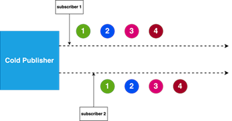
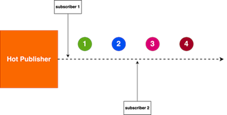
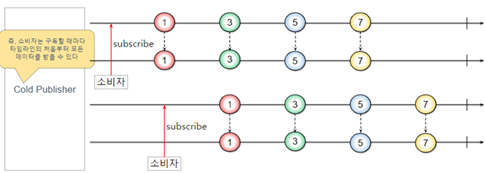
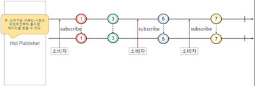

# Sección 6: Cold & Hot Publishers

---

## Introducción

En programación reactiva (y particularmente en `Project Reactor`), los términos `Cold Publisher` y `Hot Publisher`
hacen referencia a cómo se manejan las emisiones de datos y cómo los suscriptores reciben esos datos de los publishers.
Entender la diferencia entre ellos es fundamental para manejar correctamente el comportamiento de los flujos de datos.

Hasta ahora, hemos considerado que todos los `Flux` (y `Mono`) son iguales: *representan una secuencia asíncrona de
datos y no ocurre nada antes de la suscripción.*

Sin embargo, existen dos grandes familias de publicadores: `Cold Publisher` y `Hot Publisher`.

La descripción anterior se aplica a los `Cold Publisher`. Generan datos de nuevo para cada suscripción. Si no se crea
ninguna suscripción, los datos nunca se generan.



Los `Hot Publisher`, por otro lado, no dependen de ningún número de suscriptores. Podrían empezar a publicar
datos de inmediato y continuarían haciéndolo cada vez que llega un nuevo suscriptor (en cuyo caso, el suscriptor solo
vería los nuevos elementos emitidos después de suscribirse).



## Cold Publisher (Publicador frío)

Un `Cold Publisher` es un flujo de datos que `emite elementos desde el principio cada vez que un suscriptor
se conecta.` Los `cold publishers` producen datos `bajo demanda`, es decir, el flujo comienza a emitir sus elementos
solo cuando hay un suscriptor y `cada suscriptor recibe los datos desde el inicio`.



### Características de los Cold Publishers

- Cada nuevo suscriptor verá las emisiones desde el principio, sin importar cuándo se conecte.
- Los datos suelen ser generados bajo demanda para cada suscriptor.
- `Ejemplo`: Flujos de datos que se generan a partir de bases de datos, archivos, o cálculos, donde cada suscriptor
  necesita ver todos los datos desde el inicio.

````java
public class Lec00ColdHot {
    private static final Logger log = LoggerFactory.getLogger(Lec00ColdHot.class);

    public static void main(String[] args) {
        coldPublisher();
    }

    private static void coldPublisher() {
        Flux<Integer> coldFlux = Flux.range(1, 3);
        coldFlux.subscribe(Util.subscriber("sub1"));
        coldFlux.subscribe(Util.subscriber("sub2"));
    }
}
````

En este caso, cada suscriptor recibe los números del 1 al 3 desde el inicio, independientemente del momento en el
que se suscriba.

````bash
11:04:53.515 INFO  [           main] d.m.a.common.DefaultSubscriber : sub1 recibido: 1
11:04:53.517 INFO  [           main] d.m.a.common.DefaultSubscriber : sub1 recibido: 2
11:04:53.517 INFO  [           main] d.m.a.common.DefaultSubscriber : sub1 recibido: 3
11:04:53.520 INFO  [           main] d.m.a.common.DefaultSubscriber : sub1 ¡completado!
11:04:53.520 INFO  [           main] d.m.a.common.DefaultSubscriber : sub2 recibido: 1
11:04:53.521 INFO  [           main] d.m.a.common.DefaultSubscriber : sub2 recibido: 2
11:04:53.521 INFO  [           main] d.m.a.common.DefaultSubscriber : sub2 recibido: 3
11:04:53.521 INFO  [           main] d.m.a.common.DefaultSubscriber : sub2 ¡completado!
````

Ejemplos del mundo real:

- Llamadas a bases de datos.
- Lectura de archivos.
- Fetch de APIs, donde cada suscriptor obtiene una nueva llamada y datos frescos.

## Hot Publisher (Publicador caliente)

Un `Hot Publisher` emite datos a medida que ocurren, y cada suscriptor recibe los datos solo desde el momento en que
se suscribe. Dependiendo de su configuración (como `connect`, `autoConnect`, o `refCount`), puede comenzar la emisión
automáticamente o requerir al menos un suscriptor.

Si un suscriptor se conecta a un hot publisher `tarde`, recibirá solo los datos que se emiten `después` de su
suscripción. Esto significa que cualquier dato emitido antes de la suscripción no será recibido por el nuevo suscriptor.



### Características de los Hot Publishers

- Los datos fluyen independientemente de los suscriptores.
- Los suscriptores que se conecten tarde se perderán los elementos ya emitidos.
- Son útiles para eventos que no dependen del suscriptor, como transmisiones en vivo.
- `Ejemplo`: Sensores de temperatura, transmisión de datos en tiempo real.

### 🔥 Hot Publisher que inicia la emisión al tener al menos un suscriptor (.share() / refCount(1))

En este caso, el `Hot Publisher` comienza a emitir datos solamente cuando se suscribe al menos un consumidor. Este
comportamiento se logra utilizando `.share()`, que internamente equivale a `.publish().refCount(1)`.

Si en algún momento todos los suscriptores se cancelan, el flujo de datos se detiene automáticamente.
Cada nuevo suscriptor recibe solo los datos emitidos a partir del momento de su suscripción, sin acceso a eventos
anteriores.

````java
public class Lec00ColdHot {
    private static final Logger log = LoggerFactory.getLogger(Lec00ColdHot.class);

    public static void main(String[] args) {
        hotPublisher();
    }

    private static void hotPublisher() {
        Flux<Long> hotFlux = Flux.interval(Duration.ofSeconds(1))
                .share(); // Convierte este Cold Publisher en Hot Publisher

        hotFlux.subscribe(Util.subscriber("sub1"));
        Util.sleepSeconds(2); // Esperamos 2 segundos antes de añadir el segundo suscriptor

        hotFlux.subscribe(Util.subscriber("sub2"));
        Util.sleepSeconds(4);
    }
}
````

La llamada a `.share()` es un atajo para `.publish().refCount(1)`, lo cual significa:

- El flujo `comienza a emitir` cuando `hay al menos un suscriptor`.
- Si todos los `suscriptores se cancelan`, el `flujo se detiene`.
- Los nuevos suscriptores solo reciben los elementos emitidos desde el momento de su suscripción.

En este caso:

- El `sub1` comienza a recibir datos de inmediato.
- El `sub2` se conecta 2 segundos después, por lo que no verá los primeros 2 valores emitidos y comenzará a
  recibir datos desde el tercer valor.

````bash
11:12:10.409 INFO  [     parallel-1] d.m.a.common.DefaultSubscriber : sub1 recibido: 0
11:12:11.406 INFO  [     parallel-1] d.m.a.common.DefaultSubscriber : sub1 recibido: 1
11:12:12.415 INFO  [     parallel-1] d.m.a.common.DefaultSubscriber : sub1 recibido: 2
11:12:12.415 INFO  [     parallel-1] d.m.a.common.DefaultSubscriber : sub2 recibido: 2
11:12:13.409 INFO  [     parallel-1] d.m.a.common.DefaultSubscriber : sub1 recibido: 3
11:12:13.409 INFO  [     parallel-1] d.m.a.common.DefaultSubscriber : sub2 recibido: 3
11:12:14.420 INFO  [     parallel-1] d.m.a.common.DefaultSubscriber : sub1 recibido: 4
11:12:14.420 INFO  [     parallel-1] d.m.a.common.DefaultSubscriber : sub2 recibido: 4
11:12:15.410 INFO  [     parallel-1] d.m.a.common.DefaultSubscriber : sub1 recibido: 5
11:12:15.410 INFO  [     parallel-1] d.m.a.common.DefaultSubscriber : sub2 recibido: 5
````

Ejemplos del mundo real:

- `Sensores`: Un sensor que mide la temperatura sigue emitiendo datos, y cualquier suscriptor que se conecte después
  solo verá los datos a partir de su conexión.
- `Eventos en tiempo real`: Streams de redes sociales, precios de acciones en bolsa, etc., donde los suscriptores que
  se unan tarde no ven eventos pasados, solo eventos futuros.

### 🔥 Hot Publisher que emite sin necesidad de suscriptores

Un `Hot Publisher` basado en `ConnectableFlux` con `.connect()` comienza a emitir datos inmediatamente después de
invocar `connect()`, sin necesidad de que haya suscriptores activos.

Esto significa que los elementos emitidos pueden perderse si no hay nadie suscrito en ese momento, ya que el flujo
avanza continuamente y no guarda historial.

✅ Características clave:

- La emisión no espera suscriptores.
- Si un suscriptor se une tarde, no recibe los datos anteriores.
- La fuente se activa explícitamente con `.connect()`, lo que hace que el `Flux` comience a empujar datos aunque nadie
  esté escuchando.
- La emisión del flujo se cancela solo en ciertas condiciones específicas, ya que este tipo de flujo:
    1. No depende de los suscriptores para comenzar.
    2. Sigue emitiendo hasta que ocurra uno de estos casos:
        - Cuando el `Publisher` fuente se completa o falla.
        - Cuando se llama manualmente a `dispose()` sobre la `Disposable` que devuelve `connect()`.
        - Cuando se cancela el `Subscription` internamente por el operador.

> 📌 `Importante`: si nadie llama a `dispose()` y el flujo es infinito, seguirá emitiendo datos indefinidamente,
> incluso si no hay suscriptores.

Veamos el siguiente ejemplo típico.

````java
public class Lec00ColdHot {
    private static final Logger log = LoggerFactory.getLogger(Lec00ColdHot.class);

    public static void main(String[] args) {
        hotPublisher2();
    }

    private static void hotPublisher2() {
        ConnectableFlux<Long> hot = Flux.interval(Duration.ofSeconds(1)).publish();
        hot.connect(); // Inicia la emisión, incluso sin suscriptores

        Util.sleepSeconds(3);

        hot.subscribe(Util.subscriber("sub1")); // Sub1 se une tarde

        Util.sleepSeconds(6);
    }
}
````

Este ejemplo demuestra que un `Hot Publisher` creado con `publish()` y activado mediante `connect()` comienza a emitir
inmediatamente, incluso si no hay suscriptores presentes en ese momento.

Cuando el suscriptor (`sub1`) se conecta después de `3 segundos`, no recibe los primeros elementos (0, 1, 2), sino que
empieza a recibir desde el elemento 3 en adelante, justo desde que se suscribió.

Esto confirma que:

- La emisión no depende de tener suscriptores activos.
- Los elementos anteriores a la suscripción se pierden.
- La fuente (`Flux.interval`) es infinita y seguirá emitiendo hasta que se cancele manualmente o se apague el programa.

````bash
11:54:09.365 INFO  [     parallel-1] d.m.a.common.DefaultSubscriber : sub1 recibido: 3
11:54:10.352 INFO  [     parallel-1] d.m.a.common.DefaultSubscriber : sub1 recibido: 4
11:54:11.359 INFO  [     parallel-1] d.m.a.common.DefaultSubscriber : sub1 recibido: 5
11:54:12.351 INFO  [     parallel-1] d.m.a.common.DefaultSubscriber : sub1 recibido: 6
11:54:13.360 INFO  [     parallel-1] d.m.a.common.DefaultSubscriber : sub1 recibido: 7
11:54:14.351 INFO  [     parallel-1] d.m.a.common.DefaultSubscriber : sub1 recibido: 8
````
