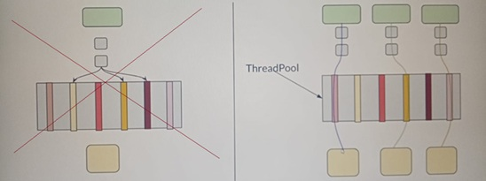
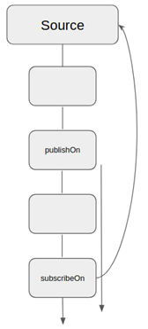
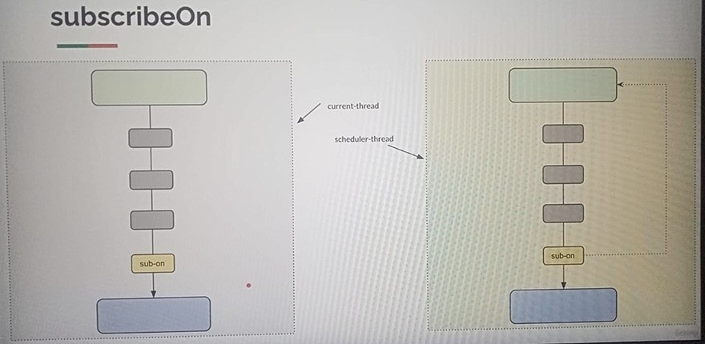
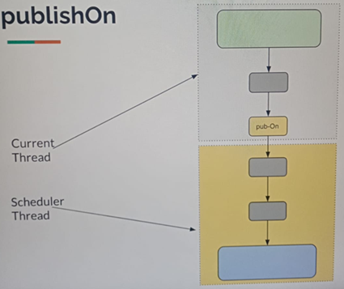

# Sección 7: [Opcional] - Hilos y Schedulers

---

## Introducción

En esta sección hablaremos sobre `hilos` (`threads`) y `planificadores` (`schedulers`). Como sabemos, `Reactor` es una
librería para programación reactiva asíncrona basada en flujos. Dado que trabaja detrás de escena, utiliza herramientas
proporcionadas por Java, como hilos, canales de socket asíncronos, entre otras.

Sin embargo, estas herramientas son complejas de manejar, propensas a errores y de muy bajo nivel. Es como un cuchillo:
si eres un chef, sabes cómo usarlo, pero no se lo darías a un niño porque podría lastimarse.

El `objetivo de Reactor` es simplificar todo esto, y lo hace bastante bien. Por ejemplo, si tenemos un `Flux` con
algunos operadores y un suscriptor, por defecto, todo se ejecutará en el hilo actual. Es decir, el mismo hilo que
inicia la ejecución del programa será responsable de:

- Suscribirse al publisher (`Flux`),
- Recibir el objeto de suscripción,
- Enviar solicitudes al publisher,
- Y procesar los elementos emitidos.

En otras palabras, todas las operaciones ocurren en el mismo hilo, a menos que indiquemos lo contrario.

Pero en algunos casos, esto no es ideal, ya que puede generar bloqueos o afectar el rendimiento. Es posible que
observemos comportamientos de bloqueo si no manejamos correctamente la ejecución en múltiples hilos.

Entonces, veremos cómo funciona internamente y qué opciones tenemos para aprovechar mejor los recursos disponibles,
como múltiples núcleos de CPU, utilizando los schedulers que ofrece Reactor.

## Publisher/Subscriber - Default Thread - Demo

Por defecto, en `programación reactiva` con `Reactor`,
`todo el flujo se ejecuta en el mismo hilo desde el cual se inicia la suscripción`. Es decir, si no se configura
explícitamente un `Scheduler`, el hilo actual será responsable de generar, procesar y consumir los datos.

Veamos el siguiente ejemplo:

````java
public class Lec01DefaultBehaviorDemo {

    private static final Logger log = LoggerFactory.getLogger(Lec01DefaultBehaviorDemo.class);

    public static void main(String[] args) {
        Flux<Integer> flux = Flux.<Integer>create(fluxSink -> {
            for (int i = 1; i < 3; i++) {
                log.info("Generando: {}", i);
                fluxSink.next(i);
            }
            fluxSink.complete();
        }).doOnNext(value -> log.info("value: {}", value));

        flux.subscribe(Util.subscriber());
    }
}
````

Explicación del código:

1. Se crea un `Flux<Integer>` usando `Flux.create`, que permite generar elementos de forma imperativa.
2. Dentro del `fluxSink`, se generan dos valores (1 y 2), y se emiten manualmente con `fluxSink.next(i)`.
3. Se usa `.doOnNext(...)` para interceptar y registrar cada valor emitido antes de que llegue al suscriptor.
4. Finalmente, se llama a `.subscribe(...)` para iniciar el flujo y consumir los elementos usando un suscriptor
   personalizado (`Util.subscriber()`).

Como se observa en el resultado, todo el flujo —desde la generación hasta el consumo— se realiza en un único hilo:
`main`.

Esto confirma el `comportamiento por defecto de Reactor`, donde:

- El `publisher` emite los datos en el mismo hilo en que se ejecuta el `main`.
- Los operadores intermedios (`doOnNext`) y el `subscriber` también operan en ese mismo hilo.

````bash
12:00:25.558 INFO  [           main] m.a.s.Lec01DefaultBehaviorDemo : Generando: 1
12:00:25.561 INFO  [           main] m.a.s.Lec01DefaultBehaviorDemo : value: 1
12:00:25.561 INFO  [           main] d.m.a.common.DefaultSubscriber :  recibido: 1
12:00:25.561 INFO  [           main] m.a.s.Lec01DefaultBehaviorDemo : Generando: 2
12:00:25.561 INFO  [           main] m.a.s.Lec01DefaultBehaviorDemo : value: 2
12:00:25.561 INFO  [           main] d.m.a.common.DefaultSubscriber :  recibido: 2
12:00:25.565 INFO  [           main] d.m.a.common.DefaultSubscriber :  ¡completado!
````

Ahora agreguemos un `subscriber` adicional. Cuando un `Flux` es `cold` (frío), significa que cada vez que alguien se
suscribe, el flujo se vuelve a ejecutar desde el principio. En este ejemplo, agregamos dos suscriptores distintos
(`sub1` y `sub2`) al mismo `Flux`.

````java
public class Lec01DefaultBehaviorDemo {

    private static final Logger log = LoggerFactory.getLogger(Lec01DefaultBehaviorDemo.class);

    public static void main(String[] args) {
        Flux<Integer> flux = Flux.<Integer>create(fluxSink -> {
            for (int i = 1; i < 3; i++) {
                log.info("Generando: {}", i);
                fluxSink.next(i);
            }
            fluxSink.complete();
        }).doOnNext(value -> log.info("value: {}", value));

        flux.subscribe(Util.subscriber("sub1"));
        flux.subscribe(Util.subscriber("sub2"));
    }
}
````

Explicación:

- Se crea un `Flux<Integer>` como en el ejemplo anterior.
- Esta vez, se suscriben dos consumidores distintos (`sub1` y `sub2`) al mismo flujo.
- Al tratarse de un flujo `cold`, cada suscripción desencadena una nueva ejecución del flujo desde cero.
- Todo el procesamiento sigue ocurriendo en el hilo actual: `main`.

Si ejecutamos el código anterior, veremos que el hilo principal `main` es el que está haciendo la suscripción, es decir
sigue haciendo todo el trabajo.

````bash
12:05:34.402 INFO  [           main] m.a.s.Lec01DefaultBehaviorDemo : Generando: 1
12:05:34.406 INFO  [           main] m.a.s.Lec01DefaultBehaviorDemo : value: 1
12:05:34.407 INFO  [           main] d.m.a.common.DefaultSubscriber : sub1 recibido: 1
12:05:34.407 INFO  [           main] m.a.s.Lec01DefaultBehaviorDemo : Generando: 2
12:05:34.407 INFO  [           main] m.a.s.Lec01DefaultBehaviorDemo : value: 2
12:05:34.407 INFO  [           main] d.m.a.common.DefaultSubscriber : sub1 recibido: 2
12:05:34.410 INFO  [           main] d.m.a.common.DefaultSubscriber : sub1 ¡completado!
12:05:34.410 INFO  [           main] m.a.s.Lec01DefaultBehaviorDemo : Generando: 1
12:05:34.410 INFO  [           main] m.a.s.Lec01DefaultBehaviorDemo : value: 1
12:05:34.410 INFO  [           main] d.m.a.common.DefaultSubscriber : sub2 recibido: 1
12:05:34.410 INFO  [           main] m.a.s.Lec01DefaultBehaviorDemo : Generando: 2
12:05:34.410 INFO  [           main] m.a.s.Lec01DefaultBehaviorDemo : value: 2
12:05:34.410 INFO  [           main] d.m.a.common.DefaultSubscriber : sub2 recibido: 2
12:05:34.410 INFO  [           main] d.m.a.common.DefaultSubscriber : sub2 ¡completado!
````

Lo que concluímos del resultado:

- Cada suscripción reinicia el flujo desde el principio. No es un "replay" del resultado anterior; se vuelve a ejecutar
  la lógica de emisión.
- Ambos `sub1` y `sub2` reciben los mismos valores, pero independientemente.
- Todo el trabajo ocurre en el `hilo principal (main)`, lo que reafirma que `Reactor`, por defecto, no cambia de hilos
  ni ejecuta en paralelo si no se le indica explícitamente.

Hasta ahora, todos los ejemplos se ejecutaban en el hilo principal (`main`), pero *¿qué pasa si usamos un hilo
diferente para realizar la suscripción?*

````java
public class Lec01DefaultBehaviorDemo {

    private static final Logger log = LoggerFactory.getLogger(Lec01DefaultBehaviorDemo.class);

    public static void main(String[] args) {
        Flux<Integer> flux = Flux.<Integer>create(fluxSink -> {
            for (int i = 1; i < 3; i++) {
                log.info("Generando: {}", i);
                fluxSink.next(i);
            }
            fluxSink.complete();
        }).doOnNext(value -> log.info("value: {}", value));

        Runnable runnable = () -> flux.subscribe(Util.subscriber("sub1"));
        Thread.ofPlatform().start(runnable);
    }
}
````

Si nos fijamos en el resultado vemos que ahora el hilo `Thread-0` es el que está haciendo el trabajo y ya no el `main`.

````bash
12:12:14.506 INFO  [       Thread-0] m.a.s.Lec01DefaultBehaviorDemo : Generando: 1
12:12:14.508 INFO  [       Thread-0] m.a.s.Lec01DefaultBehaviorDemo : value: 1
12:12:14.509 INFO  [       Thread-0] d.m.a.common.DefaultSubscriber : sub1 recibido: 1
12:12:14.509 INFO  [       Thread-0] m.a.s.Lec01DefaultBehaviorDemo : Generando: 2
12:12:14.509 INFO  [       Thread-0] m.a.s.Lec01DefaultBehaviorDemo : value: 2
12:12:14.509 INFO  [       Thread-0] d.m.a.common.DefaultSubscriber : sub1 recibido: 2
12:12:14.511 INFO  [       Thread-0] d.m.a.common.DefaultSubscriber : sub1 ¡completado!
````

Explicación:

- En este ejemplo, en lugar de llamar directamente a `flux.subscribe(...)`, se hace desde otro hilo creado con
  `Thread.ofPlatform().start(...)`.
- Como resultado, todo el trabajo de generación, procesamiento (`doOnNext`) y consumo (`subscribe`) se realiza en ese
  nuevo hilo: `Thread-0`.
- `Esto refuerza un principio importante en Reactor`: Por defecto, el hilo desde donde se realiza la suscripción es el
  hilo donde ocurren todas las operaciones del flujo.

¿Cómo lo controlamos mejor? Para eso existen los operadores como:

- `subscribeOn(...)`: cambia el hilo donde se inicia la suscripción (es decir, desde dónde se ejecuta el flujo).
- `publishOn(...)`: cambia el hilo desde donde se ejecutan las siguientes etapas del flujo (transformaciones,
  operadores, etc.).

👉 En las siguientes secciones se explicará cómo usar estos operadores para tener un control fino del threading model en
programación reactiva.

## Schedulers

En la lección anterior, vimos que, `por defecto, todo se ejecuta en el hilo actual`. En muchos casos, eso puede no ser
lo ideal.

`¿Por qué?` Porque podríamos tener, por ejemplo, 10 núcleos de CPU disponibles en nuestra máquina, y, sin embargo,
estamos utilizando solo un hilo (`main`) para todo el trabajo.

También vimos que podíamos crear un nuevo hilo y usarlo para suscribirnos al `Flux`, haciendo que ese hilo realice todo
el trabajo. Si bien eso puede funcionar, no es recomendable encargarnos nosotros mismos de crear y gestionar hilos.
Esto puede volverse complejo, propenso a errores y difícil de mantener.

### ¿Cuál es la solución?

`Project Reactor` nos ofrece una solución elegante: los `Schedulers`, que son conjuntos de *pools de hilos* optimizados
para distintos propósitos.

### ¿Qué es un Scheduler?

Un `Scheduler` es un componente que `define en qué hilo(s)` (o pool de hilos) se ejecutan las operaciones de un flujo
reactivo, como `Flux` o `Mono`.

Permite `controlar el contexto de ejecución` para que puedas decidir si una operación debe ejecutarse:

- en el hilo actual,
- en un hilo dedicado,
- en paralelo,
- o en hilos pensados para operaciones de bloqueo.

### Tipos comunes de Schedulers en Project Reactor:

1. `Schedulers.immediate()`, ejecuta las operaciones en el hilo actual. No cambia el contexto de ejecución. Es el
   comportamiento por defecto.


2. `Schedulers.single()`, usa un solo hilo compartido para todas las tareas. Es útil cuando necesitas que las tareas se
   ejecuten secuencialmente en un mismo hilo (como en un entorno con restricciones de acceso concurrente).


3. `Schedulers.parallel()` proporciona un pool de hilos de tamaño fijo, usualmente igual al número de núcleos
   disponibles en el sistema (`Runtime.getRuntime().availableProcessors()`). Está pensado para tareas `CPU-bound`, es
   decir, tareas intensivas en procesamiento que no deben bloquear (como cálculos o transformaciones).


4. `Schedulers.boundedElastic()`, usa un pool de hilos "elástico", con un límite superior. Está diseñado para tareas
   bloqueantes o de larga duración, como llamadas a bases de datos, operaciones de E/S o APIs externas. Permite crecer
   si es necesario, pero con límites para evitar sobrecarga.

### 🧠 Aclaración sobre `Schedulers.parallel()`

Cuando la gente ve `Schedulers.parallel()`, a menudo asume que garantiza ejecución paralela, como si todas las
operaciones se fueran a ejecutar al mismo tiempo. Pero en realidad no es así. El nombre puede ser engañoso:
`Schedulers.parallel()` simplemente es un grupo de hilos diseñado para tareas relacionadas con el CPU, como cálculos
intensivos.

Esto `no significa que el procesamiento ocurrirá en paralelo automáticamente`. Muchos desarrolladores imaginan algo
como el de la *imagen inferior (lado izquierdo)*.

> “Tengo un productor, tengo un suscriptor, tengo un pool de hilos… así que cada hilo tomará un elemento del flujo y lo
> procesará de forma independiente”.

Pero esa `no es la forma en que funciona por defecto`.



Lo que realmente ocurre es que cuando defines un `Flux`, creas una `tubería reactiva` (pipeline).
Y es posible que haya varios suscriptores a ese flujo: tú, yo, otros más.
Si el flujo es un `cold publisher`, entonces cada suscriptor tendrá su propia instancia del productor de datos.

En ese momento, cada suscriptor tomará prestado un hilo del pool de `Schedulers.parallel()` para ejecutar su trabajo.
Así, uno usará un hilo, otro usará un hilo distinto, y así sucesivamente.

> 👉 Ese es el comportamiento por defecto: `cada suscripción usa un hilo del scheduler`.
> *Imagen superior (lado derecho)*.

### ¿Cómo se usan los Schedulers?

Reactor ofrece principalmente dos operadores para aplicar los `Schedulers`:

- `subscribeOn(Scheduler)`, define el `Scheduler` que se usará para iniciar el flujo, es decir, el hilo donde se
  generarán y emitirán los elementos. Afecta las operaciones anteriores a la ubicación donde se coloca en el flujo.


- `publishOn(Scheduler)`, cambia el contexto de ejecución a partir del punto donde se coloca este operador. Es útil
  cuando quieres procesar parte del flujo en otro hilo, sin afectar cómo se generan los datos.

### Resumen gráfico:

| Operador      | Afecta desde...    | Afecta a...                   | Uso típico                                          |
|---------------|--------------------|-------------------------------|-----------------------------------------------------|
| `subscribeOn` | El punto de origen | Toda la cadena hacia atrás    | Controlar el hilo del publisher                     |
| `publishOn`   | Donde se aplica    | Toda la cadena hacia adelante | Cambiar el hilo del subscriber o etapas intermedias |

`publishOn` y `subscribeOn` son métodos convenientes en `Project Reactor` que aceptan cualquiera de los `Schedulers`
mencionados para cambiar el contexto de ejecución de tareas para las operaciones en una pipeline reactiva.
Mientras que `subscribeOn` fuerza la emisión de origen a usar `Schedulers` específicos, `publishOn` cambia los
`Schedulers` para todas las operaciones posteriores en la pipeline, como se muestra a continuación.



## SubscribeOn

El operador `subscribeOn(Scheduler)` en `Project Reactor` se utiliza para cambiar el `hilo (o pool de hilos)` en el que
se ejecuta la `suscripción y la generación de los datos` dentro de un flujo reactivo (`Flux` o `Mono`). Es decir,
afecta la parte `"aguas arriba"` del flujo — desde el punto donde se crea el flujo hasta donde se coloca el
`subscribeOn`.



### ¿Qué hace exactamente?

Cuando usas `subscribeOn`, estás diciendo:

> “Ejecuta todo el trabajo que ocurre antes o hasta este punto del flujo (incluida la creación de los elementos y la
> suscripción) en el `Scheduler` que te estoy dando.”

Esto permite que las tareas que pueden ser costosas o lentas (por ejemplo, leer de un archivo, acceder a una base de
datos, etc.) se hagan en un hilo `diferente del hilo principal`.

### ¿Por qué es útil?

- Permite liberar el hilo principal (`main`) para que no se bloquee.
- Es útil en aplicaciones reactivas donde necesitas evitar bloqueos y aprovechar múltiples núcleos del procesador.
- Mejora el rendimiento cuando tienes flujos que hacen operaciones de bloqueo (como llamadas a servicios externos o
  lecturas desde disco).
- Se usa junto con `Schedulers` como `boundedElastic`, `parallel`, etc., para controlar el tipo de ejecución.

### Ejemplo conceptual:

Imagina que tienes un `Flux` que lee archivos grandes. Si no usas `subscribeOn`, todo ese trabajo se hará en el hilo
principal. Si usas:

````bash
flux.subscribeOn(Schedulers.boundedElastic())
````

Entonces la lectura y emisión de los datos del archivo se harán en un hilo especial del tipo elástico, que está pensado
para tareas de larga duración o bloqueo.

### Importante:

- Aunque pongas múltiples `subscribeOn` en un flujo, `solo se respeta el primero` que aparece en la cadena.
- Se diferencia de `publishOn`, que cambia el hilo desde ese punto en adelante (flujo "aguas abajo").

## SubscribeOn - Demo

El operador `subscribeOn` en `Project Reactor` permite cambiar el `contexto (hilo o pool de hilos)` en el que se
ejecuta el flujo reactivo `desde su creación`. Es decir, afecta todo lo que ocurre "aguas arriba", incluyendo:

- El momento en que se crea el flujo (por ejemplo, `en Flux.create(...)`).
- Cualquier operador anterior al `subscribeOn`, incluso `doFirst`.

````java
public class Lec02SubscribeOn {

    private static final Logger log = LoggerFactory.getLogger(Lec02SubscribeOn.class);

    public static void main(String[] args) {
        Flux<Integer> flux = Flux.<Integer>create(fluxSink -> {
            for (int i = 1; i < 3; i++) {
                log.info("Generando: {}", i);
                fluxSink.next(i);
            }
            fluxSink.complete();
        }).doOnNext(value -> log.info("value: {}", value));

        flux
                .doFirst(() -> log.info("first-1"))
                .subscribeOn(Schedulers.boundedElastic())
                .doFirst(() -> log.info("first-2"))
                .subscribe(Util.subscriber());

        Util.sleepSeconds(2);
    }
}
````

Este ejemplo tiene dos llamadas a `doFirst(...)`, y se aplica `subscribeOn(Schedulers.boundedElastic())`. Veamos el
orden y el hilo en que se ejecuta cada parte, comparándolo con el log:

````bash
16:31:21.926 INFO  [           main] d.m.app.sec07.Lec02SubscribeOn : first-2
16:31:21.932 INFO  [oundedElastic-1] d.m.app.sec07.Lec02SubscribeOn : first-1
16:31:21.939 INFO  [oundedElastic-1] d.m.app.sec07.Lec02SubscribeOn : Generando: 1
16:31:21.940 INFO  [oundedElastic-1] d.m.app.sec07.Lec02SubscribeOn : value: 1
16:31:21.941 INFO  [oundedElastic-1] d.m.a.common.DefaultSubscriber :  recibido: 1
16:31:21.941 INFO  [oundedElastic-1] d.m.app.sec07.Lec02SubscribeOn : Generando: 2
16:31:21.941 INFO  [oundedElastic-1] d.m.app.sec07.Lec02SubscribeOn : value: 2
16:31:21.941 INFO  [oundedElastic-1] d.m.a.common.DefaultSubscriber :  recibido: 2
16:31:21.943 INFO  [oundedElastic-1] d.m.a.common.DefaultSubscriber :  ¡completado!
````

Explicación:

- `doFirst()` se ejecuta en orden inverso al que fueron declarados:
    - Primero se ejecuta `first-2` (último declarado), en el hilo `main`, antes de aplicar `subscribeOn`.
    - Luego `first-1` (declarado primero), en el hilo `boundedElastic`, porque ya está dentro del efecto de
      `subscribeOn`.

- La generación (`Flux.create`) y el procesamiento (`doOnNext`, `subscribe`) también ocurren en el hilo
  `boundedElastic`, que es el que gestionará todo a partir del punto en que se aplica `subscribeOn`.

> 💡 `subscribeOn` siempre actúa desde el punto donde se declara hacia atrás (aguas arriba). Esto lo diferencia de
> `publishOn`, que actúa hacia adelante (aguas abajo).

## Múltiple SubscribeOn

Cuando usas múltiples `subscribeOn`, el `subscribeOn` más cercano a la fuente (`publisher`) es el que finalmente
determina el `Scheduler` que se usará para la ejecución. Los demás `subscribeOn` que sigan no tendrán efecto, porque
`subscribeOn` solo tiene impacto en el primer `subscribeOn` que se encuentre al recorrer el pipeline reactivo.

````java
public class Lec03MultipleSubscribeOn {

    private static final Logger log = LoggerFactory.getLogger(Lec03MultipleSubscribeOn.class);

    // Podemos tener varias suscripciones. La más cercana a la fuente (publisher) tendrá prioridad y es el
    // que acabará haciendo todo el trabajo
    public static void main(String[] args) {
        Flux<Integer> flux = Flux.<Integer>create(fluxSink -> {
                    for (int i = 1; i < 3; i++) {
                        log.info("Generando: {}", i);
                        fluxSink.next(i);
                    }
                    fluxSink.complete();
                })
                .subscribeOn(Schedulers.parallel())
                .doOnNext(value -> log.info("value: {}", value))
                .doFirst(() -> log.info("first-1"))
                .subscribeOn(Schedulers.boundedElastic())
                .doFirst(() -> log.info("first-2"));

        flux.subscribe(Util.subscriber());

        Util.sleepSeconds(2);
    }
}
````

### Revisando el código

1. `Flux y su fuente`: El `Flux.create` es donde se genera la secuencia de datos. En este caso, se generan dos valores,
   1 y 2.


2. Primer `subscribeOn(Schedulers.parallel())`: Este es el primer `subscribeOn`, y afecta al `Publisher`. Esto indica
   que la creación de los valores se ejecutará en un `Scheduler paralelo`.
    - Esto es evidente en el log: `Generando: 1` y `Generando: 2`, los cuales se están ejecutando en un hilo
      `parallel-1`, que es un hilo del `Schedulers.parallel()`.


3. Segundo `subscribeOn(Schedulers.boundedElastic())`: Aunque este `subscribeOn` aparece después en el pipeline, no
   tiene efecto. El primer `subscribeOn` (en `Schedulers.parallel()`) se encarga de todo el trabajo, porque es el que
   está más cercano a la fuente del flujo.


4. Ejecución de `doFirst`: Se ejecuta `doFirst` antes de cada emisión, y es por eso que vemos los logs `first-1` y
   `first-2`. Estas son las acciones que se ejecutan justo antes de la ejecución de la primera emisión (antes de
   procesar el primer elemento).

````bash
17:02:18.148 INFO  [           main] m.a.s.Lec03MultipleSubscribeOn : first-2
17:02:18.154 INFO  [oundedElastic-1] m.a.s.Lec03MultipleSubscribeOn : first-1
17:02:18.162 INFO  [     parallel-1] m.a.s.Lec03MultipleSubscribeOn : Generando: 1
17:02:18.163 INFO  [     parallel-1] m.a.s.Lec03MultipleSubscribeOn : value: 1
17:02:18.163 INFO  [     parallel-1] d.m.a.common.DefaultSubscriber :  recibido: 1
17:02:18.164 INFO  [     parallel-1] m.a.s.Lec03MultipleSubscribeOn : Generando: 2
17:02:18.164 INFO  [     parallel-1] m.a.s.Lec03MultipleSubscribeOn : value: 2
17:02:18.164 INFO  [     parallel-1] d.m.a.common.DefaultSubscriber :  recibido: 2
17:02:18.167 INFO  [     parallel-1] d.m.a.common.DefaultSubscriber :  ¡completado!
````

1. El log muestra que el primer `subscribeOn` (paralelo) `hace el trabajo de generar y procesar los valores`.
2. El segundo `subscribeOn` no tiene impacto, como se esperaba, porque es el primero el que controla el flujo de
   trabajo.
3. El orden de los logs confirma que la secuencia sigue la `regla de prioridad del primer` `subscribeOn`.

> El `subscribeOn` más cercano al `Publisher` (en este caso, el que se usa en `Flux.create`) es el que controla
> el `Scheduler` en el que se ejecutan las operaciones. El segundo `subscribeOn` se ignora y no tiene efecto.

## Scheduler - Virtual Thread

Los `Virtual Threads` son una nueva característica introducida en `Java 21` (como parte de `Project Loom`) que permite
crear `hilos livianos gestionados por la JVM`, `no por el sistema operativo`. Esto trae ventajas clave:

- Se pueden crear `miles o millones` de `hilos virtuales` sin agotar los recursos del sistema.
- Son ideales para aplicaciones `concurrentes y reactivas`, donde hay muchas tareas que esperan (por ejemplo, llamadas a
  base de datos o servicios externos).
- A diferencia de los `hilos tradicionales` (`plataforma` o `carrier threads`), los `virtual threads` son más baratos
  de crear y más eficientes.

Actualmente, `Reactor` soporta `Virtual Threads`, solo debemos habilitarlo utilizando el `System.setProperty`.
Este `System.setProperty` le indica a `Reactor` que cuando cree hilos en el `boundedElastic scheduler`, utilice
`virtual threads` en lugar de `hilos tradicionales`.

````java
public class Lec04VirtualThreads {

    private static final Logger log = LoggerFactory.getLogger(Lec04VirtualThreads.class);

    public static void main(String[] args) {
        System.setProperty("reactor.schedulers.defaultBoundedElasticOnVirtualThreads", "true");

        Flux<Integer> flux = Flux.<Integer>create(fluxSink -> {
                    for (int i = 1; i < 3; i++) {
                        log.info("Generando: {}", i);
                        fluxSink.next(i);
                    }
                    fluxSink.complete();
                })
                .doOnNext(value -> log.info("value: {}", value))
                .doFirst(() -> log.info("first-1-{}", Thread.currentThread().isVirtual()))
                .subscribeOn(Schedulers.boundedElastic())
                .doFirst(() -> log.info("first-2"));

        flux.subscribe(Util.subscriber());

        Util.sleepSeconds(2);
    }
}
````

Al ejecutar la aplicación vemos dentro del resultado el valor `first-1-true`. Esto confirma que el hilo que ejecutó esa
parte del flujo es `virtual`, porque `Thread.currentThread().isVirtual()` devolvió `true`.

````bash
17:40:24.332 INFO  [           main] d.m.a.s.Lec04VirtualThreads    : first-2
17:40:24.345 INFO  [oundedElastic-1] d.m.a.s.Lec04VirtualThreads    : first-1-true
17:40:24.352 INFO  [oundedElastic-1] d.m.a.s.Lec04VirtualThreads    : Generando: 1
17:40:24.353 INFO  [oundedElastic-1] d.m.a.s.Lec04VirtualThreads    : value: 1
17:40:24.353 INFO  [oundedElastic-1] d.m.a.common.DefaultSubscriber :  recibido: 1
17:40:24.353 INFO  [oundedElastic-1] d.m.a.s.Lec04VirtualThreads    : Generando: 2
17:40:24.353 INFO  [oundedElastic-1] d.m.a.s.Lec04VirtualThreads    : value: 2
17:40:24.353 INFO  [oundedElastic-1] d.m.a.common.DefaultSubscriber :  recibido: 2
17:40:24.356 INFO  [oundedElastic-1] d.m.a.common.DefaultSubscriber :  ¡completado!
````

🧠 ¿Qué significa esto para ti como desarrollador?

- Sin cambiar nada del código reactor existente, puedes empezar a usar hilos virtuales.
- Mejora la eficiencia de uso de memoria y CPU, sobre todo en cargas pesadas.
- No necesitas preocuparte por el manejo complejo de pools de hilos.

## PublishOn

En programación reactiva con Reactor, la ejecución de una secuencia de eventos puede dividirse en distintos hilos, y el
operador `publishOn` es una herramienta clave para lograr eso.

El operador `publishOn` cambia el hilo en el que se ejecutan los operadores posteriores a partir del punto donde se
invoca. Es decir, redirige el flujo de ejecución a un `Scheduler` diferente a partir de ese momento.

Cuando decimos que `publishOn` cambia el hilo de ejecución de los operadores posteriores, nos referimos a los operadores
que están aguas abajo, es decir, en dirección hacia el `Subscriber`, no hacia el `Publisher`.

### 🔄 Dirección del cambio de hilo:

- El cambio de hilo ocurre a partir del `publishOn` hacia el `Subscriber`, es decir, afecta todos los operadores que
  vienen después en la cadena.
- Los operadores que se encuentran antes del `publishOn` siguen ejecutándose en el hilo original (por ejemplo, el hilo
  principal si es un flujo síncrono).


