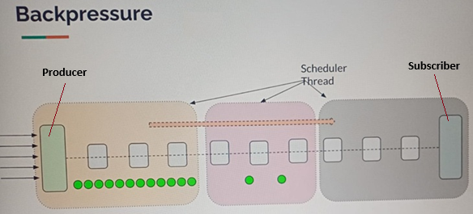

# Sección 8: [Opcional] - Backpressure / Estrategia de desbordamiento

---

## 🚀 Introducción

Los flujos reactivos se centran en el procesamiento asíncrono y no bloqueante de datos, con soporte fundamental para el
manejo de la Contrapresión (`backpressure`).

En un escenario típico, un `subscriber` (consumidor) podría inicialmente solicitar una gran cantidad de datos
(`“¡Dame todo!”`), o el `publisher` (productor) podría generar datos a una velocidad extremadamente alta
(por ejemplo, leyendo un archivo o una queue rápida).

Si el `publisher` empieza a emitir los elementos muy rápidamente, y el `subscriber` no es capaz de procesarlos
a la misma velocidad, se produce un desequilibrio de flujo (la sobrecarga o overload).

### ⚙️ ¿Qué es la Contrapresión?

Aquí es donde entra en juego la Contrapresión (`backpressure`).

> La `Contrapresión` es el mecanismo de señalización mediante el cual el `subscriber` le indica al `publisher` la
> cantidad exacta de elementos de datos que está listo y es capaz de procesar en un momento dado.

Este mecanismo obliga al `publisher` a `ajustar automáticamente la velocidad de emisión` en función de la capacidad
de consumo del `subscriber`.



En `programación reactiva` (y en particular en la especificación `Reactive Streams` implementada por librerías
como Project Reactor), el manejo de `backpressure` es esencial para:

1. `Evitar el Desbordamiento`: Prevenir que el consumidor se vea desbordado y agote sus recursos (como la memoria).
2. `Garantizar la Resiliencia`: Asegurar que el sistema sea estable y adaptable bajo diferentes cargas.

## Manejo automático de la contrapresión

Para que quede muy claro: el `problema` es cuando el productor genera elementos más rápido de lo que el consumidor
puede procesar. `La contrapresión es la solución que permite al consumidor controlar al productor`.

### Sin contrapresión visible

Si ejecutamos el siguiente código, `no veremos ningún problema de contrapresión`.

````java
public class Lec01BackPressureHandling {

    private static final Logger log = LoggerFactory.getLogger(Lec01BackPressureHandling.class);

    public static void main(String[] args) {
        Flux<Integer> producer = Flux.generate(
                () -> 1,
                (state, synchronousSink) -> {
                    log.info("Generando: {}", state);
                    synchronousSink.next(state);
                    return ++state;
                }
        );

        producer
                .map(state -> timeConsumingTask(state))
                .subscribe(Util.subscriber());
    }

    private static final int timeConsumingTask(int i) {
        Util.sleepSeconds(1);
        return i;
    }
}
````

En este ejemplo, `no se produce contrapresión` porque el `Flux.generate(...)` y el `.subscribe(...)` operan en el mismo
hilo (`main`). Eso significa que el `productor` no puede generar un nuevo valor hasta que el `consumidor` haya
terminado de procesar el actual. Es decir, `el procesamiento es sincrónico y secuencial`, lo cual previene cualquier
desbordamiento o acumulación.

````bash
13:10:32.451 INFO  [           main] .a.s.Lec01BackPressureHandling : Generando: 1
13:10:33.464 INFO  [           main] d.m.a.common.DefaultSubscriber :  recibido: 1
13:10:33.464 INFO  [           main] .a.s.Lec01BackPressureHandling : Generando: 2
13:10:34.479 INFO  [           main] d.m.a.common.DefaultSubscriber :  recibido: 2
13:10:34.479 INFO  [           main] .a.s.Lec01BackPressureHandling : Generando: 3
13:10:35.482 INFO  [           main] d.m.a.common.DefaultSubscriber :  recibido: 3
...
...
````

### Manejo automático de contrapresión en Reactor

Ahora, con el fin de recrear el problema, de ver la contrapresión y cómo es que reactor lo maneja automáticamente vamos
a modificar el código anterior.

````java
public class Lec01BackPressureHandling {

    private static final Logger log = LoggerFactory.getLogger(Lec01BackPressureHandling.class);

    public static void main(String[] args) {
        Flux<Integer> producer = Flux.generate(
                () -> 1,
                (state, synchronousSink) -> {
                    log.info("Generando: {}", state);
                    synchronousSink.next(state);
                    return ++state;
                }
        );

        producer
                .publishOn(Schedulers.boundedElastic()) //<----- Se agregó este Scheduler
                .map(state -> timeConsumingTask(state))
                .subscribe(Util.subscriber());

        Util.sleepSeconds(60);
    }

    private static int timeConsumingTask(int i) {
        Util.sleepSeconds(1);
        return i;
    }
}
````

✅ Lo que hicimos:

- Usamos `Flux.generate()` para generar datos de forma secuencial desde un solo hilo (el hilo `main`).
- Agregamos el `publishOn(Schedulers.boundedElastic())` para mover el procesamiento posterior a otro hilo (uno de tipo
  `boundedElastic`, pensado para tareas bloqueantes o pesadas).
- En el `map()`, simulamos una tarea costosa con `sleepSeconds(1)`, es decir, cada elemento toma 1 segundo en
  procesarse.
- Nos subscribimos a ese flujo usando `Util.subscriber()` y dimos tiempo suficiente para ver el comportamiento
  (`Util.sleepSeconds(60)`).

⚠️ Qué se observa:

- El productor genera rápidamente los elementos desde el hilo `main`.
- El consumidor va lento, ya que está simulando una tarea costosa.
- El productor `llega hasta 256 elementos` y luego `se detiene temporalmente`, aunque el consumidor aún no termina de
  consumir.

🤖 Cómo lo maneja Reactor:

- Reactor utiliza una `cola interna` con `capacidad limitada` (por defecto, `256 elementos` para `publishOn`), lo que
  actúa como un `buffer`. Cuando este buffer se llena:
    - El publisher `deja de emitir temporalmente`.
    - Espera a que el consumidor consuma elementos y libere espacio.
    - Luego continúa generando nuevos elementos.

Eso es `backpressure automática`: el sistema se regula sin que tú tengas que escribir código manual de control.

El productor procesará hasta 256 (el hilo principal se detuvo automáticamente en ese valor) y esperará a que el
consumidor se ponga al día poco a poco. Así es como reactor maneja automáticamente la contrapresión.

````bash
15:59:23.005 INFO  [           main] .a.s.Lec01BackPressureHandling : Generando: 1
15:59:23.008 INFO  [           main] .a.s.Lec01BackPressureHandling : Generando: 2
15:59:23.008 INFO  [           main] .a.s.Lec01BackPressureHandling : Generando: 3
15:59:23.008 INFO  [           main] .a.s.Lec01BackPressureHandling : Generando: 4
15:59:23.008 INFO  [           main] .a.s.Lec01BackPressureHandling : Generando: 5
15:59:23.008 INFO  [           main] .a.s.Lec01BackPressureHandling : Generando: 6
15:59:23.008 INFO  [           main] .a.s.Lec01BackPressureHandling : Generando: 7
15:59:23.008 INFO  [           main] .a.s.Lec01BackPressureHandling : Generando: 8
...
16:01:27.812 INFO  [           main] .a.s.Lec01BackPressureHandling : Generando: 254
16:01:27.812 INFO  [           main] .a.s.Lec01BackPressureHandling : Generando: 255
16:01:27.812 INFO  [           main] .a.s.Lec01BackPressureHandling : Generando: 256
16:01:28.800 INFO  [oundedElastic-1] d.m.a.common.DefaultSubscriber :  recibido: 1
16:01:29.813 INFO  [oundedElastic-1] d.m.a.common.DefaultSubscriber :  recibido: 2
16:01:30.822 INFO  [oundedElastic-1] d.m.a.common.DefaultSubscriber :  recibido: 3
16:01:31.832 INFO  [oundedElastic-1] d.m.a.common.DefaultSubscriber :  recibido: 4
...
````

✅ Conclusión:

El ejemplo `demuestra la contrapresión automática` en acción: el productor es mucho más rápido, pero no desborda al
consumidor porque Reactor `detiene la emisión al llegar al límite del buffer (256 elementos)`, y solo reanuda cuando se
ha liberado al menos el `75% del buffer`, es decir, cuando hay suficiente espacio disponible
(aproximadamente 192 elementos procesados).

### Contrapresión automática con productor en hilo paralelo

Este ejemplo es, muy similar al anterior que analizamos, con una diferencia clave: *ahora el productor no está en el
hilo principal, sino en un hilo del* `Schedulers.parallel()`. Aun así, se sigue aplicando contrapresión automática,
igual que en el ejemplo anterior.

````java
public class Lec01BackPressureHandling {

    private static final Logger log = LoggerFactory.getLogger(Lec01BackPressureHandling.class);

    public static void main(String[] args) {
        Flux<Integer> producer = Flux.generate(
                        () -> 1,
                        (state, synchronousSink) -> {
                            log.info("Generando: {}", state);
                            synchronousSink.next(state);
                            return ++state;
                        }
                ).cast(Integer.class)
                .subscribeOn(Schedulers.parallel());        //<--------- Scheduler

        producer
                .publishOn(Schedulers.boundedElastic())     //<--------- Scheduler
                .map(state -> timeConsumingTask(state))
                .subscribe(Util.subscriber());

        Util.sleepSeconds(60);
    }

    private static int timeConsumingTask(int i) {
        Util.sleepSeconds(1);
        return i;
    }
}
````

Este ejemplo muestra que `no es necesario estar en el hilo principal` para que `Reactor` limite la producción:
incluso si el `Flux.generate` corre en otro hilo (`parallel`), la contrapresión sigue funcionando correctamente.

````bash
16:22:33.135 INFO  [     parallel-1] .a.s.Lec01BackPressureHandling : Generando: 1
16:22:33.138 INFO  [     parallel-1] .a.s.Lec01BackPressureHandling : Generando: 2
16:22:33.138 INFO  [     parallel-1] .a.s.Lec01BackPressureHandling : Generando: 3
16:22:33.138 INFO  [     parallel-1] .a.s.Lec01BackPressureHandling : Generando: 4
...
16:22:33.152 INFO  [     parallel-1] .a.s.Lec01BackPressureHandling : Generando: 254
16:22:33.152 INFO  [     parallel-1] .a.s.Lec01BackPressureHandling : Generando: 255
16:22:33.152 INFO  [     parallel-1] .a.s.Lec01BackPressureHandling : Generando: 256
16:22:34.146 INFO  [oundedElastic-1] d.m.a.common.DefaultSubscriber :  recibido: 1
16:22:35.162 INFO  [oundedElastic-1] d.m.a.common.DefaultSubscriber :  recibido: 2
16:22:36.168 INFO  [oundedElastic-1] d.m.a.common.DefaultSubscriber :  recibido: 3
````

### Contrapresión con Búfer Limitado: Control del Ritmo del Productor

En el ejemplo anterior, como no se estableció un límite al tamaño del búfer, el productor generó exactamente
`256 elementos` de forma inmediata, muy por delante del consumidor. Aun así, Reactor aplicó contrapresión automática
en segundo plano gracias al uso de los Schedulers.

En este nuevo ejemplo, al ajustar el tamaño del búfer con `System.setProperty("reactor.bufferSize.small", "16")`
se fuerza a detener al productor después de emitir `16 elementos`, hasta que el consumidor procese algunos y libere
espacio. Esto da una demostración clara del control de flujo y cómo `Reactor` evita el desbordamiento de memoria o
saturación del consumidor.

````java
public class Lec01BackPressureHandling {
    private static final Logger log = LoggerFactory.getLogger(Lec01BackPressureHandling.class);

    public static void main(String[] args) {
        System.setProperty("reactor.bufferSize.small", "16"); //<---- Ajustamos el tamaño de la cola, solo fines demostrativos

        Flux<Integer> producer = Flux.generate(
                        () -> 1,
                        (state, synchronousSink) -> {
                            log.info("Generando: {}", state);
                            synchronousSink.next(state);
                            return ++state;
                        }
                ).cast(Integer.class)
                .subscribeOn(Schedulers.parallel());

        producer
                .publishOn(Schedulers.boundedElastic())
                .map(state -> timeConsumingTask(state))
                .subscribe(Util.subscriber());

        Util.sleepSeconds(60);
    }

    private static int timeConsumingTask(int i) {
        Util.sleepSeconds(1);
        return i;
    }
}
````

Este ejemplo hace visible el comportamiento de contrapresión en tiempo real, gracias al `búfer limitado`. Es clave para
comprender:

- Cómo el productor se detiene automáticamente al llenarse el búfer (por ejemplo, con el límite de 16 elementos si se
  establece `reactor.bufferSize.small=16`).
- Cuándo se reanuda: no inmediatamente, sino `cuando el consumidor ha liberado al menos el 75% del búfer`, es decir,
  cuando hay suficiente espacio disponible.
- Que todo este control ocurre de forma automática, sin necesidad de escribir código adicional por parte del
  desarrollador.

````bash
16:56:59.883 INFO  [     parallel-1] .a.s.Lec01BackPressureHandling : Generando: 1
16:56:59.886 INFO  [     parallel-1] .a.s.Lec01BackPressureHandling : Generando: 2
16:56:59.886 INFO  [     parallel-1] .a.s.Lec01BackPressureHandling : Generando: 3
16:56:59.886 INFO  [     parallel-1] .a.s.Lec01BackPressureHandling : Generando: 4
...
16:56:59.887 INFO  [     parallel-1] .a.s.Lec01BackPressureHandling : Generando: 13
16:56:59.887 INFO  [     parallel-1] .a.s.Lec01BackPressureHandling : Generando: 14
16:56:59.887 INFO  [     parallel-1] .a.s.Lec01BackPressureHandling : Generando: 15
16:56:59.887 INFO  [     parallel-1] .a.s.Lec01BackPressureHandling : Generando: 16
16:57:00.894 INFO  [oundedElastic-1] d.m.a.common.DefaultSubscriber :  recibido: 1
16:57:01.905 INFO  [oundedElastic-1] d.m.a.common.DefaultSubscriber :  recibido: 2
16:57:02.920 INFO  [oundedElastic-1] d.m.a.common.DefaultSubscriber :  recibido: 3
16:57:03.926 INFO  [oundedElastic-1] d.m.a.common.DefaultSubscriber :  recibido: 4
16:57:04.935 INFO  [oundedElastic-1] d.m.a.common.DefaultSubscriber :  recibido: 5
16:57:05.946 INFO  [oundedElastic-1] d.m.a.common.DefaultSubscriber :  recibido: 6
16:57:06.959 INFO  [oundedElastic-1] d.m.a.common.DefaultSubscriber :  recibido: 7
16:57:07.970 INFO  [oundedElastic-1] d.m.a.common.DefaultSubscriber :  recibido: 8
16:57:08.980 INFO  [oundedElastic-1] d.m.a.common.DefaultSubscriber :  recibido: 9
16:57:09.992 INFO  [oundedElastic-1] d.m.a.common.DefaultSubscriber :  recibido: 10
16:57:10.998 INFO  [oundedElastic-1] d.m.a.common.DefaultSubscriber :  recibido: 11
16:57:12.011 INFO  [oundedElastic-1] d.m.a.common.DefaultSubscriber :  recibido: 12
16:57:12.012 INFO  [     parallel-1] .a.s.Lec01BackPressureHandling : Generando: 17
16:57:12.012 INFO  [     parallel-1] .a.s.Lec01BackPressureHandling : Generando: 18
...
````

## Limit Rate

En la lección anterior vimos cómo Reactor gestiona la contrapresión automáticamente, y cómo es posible ajustar el tamaño
del buffer interno con la propiedad `System.setProperty("reactor.bufferSize.small", "16")`. Sin embargo, en aplicaciones
reales no es recomendable manipular directamente ese buffer; ese ajuste solo se usó aquí con fines demostrativos.

Para indicarle al productor que el consumidor tiene una capacidad limitada y evitar que se envíen más elementos de los
que puede manejar, `Reactor` ofrece el operador `.limitRate(...)`.

Por ejemplo, `.limitRate(5)` indica que el `consumidor solicitará como máximo 5 elementos a la vez`, lo que regula el
ritmo al que el `productor` envía los datos y ayuda a evitar la sobrecarga del sistema.

````java

public class Lec02LimitRate {

    private static final Logger log = LoggerFactory.getLogger(Lec02LimitRate.class);

    public static void main(String[] args) {

        Flux<Integer> producer = Flux.generate(
                        () -> 1,
                        (state, synchronousSink) -> {
                            log.info("Generando: {}", state);
                            synchronousSink.next(state);
                            return ++state;
                        }
                ).cast(Integer.class)
                .subscribeOn(Schedulers.parallel());

        producer
                .limitRate(5)                           //<-- Indica que el productor solo produzca 5 elementos
                .publishOn(Schedulers.boundedElastic())
                .map(state -> timeConsumingTask(state))
                .subscribe(Util.subscriber());

        Util.sleepSeconds(60);
    }

    private static int timeConsumingTask(int i) {
        Util.sleepSeconds(1);
        return i;
    }
}
````

En la práctica, lo que hace `limitRate(5)` es pedir inicialmente 5 elementos del productor. Conforme el consumidor
procesa elementos y libera espacio en el buffer interno, `Reactor` solicita más elementos al productor, pero no en lotes
individuales, sino cuando la `cantidad consumida` alcanza un umbral del `75% de los elementos` solicitados. Esto
significa que:

- Se solicitan 5 elementos al inicio.
- Cuando se han consumido alrededor de 3 o 4 elementos (`75% de 5`), Reactor solicita más elementos al productor.
- Esto evita solicitar elemento por elemento y reduce el overhead de solicitud, optimizando el flujo.

Así, `limitRate` ayuda a controlar el ritmo del productor para que no sobrecargue al consumidor ni al `buffer`,
sin que el desarrollador tenga que manejar esto manualmente.

Ejemplo de salida:

````bash
17:34:01.771 INFO  [     parallel-1] d.m.app.sec08.Lec02LimitRate   : Generando: 1
17:34:01.774 INFO  [     parallel-1] d.m.app.sec08.Lec02LimitRate   : Generando: 2
17:34:01.774 INFO  [     parallel-1] d.m.app.sec08.Lec02LimitRate   : Generando: 3
17:34:01.774 INFO  [     parallel-1] d.m.app.sec08.Lec02LimitRate   : Generando: 4
17:34:01.774 INFO  [     parallel-1] d.m.app.sec08.Lec02LimitRate   : Generando: 5
17:34:02.787 INFO  [oundedElastic-1] d.m.a.common.DefaultSubscriber :  recibido: 1
17:34:03.797 INFO  [oundedElastic-1] d.m.a.common.DefaultSubscriber :  recibido: 2
17:34:04.810 INFO  [oundedElastic-1] d.m.a.common.DefaultSubscriber :  recibido: 3
17:34:04.811 INFO  [     parallel-1] d.m.app.sec08.Lec02LimitRate   : Generando: 6
17:34:04.811 INFO  [     parallel-1] d.m.app.sec08.Lec02LimitRate   : Generando: 7
17:34:04.811 INFO  [     parallel-1] d.m.app.sec08.Lec02LimitRate   : Generando: 8
17:34:04.811 INFO  [     parallel-1] d.m.app.sec08.Lec02LimitRate   : Generando: 9
17:34:05.820 INFO  [oundedElastic-1] d.m.a.common.DefaultSubscriber :  recibido: 4
17:34:06.833 INFO  [oundedElastic-1] d.m.a.common.DefaultSubscriber :  recibido: 5
...
````

En resumen, `limitRate` es una forma sencilla y eficiente de comunicar al productor un límite razonable de producción
acorde con la capacidad del consumidor, evitando saturaciones y optimizando el flujo sin complicar la lógica con código
extra.
