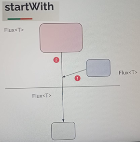
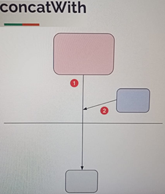
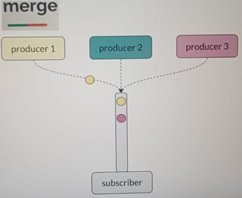
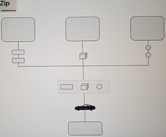
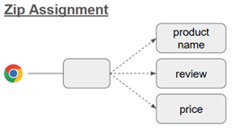
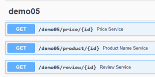
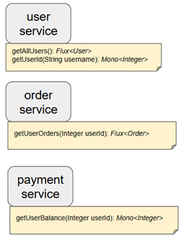

# Sección 9: Combinando Publicadores

---

## Introducción

La `Programación Reactiva` en Java implica trabajar con flujos de datos de forma asíncrona. A menudo, es necesario
combinar datos de múltiples fuentes o `publishers` para lograr el resultado deseado. Comprender cómo integrar estos
`publishers` eficientemente puede mejorar la flexibilidad y la escalabilidad de la aplicación.

Exploremos los operadores utilizados para combinar `publishers`, sus casos de uso y ejemplos.

- startWith
- concat
- merge
- zip
- flatMap
- concatMap

## StartWith

El operador `startWith` permite anteponer uno o más elementos o incluso otro `Publisher` al inicio de un flujo (`Flux`
o `Mono`). Es útil cuando queremos que el flujo comience con ciertos valores antes de emitir los elementos principales
provenientes de otra fuente.

Imaginemos que tenemos dos `Publisher`, ambos emiten elementos del mismo tipo `T` (por ejemplo, un `Flux<Integer>`, un
`Flux<Client>,` etc.). Al usar el operador `startWith`, podemos combinar estos dos `publishers` en un único flujo
reactivo, de modo que, desde la perspectiva del `Subscriber`, parecerá que se ha suscrito a un solo `Publisher<T>`.

El comportamiento clave de `startWith` es que los elementos pasados como argumento (ya sean valores individuales o un
`Publisher`) `se emitirán antes` que los elementos `del flujo original`.

El operador `startWith` se utiliza para anteponer elementos al inicio de una secuencia. Esto resulta útil cuando
se desea garantizar que algunos `datos iniciales se emitan antes del flujo de datos principal`.



### Ejemplo conceptual

Imagine que tiene un flujo de lecturas de temperatura diarias, pero desea anteponer un mensaje de
`Inicio de lecturas de temperatura` al flujo:

````java
public static void main(String[] args) {
    Flux<String> flujoPrincipal = Flux.just("28°C", "30°C", "31°C");
    Flux<String> flujoFinal = flujoPrincipal.startWith("Temperature Readings Start");

    flujoFinal.subscribe(System.out::println);
}
````

La salida sería.

````bash
Temperature Readings Start
28°C
30°C
31°C
````

### Consideraciones

- `startWith` no es un operador de fallback (es decir, no entra en acción cuando el primer flujo no tiene suficientes
  elementos, como podría malinterpretarse).
- Su función principal es `anteponer datos`, no completarlos.
- Si necesitas manejar situaciones donde el primer `Publisher` no emite suficientes elementos, deberías considerar
  operadores como `concatWith`, `switchIfEmpty`, etc.

### Ejemplo

Veamos un ejemplo práctico del operador `startWith`:

````java
public class Lec01StartWith {

    private static final Logger log = LoggerFactory.getLogger(Lec01StartWith.class);

    public static void main(String[] args) {
        producer1()
                .startWith(0, 1, 2, 3)
                .subscribe(Util.subscriber());

        Util.sleepSeconds(3);
    }

    private static Flux<Integer> producer1() {
        return Flux.just(4, 5, 6)
                .doOnSubscribe(subscription -> log.info("Subscribiendo al producer1"))
                .delayElements(Duration.ofMillis(10));
    }
}
````

### Explicación

1. Se define un `Flux<Integer>` en el método `producer1()` que emite los valores `4, 5 y 6`.
2. Luego, usamos el operador `.startWith(0, 1, 2, 3)` para anteponer los valores `0, 1, 2, y 3` al inicio del flujo.
3. El `Subscriber` recibirá todos los elementos en el siguiente orden: `0, 1, 2, 3, 4, 5, 6`.

El operador `doOnSubscribe` se ejecuta cuando se produce la suscripción al `Flux original (producer1())`, lo cual
ocurre después de que se emiten los elementos pasados a `startWith`.

````bash
12:28:13.911 INFO  [           main] d.m.a.common.DefaultSubscriber :  recibido: 0
12:28:13.913 INFO  [           main] d.m.a.common.DefaultSubscriber :  recibido: 1
12:28:13.913 INFO  [           main] d.m.a.common.DefaultSubscriber :  recibido: 2
12:28:13.913 INFO  [           main] d.m.a.common.DefaultSubscriber :  recibido: 3
12:28:13.915 INFO  [           main] d.m.app.sec09.Lec01StartWith   : Subscribiendo al producer1
12:28:13.939 INFO  [     parallel-1] d.m.a.common.DefaultSubscriber :  recibido: 4
12:28:13.954 INFO  [     parallel-2] d.m.a.common.DefaultSubscriber :  recibido: 5
12:28:13.970 INFO  [     parallel-3] d.m.a.common.DefaultSubscriber :  recibido: 6
12:28:13.972 INFO  [     parallel-3] d.m.a.common.DefaultSubscriber :  ¡completado!
````

### Observaciones

- El `startWith` emite sus valores antes de que se realice la suscripción al `Flux original`.
- La línea `Subscribiendo al producer1` aparece después de la emisión de `0 a 3`, lo que demuestra que el `producer1()`
  aún no había comenzado a emitir.
- Los elementos 4, 5, y 6 son emitidos con un pequeño retardo simulado, cada uno en un hilo diferente del Scheduler por
  defecto (debido al delayElements).

## StartWith - Casos de uso

En aplicaciones reales, es común realizar cálculos costosos que deseamos evitar repetir constantemente. Para mejorar el
rendimiento, almacenamos los resultados en caché y los reutilizamos cuando sea posible. En este tipo de escenarios, el
operador `startWith` resulta útil para emitir primero los valores almacenados en caché antes de realizar cálculos
adicionales o acceder a una fuente de datos más costosa.

> ⚠️ En este ejemplo usamos una lista local como caché, pero en una aplicación real, una tecnología como `Redis` sería
> una mejor opción para gestionar caché de forma eficiente.

### Ejemplo: Generador de nombres con caché

````java
public class NameGenerator {

    private static final Logger log = LoggerFactory.getLogger(NameGenerator.class);
    private final List<String> redis = new ArrayList<>();

    public Flux<String> generateNames() {
        return Flux.generate(synchronousSink -> {
                    log.info("generando nombre");
                    Util.sleepSeconds(1);

                    String name = Util.faker().name().firstName();
                    this.redis.add("[caché] " + name);
                    synchronousSink.next(name);
                })
                .startWith(this.redis)
                .cast(String.class);
    }
}
````

La clase `NameGenerator` simula un flujo que genera nombres aleatorios usando `Flux.generate()`. Cada vez que se genera
un nuevo nombre, se agrega a una lista que actúa como `caché simulada` (`redis`).

El punto clave está en esta línea: `.startWith(this.redis)`.

Con `startWith`, antes de emitir los nuevos nombres generados, el `Flux` primero emite los valores que ya están en
caché (es decir, los elementos de la lista redis). Esto permite que los suscriptores reciban primero los datos
almacenados, y luego los nuevos si son necesarios.

> 💡 `Ventaja`: cuando un nuevo suscriptor se conecta, puede acceder rápidamente a datos previos sin esperar a que se
> generen de nuevo, lo cual simula el comportamiento típico de una caché.

````java
public class Lec02StartWithUseCase {

    private static final Logger log = LoggerFactory.getLogger(Lec02StartWithUseCase.class);

    public static void main(String[] args) {
        NameGenerator nameGenerator = new NameGenerator();

        nameGenerator.generateNames()
                .take(2)
                .subscribe(Util.subscriber("sam"));

        nameGenerator.generateNames()
                .take(2)
                .subscribe(Util.subscriber("mike"));

        nameGenerator.generateNames()
                .take(3)
                .subscribe(Util.subscriber("jake"));
    }
}
````

1. En la primera llamada (`sam`), no hay elementos en caché, por lo tanto, se generan nuevos nombres y se agregan a la
   lista `redis`.
2. En la segunda llamada (`mike`), el operador `startWith` emite primero los nombres almacenados en caché.
3. En la tercera llamada (`jake`), se emiten primero los datos en caché y luego se genera un nuevo nombre adicional.

Este patrón es útil cuando deseamos `precargar datos almacenados` antes de acceder a una fuente dinámica o costosa.

````bash
13:08:52.450 INFO  [           main] d.m.a.s.helper.NameGenerator   : generando nombre
13:08:53.581 INFO  [           main] d.m.a.common.DefaultSubscriber : sam recibido: Sun
13:08:53.581 INFO  [           main] d.m.a.s.helper.NameGenerator   : generando nombre
13:08:54.585 INFO  [           main] d.m.a.common.DefaultSubscriber : sam recibido: Bert
13:08:54.585 INFO  [           main] d.m.a.common.DefaultSubscriber : sam ¡completado!

13:08:54.585 INFO  [           main] d.m.a.common.DefaultSubscriber : mike recibido: [caché] Sun
13:08:54.585 INFO  [           main] d.m.a.common.DefaultSubscriber : mike recibido: [caché] Bert
13:08:54.585 INFO  [           main] d.m.a.common.DefaultSubscriber : mike ¡completado!

13:08:54.585 INFO  [           main] d.m.a.common.DefaultSubscriber : jake recibido: [caché] Sun
13:08:54.585 INFO  [           main] d.m.a.common.DefaultSubscriber : jake recibido: [caché] Bert
13:08:54.585 INFO  [           main] d.m.a.s.helper.NameGenerator   : generando nombre
13:08:55.595 INFO  [           main] d.m.a.common.DefaultSubscriber : jake recibido: Joel
13:08:55.595 INFO  [           main] d.m.a.common.DefaultSubscriber : jake ¡completado!
````

## ConcatWith

El operador `concatWith` funciona como el opuesto del operador `startWith`. Su comportamiento consiste en emitir primero
todos los elementos del `publisher original`, y una vez que este se completa, pasa a emitir los elementos del
`publisher que se le concatena`.

Esto significa que `concatWith` `combina dos publishers de forma secuencial`, respetando el orden de emisión:
primero uno, luego el otro. Es importante destacar que el segundo publisher no se suscribirá hasta que el primero
haya enviado la señal de `completado`. Esto garantiza un flujo de datos estrictamente ordenado.

> 📌 Este comportamiento es útil cuando queremos asegurar que los elementos de un flujo se procesen completamente antes
> de continuar con otro conjunto de datos.



### Ejemplo 1

En este ejemplo se usa el método `.concatWithValues(...)`, que permite concatenar un `Flux` con valores individuales
directamente.

````java
public class Lec03ConcatWith {

    private static final Logger log = LoggerFactory.getLogger(Lec03ConcatWith.class);

    public static void main(String[] args) {
        demo1();
        Util.sleepSeconds(3);
    }

    private static void demo1() {
        producer1()
                .concatWithValues(6, 8, 10)
                .subscribe(Util.subscriber());
    }

    private static Flux<Integer> producer1() {
        return Flux.just(1, 2, 3)
                .doOnSubscribe(subscription -> log.info("Subscribiendo al producer1"))
                .delayElements(Duration.ofMillis(10));
    }
}
````

Como se observa en la salida, primero se emiten los elementos del `producer1()`, y una vez que este flujo se completa,
se emiten los valores adicionales definidos en `.concatWithValues(6, 8, 10)`.

````bash
15:28:20.442 INFO  [           main] d.m.app.sec09.Lec03ConcatWith  : Subscribiendo al producer1
15:28:20.467 INFO  [     parallel-1] d.m.a.common.DefaultSubscriber :  recibido: 1
15:28:20.483 INFO  [     parallel-2] d.m.a.common.DefaultSubscriber :  recibido: 2
15:28:20.499 INFO  [     parallel-3] d.m.a.common.DefaultSubscriber :  recibido: 3
15:28:20.499 INFO  [     parallel-3] d.m.a.common.DefaultSubscriber :  recibido: 6
15:28:20.499 INFO  [     parallel-3] d.m.a.common.DefaultSubscriber :  recibido: 8
15:28:20.499 INFO  [     parallel-3] d.m.a.common.DefaultSubscriber :  recibido: 10
15:28:20.502 INFO  [     parallel-3] d.m.a.common.DefaultSubscriber :  ¡completado!
````

### Ejemplo 2

En este segundo ejemplo usamos el operador `concatWith(...)` para concatenar un `Flux` con otro `Flux`, es decir,
dos publishers completos. A diferencia del primer ejemplo donde se usaban valores individuales, aquí ambos flujos
tienen su propia lógica de producción y suscripciones.

````java
public class Lec03ConcatWith {

    private static final Logger log = LoggerFactory.getLogger(Lec03ConcatWith.class);

    public static void main(String[] args) {
        demo2();
        Util.sleepSeconds(3);
    }

    private static void demo2() {
        producer1()
                .concatWith(producer2())
                .subscribe(Util.subscriber());
    }

    private static Flux<Integer> producer1() {
        return Flux.just(1, 2, 3)
                .doOnSubscribe(subscription -> log.info("Subscribiendo al producer1"))
                .delayElements(Duration.ofMillis(10));
    }

    private static Flux<Integer> producer2() {
        return Flux.just(40, 50, 60)
                .doOnSubscribe(subscription -> log.info("Subscribiendo al producer2"))
                .delayElements(Duration.ofMillis(10));
    }
}
````

La clave del comportamiento está en que `concatWith` espera a que el primer flujo (`producer1`) se complete antes de
suscribirse al segundo (`producer2`). Esto garantiza que los datos se emitan en el orden correcto sin entrelazarse,
incluso si ambos flujos introducen demoras (`delayElements`).

````bash
15:30:39.925 INFO  [           main] d.m.app.sec09.Lec03ConcatWith  : Subscribiendo al producer1
15:30:39.948 INFO  [     parallel-1] d.m.a.common.DefaultSubscriber :  recibido: 1
15:30:39.964 INFO  [     parallel-2] d.m.a.common.DefaultSubscriber :  recibido: 2
15:30:39.980 INFO  [     parallel-3] d.m.a.common.DefaultSubscriber :  recibido: 3
15:30:39.980 INFO  [     parallel-3] d.m.app.sec09.Lec03ConcatWith  : Subscribiendo al producer2
15:30:39.995 INFO  [     parallel-4] d.m.a.common.DefaultSubscriber :  recibido: 40
15:30:40.011 INFO  [     parallel-5] d.m.a.common.DefaultSubscriber :  recibido: 50
15:30:40.026 INFO  [     parallel-6] d.m.a.common.DefaultSubscriber :  recibido: 60
15:30:40.029 INFO  [     parallel-6] d.m.a.common.DefaultSubscriber :  ¡completado!
````

### Ejemplo 3

En este ejemplo se usa el operador de fábrica `Flux.concat(...)` para concatenar dos publishers, estos se ejecutarán
de manera secuencial, tal cual fueron definidos. En nuestro ejemplo, primero se emitirán los elementos del `producer1()`
y a continuación los elementos del `producer2()`.

````java
public class Lec03ConcatWith {

    private static final Logger log = LoggerFactory.getLogger(Lec03ConcatWith.class);

    public static void main(String[] args) {
        demo3();
        Util.sleepSeconds(3);
    }

    private static void demo3() {
        Flux.concat(producer1(), producer2())
                .subscribe(Util.subscriber());
    }

    private static Flux<Integer> producer1() {
        return Flux.just(1, 2, 3)
                .doOnSubscribe(subscription -> log.info("Subscribiendo al producer1"))
                .delayElements(Duration.ofMillis(10));
    }

    private static Flux<Integer> producer2() {
        return Flux.just(40, 50, 60)
                .doOnSubscribe(subscription -> log.info("Subscribiendo al producer2"))
                .delayElements(Duration.ofMillis(10));
    }
}

````

El resultado es similar a lo que hemos visto anteriormente.

````bash
15:33:01.034 INFO  [           main] d.m.app.sec09.Lec03ConcatWith  : Subscribiendo al producer1
15:33:01.066 INFO  [     parallel-1] d.m.a.common.DefaultSubscriber :  recibido: 1
15:33:01.081 INFO  [     parallel-2] d.m.a.common.DefaultSubscriber :  recibido: 2
15:33:01.097 INFO  [     parallel-3] d.m.a.common.DefaultSubscriber :  recibido: 3
15:33:01.097 INFO  [     parallel-3] d.m.app.sec09.Lec03ConcatWith  : Subscribiendo al producer2
15:33:01.113 INFO  [     parallel-4] d.m.a.common.DefaultSubscriber :  recibido: 40
15:33:01.129 INFO  [     parallel-5] d.m.a.common.DefaultSubscriber :  recibido: 50
15:33:01.144 INFO  [     parallel-6] d.m.a.common.DefaultSubscriber :  recibido: 60
15:33:01.147 INFO  [     parallel-6] d.m.a.common.DefaultSubscriber :  ¡completado!
````

> 💡 Todos estos enfoques garantizan un flujo ordenado, en el cual no se mezcla la emisión de elementos de los
> publishers involucrados.

Esto es útil cuando:

- Necesitas mantener un orden específico en la emisión.
- El segundo flujo depende de la finalización del primero.
- Estás combinando datos que deben procesarse en secuencia, como pasos en un pipeline.

## ConcatDelayError

El operador `concatDelayError` es similar a `concatWith` o `Flux.concat`, con una diferencia clave: *retrasa la emisión
de errores hasta que todos los publishers hayan sido procesados.* Es útil cuando se desea garantizar que todos los
flujos de datos sean evaluados, incluso si uno o más fallan.

````java
public class Lec04ConcatDelayError {

    private static final Logger log = LoggerFactory.getLogger(Lec04ConcatDelayError.class);

    public static void main(String[] args) {
        demo1();
        Util.sleepSeconds(3);
    }

    private static void demo1() {
        Flux.concatDelayError(producer1(), producer3(), producer2())
                .subscribe(Util.subscriber());

    }

    private static Flux<Integer> producer1() {
        return Flux.just(1, 2, 3)
                .doOnSubscribe(subscription -> log.info("Subscribiendo al producer1"))
                .delayElements(Duration.ofMillis(10));
    }

    private static Flux<Integer> producer2() {
        return Flux.just(40, 50, 60)
                .doOnSubscribe(subscription -> log.info("Subscribiendo al producer2"))
                .delayElements(Duration.ofMillis(10));
    }

    private static Flux<Integer> producer3() {
        return Flux.error(new RuntimeException("Error en el producer3"));
    }
}
````

Aunque el error se produce en `producer3()`, su emisión se retrasa hasta que los demás publishers (`producer1()` y
`producer2()`) hayan completado su flujo. Solo entonces se lanza el error al suscriptor.

````bash
16:22:51.367 INFO  [           main] d.m.a.s.Lec04ConcatDelayError  : Subscribiendo al producer1
16:22:51.398 INFO  [     parallel-1] d.m.a.common.DefaultSubscriber :  recibido: 1
16:22:51.414 INFO  [     parallel-2] d.m.a.common.DefaultSubscriber :  recibido: 2
16:22:51.430 INFO  [     parallel-3] d.m.a.common.DefaultSubscriber :  recibido: 3
16:22:51.433 INFO  [     parallel-3] d.m.a.s.Lec04ConcatDelayError  : Subscribiendo al producer2
16:22:51.446 INFO  [     parallel-4] d.m.a.common.DefaultSubscriber :  recibido: 40
16:22:51.462 INFO  [     parallel-5] d.m.a.common.DefaultSubscriber :  recibido: 50
16:22:51.478 INFO  [     parallel-6] d.m.a.common.DefaultSubscriber :  recibido: 60
16:22:51.478 ERROR [     parallel-6] d.m.a.common.DefaultSubscriber :  error: Error en el producer3
````

## Merge

El operador `merge` combina múltiples `publishers` en un único flujo (`Flux`), emitiendo los elementos a medida que son
producidos. Esto permite el procesamiento en paralelo de los datos emitidos por cada `publisher`.

Imaginemos que tenemos tres productores: `producer1`, `producer2` y `producer3`. En lugar de que el `subscriber` se
suscriba a cada uno por separado, podemos utilizar `merge` para fusionarlos en un solo `publisher`. Así, el `subscriber`
se suscribe a todos los productores al mismo tiempo, como si fueran uno solo.

El orden en que los elementos se emiten dependerá del momento en que cada productor los genere. Por ejemplo, si
`producer3` emite un valor antes que los demás, ese será el primer valor recibido por el `subscriber`. Luego, si
`producer1` emite otro valor, este será el siguiente en ser procesado, y así sucesivamente.

> En resumen: `no hay un orden garantizado`. Dado que todos los publishers están activos simultáneamente, el orden de
> los elementos será el que resulte del momento en que se produzcan. Además, si se cancela la suscripción, se cancelan
> todos los publishers de manera conjunta.



En el siguiente ejemplo usamos `Flux.merge(...)` para fusionar los tres `publishers`. Es importante notar que el orden
en que se pasan como parámetros (`Flux.merge(producer1(), producer2(), producer3())`) no influye en el orden de emisión,
ya que todos se suscriben simultáneamente:

````java

public class Lec05Merge {

    private static final Logger log = LoggerFactory.getLogger(Lec05Merge.class);

    public static void main(String[] args) {
        Flux.merge(producer1(), producer2(), producer3())
                .subscribe(Util.subscriber());

        Util.sleepSeconds(3);
    }

    private static Flux<Integer> producer1() {
        return Flux.just(1, 2, 3)
                .doOnSubscribe(subscription -> log.info("Subscribiendo al producer1"))
                .delayElements(Duration.ofMillis(10));
    }

    private static Flux<Integer> producer2() {
        return Flux.just(40, 50, 60)
                .doOnSubscribe(subscription -> log.info("Subscribiendo al producer2"))
                .delayElements(Duration.ofMillis(10));
    }

    private static Flux<Integer> producer3() {
        return Flux.just(100, 101, 102)
                .doOnSubscribe(subscription -> log.info("Subscribiendo al producer3"))
                .delayElements(Duration.ofMillis(10));
    }
}
````

Si ejecutamos la aplicación vemos cómo el subscriber está recibiendo los valores sin un orden en específico.

````bash
20:54:33.736 INFO  [           main] d.m.app.sec09.Lec05Merge       : Subscribiendo al producer1
20:54:33.742 INFO  [           main] d.m.app.sec09.Lec05Merge       : Subscribiendo al producer2
20:54:33.742 INFO  [           main] d.m.app.sec09.Lec05Merge       : Subscribiendo al producer3
20:54:33.761 INFO  [     parallel-1] d.m.a.common.DefaultSubscriber :  recibido: 1
20:54:33.764 INFO  [     parallel-3] d.m.a.common.DefaultSubscriber :  recibido: 40
20:54:33.764 INFO  [     parallel-3] d.m.a.common.DefaultSubscriber :  recibido: 100
20:54:33.776 INFO  [     parallel-5] d.m.a.common.DefaultSubscriber :  recibido: 50
20:54:33.776 INFO  [     parallel-5] d.m.a.common.DefaultSubscriber :  recibido: 2
20:54:33.776 INFO  [     parallel-5] d.m.a.common.DefaultSubscriber :  recibido: 101
20:54:33.792 INFO  [     parallel-1] d.m.a.common.DefaultSubscriber :  recibido: 60
20:54:33.792 INFO  [     parallel-1] d.m.a.common.DefaultSubscriber :  recibido: 3
20:54:33.792 INFO  [     parallel-1] d.m.a.common.DefaultSubscriber :  recibido: 102
20:54:33.795 INFO  [     parallel-1] d.m.a.common.DefaultSubscriber :  ¡completado!
````

Si volvemos a ejecutar la aplicación se puede observar que `el orden de los elementos varía en cada ejecución`,
dependiendo de cómo y cuándo cada productor emite sus elementos.

````bash
20:57:25.747 INFO  [           main] d.m.app.sec09.Lec05Merge       : Subscribiendo al producer1
20:57:25.755 INFO  [           main] d.m.app.sec09.Lec05Merge       : Subscribiendo al producer2
20:57:25.756 INFO  [           main] d.m.app.sec09.Lec05Merge       : Subscribiendo al producer3
20:57:25.777 INFO  [     parallel-3] d.m.a.common.DefaultSubscriber :  recibido: 100
20:57:25.779 INFO  [     parallel-1] d.m.a.common.DefaultSubscriber :  recibido: 1
20:57:25.779 INFO  [     parallel-1] d.m.a.common.DefaultSubscriber :  recibido: 40
20:57:25.792 INFO  [     parallel-5] d.m.a.common.DefaultSubscriber :  recibido: 50
20:57:25.792 INFO  [     parallel-5] d.m.a.common.DefaultSubscriber :  recibido: 2
20:57:25.792 INFO  [     parallel-5] d.m.a.common.DefaultSubscriber :  recibido: 101
20:57:25.808 INFO  [     parallel-7] d.m.a.common.DefaultSubscriber :  recibido: 3
20:57:25.808 INFO  [     parallel-7] d.m.a.common.DefaultSubscriber :  recibido: 60
20:57:25.808 INFO  [     parallel-7] d.m.a.common.DefaultSubscriber :  recibido: 102
20:57:25.810 INFO  [     parallel-7] d.m.a.common.DefaultSubscriber :  ¡completado!
````

### Reutilización de lógica con `UnaryOperator<Flux<T>>` y `transform()`

Antes de continuar con más ejemplos del operador `merge`, vamos a refactorizar el código para evitar repeticiones
innecesarias. Crearemos un método genérico que nos permita aplicar de forma reutilizable operadores como `.doOn...`,
que son útiles para observar el ciclo de vida de un `Flux`.

### ¿Qué es UnaryOperator<Flux<T>>?

`UnaryOperator<Flux<T>>` es una especialización de `Function<T, T>` cuando el tipo de entrada y de salida es el
mismo (en este caso, `Flux<T>`). Representa una operación sobre un único operando que produce un resultado del
mismo tipo. Es una `interfaz funcional` cuyo método principal es `apply(Object)`.

### Implementación del método genérico

En nuestra clase `Util`, ubicada en el paquete `common`, agregamos el siguiente método:

````java
public class Util {
    private static final Logger log = LoggerFactory.getLogger(Util.class);

    /* other code */
    public static <T> UnaryOperator<Flux<T>> fluxLogger(String name) {
        return flux -> flux
                .doOnSubscribe(subscription -> log.info("Subscribiendo al {}", name))
                .doOnCancel(() -> log.info("Cancelando {}", name))
                .doOnComplete(() -> log.info("{} completado", name));
    }
}
````

### Aplicación con transform()

El operador `transform()` nos permite aplicar funciones de transformación a un `Flux`. Si necesitamos aplicar una misma
cadena de operadores en varios lugares, podemos encapsular dicha lógica en una función (como `fluxLogger`) y
reutilizarla fácilmente.

````java
public class Lec05Merge {

    private static final Logger log = LoggerFactory.getLogger(Lec05Merge.class);

    public static void main(String[] args) {
        Flux.merge(producer1(), producer2(), producer3()) // Como nos subscribimos a todos estos publishers al mismo tiempo, el orden en el que se coloca no importa
                .take(2)
                .subscribe(Util.subscriber());

        Util.sleepSeconds(3);
    }

    private static Flux<Integer> producer1() {
        return Flux.just(1, 2, 3)
                .transform(Util.fluxLogger("producer1"))    //<--- Se agregó
                .delayElements(Duration.ofMillis(10));
    }

    private static Flux<Integer> producer2() {
        return Flux.just(40, 50, 60)
                .transform(Util.fluxLogger("producer2"))    //<--- Se agregó
                .delayElements(Duration.ofMillis(10));
    }

    private static Flux<Integer> producer3() {
        return Flux.just(100, 101, 102)
                .transform(Util.fluxLogger("producer3"))    //<--- Se agregó
                .delayElements(Duration.ofMillis(10));
    }
}
````

Como observamos en el resultado, todos los `producers` se han suscrito al mismo tiempo. Luego, el `subscriber` toma
dos elementos y se cancelan los flujos restantes simultáneamente.

````bash
10:55:42.484 INFO  [           main] dev.magadiflo.app.common.Util  : Subscribiendo al producer1
10:55:42.492 INFO  [           main] dev.magadiflo.app.common.Util  : Subscribiendo al producer2
10:55:42.492 INFO  [           main] dev.magadiflo.app.common.Util  : Subscribiendo al producer3
10:55:42.511 INFO  [     parallel-2] d.m.a.common.DefaultSubscriber :  recibido: 40
10:55:42.513 INFO  [     parallel-3] d.m.a.common.DefaultSubscriber :  recibido: 1
10:55:42.516 INFO  [     parallel-3] d.m.a.common.DefaultSubscriber :  ¡completado!
10:55:42.517 INFO  [     parallel-3] dev.magadiflo.app.common.Util  : Cancelando producer1
10:55:42.517 INFO  [     parallel-3] dev.magadiflo.app.common.Util  : Cancelando producer2
10:55:42.517 INFO  [     parallel-3] dev.magadiflo.app.common.Util  : Cancelando producer3
````

> `Nota:` Aquí es importante destacar que la reutilización del código mediante `transform()` está funcionando
> correctamente.

A continuación se muestra otra manera de poder usar el `merge` y es usando el `mergeWith(...)`.

````java

public class Lec05Merge {

    private static final Logger log = LoggerFactory.getLogger(Lec05Merge.class);

    public static void main(String[] args) {
        demo2();
        Util.sleepSeconds(3);
    }

    private static void demo2() {
        producer1()
                .mergeWith(producer2())
                .mergeWith(producer3())
                .take(2)
                .subscribe(Util.subscriber());
    }

    private static Flux<Integer> producer1() {
        return Flux.just(1, 2, 3)
                .transform(Util.fluxLogger("producer1"))
                .delayElements(Duration.ofMillis(10));
    }

    private static Flux<Integer> producer2() {
        return Flux.just(40, 50, 60)
                .transform(Util.fluxLogger("producer2"))
                .delayElements(Duration.ofMillis(10));
    }

    private static Flux<Integer> producer3() {
        return Flux.just(100, 101, 102)
                .transform(Util.fluxLogger("producer3"))
                .delayElements(Duration.ofMillis(10));
    }
}
````

Con el resultado obtenido demostramos que `Flux.merge(...)` y `.mergeWith(...)` logran el mismo comportamiento
de suscripción simultánea a múltiples fuentes, es decir, ambos hacen exactamente lo mismo.

````bash
11:10:37.109 INFO  [           main] dev.magadiflo.app.common.Util  : Subscribiendo al producer1
11:10:37.118 INFO  [           main] dev.magadiflo.app.common.Util  : Subscribiendo al producer2
11:10:37.118 INFO  [           main] dev.magadiflo.app.common.Util  : Subscribiendo al producer3
11:10:37.136 INFO  [     parallel-2] d.m.a.common.DefaultSubscriber :  recibido: 40
11:10:37.139 INFO  [     parallel-3] d.m.a.common.DefaultSubscriber :  recibido: 1
11:10:37.142 INFO  [     parallel-3] d.m.a.common.DefaultSubscriber :  ¡completado!
11:10:37.142 INFO  [     parallel-3] dev.magadiflo.app.common.Util  : Cancelando producer1
11:10:37.142 INFO  [     parallel-3] dev.magadiflo.app.common.Util  : Cancelando producer2
11:10:37.142 INFO  [     parallel-3] dev.magadiflo.app.common.Util  : Cancelando producer3
````

- `.mergeWith()` es útil cuando vamos encadenando productores de manera fluida.
- `Flux.merge(...)` es preferido si ya tenemos todos los flujos disponibles.

## Merge - Casos de uso

El siguiente ejemplo nos permitirá simular una consulta de vuelos en múltiples aerolíneas, donde cada aerolínea responde
de forma asíncrona y en tiempos variables. El uso de `merge` permite `combinar los flujos de datos concurrentes` en una
sola secuencia.

Iniciamos creando el siguiente record.

````java
public record Flight(String airline,
                     Integer price) {
}
````

Ahora creamos las clases que representan clientes para llamar a un servicio remoto. Cada clase (`AmericanAirlines`,
`Emirates`, `Qatar`) emite un flujo de `Flight`, con retrasos simulados para representar la latencia real de llamadas a
servicios externos.

````java
public class AmericanAirlines {
    private static final String AIRLINE = "American Airlines";

    public static Flux<Flight> getFlights() {
        return Flux.range(1, Util.faker().random().nextInt(5, 10))
                .delayElements(Duration.ofMillis(Util.faker().random().nextInt(200, 1200)))
                .map(value -> new Flight(AIRLINE, Util.faker().random().nextInt(300, 1200)))
                .transform(Util.fluxLogger(AIRLINE));
    }
}
````

````java
public class Emirates {
    private static final String AIRLINE = "Emirates";

    public static Flux<Flight> getFlights() {
        return Flux.range(1, Util.faker().random().nextInt(2, 10))
                .delayElements(Duration.ofMillis(Util.faker().random().nextInt(200, 1000)))
                .map(value -> new Flight(AIRLINE, Util.faker().random().nextInt(300, 1000)))
                .transform(Util.fluxLogger(AIRLINE));
    }
}
````

````java
public class Qatar {
    private static final String AIRLINE = "Qatar";

    public static Flux<Flight> getFlights() {
        return Flux.range(1, Util.faker().random().nextInt(3, 5))
                .delayElements(Duration.ofMillis(Util.faker().random().nextInt(300, 800)))
                .map(value -> new Flight(AIRLINE, Util.faker().random().nextInt(400, 900)))
                .transform(Util.fluxLogger(AIRLINE));
    }
}
````

A continuación creamos la clase que hará el merge de las 3 clases cliente anteriores. `Flux.merge(...)` permite que los
elementos se emitan a medida que estén disponibles, sin importar el orden, lo que lo hace ideal para llamadas en
paralelo.

El `take(Duration.ofSeconds(2))` es muy útil cuando no queremos esperar indefinidamente a todos los proveedores, sino
trabajar con la información disponible en un tiempo límite. Este patrón es común en sistemas que deben ofrecer
respuestas rápidas, como sistemas de reservas, agregadores de información, cotizadores, etc.

Una vez alcanzado el límite de tiempo (2 segundos), el `Subscriber` cancela automáticamente los `Publisher` restantes,
lo que es importante para liberar recursos y evitar trabajo innecesario.

````java
public class FlightSearch {
    public static Flux<Flight> getFlights() {
        return Flux.merge(
                AmericanAirlines.getFlights(),
                Emirates.getFlights(),
                Qatar.getFlights()
        ).take(Duration.ofSeconds(2)); // Retransmite valores de este Flujo hasta que transcurra la Duración especificada.
    }
}
````

Finalmente, en la clase principal iniciamos el flujo.

````java
public class Lec06MergeUseCase {
    public static void main(String[] args) {
        FlightSearch.getFlights()
                .subscribe(Util.subscriber());

        Util.sleepSeconds(3);
    }
}
````

El resultado muestra la simulación donde solicitamos información de los vuelos. Esta información nos la retorna dentro
de los 2 segundos establecidos.

````bash
11:44:06.782 INFO  [           main] dev.magadiflo.app.common.Util  : Subscribiendo al American Airlines
11:44:06.786 INFO  [           main] dev.magadiflo.app.common.Util  : Subscribiendo al Emirates
11:44:06.786 INFO  [           main] dev.magadiflo.app.common.Util  : Subscribiendo al Qatar
11:44:07.393 INFO  [     parallel-4] d.m.a.common.DefaultSubscriber :  recibido: Flight[airline=Qatar, price=839]
11:44:07.593 INFO  [     parallel-3] d.m.a.common.DefaultSubscriber :  recibido: Flight[airline=Emirates, price=785]
11:44:07.997 INFO  [     parallel-2] d.m.a.common.DefaultSubscriber :  recibido: Flight[airline=American Airlines, price=525]
11:44:08.028 INFO  [     parallel-5] d.m.a.common.DefaultSubscriber :  recibido: Flight[airline=Qatar, price=562]
11:44:08.400 INFO  [     parallel-6] d.m.a.common.DefaultSubscriber :  recibido: Flight[airline=Emirates, price=372]
11:44:08.632 INFO  [     parallel-8] d.m.a.common.DefaultSubscriber :  recibido: Flight[airline=Qatar, price=850]
11:44:08.632 INFO  [     parallel-8] dev.magadiflo.app.common.Util  : Qatar completado
11:44:08.785 INFO  [     parallel-1] dev.magadiflo.app.common.Util  : Cancelando American Airlines
11:44:08.787 INFO  [     parallel-1] dev.magadiflo.app.common.Util  : Cancelando Emirates
11:44:08.788 INFO  [     parallel-1] d.m.a.common.DefaultSubscriber :  ¡completado!
````

## Zip

El operador `zip` combina elementos de varios `publishers` según su índice. Espera a que todos los `publishers` emitan
un elemento antes de combinarlos en una única salida. En otras palabras, sincroniza las emisiones de los `publishers`
involucrados para producir una nueva emisión conjunta.

### Analogía: Construcción de un carro

Imaginemos una cadena de ensamblaje de carros. Nuestro `subscriber` quiere recibir un carro completo, pero ningún
productor individual lo proporciona por sí solo. En cambio, tenemos:

- `producer1`: emite el armazón del carro.
- `producer2`: emite el motor.
- `producer3`: emite los neumáticos.

Podemos usar `zip` para combinar las emisiones de estos productores. Cuando cada uno haya emitido un elemento, se
ensamblará un carro y se enviará al `subscriber`.



Ahora bien, si los tres `publishers` emiten a velocidades distintas, eso no es problema. `zip` esperará a que todos
hayan emitido un nuevo elemento antes de avanzar. Sin embargo, si alguno de los publishers no emite más elementos, el
flujo se detendrá, ya que no es posible completar la combinación.

En pocas palabras, `zip` funciona bajo el principio de `“todo o nada”`:

> *Un nuevo valor combinado se emitirá solo cuando cada fuente haya emitido su correspondiente valor.*

### Ejemplo práctico

En el siguiente ejemplo, el `subscriber` recibe un carro completo (`Car`) solo cuando los tres `Flux` han emitido un
elemento:

````java
public class Lec07Zip {

    public static void main(String[] args) {
        Flux.zip(getBody(), getEngine(), getTires())
                .map(t -> new Car(t.getT1(), t.getT2(), t.getT3()))
                .subscribe(Util.subscriber());

        Util.sleepSeconds(5);
    }

    private static Flux<String> getBody() {
        return Flux.range(1, 5)
                .map(value -> "body-" + value)
                .delayElements(Duration.ofMillis(100));
    }

    private static Flux<String> getEngine() {
        return Flux.range(1, 3)
                .map(value -> "engine-" + value)
                .delayElements(Duration.ofMillis(200));
    }

    private static Flux<String> getTires() {
        return Flux.range(1, 10)
                .map(value -> "tires-" + value)
                .delayElements(Duration.ofMillis(75));
    }

    record Car(String body, String engine, String tires) {

    }
}
````

### ¿Por qué solo se arman 3 carros?

Porque el `Flux` que representa el motor (`getEngine()`) solo emite `3 elementos`. Aunque los otros dos publishers
tengan más elementos disponibles, `zip` detiene el flujo una vez que uno de ellos se agota.

````bash
13:08:32.882 INFO  [     parallel-2] d.m.a.common.DefaultSubscriber :  recibido: Car[body=body-1, engine=engine-1, tires=tires-1]
13:08:33.100 INFO  [     parallel-8] d.m.a.common.DefaultSubscriber :  recibido: Car[body=body-2, engine=engine-2, tires=tires-2]
13:08:33.301 INFO  [     parallel-5] d.m.a.common.DefaultSubscriber :  recibido: Car[body=body-3, engine=engine-3, tires=tires-3]
13:08:33.309 INFO  [     parallel-5] d.m.a.common.DefaultSubscriber :  ¡completado!
````

### Resumen de características del operador zip:

- ✅ Sincroniza emisiones por posición/index
- ✅ Espera a que todos los publishers involucrados emitan
- ✅ Combina los valores en una única salida (usualmente con `Tuple`, `map()` o una función combinadora)
- ✅ Se completa cuando el primer publisher se agota
- ✅ Es determinista: combina los n primeros valores de todos los publishers

## Zip - Tarea asignada

A diferencia del ejemplo anterior que usamos `Flux.zip()`, en esta tarea usaremos `Mono.zip()` ya que cada
endpoint (`product`, `price`, `review`) retorna un único valor (por producto). `Mono.zip()` permite combinar
múltiples `Mono` en uno solo, lo cual es ideal para realizar peticiones paralelas a múltiples servicios y unificarlas.

> ⚠️ Si uno solo de los `Mono` falla, `Mono.zip()` emitirá un error y no generará el objeto `Product`. En escenarios
> reales, puede ser útil añadir manejo de errores (`onErrorResume`, `retry`, etc.) para mayor resiliencia.

Entonces, lo que haremos en esta tarea será construir la información del producto con base en tres endpoints.



Iniciaremos ejecutando nuestro servicio externo.

````bash
D:\programming\spring\01.udemy\03.vinoth_selvaraj\java-reactive-programming (feature/section-9)
$ java -jar .\servers\external-services.jar
````

Accedemos al servicio externo mediante el navegador `http://localhost:7070/webjars/swagger-ui/index.html`.
Los tres endpoints que usaremos se encuentran en la sección `demo05`.



Creamos el siguiente record que agrupará toda la información del producto.

````java
public record Product(String name,
                      String review,
                      String price) {
}
````

Procedemos a crear la clase que realizará la petición a nuestro servicio externo. Es en esta clase donde hacemos uso
del operador `.zip()`. Este operador también funciona con el publisher `Mono`, así que como máximo podrá emitir un
solo elemento como parte del flujo final.

````java
public class ExternalServiceClient extends AbstractHttpClient {

    private static final Logger log = LoggerFactory.getLogger(ExternalServiceClient.class);

    public Mono<Product> getProduct(int productId) {
        return Mono.zip(
                this.getProductName(productId),
                this.getReview(productId),
                this.getPrice(productId)
        ).map(t -> new Product(t.getT1(), t.getT2(), t.getT3()));
    }

    private Mono<String> getProductName(int productId) {
        return this.remoteService("/demo05/product/" + productId);
    }

    private Mono<String> getReview(int productId) {
        return this.remoteService("/demo05/review/" + productId);
    }

    private Mono<String> getPrice(int productId) {
        return this.remoteService("/demo05/price/" + productId);
    }

    private Mono<String> remoteService(String path) {
        return this.httpClient
                .get()
                .uri(path)
                .responseContent()
                .asString()
                .next();
    }
}
````

Finalmente, en la clase principal `Lec08ZipAssignment` vamos a obtener la información completa de todos los productos
utilizando un for para recorrer los ids de los 10 productos que tenemos en el backend.

````java
public class Lec08ZipAssignment {
    public static void main(String[] args) {
        ExternalServiceClient externalServiceClient = new ExternalServiceClient();

        for (int i = 1; i <= 10; i++) {
            externalServiceClient.getProduct(i)
                    .subscribe(Util.subscriber());
        }

        Util.sleepSeconds(2);
    }
}
````

Si ejecutamos la aplicación, vemos cómo es que obtenemos la información completa del producto que ha sido creado a
partir de la información de tres endpoints.

````bash
16:02:58.497 INFO  [magadiflo-nio-1] d.m.a.common.DefaultSubscriber :  recibido: Product[name=product-1, review=review-1, price=price-1]
16:02:58.513 INFO  [magadiflo-nio-1] d.m.a.common.DefaultSubscriber :  ¡completado!
16:02:58.515 INFO  [magadiflo-nio-1] d.m.a.common.DefaultSubscriber :  recibido: Product[name=product-2, review=review-2, price=price-2]
16:02:58.515 INFO  [magadiflo-nio-1] d.m.a.common.DefaultSubscriber :  ¡completado!
16:02:58.519 INFO  [magadiflo-nio-1] d.m.a.common.DefaultSubscriber :  recibido: Product[name=product-5, review=review-5, price=price-5]
16:02:58.519 INFO  [magadiflo-nio-1] d.m.a.common.DefaultSubscriber :  ¡completado!
16:02:58.520 INFO  [magadiflo-nio-1] d.m.a.common.DefaultSubscriber :  recibido: Product[name=product-3, review=review-3, price=price-3]
16:02:58.520 INFO  [magadiflo-nio-1] d.m.a.common.DefaultSubscriber :  ¡completado!
16:02:58.523 INFO  [magadiflo-nio-1] d.m.a.common.DefaultSubscriber :  recibido: Product[name=product-4, review=review-4, price=price-4]
16:02:58.523 INFO  [magadiflo-nio-1] d.m.a.common.DefaultSubscriber :  ¡completado!
16:02:58.530 INFO  [magadiflo-nio-1] d.m.a.common.DefaultSubscriber :  recibido: Product[name=product-6, review=review-6, price=price-6]
16:02:58.530 INFO  [magadiflo-nio-1] d.m.a.common.DefaultSubscriber :  ¡completado!
16:02:58.536 INFO  [magadiflo-nio-1] d.m.a.common.DefaultSubscriber :  recibido: Product[name=product-7, review=review-7, price=price-7]
16:02:58.536 INFO  [magadiflo-nio-1] d.m.a.common.DefaultSubscriber :  ¡completado!
16:02:58.537 INFO  [magadiflo-nio-1] d.m.a.common.DefaultSubscriber :  recibido: Product[name=product-8, review=review-8, price=price-8]
16:02:58.537 INFO  [magadiflo-nio-1] d.m.a.common.DefaultSubscriber :  ¡completado!
16:02:58.544 INFO  [magadiflo-nio-1] d.m.a.common.DefaultSubscriber :  recibido: Product[name=product-10, review=review-10, price=price-10]
16:02:58.544 INFO  [magadiflo-nio-1] d.m.a.common.DefaultSubscriber :  ¡completado!
16:02:58.547 INFO  [magadiflo-nio-1] d.m.a.common.DefaultSubscriber :  recibido: Product[name=product-9, review=review-9, price=price-9]
16:02:58.547 INFO  [magadiflo-nio-1] d.m.a.common.DefaultSubscriber :  ¡completado!
````

> ✅ Esta tarea es un ejemplo claro de cómo `zip()` nos permite componer objetos complejos a partir de datos
> distribuidos, una necesidad común en arquitecturas basadas en microservicios. También resalta cómo `Reactor` permite
> manejar la asincronía de forma declarativa y legible.

## FlatMap - Introducción

`flatMap` es un operador muy poderoso dentro de la programación reactiva. Su función principal es transformar cada
elemento emitido por un `Publisher` (como `Mono` o `Flux`) en otro `Publisher`, y luego aplanar (`flatten`) todos
esos `Publisher` resultantes en un solo flujo continuo.

Es decir, cuando cada elemento que recibes `desencadena` una nueva operación asíncrona que a su vez devuelve otro
flujo (como una `llamada HTTP` o una `consulta a base de datos`), `flatMap` te permite orquestar esas operaciones sin
anidar suscripciones ni generar flujos dentro de flujos.

### ¿Por qué usar flatMap?

Sirve especialmente cuando:

- Cada elemento del flujo inicial requiere una operación adicional que también es asíncrona.
- Es necesario encadenar servicios (como llamadas a APIs) sin bloquear.
- Se espera más de una respuesta por cada entrada (por ejemplo, un usuario puede tener varios pedidos).

### ¿Qué ocurre con las llamadas secuenciales dependientes?

Imagina que tienes los siguientes microservicios:

1. `Servicio de usuarios`: tiene 2 endpoints:
    - Obtener el ID de usuario a partir del username especificado
    - Obtener todos los usuarios


2. `Servicio de pagos`: tiene 1 endpoint:
    - Obtener el saldo del usuario a partir de su ID especificado


3. `Servicio de pedidos`: tiene 1 endpoint:
    - Obtener los pedidos del usuario a partir de su ID especificado

### Escenario

A partir del username necesitamos obtener los pedidos del usuario.

Aquí es donde `flatMap` resulta esencial: `cada paso depende del resultado anterior y genera una nueva operación
asíncrona`. `flatMap` permite que esa cadena fluya de manera natural y no anidada.

Entonces, en base al escenario descrito vamos a tratar de simular los microservicios siguientes utilizando simplemente
clases con métodos.



### User service

Creamos la clase que simulará nuestro usuario.

````java
public record User(Integer id, String username) {
}
````

Creamos la clase que simulará el microservicio `user-service` definiendo sus dos endpoints.

````java
public class UserService {
    private static final Map<String, Integer> userTable = Map.of(
            "sam", 1,
            "mike", 2,
            "jake", 3
    );

    public static Flux<User> getAllUsers() {
        return Flux.fromIterable(userTable.entrySet())
                .map(entry -> new User(entry.getValue(), entry.getKey()));
    }

    public static Mono<Integer> getUserId(String username) {
        return Mono.fromSupplier(() -> userTable.get(username));
    }
}
````

### Order service

Creamos la clase que simulará nuestro pedido.

````java
public record Order(Integer userId,
                    String productName,
                    Integer price) {
}
````

Creamos la clase que simulará el microservicio `order-service` definiendo su endpoint.

````java
public class OrderService {
    private static final Map<Integer, List<Order>> orderTable = Map.of(
            1, List.of(
                    new Order(1, Util.faker().commerce().productName(), Util.faker().random().nextInt(10, 100)),
                    new Order(1, Util.faker().commerce().productName(), Util.faker().random().nextInt(10, 100))
            ),
            2, List.of(
                    new Order(2, Util.faker().commerce().productName(), Util.faker().random().nextInt(10, 100)),
                    new Order(2, Util.faker().commerce().productName(), Util.faker().random().nextInt(10, 100)),
                    new Order(2, Util.faker().commerce().productName(), Util.faker().random().nextInt(10, 100))
            ),
            3, List.of()
    );

    public static Flux<Order> getUserOrders(Integer userId) {
        return Flux.fromIterable(orderTable.get(userId))
                .delayElements(Duration.ofMillis(500));
    }
}
````

### Payment service

Creamos la clase que simulará el microservicio `payment-service` definiendo su endpoint.

````java
public class PaymentService {
    private static final Map<Integer, Integer> userBalanceTable = Map.of(
            1, 100,
            2, 200,
            3, 300
    );

    public static Mono<Integer> getUserBalance(Integer userId) {
        return Mono.fromSupplier(() -> userBalanceTable.get(userId));
    }
}
````

## Mono - flatMap

El operador `flatMap` se utiliza para transformar un elemento emitido por un `Mono<T>` en otro `Mono<R>`, y luego
aplanar (`flatten`) ese resultado. Esto significa que se toma el valor dentro del `Mono`, se realiza una
transformación asíncrona que también devuelve un `Mono`, y se evita tener un `Mono<Mono<R>>` anidado, gracias a
que `flatMap` lo `aplana` automáticamente a `Mono<R>`.

Este operador es muy útil cuando se necesita encadenar operaciones asíncronas donde cada paso devuelve un `Mono`.

### 📌 ¿Para qué sirve?

Se usa cuando una operación depende del resultado de una anterior y dicha operación también es asíncrona. Es decir:

- Tienes un `Mono<T>` con un valor.
- Quieres usar ese valor para llamar a otro método que retorna un `Mono<R>`.
- Usas `flatMap` para conectar ambos y obtener finalmente un `Mono<R>`.

### 🧪 Ejemplo práctico

En el siguiente código realizamos una cadena de operaciones reactivas no bloqueantes. La idea es:

1. Obtener el ID del usuario a partir del nombre (`sam`) mediante `UserService.getUserId()`, que devuelve un
   `Mono<Integer>`.
2. Con ese ID, obtener el saldo de la cuenta usando PaymentService.getUserBalance(), que también devuelve un
   `Mono<Integer>`.
3. Finalmente, suscribirse al resultado y mostrarlo con `Util.subscriber()`.

````java
// Llamadas de E/S secuenciales sin bloqueo.
// flatMap se utiliza para aplanar el publisher interno o para suscribirse a él.
public class Lec09MonoFlatMap {

    public static void main(String[] args) {
        // Tenemos el username, necesitamos obtener el saldo de la cuenta
        UserService.getUserId("sam")                        //Mono<Integer>
                .flatMap(PaymentService::getUserBalance)    //Mono<Integer>
                .subscribe(Util.subscriber());
    }
}
````

En el código anterior usamos `flatMap` porque `getUserBalance` devuelve un `Mono`, es decir, otro `Publisher`.

- Si usáramos `map`, terminaríamos con un `Mono<Mono<Integer>>`, lo cual no es útil directamente.
- `flatMap` aplana ese resultado para que siga siendo un `Mono<Integer>` en el flujo, lo que permite continuar con el
  encadenamiento reactivo.

````bash
12:52:26.173 INFO  [           main] d.m.a.common.DefaultSubscriber :  recibido: 100
12:52:26.178 INFO  [           main] d.m.a.common.DefaultSubscriber :  ¡completado!
````

## Mono - flatMapMany

El operador `flatMapMany` se utiliza cuando se parte de un `Mono<T>` y se desea transformar ese único elemento `T`
en un `Publisher<R>`, como un `Flux<R>`. Es decir, convierte un único valor (emitido por un `Mono`) en **muchos valores
** (emitidos por un `Flux`), y los "aplana" para emitirlos de forma continua dentro del flujo reactivo.

### 📌 ¿Para qué sirve?

Cuando el resultado de un `Mono` debe utilizarse para obtener una **colección de elementos**, se usa `flatMapMany`.  
Esto es útil, por ejemplo, cuando:

- Tienes un `Mono` con el ID de usuario, y necesitas obtener una lista de pedidos (`Flux<Order>`).
- Tienes un `Mono` con una palabra, y quieres obtener sus caracteres como `Flux<Character>`.

`flatMapMany` es ideal cuando se parte de un solo dato (`Mono`) pero se quiere producir múltiples elementos derivados
(`Flux`), manteniendo la naturaleza reactiva del flujo.

### 🧪 Ejemplo práctico

````java
// Se supone que Mono es 1 item: ¿qué pasa si flatMap devuelve varios items?
public class Lec10MonoFlatMapMany {

    public static void main(String[] args) {
        // Tenemos nombre de usuario, obtenemos todos los pedidos de usuario
        Flux<Order> orders = UserService.getUserId("sam")   //Mono<Integer>
                .flatMapMany(OrderService::getUserOrders);    //Flux<Order>
        orders.subscribe(Util.subscriber());

        Util.sleepSeconds(2);
    }
}
````

En este ejemplo, `UserService.getUserId("sam")` devuelve un `Mono` con el ID del usuario, y luego
`OrderService.getUserOrders(id)` devuelve un `Flux` con sus pedidos. `flatMapMany` se encarga de conectar ambos pasos y
de `aplanar` el resultado para que el `subscribe` pueda recibir directamente los elementos del `Flux` resultante.

La salida muestra cómo se reciben dos elementos (dos pedidos) en momentos distintos, debido al retraso simulado en
`delayElements`.

````bash
17:17:26.936 INFO  [     parallel-1] d.m.a.common.DefaultSubscriber :  recibido: Order[userId=1, productName=Ergonomic Granite Hat, price=73]
17:17:27.489 INFO  [     parallel-2] d.m.a.common.DefaultSubscriber :  recibido: Order[userId=1, productName=Awesome Bronze Shoes, price=97]
17:17:27.489 INFO  [     parallel-2] d.m.a.common.DefaultSubscriber :  ¡completado!
````

### Comparación con flatMap

- `flatMap` se usa cuando se transforma el valor de un `Mono` en otro `Mono`.
- `flatMapMany` se usa cuando se transforma el valor de un `Mono` en un `Publisher`, normalmente un `Flux`.

## Flux - flatMap

Ya hemos trabajado con `flatMap` en `Mono`, donde usamos este operador para transformar el valor contenido en el `Mono`
en otro `Publisher`, como un `Mono` distinto o un `Flux`. El operador `flatMap` también existe en `Flux` y funciona
de manera similar, pero adaptado al hecho de que `Flux` puede emitir múltiples valores.

### ¿Qué hace flatMap en un Flux?

`flatMap` transforma cada elemento emitido por un `Flux` original en un nuevo `Publisher` (normalmente un `Mono` o
`Flux`) y luego `aplana` todos esos `Publishers` en un único `Flux` resultante.

### 🧪 Ejemplo práctico: `Flux.flatMap` con múltiples fuentes

Este ejemplo muestra cómo utilizar `flatMap` para transformar un `Flux<User>` en un `Flux<Order>`, recuperando las
órdenes asociadas a cada usuario de forma `asíncrona` y `no bloqueante`.

````java
public class Lec11FluxFlatMap {

    public static void main(String[] args) {
        // Obtener todas las órdenes desde el servicio de orden
        Flux<Order> orderFlux = UserService.getAllUsers()       //Flux<User>
                .map(User::id)                                  //Flux<Integer>
                .flatMap(OrderService::getUserOrders);          //Flux<Order>
        orderFlux.subscribe(Util.subscriber());

        Util.sleepSeconds(3);
    }
}
````

### Flujo de ejecución

1. `UserService.getAllUsers()` retorna un `Flux<User>` con varios usuarios.
2. `map(User::id)` extrae los `id` de cada usuario, obteniendo un `Flux<Integer>`.
3. `flatMap(OrderService::getUserOrders)` usa el `ID` de usuario para consultar sus órdenes, retornando un
   `Flux<Order>` por cada ID.
4. Todos los `Flux<Order>` individuales se aplanan en un único `Flux<Order>`.
5. Finalmente, los resultados se imprimen con un suscriptor personalizado.

### Salida esperada (Comportamiento concurrente de `flatMap`)

La variabilidad en el orden de los resultados que observamos al usar `flatMap` con `Flux` se debe a su
`naturaleza concurrente`. A diferencia de operadores secuenciales como `concatMap`, `flatMap` ejecuta las
transformaciones de forma `paralela`, lo que significa que:

- Cada flujo interno (por ejemplo, una llamada a `getUserOrders(id)`) se ejecuta sin esperar a que el anterior finalice.
- Las respuestas pueden llegar en diferente orden al que se solicitaron.

Este comportamiento es esperado y deseado cuando se trabaja con operaciones que pueden realizarse en paralelo, como
llamadas a servicios remotos o procesos con distintos tiempos de respuesta. Permite mejorar el rendimiento al
aprovechar múltiples hilos o núcleos de procesamiento.

Por ejemplo, si un usuario tiene un servicio de órdenes más rápido que otro, sus datos llegarán antes, incluso si
no fue el primero en la secuencia original.

````bash
17:52:30.798 INFO  [     parallel-1] d.m.a.common.DefaultSubscriber :  recibido: Order[userId=2, productName=Heavy Duty Wooden Watch, price=12]
17:52:30.837 INFO  [     parallel-1] d.m.a.common.DefaultSubscriber :  recibido: Order[userId=1, productName=Practical Granite Watch, price=57]
17:52:31.307 INFO  [     parallel-3] d.m.a.common.DefaultSubscriber :  recibido: Order[userId=1, productName=Intelligent Silk Bench, price=58]
17:52:31.353 INFO  [     parallel-4] d.m.a.common.DefaultSubscriber :  recibido: Order[userId=2, productName=Aerodynamic Leather Watch, price=79]
17:52:31.864 INFO  [     parallel-5] d.m.a.common.DefaultSubscriber :  recibido: Order[userId=2, productName=Synergistic Wool Chair, price=60]
17:52:31.874 INFO  [     parallel-5] d.m.a.common.DefaultSubscriber :  ¡completado!
````

## FlatMap - Tarea asignada

En la lección `Lec08ZipAssignment`, se usaba un bucle `for` donde se realizaba una suscripción por cada producto. Esto
generaba múltiples flujos y, por lo tanto, múltiples eventos de completado.

Ahora reemplazamos ese enfoque utilizando `flatMap`, lo cual permite procesar todos los elementos de manera concurrente
en un solo flujo reactivo, con una única suscripción y un solo evento de completado.

### Objetivo

- Evitar múltiples suscripciones utilizando `flatMap`.
- Procesar los productos de manera asíncrona y no bloqueante.
- Obtener todos los resultados con una única suscripción y un solo evento de completado.

Para este ejercicio, es importante tener levantado el servicio externo.

````bash
D:\programming\spring\01.udemy\03.vinoth_selvaraj\java-reactive-programming (feature/section-9)
$ java -jar .\servers\external-services.jar
````

En la siguiente clase se muestra la implementación de la tarea asignada.

````java
public class Lec12FluxFlatMapAssignment {

    public static void main(String[] args) {
        ExternalServiceClient externalServiceClient = new ExternalServiceClient();

        Flux.range(1, 10)
                .flatMap(externalServiceClient::getProduct)
                .transform(Util.fluxLogger("assignment"))
                .subscribe(Util.subscriber());

        Util.sleepSeconds(2);
    }
}
````

### Explicación

- `Flux.range(1, 10)` genera una secuencia de números del 1 al 10.
- Por cada número, se invoca `externalServiceClient.getProduct(id)`, que retorna un `Mono<Product>`.
- `flatMap` se encarga de aplanar todos los `Mono<Product>` en un único `Flux<Product>`, permitiendo la ejecución
  concurrente de las llamadas.
- Se realiza una sola suscripción a todo el flujo, y al final se emite un único evento `onComplete`.

A diferencia del enfoque anterior con `for` usado en la lección `Lec08ZipAssignment`, donde cada iteración generaba una
nueva suscripción (y su respectivo `onComplete`), aquí todo ocurre dentro del contexto de una única suscripción.

````bash
10:32:45.627 INFO  [           main] dev.magadiflo.app.common.Util  : Subscribiendo al assignment
10:32:46.888 INFO  [magadiflo-nio-1] d.m.a.common.DefaultSubscriber :  recibido: Product[name=product-1, review=review-1, price=price-1]
10:32:46.907 INFO  [magadiflo-nio-1] d.m.a.common.DefaultSubscriber :  recibido: Product[name=product-2, review=review-2, price=price-2]
10:32:46.911 INFO  [magadiflo-nio-1] d.m.a.common.DefaultSubscriber :  recibido: Product[name=product-4, review=review-4, price=price-4]
10:32:46.913 INFO  [magadiflo-nio-1] d.m.a.common.DefaultSubscriber :  recibido: Product[name=product-3, review=review-3, price=price-3]
10:32:46.918 INFO  [magadiflo-nio-1] d.m.a.common.DefaultSubscriber :  recibido: Product[name=product-7, review=review-7, price=price-7]
10:32:46.919 INFO  [magadiflo-nio-1] d.m.a.common.DefaultSubscriber :  recibido: Product[name=product-5, review=review-5, price=price-5]
10:32:46.921 INFO  [magadiflo-nio-1] d.m.a.common.DefaultSubscriber :  recibido: Product[name=product-6, review=review-6, price=price-6]
10:32:46.926 INFO  [magadiflo-nio-1] d.m.a.common.DefaultSubscriber :  recibido: Product[name=product-8, review=review-8, price=price-8]
10:32:46.934 INFO  [magadiflo-nio-1] d.m.a.common.DefaultSubscriber :  recibido: Product[name=product-10, review=review-10, price=price-10]
10:32:46.936 INFO  [magadiflo-nio-1] d.m.a.common.DefaultSubscriber :  recibido: Product[name=product-9, review=review-9, price=price-9]
10:32:46.937 INFO  [magadiflo-nio-1] dev.magadiflo.app.common.Util  : assignment completado
10:32:46.938 INFO  [magadiflo-nio-1] d.m.a.common.DefaultSubscriber :  ¡completado!
````

Como se puede ver, los productos no necesariamente se reciben en orden, ya que `flatMap` ejecuta cada llamada de manera
concurrente. Esto lo diferencia de operadores como `concatMap`, que respeta el orden de emisión.
