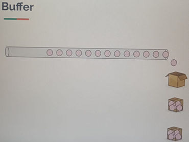
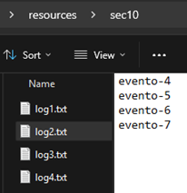
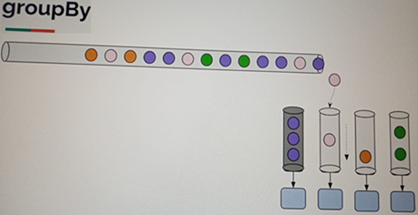

# Sección 10: [Opcional] - Batching / Windowing / Grouping

---

## Introducción

En entornos donde trabajamos con flujos continuos de datos, como los provenientes de sistemas de mensajería (`Kafka`,
`RabbitMQ`, `Pulsar`, etc.), es común encontrarnos con un `Flux<T>`, es decir, un flujo reactivo que emite datos de
forma constante o indefinida.

Para manejar este tipo de flujos de manera eficiente, especialmente cuando queremos agrupar, dividir o procesar
elementos en lotes, `Reactor` nos ofrece una serie de operadores útiles:

- `buffer`: Agrupa elementos emitidos por el flujo en colecciones (listas).
- `window`: Divide el flujo en subflujos (`Flux<Flux<T>>`), cada uno con un conjunto de elementos.
- `groupBy`: Agrupa los elementos del flujo según una clave, generando subflujos por cada grupo.

Estos operadores nos permiten aplicar técnicas como `batching`, `windowing` y `grouping`, fundamentales para procesar
datos de forma eficiente y organizada.

## Buffer

Consideremos un `publisher` que emite ítems a un ritmo muy rápido; por ejemplo, eventos de clic de los usuarios,
visualizaciones de productos, entre otros. Nos interesa saber en qué hacen clic los usuarios, qué productos visitan,
etc. Aunque no lo parezca, esta información es muy valiosa para las empresas, ya que les permite tomar decisiones para
mejorar sus servicios o estrategias de negocio.

Todos estos eventos suelen enviarse a un `topic` en `Kafka`, y desde allí pueden ser procesados por diferentes sistemas.

Ahora bien, supongamos que nuestro objetivo es insertar cada uno de esos eventos en una base de datos. Si los eventos
llegan a una velocidad muy alta, insertar uno por uno no es eficiente ni escalable. En su lugar, lo que podemos hacer
es agrupar esos eventos en lotes (`batching`) basados en un intervalo de tiempo, como por ejemplo cada 5 segundos.

La idea es la siguiente:

- Recolectar todos los eventos emitidos durante un intervalo de 5 segundos.
- Al finalizar el intervalo, agruparlos en una lista.
- Insertar todos los eventos del lote en la base de datos de una sola vez.

Luego, esperamos otros 5 segundos, recolectamos los nuevos eventos, los agrupamos, y repetimos el proceso.

Esta técnica nos permite mejorar la eficiencia y reducir la sobrecarga de operaciones individuales contra la base de
datos.



### Ejemplo 01 - buffer()

Veamos un ejemplo donde se utiliza el operador `buffer()` con su comportamiento por defecto:

````java
// Recopilar items en función del valor interno / tamaño dado
public class Lec01Buffer {
    public static void main(String[] args) {
        demo1();

        Util.sleepSeconds(60);
    }

    private static void demo1() {
        eventStream() //Flux<String>
                .buffer()//Flux<List<String>>: intenta recopilar todos los elementos antes de emitir
                .subscribe(Util.subscriber());
    }

    // Simulando flujo de eventos
    private static Flux<String> eventStream() {
        return Flux.interval(Duration.ofMillis(200))
                .map(value -> "evento-" + (value + 1));
    }
}
````

El operador `buffer()` sin argumentos recopila todos los elementos emitidos por el `Flux` original en una sola lista, y
emite esa lista únicamente cuando el `Flux` fuente se completa.

En este ejemplo, estamos simulando un flujo de eventos continuo (infinito), donde se emite un evento cada 200
milisegundos. Como el `Flux` nunca se completa (es infinito), el `buffer()` nunca emite nada. Por eso, al ejecutar este
código no veremos ninguna salida en la consola, a pesar de que los eventos se están generando.

> 🔍 Importante: `buffer()` sin parámetros no es adecuado para flujos infinitos si esperamos recibir resultados durante
> la ejecución. Para esos casos, se recomienda usar variantes de `buffer` con condiciones de `tiempo` o `cantidad`,
> como `buffer(Duration)` o `buffer(int)`.

### Ejemplo 02 - buffer(int)

Veamos otro ejemplo donde usamos `buffer(int)` para recolectar elementos en grupos de 3:

````java
public class Lec01Buffer {
    public static void main(String[] args) {
        demo2();

        Util.sleepSeconds(60);
    }

    private static void demo2() {
        eventStream()
                .buffer(3)// Agrupa cada 3 elementos emitidos en una lista
                .subscribe(Util.subscriber());
    }

    private static Flux<String> eventStream() {
        return Flux.interval(Duration.ofMillis(200))
                .map(value -> "evento-" + (value + 1));
    }
}
````

En este caso, el operador `buffer(3)` agrupa cada 3 elementos emitidos por el `Flux` fuente en una lista, y luego
emite esa lista como un nuevo ítem en el flujo resultante (`Flux<List<String>>`).

Como resultado, obtendremos salidas similares a las siguientes:

````bash
10:30:05.423 INFO  [     parallel-1] d.m.a.common.DefaultSubscriber :  recibido: [evento-1, evento-2, evento-3]
10:30:06.029 INFO  [     parallel-1] d.m.a.common.DefaultSubscriber :  recibido: [evento-4, evento-5, evento-6]
10:30:06.619 INFO  [     parallel-1] d.m.a.common.DefaultSubscriber :  recibido: [evento-7, evento-8, evento-9]
10:30:07.226 INFO  [     parallel-1] d.m.a.common.DefaultSubscriber :  recibido: [evento-10, evento-11, evento-12]
10:30:07.834 INFO  [     parallel-1] d.m.a.common.DefaultSubscriber :  recibido: [evento-13, evento-14, evento-15]
...
````

Como puedes ver, el `Flux` original emite un evento cada 200 milisegundos, y `buffer(3)` recolecta esos eventos en
bloques de 3 antes de pasarlos al subscriber.

> 📌 `Nota`: Esta forma de `batching` es útil cuando queremos procesar múltiples elementos juntos por cantidad,
> en lugar de tiempo. Es eficiente para reducir la cantidad de operaciones repetitivas, como llamadas a bases de datos
> o servicios externos.

### Ejemplo 03 - buffer(Duration)

Ahora veamos un caso en el que usamos el operador `buffer(Duration)` para recolectar elementos en función del tiempo.

````java
public class Lec01Buffer {
    public static void main(String[] args) {
        demo3();

        Util.sleepSeconds(60);
    }

    private static void demo3() {
        eventStream()
                .buffer(Duration.ofMillis(500))//Le decimos que recoja items dentro de 500 milisegundos
                .subscribe(Util.subscriber());
    }

    private static Flux<String> eventStream() {
        return Flux.interval(Duration.ofMillis(200))
                .map(value -> "evento-" + (value + 1));
    }
}
````

En este ejemplo, `buffer(Duration.ofMillis(500))` agrupa todos los elementos que llegan dentro de una ventana de 500
milisegundos. A diferencia de `buffer(int)`, aquí la agrupación se basa en el tiempo y no en la cantidad de elementos.

Esto implica que la cantidad de elementos en cada lista puede variar, dependiendo de cuántos eventos lleguen dentro del
intervalo de 500 ms.

````bash
10:34:59.745 INFO  [     parallel-1] d.m.a.common.DefaultSubscriber :  recibido: [evento-1, evento-2]
10:35:00.237 INFO  [     parallel-1] d.m.a.common.DefaultSubscriber :  recibido: [evento-3, evento-4]
10:35:00.738 INFO  [     parallel-1] d.m.a.common.DefaultSubscriber :  recibido: [evento-5, evento-6, evento-7]
10:35:01.237 INFO  [     parallel-1] d.m.a.common.DefaultSubscriber :  recibido: [evento-8, evento-9]
10:35:01.733 INFO  [     parallel-1] d.m.a.common.DefaultSubscriber :  recibido: [evento-10, evento-11, evento-12]
...
````

> 🧠 `Observación`: Como los eventos se generan cada 200 ms, en teoría podríamos recibir 2 o 3 eventos por cada ventana
> de 500 ms, dependiendo de la alineación temporal entre la generación de eventos y la apertura de cada ventana de
> tiempo.

### Ejemplo 04 - bufferTimeout(int, Duration)

Como último ejemplo, utilizaremos el operador `bufferTimeout(int, Duration)`, el cual permite agrupar elementos según
dos condiciones: un `número máximo de items` o un `tiempo máximo de espera`, lo que ocurra primero.

````java
public class Lec01Buffer {
    public static void main(String[] args) {
        demo4();

        Util.sleepSeconds(60);
    }

    private static void demo4() {
        eventStream()
                .bufferTimeout(3, Duration.ofSeconds(1))// Agrupa cada 3 elementos o espera 1 segundo máximo
                .subscribe(Util.subscriber());
    }

    private static Flux<String> eventStream() {
        return Flux.interval(Duration.ofMillis(200))
                .take(10)                   // Emitimos solo 10 eventos
                .concatWith(Flux.never())   // Evita la finalización del flujo para ver el comportamiento del último buffer
                .map(value -> "evento-" + (value + 1));
    }
}
````

En este ejemplo:

- `bufferTimeout(3, Duration.ofSeconds(1))` intenta recolectar 3 elementos.
- Si no los obtiene en 1 segundo, `emite lo que tenga disponible hasta ese momento`.
- Luego del décimo elemento, no se emiten más valores, ni error, ni evento de finalización (onComplete), ya que usamos
  `Flux.never()` para mantener el flujo `abierto`.

````bash
10:46:52.126 INFO  [     parallel-1] d.m.a.common.DefaultSubscriber :  recibido: [evento-1, evento-2, evento-3]
10:46:52.713 INFO  [     parallel-1] d.m.a.common.DefaultSubscriber :  recibido: [evento-4, evento-5, evento-6]
10:46:53.321 INFO  [     parallel-1] d.m.a.common.DefaultSubscriber :  recibido: [evento-7, evento-8, evento-9]
10:46:54.528 INFO  [     parallel-2] d.m.a.common.DefaultSubscriber :  recibido: [evento-10]
````

> 🧠 `Observación`: Si hubiéramos utilizado solo `buffer(3)`, el último elemento (`evento-10`) no se habría emitido, ya
> que el operador esperaría por dos elementos más para completar el grupo. Con `bufferTimeout`, logramos emitir incluso
> los grupos incompletos tras un tiempo límite.

## Buffer - Tarea asignada

### 🎯 Objetivo

Emitir un reporte cada 5 segundos con los ingresos generados por órdenes de libros pertenecientes a los géneros:

- Science fiction
- Fantasy
- Suspense/Thriller

### 🧱 Estructura del código

1. 📘`BookOrder`, modelo de orden de libro. Se define un record llamado `BookOrder` con los campos `genre`, `title` y
   `price`. El método estático `create()` genera una instancia con valores aleatorios usando la librería `faker()`.

````java
public record BookOrder(String genre, String title, Integer price) {
    public static BookOrder create() {
        return new BookOrder(
                Util.faker().book().genre(),
                Util.faker().book().title(),
                Util.faker().random().nextInt(10, 100)
        );
    }
}
````

2. 📊`RevenueReport`, modelo del reporte generado. Este record representa el reporte de ingresos por género, acompañado
   de la hora de generación.

````java
// Reporte de ingresos
public record RevenueReport(LocalTime time,
                            Map<String, Integer> revenue) {
}
````

3. 🧪`Lógica principal en Lec02BufferAssignment`, aquí se genera un flujo continuo de órdenes de libros cada 200ms. Se
   aplican los siguientes pasos:
    - Filtrar las órdenes por las categorías requeridas.
    - Agrupar cada 5 segundos usando `buffer(Duration.ofSeconds(5))`.
    - Procesar el listado acumulado con el método `generateReport`.
    - Emitir el reporte usando `subscribe`.

````java
public class Lec02BufferAssignment {

    public static void main(String[] args) {
        Set<String> allowedCategories = Set.of("Science fiction", "Fantasy", "Suspense/Thriller");
        orderStream()
                .filter(bookOrder -> allowedCategories.contains(bookOrder.genre()))
                .buffer(Duration.ofSeconds(5))
                .map(Lec02BufferAssignment::generateReport)
                .subscribe(Util.subscriber());

        Util.sleepSeconds(60);
    }

    private static Flux<BookOrder> orderStream() {
        return Flux.interval(Duration.ofMillis(200))
                .map(value -> BookOrder.create());
    }

    private static RevenueReport generateReport(List<BookOrder> bookOrders) {
        Map<String, Integer> revenue = bookOrders.stream()
                .collect(Collectors.groupingBy(
                        BookOrder::genre,
                        Collectors.summingInt(BookOrder::price)
                ));
        return new RevenueReport(LocalTime.now().truncatedTo(ChronoUnit.SECONDS), revenue);
    }
}
````

Cada 5 segundos se imprime un reporte de ingresos por género, como se muestra a continuación.

````bash
12:08:34.905 INFO  [     parallel-1] d.m.a.common.DefaultSubscriber :  recibido: RevenueReport[time=12:08:34, revenue={Science fiction=47, Fantasy=96, Suspense/Thriller=83}]
12:08:39.911 INFO  [     parallel-1] d.m.a.common.DefaultSubscriber :  recibido: RevenueReport[time=12:08:39, revenue={Fantasy=48}]
12:08:44.909 INFO  [     parallel-1] d.m.a.common.DefaultSubscriber :  recibido: RevenueReport[time=12:08:44, revenue={Science fiction=160, Fantasy=48}]
12:08:49.907 INFO  [     parallel-1] d.m.a.common.DefaultSubscriber :  recibido: RevenueReport[time=12:08:49, revenue={Science fiction=39, Fantasy=25, Suspense/Thriller=138}]
12:08:54.900 INFO  [     parallel-1] d.m.a.common.DefaultSubscriber :  recibido: RevenueReport[time=12:08:54, revenue={Science fiction=151}]
12:08:59.900 INFO  [     parallel-1] d.m.a.common.DefaultSubscriber :  recibido: RevenueReport[time=12:08:59, revenue={Fantasy=45, Suspense/Thriller=60}]
...
````

### ✅ Conclusión

Este ejemplo demuestra cómo usar el operador `buffer(Duration)` para agrupar eventos por intervalos de tiempo,
permitiendo generar reportes periódicos. Es ideal para casos donde no sabemos la cantidad exacta de eventos a recibir,
pero queremos emitir información regularmente (cada N segundos).

## Windowing

El operador `window` en `Project Reactor` funciona de manera similar al operador `buffer`, pero con una diferencia clave
en su comportamiento: `en lugar de recopilar los elementos en una lista y entregarlos al Subscriber`, el operador
`window` crea un nuevo `Flux` (una `sub-secuencia` o `ventana`) para agrupar elementos en función del tiempo o la
cantidad, permitiendo procesarlos a medida que llegan.

### Diferencia entre buffer y window

- `buffer`: Agrupa los elementos recibidos en una lista y entrega esa lista al Subscriber cuando se cumple una
  condición (por cantidad o tiempo). El `Subscriber` recibe la `lista` completa de elementos.


- `window`: Agrupa los elementos en un nuevo `Flux`, el cual contiene los elementos que caen dentro de cierta condición
  (por cantidad o tiempo). El `Subscriber` recibe un `Flux<Flux<T>>`, es decir, un flujo de ventanas, y cada ventana es
  un `Flux` que se puede suscribir y procesar independientemente.

### Analogía para entender window

Imaginemos una aplicación que está escribiendo registros de eventos (logs). En lugar de escribir todos los logs en un
único archivo gigante, lo común es dividir los logs en archivos separados por períodos de tiempo, por ejemplo, uno por
día o por hora.

- Cada archivo de log representa una ventana.
- Todos los eventos que ocurren durante esa ventana de tiempo se escriben directamente en ese archivo (no se acumulan
  primero en memoria como haría buffer).
- Cuando se termina el tiempo asignado a una ventana, se abre una nueva ventana (un nuevo archivo de log), y los eventos
  posteriores van a ese nuevo archivo.

Del mismo modo, en Reactor:

- Cada ventana (`Flux`) se abre bajo una condición (tiempo o cantidad).
- Los elementos se envían en tiempo real a la ventana mientras esta está activa.
- Al terminar la ventana, se cierra y se abre una nueva.


En este gráfico (referencia visual), podemos ver cómo los datos se agrupan en ventanas, no como listas completas, sino
como flujos independientes que pueden procesarse por separado.

## Windowing - window(int)

El operador `window(int)` en `Project Reactor` divide una secuencia de un `Flux<T>` en múltiples ventanas, donde cada
ventana es a su vez un `Flux<T>`. Cada una de estas ventanas emitirá hasta un número máximo de elementos especificado
(en este caso, 5). A diferencia del operador `buffer`, que recolecta los elementos en una lista, `window` conserva el
comportamiento reactivo emitiendo los elementos a medida que llegan, sin agruparlos en una colección.

En este ejemplo, se simula una secuencia de eventos con el método `eventStream()`, que emite un nuevo evento cada 500
milisegundos. Luego, se aplica el operador `window(5)` para dividir el flujo en ventanas de 5 elementos cada una, es
decir, se crea un nuevo `Flux<String>` cada vez que se alcanzan 5 eventos.

Cada una de estas ventanas se pasa al método `processEvents`, que procesa los eventos imprimiendo un asterisco `(*)`
por cada uno. Al completar la ventana, se imprime una nueva línea. El método retorna un `Mono<Void>` que se utiliza con
`flatMap` para suscribirse a cada `sub-flux` de forma no bloqueante.

````java
public class Lec03Window {

    public static void main(String[] args) {
        demo1();
        Util.sleepSeconds(60);
    }

    private static void demo1() {
        eventStream()
                .window(5) // Flux<Flux<String>>, divide el flujo original en ventanas (flux) de 5 elementos
                .flatMap(Lec03Window::processEvents) // Procesa cada ventana    
                .subscribe();
    }

    private static Flux<String> eventStream() {
        return Flux.interval(Duration.ofMillis(500))
                .map(value -> "evento-" + (value + 1));
    }

    private static Mono<Void> processEvents(Flux<String> flux) {
        return flux.doOnNext(value -> System.out.print("*")) // Imprime un * por cada elemento
                .doOnComplete(System.out::println)           // Imprime salto de línea al terminar la ventana
                .then();                                     // Retorna un Mono<Void> para encadenar en flatMap
    }
}
````

En el resultado vemos una manera de evidenciar el trabajo del operador `window`.

````bash
*****
*****
*****
...
````

## Windowing - window(Duration)

A diferencia de `window(int)`, que divide el flujo en ventanas de un número fijo de elementos, el operador
`window(Duration)` divide el `Flux` en ventanas temporales. Cada ventana agrupa los elementos que llegan dentro del
intervalo de tiempo especificado, y luego se cierra automáticamente al terminar ese tiempo, sin importar cuántos
elementos contenga.

En el siguiente ejemplo, se crea un flujo simulado de eventos que emite un elemento cada 500 milisegundos. Luego, se
agrupan estos eventos utilizando `window(Duration.ofMillis(1800))`, lo que significa que cada ventana recogerá
los eventos emitidos en un periodo de 1.8 segundos (1800 milisegundos).

Cada ventana es procesada por el método `processEvents`, el cual imprime un asterisco `*` por cada evento recibido,
y un salto de línea cuando la ventana se completa.

````java
public class Lec03Window {

    public static void main(String[] args) {
        demo2();
        Util.sleepSeconds(60);
    }

    private static void demo2() {
        eventStream()
                .window(Duration.ofMillis(1800))        // Crea una nueva ventana cada 1.8 segundos
                .flatMap(Lec03Window::processEvents)    // Procesa cada ventana
                .subscribe();
    }

    private static Flux<String> eventStream() {
        return Flux.interval(Duration.ofMillis(500))
                .map(value -> "evento-" + (value + 1));
    }

    private static Mono<Void> processEvents(Flux<String> flux) {
        return flux.doOnNext(value -> System.out.print("*"))
                .doOnComplete(System.out::println)
                .then();
    }
}
````

El número de asteriscos por ventana puede variar según el momento en que los eventos caen dentro del intervalo de
tiempo. Por ejemplo, si un evento llega justo al final de una ventana, podría pasar a la siguiente.

````bash
***
****
***
****
***
...
````

## Windowing - Tarea asignada

Aplicar el operador `window(Duration)` para dividir un flujo de eventos en ventanas basadas en tiempo, y guardar
los eventos de cada ventana en archivos de texto separados.

### 🧩 Descripción de la tarea:

Partiendo del ejemplo anterior que utiliza un `Flux<String>` para simular un flujo de eventos (por ejemplo, `evento-1`,
`evento-2`, etc.), deberás hacer lo siguiente:

1. `No modificar el flujo base (eventStream)`, usa el mismo flujo de eventos que emite valores periódicamente (por
   ejemplo, cada 500 ms). Puedes ajustar el intervalo o la duración de la ventana si lo deseas, pero no es necesario.


2. `Aplicar el operador window(Duration)`, divide el flujo en ventanas temporales. Cada ventana contendrá los eventos
   emitidos dentro del intervalo especificado (por ejemplo, cada 1.8 segundos).


3. `Crear un archivo por cada ventana`, por cada ventana que se genere, deberás crear un archivo nuevo en la ruta
   `resources/sec10/`. Los archivos deben tener un nombre secuencial como: `log-1.txt`, `log-2.txt`, `log-3.txt`, etc.


4. `Escribir los eventos en los archivos`, cada evento recibido en una ventana debe escribirse en su respectivo archivo.
   Por ejemplo, si durante la primera ventana se reciben tres eventos, esos tres eventos se escriben en `log-1.txt`.

### ✅ Resultado esperado:

Al ejecutar la aplicación, se crearán múltiples archivos de texto en el directorio `resources/sec10/`, cada uno
representando los eventos capturados durante una ventana específica.

## Windowing - Solución a la tarea asignada

A continuación se muestran las clases realizadas para dar solución a la tarea asignada.

### 📄 Clase: FileWriter

Encapsula la lógica de escritura en archivos de forma imperativa, pero integrada dentro de un flujo reactivo (`Flux`).
Se encarga de crear, escribir y cerrar el archivo de forma controlada durante el procesamiento de cada ventana de
eventos.

Cómo funciona:

- Recibe un `Path` y prepara un `BufferedWriter`.
- Usa el método `write()` para escribir cada línea del `Flux<String>`.
- Llama a `flush()` para forzar la escritura inmediata en disco, sin esperar al `close()`.
- Usa `doFirst()` para crear el archivo antes de que empiece a llegar contenido.
- Usa `doFinally()` para asegurarse de cerrar el archivo al finalizar el procesamiento del `Flux` (ya sea por éxito,
  error o cancelación).

Por qué así:

- Aunque usa APIs bloqueantes (`BufferedWriter`), se encapsulan dentro de operadores reactivos, lo cual permite integrar
  la lógica con Reactor.
- La responsabilidad del archivo está bien encapsulada (`Single Responsibility`), lo que facilita pruebas y
  mantenimiento.
- `flush()` se usa para forzar que los datos almacenados en el búfer se escriban inmediatamente en el archivo, en lugar
  de esperar hasta que se cierre el archivo.

````java
public class FileWriter {

    private static final Logger log = LoggerFactory.getLogger(FileWriter.class);
    private final Path path;
    private BufferedWriter writer;

    private FileWriter(Path path) {
        this.path = path;
    }

    private void createFile() {
        log.info("Creando archivo: {}", this.path.getFileName());
        try {
            this.writer = Files.newBufferedWriter(this.path); // Abre el archivo (crea si no existe) y prepara un BufferedWriter para escribir de forma eficiente
        } catch (IOException e) {
            throw new RuntimeException(e);
        }
    }

    private void closeFile() {
        log.info("Cerrando archivo: {}", this.path.getFileName());
        try {
            this.writer.close();
        } catch (IOException e) {
            throw new RuntimeException(e);
        }
    }

    private void write(String content) {
        log.info("Escribiendo en archivo: {}", this.path.getFileName());
        try {
            this.writer.write(content);
            this.writer.newLine();
            this.writer.flush(); //Fuerza a escribir inmediatamente en el archivo los datos que están en el búfer
        } catch (IOException e) {
            throw new RuntimeException(e);
        }
    }

    public static Mono<Void> create(Flux<String> flux, Path path) {
        log.info("Procesando flux (ventana)");
        FileWriter fileWriter = new FileWriter(path);
        return flux.doOnNext(fileWriter::write)
                .doFirst(fileWriter::createFile)
                .doFinally(signalType -> fileWriter.closeFile())
                .then();
    }
}
````

### 🚀 Clase: Lec04WindowAssignment

Simula un flujo de eventos que llegan cada 500ms, agrupa esos eventos en ventanas de 1.8 segundos, y escribe cada grupo
en un archivo de texto diferente.

Cómo funciona:

- Usa `Flux.interval()` para generar eventos periódicos.
- Usa `window(Duration)` para agrupar los eventos en periodos de tiempo fijos.
- Usa `zipWith(sequential())` para asociar a cada ventana un número secuencial (`log1.txt`, `log2.txt`, ...).
- Para cada ventana, llama al método `FileWriter.create()` que se encarga de escribir en el archivo.

Por qué así:

- La combinación de `window()` y `zipWith()` permite dividir el flujo en segmentos manejables y numerarlos fácilmente.
- Se evita el uso de estructuras temporales intermedias como listas.
- Aunque la escritura en disco es bloqueante, el flujo general sigue siendo reactivo y no bloquea el `main thread`.

````java
public class Lec04WindowAssignment {

    private static final String FILE_NAME_FORMAT = "src/main/resources/sec10/log%d.txt";

    public static void main(String[] args) {
        eventStream()
                .window(Duration.ofMillis(1800))
                .zipWith(sequential())
                .flatMap(tuple -> {
                    Flux<String> window = tuple.getT1();
                    Integer count = tuple.getT2();
                    return FileWriter.create(window, Path.of(FILE_NAME_FORMAT.formatted(count)));
                })
                .subscribe();

        Util.sleepSeconds(60);
    }

    private static Flux<Integer> sequential() {
        return Flux.generate(
                () -> 1,
                (count, synchronousSink) -> {
                    synchronousSink.next(count);
                    return count + 1;
                }
        );
    }

    private static Flux<String> eventStream() {
        return Flux.interval(Duration.ofMillis(500))
                .map(value -> "evento-" + (value + 1));
    }
}
````

Si ejecutamos la aplicación, veremos el siguiente resultado en consola.

````bash
15:38:56.041 INFO  [           main] d.m.a.s.a.window.FileWriter    : Procesando flux (ventana)
15:38:56.046 INFO  [           main] d.m.a.s.a.window.FileWriter    : Creando archivo: log1.txt
15:38:56.524 INFO  [     parallel-2] d.m.a.s.a.window.FileWriter    : Escribiendo en archivo: log1.txt
15:38:57.033 INFO  [     parallel-2] d.m.a.s.a.window.FileWriter    : Escribiendo en archivo: log1.txt
15:38:57.524 INFO  [     parallel-2] d.m.a.s.a.window.FileWriter    : Escribiendo en archivo: log1.txt
15:38:57.840 INFO  [     parallel-1] d.m.a.s.a.window.FileWriter    : Cerrando archivo: log1.txt
15:38:57.840 INFO  [     parallel-1] d.m.a.s.a.window.FileWriter    : Procesando flux (ventana)
15:38:57.840 INFO  [     parallel-1] d.m.a.s.a.window.FileWriter    : Creando archivo: log2.txt
15:38:58.031 INFO  [     parallel-2] d.m.a.s.a.window.FileWriter    : Escribiendo en archivo: log2.txt
15:38:58.527 INFO  [     parallel-2] d.m.a.s.a.window.FileWriter    : Escribiendo en archivo: log2.txt
15:38:59.037 INFO  [     parallel-2] d.m.a.s.a.window.FileWriter    : Escribiendo en archivo: log2.txt
15:38:59.530 INFO  [     parallel-2] d.m.a.s.a.window.FileWriter    : Escribiendo en archivo: log2.txt
15:38:59.625 INFO  [     parallel-1] d.m.a.s.a.window.FileWriter    : Cerrando archivo: log2.txt
15:38:59.625 INFO  [     parallel-1] d.m.a.s.a.window.FileWriter    : Procesando flux (ventana)
15:38:59.625 INFO  [     parallel-1] d.m.a.s.a.window.FileWriter    : Creando archivo: log3.txt
15:39:00.038 INFO  [     parallel-2] d.m.a.s.a.window.FileWriter    : Escribiendo en archivo: log3.txt
15:39:00.533 INFO  [     parallel-2] d.m.a.s.a.window.FileWriter    : Escribiendo en archivo: log3.txt
15:39:01.036 INFO  [     parallel-2] d.m.a.s.a.window.FileWriter    : Escribiendo en archivo: log3.txt
15:39:01.435 INFO  [     parallel-1] d.m.a.s.a.window.FileWriter    : Cerrando archivo: log3.txt
...
````

Como observamos, se están generando los archivos por cada ventana del flujo y dentro de ellos se está escribiendo el
evento generado.



## GroupBy

El operador `groupBy` toma un flujo (`Flux`) de elementos y lo divide en múltiples `sub-flujos` (`Flux internos`),
agrupando los elementos según una clave que se extrae de cada uno de ellos (por ejemplo, `color` o `tipo de pago`).

Supongamos que tenemos un `Publisher` que está emitiendo elementos de forma continua y a gran velocidad. Ahora,
imaginemos que queremos agrupar esos elementos según alguna propiedad específica, como por ejemplo su `color`.
Para lograr esto, usamos el operador `groupBy`.

Este operador nos permite dividir el flujo principal en varios `sub-flujos`, donde cada `sub-flujo` contiene únicamente
los elementos que comparten una misma clave. En este caso, agruparemos por la propiedad `color`.

Visualmente, pensemos en una serie de bolas de diferentes colores que representan nuestros elementos. Si tenemos bolas
de color `naranja`, `rosado`, `morado` y `verde`, entonces `groupBy` creará cuatro flujos diferentes, uno para cada
color. A medida que las bolas vayan llegando, se enviarán automáticamente al flujo correspondiente según su color.

Por ejemplo, si estamos procesando objetos con una propiedad `color`, puedes agruparlos así:

````bash
source.groupBy(item -> item.getColor());
````

Esto generará un `Flux<GroupedFlux<String, Item>>`, con un `sub-flux` por cada color encontrado.

### 🎯 ¿Cuál es la ventaja de agrupar?

Agrupar elementos en varios flujos nos da la posibilidad de procesar cada grupo por separado y con independencia. Esto
es útil porque cada grupo puede requerir un tratamiento diferente. Por ejemplo:

- Las bolas moradas pueden necesitar una transformación especial o validación adicional.
- Las bolas rosadas pueden procesarse de forma más simple, sin pasos extra.

De esta manera, podemos aplicar una lógica diferente a cada tipo de grupo sin afectar el resto.



### 💡 Ejemplo práctico

Supongamos que estamos procesando un flujo de pedidos, y cada pedido tiene un método de pago diferente
(`tarjeta de crédito`, `PayPal`, `criptomonedas`, etc.). Al usar `groupBy`, podemos separar estos pedidos por tipo
de pago y aplicar distintas reglas de negocio según el caso.

### ⚠️ Consideración importante: Cardinalidad

Cuando agrupamos, debemos elegir propiedades que tengan `baja cardinalidad`. Es decir, que no generen demasiados grupos.
Por ejemplo:

- ✅ Agrupar por color: normalmente hay pocos colores.
- ✅ Agrupar por tipo de pago: hay un número limitado de métodos de pago.
- ❌ No agrupar por número de teléfono: genera casi un grupo por cada cliente, lo cual es ineficiente.
- ❌ No agrupar por ID de usuario: puede producir millones de flujos únicos.

> 👉 Agrupar por una propiedad con demasiados valores posibles puede saturar el sistema y dificultar el manejo del
> flujo.

## ✅ En resumen

- `groupBy` divide el flujo principal en varios `sub-flujos` según una clave.
- Cada `sub-flujo` agrupa elementos con la misma clave.
- Permite aplicar lógica personalizada a cada grupo.
- Es importante elegir bien la clave de agrupación para no generar demasiados grupos.

## GroupBy - Demo

### Ejemplo 1 - Agrupar por números pares e impares

En este ejemplo, emitimos una secuencia de números del 1 al 30, con un retraso de 1 segundo entre cada emisión. Luego,
utilizamos el operador `groupBy` para agrupar los números en dos grupos distintos, basados en si el número es `par` o
`impar`.

Para ello, usamos como clave de agrupación la expresión `value % 2`, que siempre devuelve `0 (par)` o `1 (impar)`.

````java
public class Lec05GroupedFlux {
    private static final Logger log = LoggerFactory.getLogger(Lec05GroupedFlux.class);

    public static void main(String[] args) {
        demo1();
        Util.sleepSeconds(35);
    }

    private static void demo1() {
        Flux.range(1, 30)
                .delayElements(Duration.ofSeconds(1))
                .groupBy(value -> value % 2)
                .flatMap(Lec05GroupedFlux::processEvents)
                .subscribe(Util.subscriber());
    }

    private static Mono<Void> processEvents(GroupedFlux<Integer, Integer> groupedFlux) {
        log.info("Flujo recibido para key: {}", groupedFlux.key());
        return groupedFlux
                .doOnNext(value -> log.info("key: {}, value: {}", groupedFlux.key(), value))
                .doOnComplete(() -> log.info("{} completado", groupedFlux.key()))
                .then();
    }
}
````

La función `processEvents` se encarga de procesar cada uno de los grupos generados. Internamente, un
`GroupedFlux<K, T>` actúa como un `Flux<T>` normal, pero contiene una `clave` `K` asociada. Aquí, `K` es el
resultado de `value % 2`.

````bash
17:06:26.267 INFO  [     parallel-1] d.m.app.sec10.Lec05GroupedFlux : Flujo recibido para key: 1
17:06:26.275 INFO  [     parallel-1] d.m.app.sec10.Lec05GroupedFlux : key: 1, value: 1
17:06:27.288 INFO  [     parallel-2] d.m.app.sec10.Lec05GroupedFlux : Flujo recibido para key: 0
17:06:27.288 INFO  [     parallel-2] d.m.app.sec10.Lec05GroupedFlux : key: 0, value: 2
17:06:28.301 INFO  [     parallel-3] d.m.app.sec10.Lec05GroupedFlux : key: 1, value: 3
17:06:29.311 INFO  [     parallel-4] d.m.app.sec10.Lec05GroupedFlux : key: 0, value: 4
...
````

### Ejemplo 2 - Agrupar solo pares

En este ejemplo, emitimos una secuencia de números del 1 al 30, pero antes de llegar al `groupBy`, todos son
transformados en números pares mediante `map(value -> value * 2)`.

Esto garantiza que al aplicar `groupBy(value -> value % 2)`, solo se creará un único grupo con `clave 0`, ya que todos
los valores serán divisibles entre 2 (números pares). Como resultado, nunca se generará un grupo con clave 1 (que
correspondería a números impares).

````java

public class Lec05GroupedFlux {
    private static final Logger log = LoggerFactory.getLogger(Lec05GroupedFlux.class);

    public static void main(String[] args) {
        demo2();
        Util.sleepSeconds(35);
    }

    private static void demo2() {
        Flux.range(1, 30)
                .delayElements(Duration.ofSeconds(1))
                .map(value -> value * 2)
                .groupBy(value -> value % 2)
                .flatMap(Lec05GroupedFlux::processEvents)
                .subscribe(Util.subscriber());
    }

    private static Mono<Void> processEvents(GroupedFlux<Integer, Integer> groupedFlux) {
        log.info("Flujo recibido para key: {}", groupedFlux.key());
        return groupedFlux
                .doOnNext(value -> log.info("key: {}, value: {}", groupedFlux.key(), value))
                .doOnComplete(() -> log.info("{} completado", groupedFlux.key()))
                .then();
    }
}
````

Este enfoque permite observar cómo `groupBy` solo crea grupos cuando se detecta una nueva clave durante la emisión.
Si no hay variedad en la clave, como en este caso, se crea un solo `GroupedFlux`.

````bash
17:12:21.868 INFO  [     parallel-1] d.m.app.sec10.Lec05GroupedFlux : Flujo recibido para key: 0
17:12:21.873 INFO  [     parallel-1] d.m.app.sec10.Lec05GroupedFlux : key: 0, value: 2
17:12:22.879 INFO  [     parallel-2] d.m.app.sec10.Lec05GroupedFlux : key: 0, value: 4
17:12:23.885 INFO  [     parallel-3] d.m.app.sec10.Lec05GroupedFlux : key: 0, value: 6
...
````

### Ejemplo 3 - Agrupar con flujo mixto: un impar seguido de pares

En este ejemplo, emitimos inicialmente un solo número `impar (1)` mediante `startWith(1)`, y luego todos los números
restantes son pares (resultado de `map(value -> value * 2)`).

Al aplicar `groupBy(value -> value % 2)`:

- Se crea un flujo para la `clave 1 (impares)`, con el único valor 1.
- Se crea otro flujo para la `clave 0 (pares`), con los demás valores.

> `Importante`: Aunque solo hay un único valor impar al inicio, el grupo de impares no se cierra inmediatamente. Esto
> ocurre porque el operador `groupBy` mantiene abiertos todos los grupos creados hasta que se complete el flujo
> original.

Por lo tanto, si el flujo fuente sigue abierto (no ha terminado), los grupos individuales tampoco se completan, porque
podrían llegar más elementos con esa clave en el futuro.

````java
public class Lec05GroupedFlux {
    private static final Logger log = LoggerFactory.getLogger(Lec05GroupedFlux.class);

    public static void main(String[] args) {
        demo3();
        Util.sleepSeconds(35);
    }

    private static void demo3() {
        Flux.range(1, 30)
                .delayElements(Duration.ofSeconds(1))
                .map(value -> value * 2)
                .startWith(1)
                .groupBy(value -> value % 2)
                .flatMap(Lec05GroupedFlux::processEvents)
                .subscribe(Util.subscriber());
    }

    private static Mono<Void> processEvents(GroupedFlux<Integer, Integer> groupedFlux) {
        log.info("Flujo recibido para key: {}", groupedFlux.key());
        return groupedFlux
                .doOnNext(value -> log.info("key: {}, value: {}", groupedFlux.key(), value))
                .doOnComplete(() -> log.info("{} completado", groupedFlux.key()))
                .then();
    }
}
````

Con este ejemplo puedes visualizar claramente cómo funciona el mantenimiento y apertura de grupos en `groupBy`, y
por qué la cardinalidad baja es fundamental para evitar problemas de rendimiento o memoria.

````bash
17:18:36.042 INFO  [           main] d.m.app.sec10.Lec05GroupedFlux : Flujo recibido para key: 1
17:18:36.045 INFO  [           main] d.m.app.sec10.Lec05GroupedFlux : key: 1, value: 1
17:18:37.055 INFO  [     parallel-1] d.m.app.sec10.Lec05GroupedFlux : Flujo recibido para key: 0
17:18:37.056 INFO  [     parallel-1] d.m.app.sec10.Lec05GroupedFlux : key: 0, value: 2
17:18:38.066 INFO  [     parallel-2] d.m.app.sec10.Lec05GroupedFlux : key: 0, value: 4
17:18:39.079 INFO  [     parallel-3] d.m.app.sec10.Lec05GroupedFlux : key: 0, value: 6
17:18:40.090 INFO  [     parallel-4] d.m.app.sec10.Lec05GroupedFlux : key: 0, value: 8
...
````

> 🧠 Concepto clave:
>
> Cuando se usa `groupBy`, cada grupo (`GroupedFlux`) permanece abierto hasta que la fuente original complete su
> emisión. Si la fuente es un flujo infinito o de larga duración, los grupos también se mantendrán abiertos.
>
> Por eso, es importante asegurarse de que la clave para agrupar tenga baja cardinalidad (pocos grupos) y que el manejo
> de cada grupo considere que puede permanecer abierto mucho tiempo.
