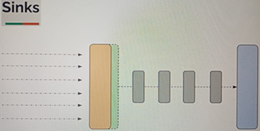
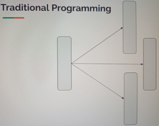
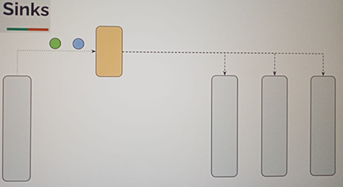

# Sección 12: Sinks

---

## Introducción

Hasta ahora, hemos aprendido a crear `publishers` utilizando varias formas estándar que proporciona `Reactor`, como:

- `Mono.fromSupplier(...)`
- `Flux.range(...)`
- `Flux.generate(...)`
- `Flux.create(...)`
- `Flux.interval(...)`
- ...

Todas estas formas de creación funcionan únicamente cuando hay un `suscriptor` que consume los datos. Es decir, no se
emite nada hasta que alguien se suscriba.

Durante este curso, nos hemos enfocado principalmente en construir `pipelines reactivos` usando diferentes operadores.
Sin embargo, todavía nos falta cubrir un aspecto importante: `la capacidad de emitir datos de manera manual`.

Cuando decimos `emitir manualmente`, nos referimos a poder enviar elementos:

- En cualquier momento.
- Si depender de bucles, rangos o intervalos.
- Sin necesidad inmediata de un suscriptor,
- Con la posibilidad de interactuar con múltiples hilos si lo deseamos.

Aquí es donde entran en escena los `Sinks`.



Los `Sinks` en `Reactor` pueden actuar tanto como `productores` como `consumidores` de datos. Esto significa que se
pueden utilizar para recibir datos (como un `Subscriber`) y también para emitirlos (como un `Publisher`).

Una vez creado un `Sink`, podemos:

- Usarlo para `emitir datos desde un hilo o clase`.
- Permitir que `otro hilo o clase reciba esos datos` mediante suscripción.

Esto resulta útil, por ejemplo, cuando necesitamos comunicar diferentes partes de nuestra aplicación de forma asíncrona
y desacoplada.

Además, los `Sinks` funcionan como puntos de integración ideales. En un enfoque tradicional, una clase suele invocar
directamente los métodos de otra para realizar alguna acción, como:

- Enviar una notificación por correo electrónico,
- Enviar un SMS,
- Registrar una auditoría, etc.



Con `Sinks`, podemos cambiar este enfoque. En lugar de depender de llamadas directas entre clases, una clase simplemente
emite un evento a través del `Sink`, y otras clases que estén suscritas a ese flujo podrán reaccionar automáticamente,
sin necesidad de acoplamiento directo.

Este patrón favorece un diseño más reactivo y desacoplado.



### Ejemplo del mundo real

Imagina un sistema de alarma en una casa inteligente. Cuando se detecta movimiento en una zona restringida, el sensor
no necesita saber quién debe reaccionar. Simplemente, `emite una señal` (evento) a través de un canal común.

Esa señal puede ser recibida por distintos sistemas al mismo tiempo:

- Uno activa la sirena,
- Otro envía una notificación al celular del dueño,
- Otro graba el video desde las cámaras de seguridad.

Cada uno de estos sistemas está suscrito a ese evento. Así funcionan los `Sinks`: permiten que una parte del sistema
emita datos, y que otras reaccionen sin estar acopladas directamente entre sí.

## Sink One - TryEmit

Un Sink One (`Sinks.One<T>`) es un tipo de `Sink` diseñado para emitir un único valor (o bien una señal de `vacío`
o `error`). Este tipo de `sink` se comporta como un `Mono`, por lo que puede ser transformado en un `Mono` al que uno
o más `suscriptores` pueden reaccionar.

### Ejemplo 01: Explorando `Sinks.one()` para emitir un valor, vacío o error

Cuando usamos `Sinks.one()`, estamos creando un sink que puede emitir `como máximo un solo elemento`, o
alternativamente puede completar sin emitir (`empty`) o terminar con un error (`error`).

````java
public class Lec01SinkOne {
    public static void main(String[] args) {
        demo1();
    }

    private static void demo1() {
        Sinks.One<Object> sink = Sinks.one();
        Mono<Object> mono = sink.asMono();
        mono.subscribe(Util.subscriber());

        sink.tryEmitValue("Hola");
//        sink.tryEmitEmpty();
//        sink.tryEmitError(new RuntimeException("Error cuando se usaba sink"));
    }
}
````

En este ejemplo:

- Se crea un `Sink` y se convierte a un `Mono` usando `asMono()`.
- Luego, nos suscribimos al Mono.
- Finalmente, emitimos un valor con `tryEmitValue("Hola")`.

¿Qué sucede al emitir?

- Si usamos `sink.tryEmitValue("Hola")`, el suscriptor recibe ese valor y ejecuta `onNext`, seguido de `onComplete`.
- Si usamos `sink.tryEmitEmpty()`, el suscriptor ejecuta únicamente `onComplete`.
- Si usamos `sink.tryEmitError(...)`, el suscriptor ejecuta `onError`, recibiendo la excepción especificada.

````bash
11:20:19.858 INFO  [           main] d.m.a.common.DefaultSubscriber :  recibido: Hola
11:20:19.863 INFO  [           main] d.m.a.common.DefaultSubscriber :  ¡completado!
````

Este comportamiento es ideal cuando queremos tener un control total sobre cuándo y qué emitir, con la posibilidad de
emitir desde una clase o hilo diferente, sin depender de generadores o flujos automáticos.

### Ejemplo 02: Múltiples suscriptores para un mismo `Sink`

En este ejemplo, creamos `dos suscriptores` que se suscriben al `Mono` derivado del `Sink`. Luego emitimos un valor, y
ambos suscriptores reciben ese mismo valor.

````java
public class Lec01SinkOne {
    public static void main(String[] args) {
        demo2();
    }

    private static void demo2() {
        Sinks.One<Object> sink = Sinks.one();
        Mono<Object> mono = sink.asMono();
        mono.subscribe(Util.subscriber("sam"));
        mono.subscribe(Util.subscriber("mike"));

        sink.tryEmitValue("Hola");
    }
}
````

Como resultado, ambos suscriptores reciben el mensaje `Hola` y finalizan con `onComplete`.

````bash
11:25:33.004 INFO  [           main] d.m.a.common.DefaultSubscriber : sam recibido: Hola
11:25:33.009 INFO  [           main] d.m.a.common.DefaultSubscriber : sam ¡completado!
11:25:33.010 INFO  [           main] d.m.a.common.DefaultSubscriber : mike recibido: Hola
11:25:33.010 INFO  [           main] d.m.a.common.DefaultSubscriber : mike ¡completado!
````

> 💡`Importante`: Aunque el `Sink.One` solo puede emitir un único valor o señal (`empty` o `error`), puede tener
> múltiples suscriptores, y todos ellos recibirán la misma señal (`valor` o `evento`) si se suscriben antes de la
> emisión.

### Diferencia entre `Mono.just(...)` y `sink.asMono()`

Ambos pueden emitir un solo valor, y ambos permiten múltiples suscriptores, pero su comportamiento en cuanto al momento
de la emisión y la naturaleza del publisher es distinto. Aquí está el detalle:

### 🟠 Mono.just(...) y Flux.just(...)

Estos son `cold publishers` (publicadores fríos).

- Cada vez que alguien se suscribe, `se vuelve a emitir` el valor (se "reproduce" la señal desde cero).
- Es decir, `cada suscriptor recibe su propia emisión independiente`.
- No comparten los datos entre suscriptores. Es como una función que se ejecuta cada vez que se llama.

### 🟢 sink.asMono() (a partir de Sinks.one())

Este es un `hot publisher` (publicador caliente).

- El valor `se emite una única vez`, cuando se llama a `sink.tryEmitValue(...)`.
- Todos los suscriptores `que ya estaban suscritos antes` de esa emisión `reciben ese mismo valor`.
- Pero si alguien se suscribe `después` de que se haya emitido,
  `también lo recibe, siempre y cuando no haya expirado (completado)`.
- El valor `ya está "almacenado" internamente en el sink`, como si fuera un `buffer` que entrega a todos los que se
  suscriben.

> 💡 Pero aquí la diferencia es que la emisión ocurre una sola vez con `tryEmitValue("Hola")`, y todos los suscriptores
> acceden al mismo valor ya emitido. No es que el sink vuelva a emitir como lo haría un `Mono.just`.

### 💡 Pero `Sinks.one()` `NO es un hot publisher tradicional`

Es un `caso especial`: es un hot publisher con memoria de un solo valor.

- `Sí es caliente` porque la emisión ocurre independientemente de las suscripciones.
- Pero guarda ese valor y se lo da a los suscriptores incluso si llegan después de la emisión (siempre que aún no se
  haya completado el Mono).
- `sink.asMono()` actúa como un Mono con valor ya disponible: todos los que se suscriban después de la emisión aún lo
  reciben, hasta que el `Mono` haya sido recolectado.
- En el caso de `Sinks.one().asMono()`, estamos ante un hot publisher con `buffer de 1`, por eso los suscriptores
  posteriores aún ven ese valor único emitido, si no se ha recolectado aún.
- En Reactor, hay varios de estos comportamientos híbridos, y Sinks.one() es uno de los más útiles para emitir un valor
  manualmente y garantizar que todos los interesados (antes o después) lo reciban una sola vez.

### 📌 Conclusión

No funcionan igual, aunque a veces el resultado pueda parecerse (todos reciben el mismo valor). Lo importante es cuándo
y cómo se emite el dato:

- `Mono.just(...)` lo emite cada vez que alguien se suscribe.
- `sink.asMono()` lo emite una vez, y todos los que se suscriban (antes o después) reciben esa misma emisión única.

## Sink One - `emitValue(...)` y `EmitFailureHandler`

Cuando usamos `Sinks.one()`, sabemos que solo se puede emitir un `valor`, o bien una señal `vacía` o una señal de
`error`. Si intentamos emitir más de una vez, el `Sink` rechazará esos intentos posteriores.

El método `tryEmitValue(...)` devuelve un `Sinks.EmitResult`, que indica si el intento fue exitoso (`OK`) o
fallido (`FAIL_TERMINATED`, entre otros). Este valor se puede capturar para decidir qué hacer, pero si no se captura,
el fallo pasa desapercibido silenciosamente.

Por otro lado, podemos usar `emitValue(...)`, que además de intentar emitir, acepta una función de tipo
`EmitFailureHandler`, permitiéndonos manejar activamente esos fallos y, si lo deseamos, reintentar la emisión.

Esta interfaz tiene un método funcional que acepta:

- `SignalType`: el tipo de señal que se intentó emitir (por ejemplo, `ON_NEXT`, `ON_COMPLETE`, etc.),
- `EmitResult`: el resultado del intento de emisión (por ejemplo, `FAIL_TERMINATED`, `FAIL_NON_SERIALIZED`, etc.).

Esto nos da la oportunidad de decidir si queremos reintentar la emisión devolviendo `true`, o no, devolviendo `false`.

### 🧠 ¿Por qué usar emitValue(...)?

Porque te da más control para manejar fallos de emisión (como cuando ya se ha completado el `sink`), y te permite
agregar lógica de reintento personalizada si es necesario.

````java
public class Lec01SinkOne {
    private static final Logger log = LoggerFactory.getLogger(Lec01SinkOne.class);

    public static void main(String[] args) {
        demo3();
    }

    private static void demo3() {
        Sinks.One<Object> sink = Sinks.one();
        Mono<Object> mono = sink.asMono();

        mono.subscribe(Util.subscriber());

        sink.emitValue("Hola", (signalType, emitResult) -> {
            log.info("Hola");
            log.info(signalType.name());
            log.info(emitResult.name());

            return false; // no intentamos reemitir si falla
        });

        sink.emitValue("Buenas", (signalType, emitResult) -> {
            log.info("Buenas");
            log.info(signalType.name());
            log.info(emitResult.name());

            return false; // tampoco reintentamos aquí
        });
    }
}
````

Explicación del resultado:

- La primera llamada a `emitValue("Hola")` es exitosa. El `Subscriber` recibe el valor y se completa.
- La segunda llamada a `emitValue("Buenas")` falla, porque el `Sink` ya está terminado (solo permite una emisión). El
  manejador (`EmitFailureHandler`) se ejecuta e imprime.
- El `EmitResult.FAIL_TERMINATED` significa que el `sink` ya fue completado o cerrado, por lo que no se puede volver a
  emitir nada.

````bash
12:32:05.675 INFO  [           main] d.m.a.common.DefaultSubscriber :  recibido: Hola
12:32:05.681 INFO  [           main] d.m.a.common.DefaultSubscriber :  ¡completado!
12:32:05.681 INFO  [           main] d.m.app.sec12.Lec01SinkOne     : Buenas
12:32:05.681 INFO  [           main] d.m.app.sec12.Lec01SinkOne     : ON_NEXT
12:32:05.681 INFO  [           main] d.m.app.sec12.Lec01SinkOne     : FAIL_TERMINATED
````

## Sink Types

Anteriormente, vimos el uso de `Sinks.one()`, que nos permite emitir un solo `valor` (o una señal `vacía` o de `error`)
y permite múltiples suscriptores. Este tipo de `Sink` se traduce en un `Mono`, que es adecuado para emisiones únicas.

Sin embargo, en situaciones donde necesitamos emitir múltiples elementos, `Reactor` proporciona otros tipos de `Sinks`
que se ajustan a distintos casos de uso. Elegir el tipo de `Sink` adecuado dependerá de cómo queremos manejar las
emisiones y los suscriptores.

A continuación se presenta una tabla con los principales tipos de `Sink` que ofrece `Reactor`:

| Sink Type            | Publisher Type | # de Subscribers | Comportamiento                                                                                        |
|----------------------|----------------|------------------|-------------------------------------------------------------------------------------------------------|
| `one`                | Mono           | N                | Emite solo un valor (o vacío/error). Todos los suscriptores reciben la misma señal.                   |
| `many().unicast()`   | Flux           | 1                | Solo permite un suscriptor. Almacena en memoria los mensajes hasta que ese suscriptor se conecte.     |
| `many().multicast()` | Flux           | N                | Emite a múltiples suscriptores, pero solo recibirán los elementos emitidos después de su suscripción. |
| `many().replay()`    | Flux           | N                | Emite a múltiples suscriptores y reenvía todos los valores pasados a los nuevos suscriptores.         |

### Descripción de cada tipo

- `Sinks.one()`: permite emitir un único valor. Después de emitir, el Sink se completa y no se puede volver a utilizar.
  Es útil cuando queremos notificar un solo evento o resultado.


- `Sinks.many().unicast()`: permite emitir múltiples elementos, pero solo acepta un suscriptor. Si el suscriptor aún no
  está presente, los valores se almacenan en un buffer interno hasta que se suscriba.


- `Sinks.many().multicast()`: permite múltiples suscriptores, pero cada suscriptor solo verá los elementos emitidos
  después de haberse suscrito. No hay almacenamiento de valores anteriores.


- `Sinks.many().replay()`: permite múltiples suscriptores y almacena todos los valores emitidos para reenviarlos a
  cualquier nuevo suscriptor que se conecte posteriormente. Es ideal si queremos garantizar que todos los suscriptores
  reciban todos los valores, sin importar cuándo se conecten.

## Sink Many - Unicast

### Ejemplo 01: Unicast con un único suscriptor (emisión previa a la suscripción)

Este ejemplo demuestra el uso de `Sinks.many().unicast().onBackpressureBuffer()` en `Project Reactor`.

Se trata de un `Sink unicast`, lo que significa que `solo puede haber un único suscriptor`. A través del objeto sink,
se emiten varios mensajes manualmente utilizando `tryEmitNext()`, y luego se conecta un subscriber al Flux resultante
(`sink.asFlux()`).

Es importante notar que el `unicast sink` tiene una `cola interna ilimitada` (gracias a `onBackpressureBuffer()`),
lo que le permite almacenar los elementos emitidos hasta que el suscriptor se conecte. Una vez que se suscribe, recibe
todos los elementos en orden.

````java
//Podemos enviar varios mensajes, pero solo habrá un suscriptor.
public class Lec02SinkUnicast {
    private static final Logger log = LoggerFactory.getLogger(Lec02SinkUnicast.class);

    public static void main(String[] args) {
        demo1();
    }

    private static void demo1() {
        //Manija a través de la cual empujaríamos los elementos
        //onBackPressureBuffer - cola ilimitada
        Sinks.Many<Object> sink = Sinks.many().unicast().onBackpressureBuffer();

        //Manejador a través del cual los suscriptores recibirán elementos
        Flux<Object> flux = sink.asFlux();

        sink.tryEmitNext("Hola");
        sink.tryEmitNext("Buen día");
        sink.tryEmitNext("¿Cómo estás?");

        flux.subscribe(Util.subscriber());
    }
}
````

Los elementos `Hola`, `Buen día` y `¿Cómo estás?` se emiten antes de que el subscriber se conecte.
Gracias al `onBackpressureBuffer()`, los elementos quedan almacenados internamente hasta que el subscriber se suscriba.

Una vez que `flux.subscribe()` es invocado, todos los mensajes acumulados se entregan en orden al suscriptor.

````bash
15:47:49.980 INFO  [           main] d.m.a.common.DefaultSubscriber :  recibido: Hola
15:47:49.982 INFO  [           main] d.m.a.common.DefaultSubscriber :  recibido: Buen día
15:47:49.982 INFO  [           main] d.m.a.common.DefaultSubscriber :  recibido: ¿Cómo estás?
````

### Ejemplo 02: Error al usar múltiples suscriptores con un Sink Unicast

Este segundo ejemplo vuelve a utilizar un `Sink unicast`, específicamente
`Sinks.many().unicast().onBackpressureBuffer()`, pero esta vez `se intenta suscribir dos veces al mismo Flux`.

Un `sink unicast` está diseñado para trabajar `exclusivamente con un único suscriptor`. Si se intenta agregar un segundo
suscriptor, `Reactor` lo considera una violación de contrato y lanza una excepción.

Este tipo de `sink` es útil cuando se tiene un único consumidor responsable de procesar el flujo completo de datos, por
ejemplo en pipelines controlados o flujos internos de una sola dirección.

````java
public class Lec02SinkUnicast {
    private static final Logger log = LoggerFactory.getLogger(Lec02SinkUnicast.class);

    public static void main(String[] args) {
        demo2();
    }

    // Al unicast no le gustan los suscriptores múltiples, solo permitirá un suscriptor
    private static void demo2() {
        Sinks.Many<Object> sink = Sinks.many().unicast().onBackpressureBuffer();
        Flux<Object> flux = sink.asFlux();

        sink.tryEmitNext("Hola");
        sink.tryEmitNext("Buen día");
        sink.tryEmitNext("¿Cómo estás?");

        flux.subscribe(Util.subscriber("sam"));
        flux.subscribe(Util.subscriber("mike"));
    }
}
````

El primer suscriptor, `sam`, se conecta correctamente y recibe todos los elementos emitidos, ya que se almacenaron
internamente hasta su suscripción (gracias a `onBackpressureBuffer()`).

Cuando se intenta añadir un segundo suscriptor, `mike`, el sistema lanza una excepción con el mensaje:

> `Sinks.many().unicast() sinks only allow a single Subscriber`

Esto ocurre porque `unicast()` no admite múltiples suscriptores, incluso si uno ya terminó de consumir.

````bash
15:56:25.925 INFO  [           main] d.m.a.common.DefaultSubscriber : sam recibido: Hola
15:56:25.928 INFO  [           main] d.m.a.common.DefaultSubscriber : sam recibido: Buen día
15:56:25.928 INFO  [           main] d.m.a.common.DefaultSubscriber : sam recibido: ¿Cómo estás?
15:56:25.932 ERROR [           main] d.m.a.common.DefaultSubscriber : mike error: Sinks.many().unicast() sinks only allow a single Subscriber
````

## Sink Many - Seguridad en Hilos (Thread Safety)

### Ejemplo 01: Uso inseguro de `tryEmitNext` con múltiples hilos

En este ejemplo exploramos si un `Sink` tipo `unicast` es seguro para ser usado simultáneamente desde `múltiples hilos`.
La pregunta central es: *¿Podemos compartir el mismo sink entre varios hilos que emiten elementos al mismo tiempo sin
perder datos?*

La respuesta que encontraremos es que `no es seguro para hilos si usamos tryEmitNext(...)` sin sincronización.
Esto lo demostraremos emitiendo desde múltiples hilos y observando que varios elementos no llegan al flujo.

````java
public class Lec03SinkThreadSafety {
    private static final Logger log = LoggerFactory.getLogger(Lec03SinkThreadSafety.class);

    public static void main(String[] args) {
        demo1();
    }

    // Uso concurrente de tryEmitNext sin sincronización → No es seguro para hilos
    private static void demo1() {
        Sinks.Many<Object> sink = Sinks.many().unicast().onBackpressureBuffer();
        Flux<Object> flux = sink.asFlux();

        ArrayList<Object> list = new ArrayList<>();
        flux.subscribe(list::add);

        for (int i = 0; i < 1000; i++) {
            int j = i;
            CompletableFuture.runAsync(() -> {
                sink.tryEmitNext(j); // ❗ El tryEmitNext no es seguro si lo usan varios hilos a la vez
            });
        }

        Util.sleepSeconds(2);
        log.info("Tamaño de lista: {}", list.size());
    }
}
````

Aunque se espera que la lista contenga los `1000` elementos emitidos, el uso concurrente de `tryEmitNext(...)` en un
`sink unicast no es seguro para hilos` sin protección, lo que provoca que muchos elementos se pierdan.

Esto ocurre porque `tryEmitNext(...)`:

- No realiza sincronización interna.
- No bloquea ni reintenta si falla.
- Es vulnerable a condiciones de carrera si es llamado por varios hilos a la vez.

Como resultado, el tamaño final de la lista es mucho menor (en este caso, `113`). Además, al ejecutar varias veces, el
número varía, confirmando la condición de carrera.

Esto muestra que *no debemos compartir este tipo de sinks sin mecanismos adicionales para asegurar la exclusión
mutua o evitar condiciones de carrera.*

````bash
16:43:50.248 INFO  [           main] d.m.a.s.Lec03SinkThreadSafety  : Tamaño de lista: 113
````

### Ejemplo 02: Emisión segura con `emitNext` y estrategia de reintento

En este ejemplo se demuestra cómo lograr que la emisión de elementos hacia un sink sea segura para hilos
(`thread-safe`). Se usa `emitNext(...)` en lugar de `tryEmitNext(...)`, y se proporciona una función de manejo de
errores que reintenta si ocurre un conflicto de concurrencia (`FAIL_NON_SERIALIZED`).

Gracias a este mecanismo, se garantiza la entrega completa de los `1000` elementos emitidos desde múltiples hilos
concurrentes.

````java

public class Lec03SinkThreadSafety {
    private static final Logger log = LoggerFactory.getLogger(Lec03SinkThreadSafety.class);

    public static void main(String[] args) {
        demo2();
    }

    private static void demo2() {
        Sinks.Many<Object> sink = Sinks.many().unicast().onBackpressureBuffer();
        Flux<Object> flux = sink.asFlux();

        ArrayList<Object> list = new ArrayList<>();
        flux.subscribe(list::add);

        for (int i = 0; i < 1000; i++) {
            int j = i;
            CompletableFuture.runAsync(() -> {
                sink.emitNext(j, (signalType, emitResult) -> {
                    // Hilo seguro: este manejador permite reintentar en caso de emisión no serializada (FAIL_NON_SERIALIZED),
                    // lo que garantiza la entrega de los mensajes incluso con múltiples hilos concurrentes
                    return Sinks.EmitResult.FAIL_NON_SERIALIZED.equals(emitResult);
                });
            });
        }

        Util.sleepSeconds(2);
        log.info("Tamaño del list: {}", list.size());
    }
}
````

Como resultado, el tamaño de la lista es el valor esperado 1000.

````bash
16:57:08.764 INFO  [           main] d.m.a.s.Lec03SinkThreadSafety  : Tamaño del list: 1000
````

## Sink Many - Multicast

### Ejemplo 01: Emisión Multicast con Suscriptores Simultáneos y Tardíos

Este ejemplo muestra cómo funciona un `Sink.Many` con estrategia `multicast` usando `onBackpressureBuffer()`. Esta
estrategia permite emitir elementos a múltiples suscriptores de forma simultánea, pero con una diferencia importante:
`solo los suscriptores activos en el momento de la emisión recibirán los eventos`. Los suscriptores que se agregan
después solo recibirán los eventos emitidos desde el momento de su suscripción en adelante.

En el ejemplo, primero se crean dos suscriptores (`sam` y `mike`) que están activos cuando se emiten los primeros dos
mensajes: `Hola` y `Buen día`. Luego de una pausa, se agrega un tercer suscriptor (`jake`) y se emite un nuevo evento
(`Examen del curso`), que sí es recibido por los tres suscriptores porque en ese momento todos están activos.

````java
public class Lec04Multicast {
    private static final Logger log = LoggerFactory.getLogger(Lec04Multicast.class);

    public static void main(String[] args) {
        demo1();
    }

    private static void demo1() {
        // onBackpressureBuffer - crea una cola limitada para manejar presión de backpressure
        Sinks.Many<Object> sink = Sinks.many().multicast().onBackpressureBuffer();
        Flux<Object> flux = sink.asFlux();

        // Primeros dos suscriptores
        flux.subscribe(Util.subscriber("sam"));
        flux.subscribe(Util.subscriber("mike"));

        // Se emiten dos eventos
        sink.tryEmitNext("Hola");
        sink.tryEmitNext("Buen día");

        // Pausa para simular retraso en la suscripción de "jake"
        Util.sleepSeconds(2);

        // Se agrega un nuevo suscriptor más tarde
        flux.subscribe(Util.subscriber("jake"));

        // Se emite un nuevo evento
        sink.tryEmitNext("Examen del curso");
    }

}
````

Explicación del resultado

- `Hola` y `Buen día` fueron recibidos solo por `sam` y `mike`, ya que `jake` aún no estaba suscrito.
- `Examen del curso` fue recibido por los tres (`sam`, `mike`, y `jake`), porque en ese momento todos estaban suscritos.

````bash
17:19:56.540 INFO  [           main] d.m.a.common.DefaultSubscriber : sam recibido: Hola
17:19:56.540 INFO  [           main] d.m.a.common.DefaultSubscriber : mike recibido: Hola
17:19:56.540 INFO  [           main] d.m.a.common.DefaultSubscriber : sam recibido: Buen día
17:19:56.540 INFO  [           main] d.m.a.common.DefaultSubscriber : mike recibido: Buen día
17:19:58.552 INFO  [           main] d.m.a.common.DefaultSubscriber : sam recibido: Examen del curso
17:19:58.552 INFO  [           main] d.m.a.common.DefaultSubscriber : mike recibido: Examen del curso
17:19:58.552 INFO  [           main] d.m.a.common.DefaultSubscriber : jake recibido: Examen del curso
````

> 💡 Nota: `multicast()` no reenvía eventos pasados a nuevos suscriptores. Si necesitas ese comportamiento, deberías
> considerar `replay()` en lugar de `multicast()`.

### Ejemplo 02: Emisión sin suscriptores activos y comportamiento del búfer

Este ejemplo revela un comportamiento muy importante y a menudo inesperado de
`Sinks.many().multicast().onBackpressureBuffer()`:

`Cuando se emiten elementos y no hay ningún suscriptor activo`, los eventos no se pierden inmediatamente. En su lugar,
se almacenan temporalmente en una `cola limitada (buffer)`. Esta cola sirve para entregar esos elementos al primer
suscriptor que se una, una vez que exista uno.

Después de esto, cualquier otro suscriptor que se una no recibirá los eventos anteriores, sino solo los nuevos emitidos
desde el momento de su suscripción.

Este comportamiento es útil para escenarios donde un productor emite datos antes de que los consumidores estén listos,
pero se debe tener cuidado, ya que `si el buffer se llena, los elementos adicionales serán descartados`.

````java
public class Lec04Multicast {
    private static final Logger log = LoggerFactory.getLogger(Lec04Multicast.class);

    public static void main(String[] args) {
        demo2();
    }

    private static void demo2() {
        Sinks.Many<Object> sink = Sinks.many().multicast().onBackpressureBuffer();
        Flux<Object> flux = sink.asFlux();

        // Emitimos tres eventos sin ningún suscriptor activo
        sink.tryEmitNext("Hola");
        sink.tryEmitNext("Buen día");
        sink.tryEmitNext("¿Cómo están?");

        // Simulamos retraso antes de suscribir
        Util.sleepSeconds(2);

        // Tres suscriptores se unen después de los eventos
        flux.subscribe(Util.subscriber("sam"));
        flux.subscribe(Util.subscriber("mike"));
        flux.subscribe(Util.subscriber("jake"));

        // Emitimos un nuevo evento
        sink.tryEmitNext("Examen del curso");
    }
}
````

Explicación del resultado

- `sam`, el primer suscriptor, recibe todos los elementos anteriores que estaban almacenados en el buffer (Hola, Buen
  día, ¿Cómo están?) y también el nuevo (Examen del curso).
- `mike` y `jake`, que se suscriben al mismo tiempo que `sam`, solo reciben los elementos emitidos después de su
  suscripción, es decir, Examen del curso.

````bash
17:38:14.220 INFO  [           main] d.m.a.common.DefaultSubscriber : sam recibido: Hola
17:38:14.224 INFO  [           main] d.m.a.common.DefaultSubscriber : sam recibido: Buen día
17:38:14.224 INFO  [           main] d.m.a.common.DefaultSubscriber : sam recibido: ¿Cómo están?
17:38:14.224 INFO  [           main] d.m.a.common.DefaultSubscriber : sam recibido: Examen del curso
17:38:14.224 INFO  [           main] d.m.a.common.DefaultSubscriber : mike recibido: Examen del curso
17:38:14.224 INFO  [           main] d.m.a.common.DefaultSubscriber : jake recibido: Examen del curso
````

> ⚠️ Importante: Este buffer no es un historial permanente, ni se comparte entre todos los suscriptores. Solo el primer
> suscriptor activo después de una emisión "sin oyentes" podrá acceder a los datos almacenados previamente.

> 💡 Este patrón puede ser útil para algunos escenarios de calentamiento o buffering inicial, pero no garantiza
> confiabilidad para nuevos suscriptores si el objetivo es que todos reciban todos los eventos. En esos casos,
> considera usar `replay()` o `Sinks.replay()`.

## Sink Many - Multicast - directBestEffort

### Ejemplo 01: Problemas al emitir a múltiples suscriptores con diferentes velocidades

Cuando trabajamos con múltiples suscriptores, cada uno puede tener una capacidad de procesamiento distinta. En
escenarios reales, no todos los consumidores (suscriptores) procesan los datos a la misma velocidad. Si uno de ellos es
lento, puede afectar la entrega de datos a los demás, incluso si estos últimos son rápidos. Esto puede provocar
problemas de rendimiento o incluso pérdida de eventos si el buffer de emisión se llena.

En este primer ejemplo, veremos cómo se comporta un `Sink` configurado con `multicast().onBackpressureBuffer()`, donde:

- Un suscriptor (`Sam`) procesa rápidamente los elementos.
- Otro suscriptor (`Mike`) introduce una demora artificial para simular lentitud.

Se reduce el tamaño del buffer para forzar un escenario en el que pueda ocurrir desbordamiento (`overflow`), y así
entender el problema que se intenta resolver posteriormente con `directBestEffort`.

````java
public class Lec05MulticastDirectBestEffort {
    private static final Logger log = LoggerFactory.getLogger(Lec05MulticastDirectBestEffort.class);

    public static void main(String[] args) {
        demo1();
        Util.sleepSeconds(25);
    }

    private static void demo1() {
        // Reducimos el tamaño del buffer para observar fácilmente un desbordamiento
        System.setProperty("reactor.bufferSize.small", "16");

        // Sink multicast con manejo de backpressure mediante buffer
        Sinks.Many<Object> sink = Sinks.many().multicast().onBackpressureBuffer();
        Flux<Object> flux = sink.asFlux();

        // Suscriptor rápido (sin demoras)
        flux.subscribe(Util.subscriber("sam"));

        // Suscriptor lento (introduce una demora artificial de 200ms entre elementos)
        flux.delayElements(Duration.ofMillis(200)).subscribe(Util.subscriber("mike"));

        // Emitimos 100 elementos al sink
        for (int i = 1; i <= 100; i++) {
            Sinks.EmitResult emitResult = sink.tryEmitNext(i);
            log.info("Item: {}, result: {}", i, emitResult);
        }
    }
}
````

Explicación del resultado:

- Los primeros 17 elementos se emiten correctamente (`result: OK`) hasta llenar el buffer.
- A partir del elemento 18, se produce `FAIL_OVERFLOW`, es decir, los eventos no pueden ser emitidos debido a que el
  buffer está lleno.
- Esto sucede porque uno de los suscriptores (`Mike`) es más lento, y no puede procesar los eventos al mismo ritmo que
  el emisor y el otro suscriptor (`Sam`).
- El Sink en modo `multicast().onBackpressureBuffer()` requiere que todos los suscriptores estén al día para continuar
  emitiendo de manera efectiva. Un suscriptor lento puede provocar la pérdida de eventos si se llena el buffer.

````bash
10:46:57.641 INFO  [           main] d.m.a.common.DefaultSubscriber : sam recibido: 1
10:46:57.649 INFO  [           main] Lec05MulticastDirectBestEffort : Item: 1, result: OK
10:46:57.649 INFO  [           main] Lec05MulticastDirectBestEffort : Item: 2, result: OK
...
10:46:57.649 INFO  [           main] Lec05MulticastDirectBestEffort : Item: 16, result: OK
10:46:57.649 INFO  [           main] Lec05MulticastDirectBestEffort : Item: 17, result: OK
10:46:57.649 INFO  [           main] Lec05MulticastDirectBestEffort : Item: 18, result: FAIL_OVERFLOW
10:46:57.649 INFO  [           main] Lec05MulticastDirectBestEffort : Item: 19, result: FAIL_OVERFLOW
...
10:46:57.649 INFO  [           main] Lec05MulticastDirectBestEffort : Item: 99, result: FAIL_OVERFLOW
10:46:57.649 INFO  [           main] Lec05MulticastDirectBestEffort : Item: 100, result: FAIL_OVERFLOW
10:46:57.865 INFO  [     parallel-1] d.m.a.common.DefaultSubscriber : mike recibido: 1
10:46:57.865 INFO  [     parallel-1] d.m.a.common.DefaultSubscriber : sam recibido: 2
10:46:58.080 INFO  [     parallel-2] d.m.a.common.DefaultSubscriber : mike recibido: 2
...
10:47:00.802 INFO  [     parallel-7] d.m.a.common.DefaultSubscriber : sam recibido: 16
10:47:01.004 INFO  [     parallel-8] d.m.a.common.DefaultSubscriber : mike recibido: 16
10:47:01.004 INFO  [     parallel-8] d.m.a.common.DefaultSubscriber : sam recibido: 17
10:47:01.211 INFO  [     parallel-1] d.m.a.common.DefaultSubscriber : mike recibido: 17
````

### Ejemplo 02: Evitar que un Subscriber lento afecte a los demás

En situaciones donde algunos suscriptores (`subscribers`) procesan los eventos más lentamente que otros, podemos
utilizar el método `directBestEffort()` para asegurarnos de que el rendimiento de los suscriptores rápidos no se vea
afectado.

Este enfoque favorece el envío directo y rápido de los elementos a cada suscriptor de forma independiente. Si un
suscriptor no puede seguir el ritmo, simplemente pierde eventos, pero los demás continúan recibiéndolos sin
interrupciones.

````java
public class Lec05MulticastDirectBestEffort {
    private static final Logger log = LoggerFactory.getLogger(Lec05MulticastDirectBestEffort.class);

    public static void main(String[] args) {
        demo2();
        Util.sleepSeconds(25);
    }

    private static void demo2() {
        System.setProperty("reactor.bufferSize.small", "16");

        // Usamos directBestEffort para priorizar al subscriber rápido
        Sinks.Many<Object> sink = Sinks.many().multicast().directBestEffort();
        Flux<Object> flux = sink.asFlux();

        flux.subscribe(Util.subscriber("sam"));
        flux.delayElements(Duration.ofMillis(200)).subscribe(Util.subscriber("mike"));

        for (int i = 1; i <= 100; i++) {
            Sinks.EmitResult emitResult = sink.tryEmitNext(i);
            log.info("item: {}, result: {}", i, emitResult);
        }
    }
}
````

A continuación se muestra parte del resultado de la ejecución del código. Se puede observar que el suscriptor rápido
(`sam`) recibe todos los eventos correctamente. El suscriptor lento (`mike`) apenas ha comenzado a recibir cuando ya
todos los ítems han sido emitidos.

````bash
11:02:10.158 INFO  [           main] d.m.a.common.DefaultSubscriber : sam recibido: 1
11:02:10.158 INFO  [           main] Lec05MulticastDirectBestEffort : item: 1, result: OK
11:02:10.158 INFO  [           main] d.m.a.common.DefaultSubscriber : sam recibido: 2
11:02:10.158 INFO  [           main] Lec05MulticastDirectBestEffort : item: 2, result: OK
...
11:02:10.179 INFO  [           main] d.m.a.common.DefaultSubscriber : sam recibido: 98
11:02:10.179 INFO  [           main] Lec05MulticastDirectBestEffort : item: 98, result: OK
11:02:10.179 INFO  [           main] d.m.a.common.DefaultSubscriber : sam recibido: 99
11:02:10.179 INFO  [           main] Lec05MulticastDirectBestEffort : item: 99, result: OK
11:02:10.179 INFO  [           main] d.m.a.common.DefaultSubscriber : sam recibido: 100
11:02:10.179 INFO  [           main] Lec05MulticastDirectBestEffort : item: 100, result: OK
11:02:10.378 INFO  [     parallel-1] d.m.a.common.DefaultSubscriber : mike recibido: 1
````

✅ Conclusión:
> Gracias a `directBestEffort()`, los suscriptores rápidos como `sam` pueden seguir recibiendo datos sin interrupción,
> mientras que los suscriptores lentos como `mike` pierden eventos si no pueden procesarlos a tiempo. Este enfoque es
> ideal en sistemas donde la prioridad es la velocidad y no la fiabilidad de entrega para todos los consumidores.

### Ejemplo 03: Entrega garantizada combinando directBestEffort y onBackpressureBuffer en múltiples subscribers

En este ejemplo, queremos lograr que ambos suscriptores, incluso el más lento, reciban todos los elementos emitidos,
sin afectar el rendimiento del suscriptor más rápido.

Para ello, usamos `directBestEffort()` (que prioriza entregar los elementos al suscriptor más rápido), pero añadimos un
`onBackpressureBuffer()` al suscriptor lento. De esta forma, evitamos que se pierdan mensajes por su lentitud.

````java
public class Lec05MulticastDirectBestEffort {
    private static final Logger log = LoggerFactory.getLogger(Lec05MulticastDirectBestEffort.class);

    public static void main(String[] args) {
        demo3();
        Util.sleepSeconds(25);
    }

    private static void demo3() {
        System.setProperty("reactor.bufferSize.small", "16");

        Sinks.Many<Object> sink = Sinks.many().multicast().directBestEffort();
        Flux<Object> flux = sink.asFlux();

        flux.subscribe(Util.subscriber("sam"));
        flux.onBackpressureBuffer().delayElements(Duration.ofMillis(200)).subscribe(Util.subscriber("mike"));

        for (int i = 1; i <= 100; i++) {
            Sinks.EmitResult emitResult = sink.tryEmitNext(i);
            log.info("item: {}, res: {}", i, emitResult);
        }
    }
}
````

Resultado esperado

- Sam (rápido) recibe los elementos inmediatamente.
- Mike (lento) recibe todos los elementos, aunque con un retraso de 200ms por elemento.
- El resultado muestra que ningún elemento se pierde, y que ambos suscriptores reciben del 1 al 100.

````bash
11:09:28.830 INFO  [           main] d.m.a.common.DefaultSubscriber : sam recibido: 1
11:09:28.846 INFO  [           main] Lec05MulticastDirectBestEffort : item: 1, res: OK
11:09:28.846 INFO  [           main] d.m.a.common.DefaultSubscriber : sam recibido: 2
11:09:28.846 INFO  [           main] Lec05MulticastDirectBestEffort : item: 2, res: OK
11:09:28.846 INFO  [           main] d.m.a.common.DefaultSubscriber : sam recibido: 3
11:09:28.846 INFO  [           main] Lec05MulticastDirectBestEffort : item: 3, res: OK
11:09:28.846 INFO  [           main] d.m.a.common.DefaultSubscriber : sam recibido: 4
11:09:28.846 INFO  [           main] Lec05MulticastDirectBestEffort : item: 4, res: OK
...
11:09:28.859 INFO  [           main] d.m.a.common.DefaultSubscriber : sam recibido: 99
11:09:28.859 INFO  [           main] Lec05MulticastDirectBestEffort : item: 99, res: OK
11:09:28.859 INFO  [           main] d.m.a.common.DefaultSubscriber : sam recibido: 100
11:09:28.859 INFO  [           main] Lec05MulticastDirectBestEffort : item: 100, res: OK
11:09:29.058 INFO  [     parallel-1] d.m.a.common.DefaultSubscriber : mike recibido: 1
11:09:29.265 INFO  [     parallel-2] d.m.a.common.DefaultSubscriber : mike recibido: 2
11:09:29.471 INFO  [     parallel-3] d.m.a.common.DefaultSubscriber : mike recibido: 3
...
11:09:49.202 INFO  [     parallel-2] d.m.a.common.DefaultSubscriber : mike recibido: 98
11:09:49.421 INFO  [     parallel-3] d.m.a.common.DefaultSubscriber : mike recibido: 99
11:09:49.627 INFO  [     parallel-4] d.m.a.common.DefaultSubscriber : mike recibido: 100
````

✅ Con este patrón, logramos:

- Mantener el rendimiento del suscriptor rápido.
- Asegurar la entrega completa de eventos al suscriptor lento.
- Evitar pérdidas de datos al utilizar `onBackpressureBuffer()`.
- Este enfoque es útil en escenarios en los que algunos consumidores pueden ser lentos, pero no podemos permitirnos
  perder datos en ningún suscriptor.

## Sink Many - Multicast - directAllOrNothing

En el siguiente ejemplo utilizamos `Sinks.many().multicast().directAllOrNothing()`. Este tipo de `Sink` es muy
estricto: si uno de los subscribers no puede recibir el mensaje, el mensaje no se entrega a ninguno y el resultado es
`FAIL_OVERFLOW`.

Detalles clave del código:

- Se establece `reactor.bufferSize.small` a 16, lo cual limita el búfer interno y pone en evidencia la presión de
  backpressure.
- Se crea un `Sink` multicast con estrategia `directAllOrNothing`, que entrega cada mensaje a todos los subscribers o a
  ninguno.
- `sam` se suscribe sin demoras, pero `mike` se suscribe con `delayElements(Duration.ofMillis(200))`, simulando que es
  un subscriber lento.
- En el bucle, se emiten 100 mensajes usando `tryEmitNext()` y se registra el resultado con log.

````java
public class Lec06MulticastDirectAllOrNothing {
    private static final Logger log = LoggerFactory.getLogger(Lec06MulticastDirectAllOrNothing.class);

    public static void main(String[] args) {
        demo1();
        Util.sleepSeconds(10);
    }

    private static void demo1() {
        System.setProperty("reactor.bufferSize.small", "16");

        Sinks.Many<Object> sink = Sinks.many().multicast().directAllOrNothing();
        Flux<Object> flux = sink.asFlux();

        flux.subscribe(Util.subscriber("sam"));
        flux.delayElements(Duration.ofMillis(200)).subscribe(Util.subscriber("mike"));

        for (int i = 1; i <= 100; i++) {
            Sinks.EmitResult emitResult = sink.tryEmitNext(i);
            log.info("item: {}, result: {}", i, emitResult);
        }
    }
}
````

La salida muestra:

- El primer mensaje (1) fue emitido exitosamente: `result: OK`. Esto ocurrió porque ambos subscribers estaban listos en
  ese instante.

- A partir del segundo mensaje (2) en adelante, todos fallan con `FAIL_OVERFLOW`. Esto indica que mike no pudo recibir
  tan rápido como sam, y al no estar listo, el sink decide no emitir el mensaje a ninguno.

````bash
11:24:44.806 INFO  [           main] d.m.a.common.DefaultSubscriber : sam recibido: 1
11:24:44.814 INFO  [           main] c06MulticastDirectAllOrNothing : item: 1, result: OK
11:24:44.814 INFO  [           main] c06MulticastDirectAllOrNothing : item: 2, result: FAIL_OVERFLOW
11:24:44.814 INFO  [           main] c06MulticastDirectAllOrNothing : item: 3, result: FAIL_OVERFLOW
11:24:44.814 INFO  [           main] c06MulticastDirectAllOrNothing : item: 4, result: FAIL_OVERFLOW
...
11:24:44.819 INFO  [           main] c06MulticastDirectAllOrNothing : item: 98, result: FAIL_OVERFLOW
11:24:44.819 INFO  [           main] c06MulticastDirectAllOrNothing : item: 99, result: FAIL_OVERFLOW
11:24:44.819 INFO  [           main] c06MulticastDirectAllOrNothing : item: 100, result: FAIL_OVERFLOW
11:24:45.015 INFO  [     parallel-1] d.m.a.common.DefaultSubscriber : mike recibido: 1
````

Este modo `directAllOrNothing` no tolera diferencias de velocidad entre subscribers. Si uno no puede recibir,
se cancela la entrega para todos, garantizando una entrega completamente sincrónica y uniforme.

Ideal en casos donde todos los consumidores deben recibir absolutamente todos los eventos o ninguno.
