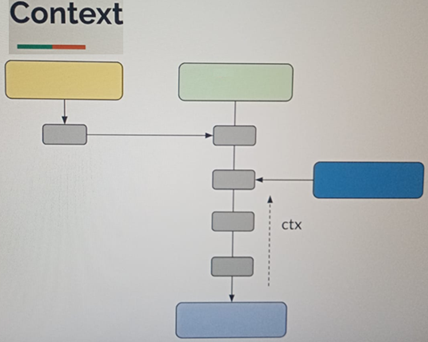
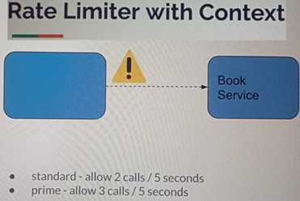
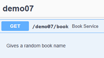
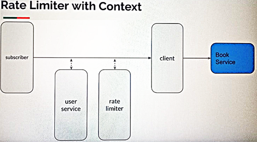

# Sección 13: [Opcional] - Context

---

## Introducción

### 📌 ¿Qué es el Context?

En programación reactiva con `Project Reactor`, el `Context` es un mecanismo diseñado para transportar información
adicional (`metadatos`) a lo largo del flujo reactivo, sin necesidad de modificar el flujo de datos principal.

Piensa en el `Context` como una especie de `mapa inmutable clave/valor` (similar a las cabeceras HTTP) que acompaña al
flujo reactivo, pero no forma parte del `Mono` o `Flux` que estás manipulando. Esta información se adjunta con
`contextWrite(...)` y se recupera dentro del flujo usando `deferContextual(...)`.

### 🔄 Comparación con ThreadLocal

En la programación imperativa tradicional, podrías usar `ThreadLocal` para almacenar datos como el usuario autenticado
o un ID de seguimiento (trace ID). Sin embargo, en un entorno reactivo y no bloqueante, donde los hilos cambian
frecuentemente, `ThreadLocal` ya no es una opción viable.

El `Context` de Reactor `es una alternativa segura, inmutable y diseñada específicamente para flujos asíncronos`,
evitando los problemas de concurrencia y acoplamiento que genera `ThreadLocal`.

### 🛠 ¿Para qué sirve el Context?

El `Context` es especialmente útil para manejar preocupaciones transversales `(cross-cutting concerns)` como:

- 🔐 Autenticación y autorización (pasar el usuario actual o un token)
- 📊 Monitoreo y trazabilidad (trace ID, correlation ID)
- 📉 Limitación de velocidad (rate limiting)
- 🌐 Localización o preferencias del usuario
- ⚙️ Configuración contextual sin modificar firmas de métodos

Esto permite propagar información importante `sin contaminar la lógica del negocio`, ni modificar cada método para
aceptar nuevos parámetros.

### 🧠 Ejemplo mental: Las cabeceras HTTP

Cuando haces una petición HTTP, puedes tener:

- Un cuerpo (`body`) con datos.
- Parámetros en la URL.
- Y cabeceras (`headers`) con metadatos: autenticación, idioma, tipo de cliente, etc.

Las cabeceras no forman parte del contenido principal, pero son esenciales. De manera similar, el `Context` acompaña al
flujo reactivo sin formar parte del valor emitido (`onNext`), pero sigue estando disponible si lo necesitas.

### ⚙️ Cómo funciona

- `contextWrite(Context.of(...))`: Escribe información en el contexto reactivo (como si pusieras cabeceras).
- `Mono.deferContextual(...)` o `Flux.deferContextual(...)`: Permite leer el contexto desde dentro del flujo, justo
  cuando se necesita.

> 📌 `El contexto es inmutable`: cada vez que escribes en el contexto (por ejemplo, con `contextWrite`), no se modifica
> el contexto existente, sino que se crea una nueva copia con los cambios. Es decir, no puedes cambiar el contexto
> original `“en el lugar”` (in-place) como lo harías con un mapa mutable.
>
> Esta inmutabilidad garantiza que el contexto sea `seguro en entornos concurrentes y asíncronos`, ya que no hay riesgo
> de que una parte del código altere la información que otra parte necesita.



### 🌐 Aplicaciones en flujos complejos

En flujos más realistas, puedes tener múltiples productores, operadores (`map`, `filter`, `flatMap`, etc.),
combinaciones (`concat`, `merge`), y consumidores. Si necesitaras pasar datos adicionales a través de todo este
pipeline, hacerlo mediante parámetros sería caótico.

El `Context` soluciona este problema permitiendo compartir información entre múltiples etapas sin acoplarlas
directamente, mejorando la `mantenibilidad y separación de responsabilidades`.

### ✅ Conclusión

El `Context` en Reactor es una herramienta poderosa para transportar metadatos de manera segura y reactiva. Aunque
opcional, puede ser clave para construir flujos más limpios, desacoplados y preparados para manejar casos reales como
seguridad, logging y trazabilidad.

## Context - Demo

Imaginemos que tenemos un `publisher`, por ejemplo una `API remota`. El requisito de negocio nos dice que solo los
usuarios autenticados pueden invocarla. Entonces, en lugar de modificar la firma del método para recibir
parámetros adicionales como un token de autenticación, queremos una forma de pasar información contextual
(como si fuesen cabeceras HTTP) sin cambiar la definición del método.

Aquí es donde entra en juego el `Context` en `Project Reactor`.

````java
//El contexto sirve para proporcionar metadatos sobre el request (similar a los headers HTTP)
public class Lec01Context {
    private static final Logger log = LoggerFactory.getLogger(Lec01Context.class);

    public static void main(String[] args) {
        getWelcomeMessage()
                .contextWrite(Context.of("user", "magadiflo"))  // Agregamos el contexto aquí
                .subscribe(Util.subscriber());
    }

    private static Mono<String> getWelcomeMessage() {
        return Mono.deferContextual(ctx -> {
            log.info("{}", ctx);                                // Mostramos el contenido del contexto
            if (ctx.hasKey("user")) {
                return Mono.just("Bienvenido %s".formatted(ctx.get("user").toString()));
            }
            return Mono.error(new RuntimeException("No autenticado"));
        });
    }
}
````

🔍 Observaciones clave

- El método `contextWrite` agrega una entrada al contexto reactivo justo antes de la suscripción.
- `Mono.deferContextual(...)` permite acceder al contexto de forma perezosa (`lazy`), es decir, cuando se ejecute el
  flujo.
- Si no se encuentra la clave `user`, se lanza un error.
- El contexto `no se propaga automáticamente` entre operadores. Hay que aplicar `contextWrite` antes de cualquier
  acceso.

````bash
10:40:03.439 INFO  [           main] d.m.app.sec13.Lec01Context     : Context1{user=magadiflo}
10:40:03.443 INFO  [           main] d.m.a.common.DefaultSubscriber :  recibido: Bienvenido magadiflo
10:40:03.445 INFO  [           main] d.m.a.common.DefaultSubscriber :  ¡completado!
````

💡 Consejos adicionales

- Evita confundir el `Context` con los datos que fluyen en el `Mono` o `Flux`. Son dos canales distintos: uno para los
  datos (`onNext`) y otro para los metadatos (`Context`).
- Este enfoque es muy útil para implementar seguridad, trazabilidad, logging enriquecido, etc.

## Context - Append / Upate / Delete

Como ya mencionamos, el `Context` en Reactor `es un mapa inmutable`, lo cual significa que no se puede modificar
directamente. En su lugar, cada vez que hacemos una operación como `put` (`agregar` o `actualizar`), se crea una nueva
instancia del `Context` con la información actualizada. Este comportamiento evita efectos secundarios y garantiza la
seguridad en entornos concurrentes.

### ¿Se puede modificar el Context?

Sí... pero no directamente. Las operaciones como agregar (`append`), actualizar (`update`) o eliminar (`delete`)
`no cambian el Context original`, sino que `crean una nueva copia modificada`, lo que sigue cumpliendo con el principio
de inmutabilidad.

📌 Importante:
> El `Context fluye de abajo hacia arriba en el pipeline`. Esto significa que el último `contextWrite` declarado es el
> primero que se aplica cuando el flujo llega al subscriber. Es decir, los `contextWrite(...)` se apilan y se aplican
> en orden inverso.

### Ejemplo 01: Append

````java
//El Context es un mapa inmutable. ¡Podemos añadir información adicional!
public class Lec02ContextAppendUpdate {
    private static final Logger log = LoggerFactory.getLogger(Lec02ContextAppendUpdate.class);

    public static void main(String[] args) {
        append();
    }

    public static void append() {
        getWelcomeMessage()
                .contextWrite(Context.of("color", "red").put("country", "Peru").put("city", "Lima"))
                .contextWrite(Context.of("token", "12345"))
                .contextWrite(Context.of("user", "magadiflo"))
                .subscribe(Util.subscriber());
    }

    private static Mono<String> getWelcomeMessage() {
        return Mono.deferContextual(ctx -> {
            log.info("{}", ctx);
            if (ctx.hasKey("user")) {
                return Mono.just("Bienvenido %s".formatted(ctx.get("user").toString()));
            }
            return Mono.error(new RuntimeException("No autenticado"));
        });
    }
}
````

Explicación

- Se agregan varios valores al contexto usando múltiples llamadas a `contextWrite(...)`.
- Cada llamada genera un nuevo `Context` y se coloca en la pila.
- Cuando se evalúa el flujo en `deferContextual`, todos los valores están disponibles, ya que fueron agregados en
  distintos niveles del stack del contexto.
- El orden que se ve en el log refleja cómo se aplicaron las capas del contexto desde el último `contextWrite` hacia el
  primero (`de abajo hacia arriba en el flujo`).

````bash
11:45:36.062 INFO  [           main] m.a.s.Lec02ContextAppendUpdate : Context5{user=magadiflo, token=12345, color=red, country=Peru, city=Lima}
11:45:36.066 INFO  [           main] d.m.a.common.DefaultSubscriber :  recibido: Bienvenido magadiflo
11:45:36.069 INFO  [           main] d.m.a.common.DefaultSubscriber :  ¡completado!
````

### Ejemplo 02: "Update" (sobrescribir o eliminar el contexto)

````java
public class Lec02ContextAppendUpdate {
    private static final Logger log = LoggerFactory.getLogger(Lec02ContextAppendUpdate.class);

    public static void main(String[] args) {
        update1();
    }

    public static void update1() {
        getWelcomeMessage()
                .contextWrite(ctx -> Context.empty()) // Eliminamos todo el contexto actual
                .contextWrite(Context.of("color", "red").put("country", "Peru").put("city", "Lima"))
                .contextWrite(Context.of("token", "12345"))
                .contextWrite(Context.of("user", "magadiflo"))
                .subscribe(Util.subscriber());
    }

    private static Mono<String> getWelcomeMessage() {
        /* code */
    }
}
````

Explicación:

- La clave está en la línea `.contextWrite(ctx -> Context.empty())`, esta instrucción reemplaza completamente el
  contexto anterior con uno nuevo y vacío. Es como hacer un “borrón y cuenta nueva”.
- Aunque hayas agregado valores como "user", "token" o "color" en las líneas siguientes, el
  `contextWrite(Context.empty())` está más abajo en la cadena del flujo, por lo tanto, se aplica después, eliminando
  toda la información previa.
- El resultado es un `Context0{}` completamente vacío cuando se evalúa el flujo en `deferContextual`.
- Como no hay clave "user" en el contexto, se lanza la excepción "No autenticado".

````bash
11:55:13.646 INFO  [           main] m.a.s.Lec02ContextAppendUpdate : Context0{}
11:55:13.652 ERROR [           main] d.m.a.common.DefaultSubscriber :  error: No autenticado
````

📌 Recordatorio
> `El contexto fluye de abajo hacia arriba`, por lo tanto, la primera llamada que se evalúa es la más interna (la más
> abajo en el código). En este caso:
> 1. `.contextWrite(Context.of("user", ...))` → se aplica primero.
> 2. Luego `.contextWrite(Context.of("token", ...))` agrega más datos.
> 3. Luego `.contextWrite(Context.of(...))` agrega más.
> 4. Pero luego: `.contextWrite(ctx -> Context.empty())` borra todo.

### Ejemplo 03: "Update" (sobrescribir una clave del contexto)

````java
public class Lec02ContextAppendUpdate {
    private static final Logger log = LoggerFactory.getLogger(Lec02ContextAppendUpdate.class);

    public static void main(String[] args) {
        update2();
    }

    public static void update2() {
        getWelcomeMessage()
                .contextWrite(Context.of("user", "nophy"))      // Sobrescribimos el valor de "user"
                .contextWrite(Context.of("color", "red").put("country", "Peru").put("city", "Lima"))
                .contextWrite(Context.of("token", "12345"))
                .contextWrite(Context.of("user", "magadiflo"))  // Este será sobrescrito por el siguiente
                .subscribe(Util.subscriber());
    }

    private static Mono<String> getWelcomeMessage() {
        /* code */
    }
}
````

Explicación

- En este flujo usamos varias llamadas a `contextWrite(...)` para agregar valores.
- En dos de ellas colocamos la clave `user`:
    1. Primero con valor `magadiflo`
    2. Luego con valor `nophy`

  📌 Como el contexto se evalúa de abajo hacia arriba, el valor de `user` que prevalece es el último que se insertó
  más abajo en el código, es decir: `nophy`.

- Es como si cada `contextWrite(...)` fuera creando una nueva capa sobre el mapa anterior, y al acceder a una clave, se
  toma la más externa (más arriba en la pila).

````bash
12:00:54.638 INFO  [           main] m.a.s.Lec02ContextAppendUpdate : Context5{user=nophy, token=12345, color=red, country=Peru, city=Lima}
12:00:54.638 INFO  [           main] d.m.a.common.DefaultSubscriber :  recibido: Bienvenido nophy
12:00:54.646 INFO  [           main] d.m.a.common.DefaultSubscriber :  ¡completado!
````

### Ejemplo 04: Actualizar usando el propio contexto (ctx -> ctx.put(...))

````java
public class Lec02ContextAppendUpdate {
    private static final Logger log = LoggerFactory.getLogger(Lec02ContextAppendUpdate.class);

    public static void main(String[] args) {
        update3();
    }

    public static void update3() {
        getWelcomeMessage()
                .contextWrite(ctx -> ctx.put("user", ctx.get("user").toString().toUpperCase())) // Transformamos el valor actual de "user"
                .contextWrite(Context.of("color", "red").put("country", "Peru").put("city", "Lima"))
                .contextWrite(Context.of("token", "12345"))
                .contextWrite(Context.of("user", "magadiflo"))
                .subscribe(Util.subscriber());
    }

    private static Mono<String> getWelcomeMessage() {
        /* code */
    }
}
````

Explicación

- En vez de sobrescribir directamente con un nuevo `Context.of(...)`, aquí usamos
  `.contextWrite(ctx -> ctx.put("user", ctx.get("user").toString().toUpperCase()))`.
- Esa línea de código lo que hace es recuperar el valor actual asociado a `user`: `magadiflo`.
- Lo Transforma a mayúscula: `MAGADIFLO`.
- Lo vuelve a insertar en el `Context`, pero como es inmutable, esto crea y devuelve una nueva copia del contexto con
  ese nuevo valor.

```bash
12:05:24.453 INFO  [           main] m.a.s.Lec02ContextAppendUpdate : Context5{user=MAGADIFLO, token=12345, color=red, country=Peru, city=Lima}
12:05:24.453 INFO  [           main] d.m.a.common.DefaultSubscriber :  recibido: Bienvenido MAGADIFLO
12:05:24.453 INFO  [           main] d.m.a.common.DefaultSubscriber :  ¡completado!
````

> 📌 `Punto clave`: cuando usamos `.contextWrite(Function<Context, Context>)`, podemos leer y modificar basándote en el
> contenido previo del contexto.

### Ejemplo 05: Eliminar claves del contexto

````java
public class Lec02ContextAppendUpdate {
    private static final Logger log = LoggerFactory.getLogger(Lec02ContextAppendUpdate.class);

    public static void main(String[] args) {
        delete();
    }

    public static void delete() {
        getWelcomeMessage()
                .contextWrite(ctx -> ctx.delete("country").delete("city").delete("color")) // Eliminamos claves específicas
                .contextWrite(Context.of("color", "red").put("country", "Peru").put("city", "Lima"))
                .contextWrite(Context.of("token", "12345"))
                .contextWrite(Context.of("user", "magadiflo"))
                .subscribe(Util.subscriber());
    }

    private static Mono<String> getWelcomeMessage() {
        /* code */
    }
}
````

🔍 `Explicación`: El flujo del contexto va de abajo hacia arriba, es decir:

1. Se inserta "user", "token", "color", "country", "city".
2. Luego, justo antes de llegar a `getWelcomeMessage()`, el operador `.contextWrite(ctx -> ...)` elimina del `Context`
   las claves "country", "city" y "color".
3. Como `Context es inmutable`, cada `.delete(...)` retorna un nuevo objeto.

````bash
12:10:21.779 INFO  [           main] m.a.s.Lec02ContextAppendUpdate : Context2{user=magadiflo, token=12345}
12:10:21.782 INFO  [           main] d.m.a.common.DefaultSubscriber :  recibido: Bienvenido magadiflo
12:10:21.786 INFO  [           main] d.m.a.common.DefaultSubscriber :  ¡completado!
````

## Context - Propagación automática

En este apartado hablaremos de la propagación automática del contexto.

### Ejemplo 01: Propagación automática del contexto a múltiples productores

En escenarios del mundo real, una cadena reactiva puede estar compuesta por múltiples productores o fuentes de datos,
que podrían ejecutarse incluso en distintos hilos. En este ejemplo, se demuestra cómo el operador `contextWrite(...)`
en `Project Reactor` `propaga automáticamente el contexto a todos los productores aguas arriba`, incluso cuando estos
utilizan diferentes `Schedulers` y, por tanto, se ejecutan en hilos distintos.

Gracias a la naturaleza inmutable y reactiva del `Context`, cada productor accede al contexto definido en el flujo, sin
necesidad de recurrir a mecanismos como `ThreadLocal`. Esto permite manejar información como usuarios autenticados,
tokens de sesión, configuraciones por entorno, entre otros, de manera segura, limpia y sin acoplamiento.

El siguiente ejemplo ilustra esta capacidad:

````java
public class Lec03ContextPropagation {
    private static final Logger log = LoggerFactory.getLogger(Lec03ContextPropagation.class);

    public static void main(String[] args) {
        demo1();
        Util.sleepSeconds(2);
    }

    // Todos los productores reciben el contexto
    public static void demo1() {
        getWelcomeMessage()
                .concatWith(Flux.merge(producer1(), producer2()))
                .contextWrite(Context.of("user", "magadiflo"))
                .subscribe(Util.subscriber());
    }

    private static Mono<String> getWelcomeMessage() {
        return Mono.deferContextual(ctx -> {
            log.info("{}", ctx);
            if (ctx.hasKey("user")) {
                return Mono.just("Bienvenido %s".formatted(ctx.get("user").toString()));
            }
            return Mono.error(new RuntimeException("No autenticado"));
        });
    }

    private static Mono<String> producer1() {
        return Mono.<String>deferContextual(ctx -> {
            log.info("producer1: {}", ctx);
            return Mono.empty();
        }).subscribeOn(Schedulers.boundedElastic()); // Hace uso de su propio pool de hilos
    }

    private static Mono<String> producer2() {
        return Mono.<String>deferContextual(ctx -> {
            log.info("producer2: {}", ctx);
            return Mono.empty();
        }).subscribeOn(Schedulers.parallel()); // Hace uso de su propio pool de hilos
    }
}
````

En la salida se observa cómo el contexto con la clave `user` y valor `magadiflo` se propaga correctamente a todos los
productores, incluso cuando estos se ejecutan en diferentes hilos (como `parallel-1` y `boundedElastic-1`). Esto valida
que el operador `contextWrite(...)` aplica de forma automática y efectiva el contexto a todo el flujo reactivo,
incluyendo los productores que corren en pools de hilos distintos.

````bash
12:27:30.712 INFO  [           main] .m.a.s.Lec03ContextPropagation : Context1{user=magadiflo}
12:27:30.716 INFO  [           main] d.m.a.common.DefaultSubscriber :  recibido: Bienvenido magadiflo
12:27:30.721 INFO  [     parallel-1] .m.a.s.Lec03ContextPropagation : producer2: Context1{user=magadiflo}
12:27:30.721 INFO  [oundedElastic-1] .m.a.s.Lec03ContextPropagation : producer1: Context1{user=magadiflo}
12:27:30.725 INFO  [oundedElastic-1] d.m.a.common.DefaultSubscriber :  ¡completado!
````

> 💡 ¡La clave!: Reactor mantiene el contexto a lo largo de la cadena reactiva, incluso con cambios de hilo gracias a
> `Scheduler`, algo que un `ThreadLocal` tradicional no lograría.

### Ejemplo 02: Exclusión del contexto en un productor específico

En este ejemplo, se demuestra cómo podemos evitar que un productor específico reciba el contexto. Para ello, se utiliza
`contextWrite(context -> Context.empty())` aplicado exclusivamente a `producer2`. Esto simula un escenario donde
ciertos productores no deberían tener acceso al contexto compartido (por ejemplo, por motivos de seguridad o separación
de responsabilidades).

````java
public class Lec03ContextPropagation {
    private static final Logger log = LoggerFactory.getLogger(Lec03ContextPropagation.class);

    public static void main(String[] args) {
        demo2();
        Util.sleepSeconds(2);
    }

    // Supongamos que el producer2 no debe recibir el contexto
    public static void demo2() {
        getWelcomeMessage()
                .concatWith(Flux.merge(producer1(), producer2().contextWrite(context -> Context.empty())))
                .contextWrite(Context.of("user", "magadiflo"))
                .subscribe(Util.subscriber());
    }

    private static Mono<String> getWelcomeMessage() {
        return Mono.deferContextual(ctx -> {
            log.info("{}", ctx);
            if (ctx.hasKey("user")) {
                return Mono.just("Bienvenido %s".formatted(ctx.get("user").toString()));
            }
            return Mono.error(new RuntimeException("No autenticado"));
        });
    }

    private static Mono<String> producer1() {
        return Mono.<String>deferContextual(ctx -> {
            log.info("producer1: {}", ctx);
            return Mono.empty();
        }).subscribeOn(Schedulers.boundedElastic()); // Hace uso de su propio pool de hilos
    }

    private static Mono<String> producer2() {
        return Mono.<String>deferContextual(ctx -> {
            log.info("producer2: {}", ctx);
            return Mono.empty();
        }).subscribeOn(Schedulers.parallel()); // Hace uso de su propio pool de hilos
    }
}
````

La salida muestra que:

- El contexto con `user=magadiflo` se propaga correctamente a `getWelcomeMessage()` y a `producer1`.
- `producer2`, en cambio, no recibe ningún dato en su contexto (`Context0{}`) debido a que fue explícitamente limpiado.

````bash
12:39:36.311 INFO  [           main] .m.a.s.Lec03ContextPropagation : Context1{user=magadiflo}
12:39:36.311 INFO  [           main] d.m.a.common.DefaultSubscriber :  recibido: Bienvenido magadiflo
12:39:36.320 INFO  [oundedElastic-1] .m.a.s.Lec03ContextPropagation : producer1: Context1{user=magadiflo}
12:39:36.320 INFO  [     parallel-1] .m.a.s.Lec03ContextPropagation : producer2: Context0{}
12:39:36.327 INFO  [oundedElastic-1] d.m.a.common.DefaultSubscriber :  ¡completado!
````

## Rate Limiter With Context - Implementación - Parte 1

En las próximas clases, implementaremos una funcionalidad similar a un limitador de velocidad (rate limiter) utilizando
el contexto. El objetivo principal es construir un ejemplo inspirado en un caso de la vida real, lo que nos permitirá
entender cómo podríamos aplicar una solución similar en nuestras propias aplicaciones.

### Problema a solucionar

Contamos con un servicio externo de libros, al cual enviamos solicitudes para obtener nombres de libros. Nuestra
aplicación tiene dos tipos de usuarios: los de tipo `standard` y los de tipo `premium`.

El problema es que estos usuarios envían un gran número de solicitudes consecutivas al servicio externo. Supongamos que
debemos pagar por cada solicitud que enviamos a dicho servicio, lo cual representa un costo que debemos controlar.

Como solución, queremos limitar la cantidad de solicitudes salientes dependiendo del tipo de usuario:

- Para un usuario `standard`, permitiremos máximo 2 solicitudes cada 5 segundos.
- Para un usuario `premium`, permitiremos máximo 3 solicitudes cada 5 segundos.

Ese es el requisito que implementaremos en nuestra aplicación.



Para esta implementación vamos a levantar nuestro servicio externo de la siguiente manera.

````bash
D:\programming\spring\01.udemy\03.vinoth_selvaraj\java-reactive-programming (feature/section-13)
$ java -jar .\servers\external-services.jar
````

Luego, si en nuestro navegador accedemos a la url `http://localhost:7070/`, podremos ver el endpoint `demo07` que es
el que usaremos para esta implementación.



Así que iniciamos implementando nuestro servicio externo que se comunicará con el endpoint anterior.

````java
public class ExternalServiceClient extends AbstractHttpClient {

    public Mono<String> getBook() {
        return this.httpClient
                .get()
                .uri("/demo07/book")
                .responseContent()
                .asString()
                .next();
    }

}
````

Verificamos el funcionamiento de nuestro servicio externo.

````java
public class Lec04ContextRateLimiterDemo {
    private static final Logger log = LoggerFactory.getLogger(Lec04ContextRateLimiterDemo.class);

    public static void main(String[] args) {
        ExternalServiceClient client = new ExternalServiceClient();
        for (int i = 0; i < 10; i++) {
            client.getBook()
                    .subscribe(Util.subscriber());
        }

        Util.sleepSeconds(5);
    }

}
````

En este punto, al ejecutar el método `getBook()` 10 veces, se observa que todas las solicitudes son enviadas sin
restricción alguna. Esto confirma el problema inicial: `múltiples llamadas al servicio externo se ejecutan sin control`,
lo que podría implicar un alto costo económico en escenarios reales donde cada solicitud tiene un precio.

````bash
13:07:51.030 INFO  [magadiflo-nio-1] d.m.a.common.DefaultSubscriber :  recibido: The Proper Study
13:07:51.036 INFO  [magadiflo-nio-1] d.m.a.common.DefaultSubscriber :  ¡completado!
13:07:51.038 INFO  [magadiflo-nio-1] d.m.a.common.DefaultSubscriber :  recibido: The Parliament of Man
13:07:51.038 INFO  [magadiflo-nio-1] d.m.a.common.DefaultSubscriber :  ¡completado!
13:07:51.039 INFO  [magadiflo-nio-1] d.m.a.common.DefaultSubscriber :  recibido: A Handful of Dust
13:07:51.039 INFO  [magadiflo-nio-1] d.m.a.common.DefaultSubscriber :  ¡completado!
13:07:51.040 INFO  [magadiflo-nio-1] d.m.a.common.DefaultSubscriber :  recibido: Fair Stood the Wind for France
13:07:51.040 INFO  [magadiflo-nio-1] d.m.a.common.DefaultSubscriber :  ¡completado!
13:07:51.041 INFO  [magadiflo-nio-1] d.m.a.common.DefaultSubscriber :  recibido: That Good Night
13:07:51.041 INFO  [magadiflo-nio-1] d.m.a.common.DefaultSubscriber :  ¡completado!
13:07:51.043 INFO  [magadiflo-nio-1] d.m.a.common.DefaultSubscriber :  recibido: Fair Stood the Wind for France
13:07:51.043 INFO  [magadiflo-nio-1] d.m.a.common.DefaultSubscriber :  ¡completado!
13:07:51.044 INFO  [magadiflo-nio-1] d.m.a.common.DefaultSubscriber :  recibido: Fame Is the Spur
13:07:51.044 INFO  [magadiflo-nio-1] d.m.a.common.DefaultSubscriber :  ¡completado!
13:07:51.045 INFO  [magadiflo-nio-1] d.m.a.common.DefaultSubscriber :  recibido: Dying of the Light
13:07:51.046 INFO  [magadiflo-nio-1] d.m.a.common.DefaultSubscriber :  ¡completado!
13:07:51.048 INFO  [magadiflo-nio-1] d.m.a.common.DefaultSubscriber :  recibido: Endless Night
13:07:51.048 INFO  [magadiflo-nio-1] d.m.a.common.DefaultSubscriber :  ¡completado!
13:07:51.050 INFO  [magadiflo-nio-1] d.m.a.common.DefaultSubscriber :  recibido: Cover Her Face
13:07:51.050 INFO  [magadiflo-nio-1] d.m.a.common.DefaultSubscriber :  ¡completado!
````

## Rate Limiter With Context - Implementación - Parte 2

Vamos a implementar nuestra funcionalidad de limitador de velocidad siguiendo el flujo ilustrado en la imagen.



El `subscriber` hará la llamada al cliente como de costumbre. A su vez, el cliente se comunicará con el servicio externo
de libros (book service). Este flujo básico no cambia, es el mismo que hemos venido utilizando hasta ahora.

Sin embargo, en esta ocasión introduciremos un par de servicios intermedios que actuarán modificando o agregando
información al contexto de la petición. Gracias a esto, el cliente contará con información adicional que le permitirá
tomar decisiones sobre si realizar o no una llamada al servicio externo.

En concreto, el `subscriber` proporcionará información sobre el usuario mediante el contexto. Luego, el `user service`
determinará la categoría del usuario: si es un usuario de tipo `standard` o `premium`.

Posteriormente, el servicio de `rate limiter` supervisará las peticiones y decidirá si se permite continuar con la
llamada. Finalmente, con esta información, el cliente decidirá si realiza o no la solicitud al servicio externo.

### ✅ ¿Qué hace este código?

Esta clase se encarga de:

1. Determinar la categoría del usuario (`standard` o `premium`).
2. Enriquecer el `Context` de `Reactor` agregando esa categoría, lo cual será útil más adelante (por ejemplo, para
   aplicar reglas de rate limiting distintas).

````java
public class UserService {
    private static final Map<String, String> USER_CATEGORY = Map.of(
            "sam", "standard",
            "mike", "premium"
    );

    static UnaryOperator<Context> userCategoryContext() {
        return ctx -> ctx.<String>getOrEmpty("user")
                .filter(USER_CATEGORY::containsKey)
                .map(USER_CATEGORY::get)
                .map(category -> ctx.put("category", category))
                .orElseGet(Context::empty);
    }
}
````

### ✅ Aspectos positivos

- 📚 Uso correcto de `Context` de Reactor: Esto es clave para programación reactiva avanzada.
- 🔒 `Inmutabilidad`: el `Context` de Reactor es inmutable, y lo estás manejando correctamente devolviendo una nueva
  instancia con `.put(...)`.
- 🔁 `Reutilizable y funcional`: encapsulado como `UnaryOperator<Context>`, lo puedes aplicar directamente con
  `.contextWrite(...)`.

## Rate Limiter With Context - Implementación - Parte 3

En esta sección se implementa la lógica que define el comportamiento del `Rate Limiter` para controlar la cantidad de
llamadas permitidas a un servicio externo, basándose en la categoría del usuario (`standard` o `premium`), como se
describió anteriormente.

La clase `RateLimiter` es responsable de mantener un registro de las llamadas permitidas por categoría de usuario, y
decidir en tiempo de ejecución si una llamada puede ser permitida o debe ser bloqueada. Para ello, se utiliza una
estructura `Map` llamada `categoryAttemps`, que almacena cuántas llamadas aún están disponibles para cada categoría.

Este mapa se envuelve con `Collections.synchronizedMap(...)`, lo cual es importante para asegurar que el acceso
concurrente desde múltiples hilos sea seguro. Aunque esta implementación es simplificada y no reinicia automáticamente
los intentos cada cierto tiempo (como un rate limiter real lo haría), sirve para ilustrar de manera didáctica cómo se
puede implementar control de acceso basado en el contexto en aplicaciones reactivas con `Project Reactor`.

El método `limitCalls()` evalúa el contexto actual y determina si se puede proceder o lanzar una excepción en caso de
haberse superado el límite de llamadas.

````java
public class RateLimiter {
    private static final Map<String, Integer> categoryAttemps = Collections.synchronizedMap(new HashMap<>());

    static {
        categoryAttemps.put("standard", 2);
        categoryAttemps.put("premium", 3);
    }

    static <T> Mono<T> limitCalls() {
        return Mono.deferContextual(ctx -> {
            boolean allowCall = ctx.<String>getOrEmpty("category")
                    .map(RateLimiter::canAllow)
                    .orElseGet(() -> false);
            return allowCall ? Mono.empty() : Mono.error(new RuntimeException("Superó el límite dado"));
        });
    }

    private static boolean canAllow(String category) {
        Integer attemps = categoryAttemps.getOrDefault(category, 0);
        if (attemps > 0) {
            categoryAttemps.put(category, attemps - 1);
            return true;
        }
        return false;
    }
}
````

Ahora que hemos implementado las clases encargadas de gestionar la categoría del usuario (`UserService`) y de aplicar
las restricciones de llamadas según dicha categoría (`RateLimiter`), las integramos dentro de nuestro cliente externo.
En esta clase `ExternalServiceClient`, simulamos una llamada HTTP al `book service`, pero antes de realizarla,
utilizamos las funcionalidades previamente desarrolladas.

La llamada se ve influenciada por dos aspectos clave:

- Primero, se aplica el limitador de velocidad (`RateLimiter.limitCalls()`), el cual determinará si la solicitud puede
  continuar o no dependiendo del número de intentos permitidos.
- Luego, se agrega información contextual mediante `UserService.userCategoryContext()`, lo que permite que el limitador
  sepa a qué tipo de usuario pertenece la solicitud.

````java
public class ExternalServiceClient extends AbstractHttpClient {

    public Mono<String> getBook() {
        return this.httpClient
                .get()
                .uri("/demo07/book")
                .responseContent()
                .asString()
                .startWith(RateLimiter.limitCalls())
                .contextWrite(UserService.userCategoryContext())
                .next();
    }
}
````

Este enfoque demuestra cómo se puede utilizar el contexto reactivo para pasar información entre distintos componentes
sin alterar directamente la lógica de negocio ni las firmas de los métodos.

## Rate Limiter With Context - Demo - Parte 1

### Ejemplo 01: Sin enviar información del usuario

En esta primera parte de la demostración, ejecutamos la aplicación sin proporcionar información de usuario en el
contexto. El método `getBook()` de `ExternalServiceClient` se encarga de realizar una llamada HTTP al servicio externo
de libros. Como parte del flujo reactivo, se integran dos operaciones clave:

- `contextWrite(UserService.userCategoryContext())`: intenta enriquecer el contexto con la categoría del usuario
  (standard o premium).
- `startWith(RateLimiter.limitCalls())`: aplica la lógica del rate limiter antes de proceder con la llamada.

````java
public class Lec04ContextRateLimiterDemo {
    private static final Logger log = LoggerFactory.getLogger(Lec04ContextRateLimiterDemo.class);

    public static void main(String[] args) {
        ExternalServiceClient client = new ExternalServiceClient();
        for (int i = 0; i < 10; i++) {
            client.getBook()
                    .subscribe(Util.subscriber());
        }

        Util.sleepSeconds(5);
    }

}
````

En este escenario específico, no se ha definido ningún usuario en el contexto, por lo tanto, el `UserService` no puede
asociar una categoría, y el `RateLimiter` no permite la llamada. Esto se traduce en una serie de errores indicando que
se ha superado el límite permitido de llamadas.

````bash
16:42:43.926 ERROR [           main] d.m.a.common.DefaultSubscriber :  error: Superó el límite dado
16:42:43.928 ERROR [           main] d.m.a.common.DefaultSubscriber :  error: Superó el límite dado
16:42:43.928 ERROR [           main] d.m.a.common.DefaultSubscriber :  error: Superó el límite dado
16:42:43.928 ERROR [           main] d.m.a.common.DefaultSubscriber :  error: Superó el límite dado
16:42:43.928 ERROR [           main] d.m.a.common.DefaultSubscriber :  error: Superó el límite dado
16:42:43.928 ERROR [           main] d.m.a.common.DefaultSubscriber :  error: Superó el límite dado
16:42:43.928 ERROR [           main] d.m.a.common.DefaultSubscriber :  error: Superó el límite dado
16:42:43.928 ERROR [           main] d.m.a.common.DefaultSubscriber :  error: Superó el límite dado
16:42:43.928 ERROR [           main] d.m.a.common.DefaultSubscriber :  error: Superó el límite dado
16:42:43.929 ERROR [           main] d.m.a.common.DefaultSubscriber :  error: Superó el límite dado
````

### Ejemplo 02: Enviando información del usuario sam

En este segundo ejemplo, demostramos cómo la lógica de control de acceso basada en contexto se activa correctamente
cuando se proporciona información del usuario al flujo reactivo. Para ello, usamos el método `contextWrite` para
establecer en el contexto el nombre del usuario `sam`, quien según nuestro servicio `UserService`, pertenece a la
categoría `standard`.

````java
public class Lec04ContextRateLimiterDemo {
    private static final Logger log = LoggerFactory.getLogger(Lec04ContextRateLimiterDemo.class);

    public static void main(String[] args) {
        ExternalServiceClient client = new ExternalServiceClient();
        for (int i = 0; i < 10; i++) {
            client.getBook()
                    .contextWrite(Context.of("user", "sam"))
                    .subscribe(Util.subscriber());
        }

        Util.sleepSeconds(5);
    }
}
````

Esta categoría tiene un límite de 2 llamadas permitido, configurado en la clase `RateLimiter`. Como resultado, solo las
primeras dos solicitudes serán exitosas, mientras que las siguientes serán bloqueadas por exceder el límite establecido.
Este comportamiento confirma que nuestras clases colaboran correctamente para aplicar reglas de negocio basadas en el
contexto del usuario.

````bash
16:46:33.009 ERROR [           main] d.m.a.common.DefaultSubscriber :  error: Superó el límite dado
16:46:33.011 ERROR [           main] d.m.a.common.DefaultSubscriber :  error: Superó el límite dado
16:46:33.011 ERROR [           main] d.m.a.common.DefaultSubscriber :  error: Superó el límite dado
16:46:33.012 ERROR [           main] d.m.a.common.DefaultSubscriber :  error: Superó el límite dado
16:46:33.012 ERROR [           main] d.m.a.common.DefaultSubscriber :  error: Superó el límite dado
16:46:33.012 ERROR [           main] d.m.a.common.DefaultSubscriber :  error: Superó el límite dado
16:46:33.012 ERROR [           main] d.m.a.common.DefaultSubscriber :  error: Superó el límite dado
16:46:33.013 ERROR [           main] d.m.a.common.DefaultSubscriber :  error: Superó el límite dado
16:46:33.389 INFO  [magadiflo-nio-1] d.m.a.common.DefaultSubscriber :  recibido: In a Glass Darkly
16:46:33.389 INFO  [magadiflo-nio-1] d.m.a.common.DefaultSubscriber :  ¡completado!
16:46:33.390 INFO  [magadiflo-nio-1] d.m.a.common.DefaultSubscriber :  recibido: Recalled to Life
16:46:33.390 INFO  [magadiflo-nio-1] d.m.a.common.DefaultSubscriber :  ¡completado!
````

### Ejemplo 03: Enviando información del usuario mike

En este tercer ejemplo, ejecutamos múltiples llamadas al servicio pero esta vez utilizando al usuario `mike`. Según la
lógica definida en `UserService`, este usuario pertenece a la categoría `premium`, la cual tiene un límite de 3 llamadas
permitidas según la configuración en la clase `RateLimiter`.

````java
public class Lec04ContextRateLimiterDemo {
    private static final Logger log = LoggerFactory.getLogger(Lec04ContextRateLimiterDemo.class);

    public static void main(String[] args) {
        ExternalServiceClient client = new ExternalServiceClient();
        for (int i = 0; i < 10; i++) {
            client.getBook()
                    .contextWrite(Context.of("user", "mike"))
                    .subscribe(Util.subscriber());
        }

        Util.sleepSeconds(5);
    }
}
````

Gracias al uso de `contextWrite`, el flujo reactivo hereda la información contextual del usuario, permitiendo que el
`RateLimiter` evalúe correctamente si debe permitir o bloquear cada llamada. Como era de esperarse, las primeras tres
llamadas se completan exitosamente y las siguientes son rechazadas con un mensaje de error, indicando que se ha superado
el límite. Esto demuestra cómo nuestro diseño permite aplicar políticas diferenciadas por usuario de forma reactiva y
contextual.

````bash
16:48:35.176 ERROR [           main] d.m.a.common.DefaultSubscriber :  error: Superó el límite dado
16:48:35.180 ERROR [           main] d.m.a.common.DefaultSubscriber :  error: Superó el límite dado
16:48:35.180 ERROR [           main] d.m.a.common.DefaultSubscriber :  error: Superó el límite dado
16:48:35.180 ERROR [           main] d.m.a.common.DefaultSubscriber :  error: Superó el límite dado
16:48:35.180 ERROR [           main] d.m.a.common.DefaultSubscriber :  error: Superó el límite dado
16:48:35.181 ERROR [           main] d.m.a.common.DefaultSubscriber :  error: Superó el límite dado
16:48:35.181 ERROR [           main] d.m.a.common.DefaultSubscriber :  error: Superó el límite dado
16:48:35.290 INFO  [magadiflo-nio-1] d.m.a.common.DefaultSubscriber :  recibido: Precious Bane
16:48:35.290 INFO  [magadiflo-nio-1] d.m.a.common.DefaultSubscriber :  ¡completado!
16:48:35.292 INFO  [magadiflo-nio-1] d.m.a.common.DefaultSubscriber :  recibido: The Mermaids Singing
16:48:35.292 INFO  [magadiflo-nio-1] d.m.a.common.DefaultSubscriber :  ¡completado!
16:48:35.293 INFO  [magadiflo-nio-1] d.m.a.common.DefaultSubscriber :  recibido: In Dubious Battle
16:48:35.293 INFO  [magadiflo-nio-1] d.m.a.common.DefaultSubscriber :  ¡completado!
````

## Rate Limiter With Context - Demo - Parte 2 - Reinicio periódico (Rate Limiter con Contexto)

En esta sección, mejoramos nuestro rate limiter para que actualice automáticamente los intentos permitidos
`cada 5 segundos`, cumpliendo con el requisito inicial de permitir un número determinado de solicitudes por cada
intervalo de tiempo.

### Cambios en la clase RateLimiter

Se actualiza la clase `RateLimiter` para que, en lugar de inicializar los intentos una sola vez, se refresquen
periódicamente utilizando un `Flux.interval(...)`. Esto permite resetear los intentos disponibles para cada categoría
(`standard`, `premium`, etc.) en intervalos regulares:

````java
public class RateLimiter {
    private static final Map<String, Integer> categoryAttemps = Collections.synchronizedMap(new HashMap<>());

    static {
        refresh();
    }

    static <T> Mono<T> limitCalls() {
        return Mono.deferContextual(ctx -> {
            boolean allowCall = ctx.<String>getOrEmpty("category")
                    .map(RateLimiter::canAllow)
                    .orElseGet(() -> false);
            return allowCall ? Mono.empty() : Mono.error(new RuntimeException("Superó el límite dado"));
        });
    }

    private static synchronized boolean canAllow(String category) {
        Integer attemps = categoryAttemps.getOrDefault(category, 0);
        if (attemps > 0) {
            categoryAttemps.put(category, attemps - 1);
            return true;
        }
        return false;
    }

    private static void refresh() {
        Flux.interval(Duration.ofSeconds(5))        // El primer valor lo emite después de 5 segundos, por eso nos apoyamos el startWith(...)
                .startWith(0L)                      // Permite que el primer valor se emita de inmediato
                .subscribe(value -> {
                    categoryAttemps.put("standard", 2);
                    categoryAttemps.put("premium", 3);
                });
    }
}
````

En el código anterior el mapa `categoryAttemps` se modifica para controlar el acceso. Por lo que es necesario
sincronizar el método `canAllow` para garantizar el acceso atómico, es por esa razón que agregamos el `synchronized`
a la firma del método. Esto garantiza que las llamadas concurrentes no interfieran entre sí al verificar y actualizar
el recuento de intentos.

Este cambio permite que cada usuario tenga nuevos intentos cada 5 segundos, haciendo que el rate limiter sea dinámico y
no estático.

### Cambios en la clase principal Lec04ContextRateLimiterDemo

Se simulan 20 llamadas por parte del usuario `sam`, con un intervalo de 1 segundo entre cada una. Esto nos permite
observar cómo las primeras 2 llamadas son aceptadas, luego se alcanzan los límites y se empiezan a rechazar las
siguientes, hasta que pasados 5 segundos, se restablecen los intentos y se vuelven a aceptar 2 nuevas solicitudes,
y así sucesivamente.

````java
public class Lec04ContextRateLimiterDemo {
    private static final Logger log = LoggerFactory.getLogger(Lec04ContextRateLimiterDemo.class);

    public static void main(String[] args) {
        ExternalServiceClient client = new ExternalServiceClient();
        for (int i = 0; i < 20; i++) {
            client.getBook()
                    .contextWrite(Context.of("user", "sam"))
                    .subscribe(Util.subscriber());
            Util.sleepSeconds(1);
        }

    }

}
````

El usuario `sam` puede hacer hasta `2 llamadas` exitosas cada `5 segundos`. Las solicitudes que superen ese límite son
rechazadas con el mensaje de error `Superó el límite dado`. Una vez transcurridos los `5 segundos`, los intentos se
reinician, permitiendo nuevas llamadas.

````bash
17:24:34.254 INFO  [magadiflo-nio-1] d.m.a.common.DefaultSubscriber :  recibido: Shall not Perish
17:24:34.257 INFO  [magadiflo-nio-1] d.m.a.common.DefaultSubscriber :  ¡completado!
17:24:35.162 INFO  [magadiflo-nio-1] d.m.a.common.DefaultSubscriber :  recibido: Arms and the Man
17:24:35.162 INFO  [magadiflo-nio-1] d.m.a.common.DefaultSubscriber :  ¡completado!
17:24:36.163 ERROR [           main] d.m.a.common.DefaultSubscriber :  error: Superó el límite dado
17:24:37.176 ERROR [           main] d.m.a.common.DefaultSubscriber :  error: Superó el límite dado
17:24:38.188 ERROR [           main] d.m.a.common.DefaultSubscriber :  error: Superó el límite dado
17:24:39.224 INFO  [magadiflo-nio-1] d.m.a.common.DefaultSubscriber :  recibido: That Hideous Strength
17:24:39.224 INFO  [magadiflo-nio-1] d.m.a.common.DefaultSubscriber :  ¡completado!
17:24:40.217 INFO  [magadiflo-nio-1] d.m.a.common.DefaultSubscriber :  recibido: Mother Night
17:24:40.217 INFO  [magadiflo-nio-1] d.m.a.common.DefaultSubscriber :  ¡completado!
17:24:41.221 ERROR [           main] d.m.a.common.DefaultSubscriber :  error: Superó el límite dado
17:24:42.227 ERROR [           main] d.m.a.common.DefaultSubscriber :  error: Superó el límite dado
17:24:43.234 ERROR [           main] d.m.a.common.DefaultSubscriber :  error: Superó el límite dado
17:24:44.257 INFO  [magadiflo-nio-1] d.m.a.common.DefaultSubscriber :  recibido: Waiting for the Barbarians
17:24:44.257 INFO  [magadiflo-nio-1] d.m.a.common.DefaultSubscriber :  ¡completado!
17:24:45.277 INFO  [magadiflo-nio-1] d.m.a.common.DefaultSubscriber :  recibido: If Not Now, When?
17:24:45.277 INFO  [magadiflo-nio-1] d.m.a.common.DefaultSubscriber :  ¡completado!
17:24:46.261 ERROR [           main] d.m.a.common.DefaultSubscriber :  error: Superó el límite dado
17:24:47.265 ERROR [           main] d.m.a.common.DefaultSubscriber :  error: Superó el límite dado
17:24:48.267 ERROR [           main] d.m.a.common.DefaultSubscriber :  error: Superó el límite dado
17:24:49.286 INFO  [magadiflo-nio-1] d.m.a.common.DefaultSubscriber :  recibido: The Wings of the Dove
17:24:49.286 INFO  [magadiflo-nio-1] d.m.a.common.DefaultSubscriber :  ¡completado!
17:24:50.292 INFO  [magadiflo-nio-1] d.m.a.common.DefaultSubscriber :  recibido: His Dark Materials
17:24:50.292 INFO  [magadiflo-nio-1] d.m.a.common.DefaultSubscriber :  ¡completado!
17:24:51.288 ERROR [           main] d.m.a.common.DefaultSubscriber :  error: Superó el límite dado
17:24:52.292 ERROR [           main] d.m.a.common.DefaultSubscriber :  error: Superó el límite dado
17:24:53.299 ERROR [           main] d.m.a.common.DefaultSubscriber :  error: Superó el límite dado
````

Este comportamiento se repite cíclicamente mientras se mantenga el proceso en ejecución, simulando un token bucket
simple basado en tiempo.
