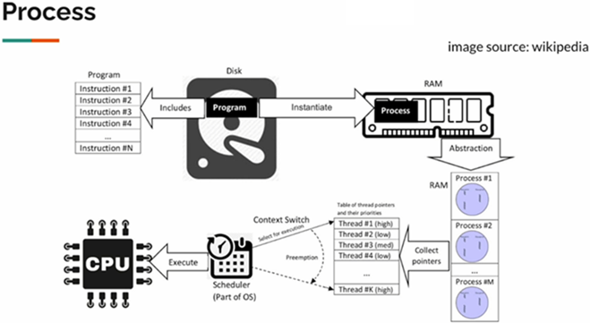
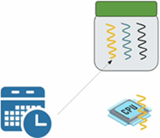
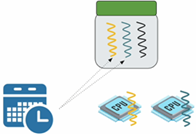
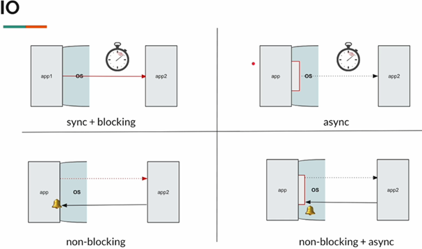
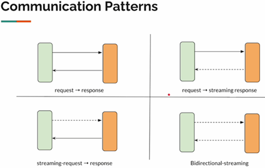
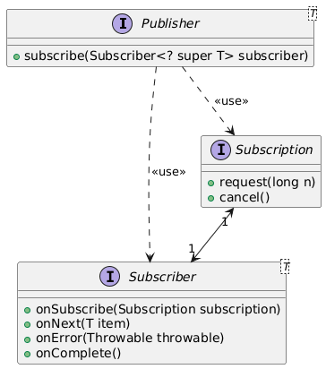

# [Mastering Java Reactive Programming [From Scratch]](https://www.udemy.com/course/complete-java-reactive-programming)

Curso tomado de `Udemy` del autor `Vinoth Selvaraj`.

---

## Process, Thread, CUP, RAM, Scheduler

Imaginemos que ha desarrollado una aplicación Java sencilla y la ha empaquetado como un archivo Jar. El archivo Jar se
encuentra ubicado en algún lugar del disco duro. Su programa no es más que un conjunto de instrucciones para ejecutar
en ese momento.

Ahora, cuando ejecutamos nuestra aplicación jar con el comando `java -jar my_app.jar`, nuestra aplicación se cargará en
la memoria creándose un proceso. Así que, `un proceso` es una instancia de un programa informático que tiene su propio
espacio de memoria aislado, que incluirá código, datos, otros recursos asignados por el sistema operativo como el socket
de memoria, etc.

El proceso es pesado, vive en la memoria ram y quien ejecuta las instrucciones es el CPU.



### Process

- Una instancia de un programa de computadora
- Incluye código, recursos (alojados por el SO como memoria, sockets, etc.)
- Son de peso pesado.
- Es caro crear y destruir un proceso.
- Es caro, es decir, pesado porque consume mucha memoria.

### Thread

- Parte de un proceso
    * Un proceso puede contener uno o más hilos
- Los hilos dentro de un proceso pueden compartir el espacio de memoria.

### Scheduler

- El scheduler (programador) asignará el hilo a la CPU para su ejecución.
- El scheduler determinará cuánto tiempo puede ejecutarse el hilo.

Supongamos que tenemos un solo procesador, el scheduler dirá, hey hilo, ve y ejecuta durante algún tiempo. Es decir,
si tenemos un proceso (que tiene múltiples hilos) y solo contamos con un procesador (CPU), el scheduler cambiará entre
los múltiples hilos.



Si se tienen dos procesadores (CPU), intentará asignar un hilo a cada procesador.



Cuando tenemos un único procesador y cuando tienes múltiples programas ejecutándose como Chrome, IntelliJ IDEA, java
app, etc. cuando todos están en marcha y funcionando, cuando tienes múltiples procesos, todos y cada uno de los procesos
tendrán hilos. Así que todos esos hilos (Thread) estarán compitiendo por la CPU.

El scheduler del SO seguirá cambiando entre los hilos (hilos del núcleo o hilos del SO) para la ejecución. A esta acción
lo llamamos cambio de contexto. Así que, cuando se cambia de un hilo a otro, el hilo actual, el punto de ejecución, el
estado tiene que ser almacenado para que pueda ser reanudado más tarde desde el punto en que se detuvo.

Todo lo discutido hasta este punto, no es nada específico de Java. En términos generales todos los procesos funcionan
así.

### Java (Platform) Thread

- `Java Thread` fue introducido hace 25 años.
- El `Java Thread` es simplemente una envoltura alrededor del hilo del `SO`, por lo que `1 Java Thread = 1 OS Thread`.
- Recuerda: El OS Thread es la unidad del Scheduling.
- La memoria se determina cuando se inicia el proceso o se crea un hilo.

## Inbound/Outbound (entradas/salidas)

1. Sync
2. Async
3. non-blocking
4. non-blocking + async



1. `Sync`, la primera es muy simple, una comunicación de bloqueo síncrono directo, que todos hemos estado haciendo. La
   aplicación envía una solicitud a otra aplicación. El hilo permanecerá inactivo hasta que reciba la respuesta, no
   puede hacer otra cosa. Se trata pues, de una `comunicación síncrona de bloqueo`.


2. `Async`, un hilo puede crear otro hilo para delegar la tarea y hacer las cosas de forma asíncrona. Pero, quien quiera
   que esté realizando la tarea desde su perspectiva, estará bloqueado de todos modos. Por ejemplo. Supongamos que
   quiero llamar a una compañía de seguros para hacerle ciertas preguntas, así que le digo a un amigo que lo haga por
   mí, mientras que yo realizo otras cosas. Mi amigo, realiza la llamada, así que es él quién va a tener que esperar a
   que le contesten el teléfono y le respondan las preguntas. En este caso, yo no estoy bloqueado, pero mi amigo sí.


3. `Non-blocking`, supongamos que vuelvo a llamar a la compañía de seguros para hacerle unas preguntas, pero la
   contestadora me indica que nadie está disponible en ese momento para atenderme, pero que deje mi número de teléfono
   para que apenas alguien esté disponible me llame. Mientras eso sucede, yo puedo seguir haciendo mis cosas con
   normalidad.<br><br>
   En este caso, envié una solicitud y no estoy bloqueado, pero después de algún tiempo se me notifica para indicar que
   ya están disponibles.<br><br>
   En una aplicación `no-bloqueante`, la aplicación envía la solicitud a otra aplicación, base de datos, etc. una vez
   enviada la petición, el hilo no se bloqueará, será libre de hacer lo que quiera, cualquier otra tarea. Si está
   disponible, el sistema operativo notificará al hilo diciéndole, oye, tenemos la respuesta.


4. `no-blocking + async`, es una combinación de `non-blocking + async`. Si tienes varias CPUs, ¿por qué un hilo tiene
   que hacer todo el trabajo?, también podemos tener más hilos.<br><br>
   Supongamos que llamo a la compañía de seguros y me dicen, dame tu número, te llamaremos. Ahora, en lugar de dar mi
   número, le doy el de mi amigo para que le devuelvan la llamada. Así que en este caso no estoy bloqueado, mi amigo
   tampoco está bloqueado, pero recibiría la llamada cuando la compañía de seguros esté disponible.<br><br>
   Entonces, aquí un hilo envía una petición a otra aplicación. La respuesta puede tardar un poco, llevará algún tiempo.
   Hasta entonces el hilo no está bloqueado. Cuando la respuesta vuelve, el SO notificará a un hilo diferente que maneje
   la respuesta para hacer uso de múltiples CPUs.

> La `programación reactiva` es un modelo de programación para simplificar la comunicación `asíncrona no bloqueante`.

## Patrones de comunicación

A veces la gente se pregunta si realmente necesitamos la programación reactiva `¿Puedo no utilizar hilos virtuales?`
En realidad, los hilos virtuales son geniales, pero los hilos virtuales podrían no ser suficientes.

Intentamos resolver un problema distinto, voy a explicarlo ahora. Todos hemos estado escribiendo código usando el tipo
de comunicación `request -> response`. Es decir, enviamos una solicitud y esperamos una respuesta. Así es como hemos
estado escribiendo código durante muchos, muchos años.

Si su requisito es simple como este, entonces sí, el hilo virtual es suficiente. No es necesario complicarse con la
programación reactiva. Pero la programación reactiva abre la puerta a tres patrones de comunicación adicionales si se
quiere `request - response`, `request - streaming response`, `streaming-request - response` y
`bidirectional - streaming`. Así que podemos lograr cuatro patrones de comunicación diferentes utilizando la
programación reactiva fácilmente.

- El `request - streaming response`, envías una solicitud para la que obtienes respuesta múltiple. Por ejemplo,
  supongamos que está intentando pedir una pizza, así que envía una solicitud de pedido de pizza. Ahora, enviarán
  actualizaciones en tiempo real, como que la pizza se está preparando. Ahora está listo para su entrega. El conductor
  está a ocho kilómetros. Al cabo de un rato, el conductor está a cuatro millas.

  Así que te darán una respuesta en `streaming` a tu dispositivo móvil diciéndote que de acuerdo, ahora tu comida está
  entregada en tu puerta. Así que envías una petición, pero recibes una respuesta periódica en `streaming`.


- El `streaming-request - response`, enviará una solicitud de streaming al servidor remoto. Por ejemplo, puede que
  lleves
  un Apple Watch, imaginémoslo así, y sigue enviando la frecuencia cardiaca al servidor remoto. O estás trabajando en un
  documento de Google y cuando escribes algo, se guarda en el servidor remoto. Así que aquí recuerde que cuando decimos
  solicitud de streaming no estamos enviando múltiples solicitudes HTTP. Nos limitamos a abrir una única conexión a
  través
  de la cual enviamos múltiples mensajes de streaming al servidor
  remoto.


- El `streaming bidireccional`, permite que dos aplicaciones pueden hablar al igual que un ser humano en realidad pueden
  seguir intercambiando mensajes.

Este tipo de patrones de comunicación son posibles lograr fácilmente con la programación reactiva, mientras que el hilo
virtual, la concurrencia estructurada no resuelven estos problemas.



## [Reactive Streams Specification](https://www.reactive-streams.org/)

`Reactive Streams` es una iniciativa que busca proporcionar un estándar para el procesamiento de flujos asíncronos con
contrapresión sin bloqueo. Esto abarca esfuerzos dirigidos a entornos de ejecución(JVM y JavaScript) así como a
protocolos de red.

Palabras claves: `Asíncrono`, `no bloqueante`, `contrapresión`.



La especificación `Reactive Streams` define un conjunto estándar de interfaces para procesar flujos de datos de manera
asíncrona y sin bloqueo, con un control adecuado de la contrapresión `(backpressure)`. Las principales interfaces
incluidas en la especificación son las siguientes:

1. `Publisher<T>`:
    - Es el productor de datos. Emite una secuencia de elementos a los suscriptores interesados.
    - Tiene un único método. Este método permite a los suscriptores registrarse para recibir los elementos que el
      `Publisher` emitirá.
   ````java
   void subscribe(Subscriber<? super T> subscriber);
   ````

2. `Subscriber<T>`:
    - Es el consumidor de datos. Recibe los elementos emitidos por un `Publisher`.
    - Los métodos clave que implementa son:
   ````java
   void onSubscribe(Subscription s);
   void onNext(T t);
   void onError(Throwable t);
   void onComplete();
   ````
    - `onSubscribe(Subscription s)`: Se llama cuando el `Subscriber` se suscribe y recibe un `Subscription` para
      gestionar la comunicación con el `Publisher`.
    - `onNext(T t)`: Se invoca cuando hay un nuevo elemento disponible.
    - `onError(Throwable t)`: Se llama cuando ocurre un error durante el procesamiento del flujo.
    - `onComplete()`: Se invoca cuando el `Publisher` ha emitido todos los elementos.


3. `Subscription`:
    - Representa la relación entre un `Subscriber` y un `Publisher`.
    - Los métodos claves son:
   ````java
   void request(long n);
   void cancel();
   ````
    - `request(long n)`: Controla la cantidad de elementos que el `Subscriber` quiere recibir. Es fundamental para la
      gestión de la contrapresión.
    - `cancel()`: Cancela la suscripción, deteniendo la emisión de más elementos.


4. `Processor<T, R> (opcional)`:
    - Combina las funciones de un `Publisher` y un `Subscriber`. Un `Processor` actúa tanto como un suscriptor de un
      flujo de entrada como un publicador de un flujo de salida.
    - Es un intermediario entre productores y consumidores que permite realizar operaciones intermedias en el flujo de
      datos.
